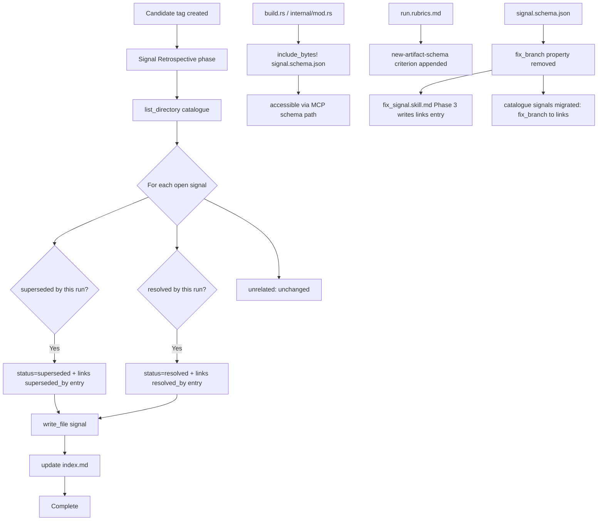

# Run Skill: Signal Retrospective Phase, Signal Schema Bundling, and fix_branch Migration

## Raw Requirement

Signal: run.skill.md missing post-candidate signal retrospective phase and artifact schema enforcement

After a run passes QA and is tagged as a candidate, no phase exists to review open signals and mark those whose proposed resolution is no longer required due to a different approach being adopted. This gap was discovered retrospectively when moeb.deprecate-patch-file-as-default-write-path superseded nine patch_file signals; those signals had to be manually updated with status=superseded and links[] outside of any run workflow. Additionally, the signal artifact type has no canonical schema reference retained in the binary (analogous to spec-schema.yaml for specifications), and no run rubric enforces producing such a schema when a new artifact type is introduced. The signal.schema.json file was bootstrapped manually at src/moeb/internal/signal.schema.json as part of this signal's creation but has not been formally wired into the binary bundling mechanism.

Proposed resolution:
1. Add a Signal Retrospective phase to run.skill.md positioned after candidate tagging and before Complete. The phase triggers only when the run passed QA and reached candidate status. The agent scans all open signals in .moeb/signals/catalogue/, identifies any whose proposed_resolution addresses the same root cause as the current run's changes, and marks them status=superseded with links=[{artifactType: 'spec', id: '<domain>.<slug>', type: 'superseded_by'}], writing each updated file. Signals whose proposed_resolution was directly implemented are marked status=resolved with type: 'resolved_by'. 2. Verify that src/moeb/internal/signal.schema.json (bootstrapped manually) is reachable via the binary bundling mechanism — add it to the explicit include list or match arm alongside spec-schema.yaml if required. 3. Add a rubric criterion to the run project context (.moeb/rubrics/run.rubrics.md): whenever a new artifact type is introduced in a run, a schema file documenting its structure and valid field values must be produced and bundled in the binary under src/moeb/internal/. Remove the stub redirect file at .moeb/signals/signal.schema.json. 4. Migrate fix_branch from a top-level signal field to links[]. The schema already carries artifactType: 'branch' and type: 'fix' for this purpose. Remove the top-level fix_branch property from the schema. Update fix_signal.skill.md Phase 3 to write a links[] entry { artifactType: 'branch', id: '<fix_branch>', type: 'fix' } instead of the top-level fix_branch field, and update the Phase 3 inline reviewer to validate the links entry rather than fix_branch. Migrate all existing catalogue signals that carry a top-level fix_branch field by moving the value into links[].

Signal ID: c7d8e9f0-a1b2-4c3d-8e4f-5a6b7c8d9e0f
Category: ProcessImprovement
Severity: Minor

## Description

This specification addresses four related improvements to the moeb run workflow and signal artifact management:

**1. Signal Retrospective phase**: After a successful run reaches candidate status, a new skill phase instructs the run agent to scan `.moeb/signals/catalogue/` for open signals whose `proposed_resolution` was rendered obsolete or fulfilled by the current run's changes. The agent updates those signals with `status=superseded` (for signals superseded by a different approach) or `status=resolved` (for signals directly implemented), appending a structured `links` entry pointing to the implementing spec. This closes the lifecycle gap where nine signals required manual post-run updates after `moeb.deprecate-patch-file-as-default-write-path`.

**2. Signal schema binary bundling**: The manually-bootstrapped `src/moeb/internal/signal.schema.json` is wired into the `include_bytes!` mechanism so it is bundled in the release binary and accessible via the same MCP schema-serving path as `spec-schema.yaml`.

**3. New-artifact-schema rubric criterion**: A new criterion added to `.moeb/rubrics/run.rubrics.md` enforces that any run introducing a new harness artifact type must produce and bundle a corresponding schema file. The stub redirect at `.moeb/signals/signal.schema.json` is replaced with a human-readable redirect notice.

**4. fix_branch field migration**: The `fix_branch` top-level field is removed from `signal.schema.json`. All existing catalogue signals carrying `fix_branch` are migrated to `links[]` as `{ "artifactType": "branch", "id": "<branch>", "type": "fix" }`. The `fix_signal.skill.md` Phase 3 is updated to write the `links` entry and validate accordingly.



## Backlinks

### Parents

| Label | Path | Purpose |
|-------|------|---------|
| Harness README | .moeb/README.md | Root harness governance |
| Signal Fix Command | specifications/moeb/moeb.signal-fix-command.md | Defines fix_signal workflow and original signal schema shape |
| Run Command: SemVer Version Bump and Candidate Tag | specifications/moeb/moeb.run-semver-bump-and-candidate-tag.md | Defines the candidate tagging phase that the new retrospective phase follows |
| Signal Deduplication and Lifecycle | specifications/moeb/moeb.signal-deduplication-and-lifecycle.md | Defines signal lifecycle fields: status, links, occurrence tracking |
| Rubric Context Layers | specifications/moeb/moeb.rubric-context-layers.md | Defines binary-bundled run.rubrics.md baseline and update policy |
| Fix Signal Catalogue Alignment | specifications/moeb/moeb.fix-signal-catalogue-alignment.md | Aligns fix_signal.skill.md with canonical signal catalogue; context for Phase 3 fix_branch changes |

## Steps

### Step 1 — Add Signal Retrospective phase to run.skill.md

Read `src/moeb/internal/skills/run.skill.md`. Identify the final numbered phase immediately before the `Complete` phase. The new phase is inserted between the candidate-tag phase and `Complete`; increment the `Complete` phase number by one.

Insert the following block at that position (substitute the correct sequential phase number for `<N>`):

```markdown
## Phase <N> — Signal Retrospective

**Trigger condition**: Execute this phase only if a candidate tag was successfully created in the preceding Version and Tag phase (i.e., `create_candidate_tag` was called and returned without error). If no candidate tag was created, skip this phase entirely and proceed to Complete.

1. Call `list_directory` with path `.moeb/signals/catalogue/`.
2. For each file whose name ends in `.signal.json`, call `read_file` to load its content.
3. For each signal where `status` is `"open"` or `"reopened"`:
   a. Evaluate whether the signal's `proposed_resolution` was **superseded** (the root cause was resolved via a different approach than the signal proposed — e.g. the signal proposed using `patch_file` but the current run deprecated `patch_file` entirely) or **resolved** (the signal's exact proposed resolution was directly and fully implemented by the current run).
   b. If **superseded**: set `status` to `"superseded"`. Append to `links` (initialise as `[]` if the field is absent):
      `{ "artifactType": "spec", "id": "<domain>.<slug>", "type": "superseded_by" }`
      where `<domain>` and `<slug>` are the frontmatter values of the specification implemented in the current run.
   c. If **resolved**: set `status` to `"resolved"`. Append to `links` (initialise as `[]` if absent):
      `{ "artifactType": "spec", "id": "<domain>.<slug>", "type": "resolved_by" }`.
   d. If unrelated to the current run's changes: leave the file unchanged.
   e. For each signal updated in (b) or (c), write the updated JSON record using `write_file` to the same catalogue path.
4. After all files are processed, read `.moeb/signals/index.md`. For each signal updated in step 3, find its row by matching the `Signal ID` cell to the signal's `signal_id` field and replace the `Status` cell with the new status value. Write the complete updated `index.md` using `write_file`.
```

Write the updated `src/moeb/internal/skills/run.skill.md` using `write_file`.

### Step 2 — Wire signal.schema.json into the binary bundling mechanism

Read `src/moeb/internal/mod.rs` (or whichever file contains the `include_bytes!` invocation for `"spec-schema.yaml"` — use `grep_files` with pattern `spec-schema.yaml` in `src/moeb/internal/` to locate the correct file if unsure). Identify the match arm or file list that serves bundled schema files by filename key.

Add `signal.schema.json` alongside the existing entries. If the mechanism uses a `match` on a string key, add:

```rust
"signal.schema.json" => Some(include_bytes!("signal.schema.json")),
```

immediately after the `"spec-schema.yaml"` arm. If the mechanism uses an array or slice of filenames, append `"signal.schema.json"` to that collection.

Do not create `src/moeb/internal/signal.schema.json` — it already exists. Write only the modified lookup/include source file using `write_file`.

### Step 3 — Add new-artifact-schema rubric criterion to run.rubrics.md

Read `.moeb/rubrics/run.rubrics.md`. Append the following row to the criteria table:

```
| `new-artifact-schema` | Whenever a run introduces a new harness artifact type (a new category of `.moeb/` file or a new JSON artifact kind), a schema file documenting its structure and valid field values must be produced and bundled in the binary under `src/moeb/internal/`. | Schema file present and bundled for every new artifact type introduced by this run | Run review: for each new artifact type documented in the specification, confirm a corresponding `<artifact>.schema.json` exists at `src/moeb/internal/<artifact>.schema.json` and is referenced via `include_bytes!` in the binary bundling file |
```

Write the updated file using `write_file`.

### Step 4 — Replace stub redirect at .moeb/signals/signal.schema.json

Read `.moeb/signals/signal.schema.json`. If the file does not contain the full canonical signal schema (i.e. it is a stub or redirect), replace its entire content with:

```
The canonical signal schema is bundled in the moeb binary as signal.schema.json.
Source: src/moeb/internal/signal.schema.json
```

Write the file using `write_file`.

### Step 5 — Remove fix_branch from signal.schema.json

Read `src/moeb/internal/signal.schema.json`. Remove the `fix_branch` property definition (the property name, its type, and any associated description or comment). Write the updated schema using `write_file`.

### Step 6 — Update fix_signal.skill.md Phase 3

Read `src/moeb/internal/skills/fix_signal.skill.md`. In Phase 3 (the signal-file writing phase):

1. Replace the instruction to set a top-level `fix_branch` field with an instruction to append a `links` entry to the signal record:
   ```json
   { "artifactType": "branch", "id": "<branch_name>", "type": "fix" }
   ```
   where `<branch_name>` is the branch name created in Phase 2 of the fix_signal skill.

2. In the Phase 3 inline reviewer instructions, replace any validation of `fix_branch` as a top-level field with validation that the `links` array contains at least one entry with `"artifactType": "branch"` and `"type": "fix"`.

Write the updated file using `write_file`.

### Step 7 — Migrate existing catalogue signals from fix_branch to links

Use `grep_files` with pattern `"fix_branch"` restricted to directory `.moeb/signals/catalogue/` to identify all signal files containing the field. For each matching file path returned:

1. Read the file using `read_file`.
2. Extract the string value of the top-level `fix_branch` field.
3. If `links` is absent, add `"links": []` to the JSON object.
4. Append `{ "artifactType": "branch", "id": "<fix_branch_value>", "type": "fix" }` to the `links` array.
5. Remove the top-level `fix_branch` field from the JSON object.
6. Write the updated JSON to the same path using `write_file`. Preserve all other fields in their original order; place `links` after `occurrences` if it is newly added.

## Decisions

### Decision 1 — Signal Retrospective phase is skill-level, not kernel-level

The retrospective scan executes as a skill phase in `run.skill.md` rather than as a compiled Rust function. Evaluating whether a signal's `proposed_resolution` was superseded or resolved requires reading unstructured text and applying model judgment; this is not a primitive OS/VCS/HTTP operation and must not live in kernel Rust.

**Rejected alternative**: A `post_candidate_retrospective()` Rust function in the run domain. Rejected because it would embed workflow coordination and text-evaluation logic in compiled code, violating the `kernel-thin-and-parity` constraint and the `thin-kernel` catalogue criterion.

**Consequence**: The phase relies on the agent's language model judgment to classify signals. Mechanical keyword matching would produce false positives; model judgment is the appropriate and intended mechanism.

### Decision 2 — Retrospective phase triggers only on successful candidate tag

The phase executes only when `create_candidate_tag` succeeded in the preceding phase. A run that failed QA or did not reach candidate status skips the retrospective entirely, preventing partial or failed runs from incorrectly marking signals as resolved.

**Rejected alternative**: Always running the retrospective regardless of candidate status. Rejected because a failed run provides no authoritative information about which signals were resolved by the current changes.

### Decision 3 — fix_branch migrated to links[], not preserved or renamed

The `fix_branch` value is moved into the existing `links` array with `artifactType: "branch"` and `type: "fix"` rather than being kept as a top-level convenience field or renamed. The `links` schema already supports this structure precisely. Centralising all artifact references in `links` prevents top-level field proliferation as additional artifact types are introduced.

**Rejected alternative**: Renaming `fix_branch` to `branch_name` at the top level. Rejected because it retains a structural asymmetry between branch references and all other artifact link types.

### Decision 4 — Stub file replaced with redirect text; no delete_file tool required

No `delete_file` tool exists in the moeb registry. The stub at `.moeb/signals/signal.schema.json` is overwritten with a concise human-readable redirect to `src/moeb/internal/signal.schema.json`. This eliminates the stub's misleading implication that it is the canonical schema location, without requiring a new tool capability.

**Rejected alternative**: Adding a `delete_file` moeb tool in this run. Out of scope; if file deletion capability is needed it should be the subject of a separate signal and spec.

**Rejected alternative**: Leaving the stub unchanged. Rejected because it actively misleads agents and humans about the canonical schema location.

## Rubric

### Structured

| Name | Description | Threshold | Pass Condition |
|------|-------------|-----------|----------------|
| `tool-errors` | No ToolHandler errors were recorded during this command invocation. Covers all tool calls on both CLI and MCP paths via `RealToolExecutor::execute`. Applies to every moeb command. | Zero tool errors | Kernel-authoritative: injected by `verify_rubrics` from `RunState.tool_errors`. Do not supply a verdict — any agent-supplied entry is overridden. |
| `rubric-qualification` | No Pass verdicts with acknowledged failures were issued during this command invocation. | Zero qualified Pass verdicts | Kernel-authoritative: injected by `verify_rubrics` by scanning `acknowledged_failures` on incoming Pass verdicts. Do not supply a verdict — any agent-supplied entry is overridden. |
| `skill-mandatory-phases` | The skill loaded for this run contains all mandatory phase headings. | All six mandatory headings present | Agent scans skill content in its loaded context; fails if any mandatory heading string is absent |
| `no-drift` | The specification does not violate any decision recorded in a linked parent specification | Zero contradictions | Manual review of every decision in every parent spec listed in Backlinks |
| `spec-schema-compliance` | All required frontmatter fields and body sections are present and correctly ordered | 100% of required fields and sections | Validation in `domain/spec.rs` exits 0 during `moeb spec` |
| `ai-first-org` | The specification's Steps prescribe file layouts, naming, and helper placement that satisfy the four AI-first organisation principles: one concern per file, context locality, grep-discoverable names, no cross-cutting helpers. | All four principles followed | Manual review: no step produces a file that mixes concerns, no name is generic across the codebase, all helpers are co-located with their callers or promoted to a precisely named module |
| `kernel-thin-and-parity` | No domain-specific or workflow-specific coordination logic may be placed in kernel Rust code when it can live in skill markdown or role files. Every tool registered in the CLI tool registry must also be registered in the MCP stdio server tool list. | Zero violations | Spec review: no proposed step places review/coordination logic in Rust; Step 2 adds only `include_bytes!` (compile-time resource embed, not workflow logic); Run review: tool lists in tools/mod.rs and the MCP server match exactly |
| `moeb-tool-origin` | All tool calls made during this invocation must originate from moeb's own tool registry. | Zero external tool calls | Agent reviews the conversation for calls to non-moeb tools. Supplies Pass if none were made; Fail with `acknowledged_failures` if external tools were used with signals; Fail with unlogged tool names if used without signals. |
| `thin-kernel` | New Rust code in tools/, commands/, or domain/ must be a primitive operation wrapper or thin dispatcher; workflow logic must live in skill markdown. | Zero workflow-logic functions in new Rust | Run review: Step 2 adds only a compile-time `include_bytes!` resource embed — confirm no sequencing, conditional, or retry logic appears in the modified Rust file |
| `mcp-cli-behavioural-parity` | For any operation exposed through both the CLI agent loop and the MCP server, observable outcomes must be identical. Any tool registered in the standard registry must be registered in the MCP registry with an identical input schema and result contract. | Zero divergent outcomes | Run review: verify `signal.schema.json` is accessible via the same schema-serving path in both CLI and MCP modes after Step 2 |
| `no-signal-reoccurrence` | No canonical signal in `.moeb/signals/catalogue/` has `status: reopened` due to this run | Zero reopened signals introduced by this run | Run review: verify that no previously resolved signal was reopened by any step in this specification |
| `new-skill-mandatory-phases` | Any `*.skill.md` file written during this run contains all mandatory phase heading strings: "Verify", "End-of-Skill Review", "Metrics Recording", "Commit", "Tag", "Complete" | All six strings present in each written skill file | Run review: after Steps 1 and 6, confirm `run.skill.md` and `fix_signal.skill.md` each contain all six mandatory heading strings |

### Qualitative

- The Signal Retrospective phase instruction must clearly distinguish **superseded** (different approach adopted) from **resolved** (exact proposed resolution implemented) so an agent can classify without ambiguity.
- Step 2 must not require the run agent to search the entire codebase; the spec identifies the expected file location and fallback grep pattern explicitly.
- The fix_branch migration (Step 7) must be complete: no catalogue signal should retain a top-level `fix_branch` field after the run; the grep-then-migrate pattern ensures coverage.
- The new `new-artifact-schema` rubric criterion must state its pass condition in terms of observable file artifacts (the schema file's presence and its `include_bytes!` reference), not intent.
