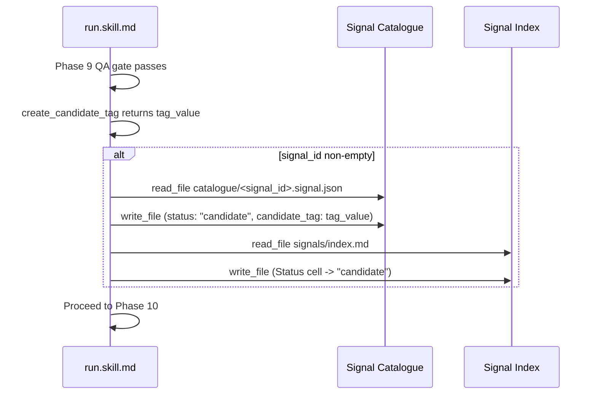

# Run Skill: Advance Signal Status to Candidate on Successful Candidate Tag Creation

## Raw Requirement

Title: run skill does not advance signal status from spec_written to candidate on successful candidate tag creation

Problem: When run.skill.md Phase 9 successfully creates a candidate tag, the corresponding signal's status field is not updated from 'spec_written' to 'candidate'. This means the signal index diverges from actual run state: a signal appears to still be awaiting a run even after one has succeeded. There is no call to fix_signal or tag_signal at the point of candidate tag creation in run.skill.md.

Proposed resolution: Add a step to run.skill.md Phase 9, after create_candidate_tag succeeds: call fix_signal (or a new update_signal_status MCP tool) to advance the signal status from 'spec_written' to 'candidate'. Include the candidate_tag value in the signal update. This should be gated on the candidate tag creation succeeding — if the QA gate fails, the status must not be advanced.

## Description

This specification adds a Signal Status Update sub-procedure to `run.skill.md` Phase 9 (Version and Tag) that fires immediately after `create_candidate_tag` returns a tag value. When the run has an associated `signal_id` in its session context, the sub-procedure reads the corresponding catalogue entry, advances `status` from `"spec_written"` to `"candidate"`, stores the `candidate_tag` value in a new optional field on the record, and updates the signal index. This follows the pattern established by `spec.skill.md` Phase 5a, which advances status to `"spec_written"` after writing the specification file.

The fix requires no new Rust kernel code — the existing `read_file`, `write_file`, and Index Update pattern used in `spec.skill.md` Phase 5a is fully sufficient. `spec.skill.md` and `fix_signal.skill.md` require no equivalent phase changes because neither creates a candidate tag. All three canonical skill files receive a schema comment update to document the new `candidate_tag` field on the signal record.

The signal record schema gains a new nullable `candidate_tag` field that records which candidate tag was created when the status transitioned to `candidate`, making the signal record self-contained without requiring cross-reference to run files.



## Backlinks

### Parents

| Label | Path | Purpose |
|-------|------|---------|
| Harness README | .moeb/README.md | Parent index for all specifications |
| Signal Status Lifecycle Tracking | specifications/moeb/moeb.signal-status-lifecycle-tracking.md | Establishes the open → in_progress → spec_written → candidate → resolved lifecycle and run skill's role in advancing to candidate |
| Run Skill: Gate Candidate Tag on QA Review Pass | specifications/moeb/moeb.run-skill-must-only-emit-candidate-tag-when-qa-rev.md | Defines the QA gate that controls whether create_candidate_tag is called; the Signal Status Update sub-procedure is naturally gated by the same structure |
| Run Files: Record signal_id and candidate_tag | specifications/moeb/moeb.run-files-must-record-signal-id-and-candidate-tag.md | Establishes candidate_tag as a first-class run output value that this spec mirrors onto the signal catalogue record |

## Steps

### Step 1 — Add Signal Status Update sub-procedure to run.skill.md Phase 9

File: `src/moeb/internal/skills/run.skill.md`

Locate Phase 9 (Version and Tag). Within the QA-pass branch, immediately after the `create_candidate_tag` call returns a tag value (and before any transition to Phase 10), insert the following Signal Status Update sub-procedure as a new `### Signal Status Update` subsection:

```markdown
### Signal Status Update <!-- condition: signal_id non-empty, candidate tag created -->

If the session context variable `signal_id` is empty or absent, skip this sub-procedure entirely and proceed to Phase 10.

1. Call `read_file` on `.moeb/signals/catalogue/<signal_id>.signal.json` where `<signal_id>` is the `signal_id` context variable. If the file does not exist, skip the remaining steps and proceed to Phase 10.
2. Parse the returned JSON. Set `"status"` to `"candidate"`. Set `"candidate_tag"` to the tag value returned by `create_candidate_tag`. Do not alter any other field.
3. Write the updated JSON back to the same path using `write_file`.
4. Run the **Index Update sub-procedure**: read `.moeb/signals/index.md`, find the row whose `Signal ID` cell matches `signal_id`, update its `Status` cell to `candidate`, write the complete updated `index.md` using `write_file`. If no matching row is found, append a new row with current field values.
```

### Step 2 — Add candidate_tag field to the canonical signal record schema comment in all three canonical skill files

For each of the three canonical skill files (`src/moeb/internal/skills/run.skill.md`, `src/moeb/internal/skills/spec.skill.md`, `src/moeb/internal/skills/fix_signal.skill.md`), locate the canonical signal record schema comment block inside the **Canonical Signal Dedup-and-Write Procedure** section. The block lists fields in order and ends with the `"archived_on"` entry. Append the following line immediately after the `"archived_on"` entry:

```
#   "candidate_tag": string | null,       -- The candidate tag created during the run that produced this signal's
#                                            candidate status. Set when status transitions to 'candidate'.
#                                            Null until then.
```

### Step 3 — spec.skill.md: no phase change required

File: `src/moeb/internal/skills/spec.skill.md`

The schema comment update in Step 2 is the only modification to `spec.skill.md`. No phase is added, removed, or modified. `spec.skill.md` handles the `spec_written` transition in Phase 5a, which it already performs correctly. The `candidate` status transition is tied to `create_candidate_tag`, which does not appear in `spec.skill.md`.

### Step 4 — fix_signal.skill.md: no phase change required

File: `src/moeb/internal/skills/fix_signal.skill.md`

The schema comment update in Step 2 is the only modification to `fix_signal.skill.md`. No phase is added, removed, or modified. `fix_signal.skill.md` orchestrates the fix pipeline by delegating to `run.skill.md` for implementation; `create_candidate_tag` is called by `run.skill.md`, not by `fix_signal.skill.md`. There is no equivalent step to add.

## Decisions

### Decision 1 — Skill-only status update; no new MCP tool

The `candidate` status transition is implemented as a skill instruction in `run.skill.md`, not as a new `update_signal_status` MCP tool.

**Rationale:** `spec.skill.md` Phase 5a already demonstrates the pattern: read the signal catalogue JSON, update `status`, write back via `write_file`, then update the index. The same primitive tools (`read_file`, `write_file`) are sufficient for the `candidate` transition in `run.skill.md`. The thin-kernel principle requires workflow sequencing to live in skill files when no new OS/VCS/HTTP primitive is needed; adding a Rust tool for this operation would place workflow logic in the kernel.

**Rejected alternative:** A new `update_signal_status` MCP tool accepting `signal_id` and `new_status`. Rejected because the existing `read_file`/`write_file` tools are sufficient; no new Rust primitive is needed. If a generic status-update tool becomes warranted as the pattern recurs in multiple contexts, a future spec can introduce it.

**Consequences:** The Signal Status Update sub-procedure in `run.skill.md` Phase 9 is inline, parallel in structure to `spec.skill.md` Phase 5a. No Rust code changes are required.

### Decision 2 — Add candidate_tag field to the signal record

The signal record gains a new optional `candidate_tag: string | null` field populated when status advances to `candidate`.

**Rationale:** The proposed resolution explicitly requires the candidate tag value to be stored in the signal update. Storing it on the signal record makes the record self-contained — consumers that query by signal ID can identify the associated candidate tag without cross-referencing run files. The run file already records `candidate_tag` (established by `moeb.run-files-must-record-signal-id-and-candidate-tag.md`); mirroring it onto the signal record completes the data model for the candidate stage.

**Rejected alternative:** Rely solely on the `candidate_tag` field in run files. Rejected because signal consumers should not need to scan run files to retrieve the candidate tag when querying a signal by ID.

**Consequences:** Signal catalogue records gain a `candidate_tag` field. Existing records treat absent fields as `null`. The schema comment block in all three canonical skill files is updated to document the new field.

### Decision 3 — QA gate enforced implicitly via Phase 9 structure

The status update is implicitly gated on `create_candidate_tag` succeeding via the existing Phase 9 branch structure, not via a new explicit conditional.

**Rationale:** Per `moeb.run-skill-must-only-emit-candidate-tag-when-qa-rev.md`, Phase 9 (Version and Tag) is skipped in its entirety when the QA gate fails. The Signal Status Update sub-procedure is inserted within the QA-pass branch, after `create_candidate_tag`, so it executes only when the tag was actually created.

**Rejected alternative:** An explicit `if qa_passed` guard around the status update. Redundant because the Phase 9 skip logic already enforces the gate structurally.

**Consequences:** No additional conditional logic needed; the gating is structural rather than explicit.

## Rubric

### Structured

| Name | Description | Threshold | Pass Condition |
|------|-------------|-----------|----------------|
| `tool-errors` | No ToolHandler errors were recorded during this command invocation. Covers all tool calls on both CLI and MCP paths via `RealToolExecutor::execute`. Applies to every moeb command. | Zero tool errors | Kernel-authoritative: injected by `verify_rubrics` from `RunState.tool_errors`. Do not supply a verdict — any agent-supplied entry is overridden. |
| `rubric-qualification` | No Pass verdicts with acknowledged failures were issued during this command invocation. An agent that observes a failure but passes a criterion must populate `acknowledged_failures` in the verdict object. Applies to every moeb command. | Zero qualified Pass verdicts | Kernel-authoritative: injected by `verify_rubrics` by scanning `acknowledged_failures` on incoming Pass verdicts. Do not supply a verdict — any agent-supplied entry is overridden. |
| `skill-mandatory-phases` | The skill loaded for this run contains all mandatory phase headings. The agent checks its own prompt context (the loaded skill content is already present) for the exact strings: "Verify", "End-of-Skill Review", "Metrics Recording", "Commit", "Tag", "Complete". No file read is required. | All six mandatory headings present | Agent scans skill content in its loaded context; fails if any mandatory heading string is absent |
| `moeb-tool-origin` | All tool calls made during this invocation must originate from moeb's own tool registry. If an external tool (not in the moeb registry) was used because no moeb equivalent exists, the agent must write a MissingMoebTool signal immediately after each such call. The criterion always fails when any external tool is used, whether or not a signal was written. | Zero external tool calls | Agent reviews the conversation for calls to non-moeb tools (e.g. Bash, Edit, Write, Read, Glob, Grep, WebFetch, WebSearch in Claude Code MCP mode). Supplies Pass if none were made. If external tools were used with MissingMoebTool signals, supplies Fail with `acknowledged_failures` listing each signal title. If external tools were used without signals, supplies Fail with the unlogged tool names in the note. |
| `no-drift` | The specification does not violate any decision recorded in a linked parent specification | Zero contradictions | Manual review of every decision in every parent spec listed in Backlinks |
| `spec-schema-compliance` | All required frontmatter fields and body sections are present and correctly ordered | 100% of required fields and sections | Validation in `domain/spec.rs` exits 0 during `moeb spec` |
| `ai-first-org` | The specification's Steps prescribe file layouts, naming, and helper placement that satisfy the four AI-first organisation principles: one concern per file, context locality, grep-discoverable names, no cross-cutting helpers. | All four principles followed | Manual review: no step produces a file that mixes concerns, no name is generic across the codebase, all helpers are co-located with their callers or promoted to a precisely named module |
| `branch-clean-at-exit` | After Phase 9 (Commit), the working tree contains no uncommitted changes; any dirty state detected in Phase 9a has been resolved by retry commit (Case A) or by signal emission and cleanup commit (Case B) | Zero uncommitted changes at spec skill exit | Agent verifies that `git_status` returned empty output after Phase 9, or that a retry (Case A) or cleanup commit (Case B) was issued and the branch is clean |
| `kernel-thin-and-parity` | No domain-specific or workflow-specific coordination logic may be placed in kernel Rust code when it can live in skill markdown or role files. Every tool registered in the CLI tool registry must also be registered in the MCP stdio server tool list. | Zero violations | Spec review: no proposed step places review/coordination logic in Rust; Run review: grep confirms no skill-specific logic in kernel tools; tool lists in tools/mod.rs and the MCP server match exactly |
| `all-skill-files-parity` | Whenever a spec adds, removes, or modifies a workflow phase in any one of the three canonical skill files (run.skill.md, spec.skill.md, fix_signal.skill.md), the spec must contain an explicit Step for each of the other two files — either applying the equivalent change or documenting with rationale why that file is intentionally excluded. | Zero unaddressed canonical skill files when any canonical skill file phase is modified | Run agent reviews the steps of the spec under implementation. If no canonical skill file phase is added, removed, or modified, mark `na`. If one or more canonical skill file phases are modified, verify that the spec contains a step for each of the other two canonical skill files (addressing the equivalent change or stating an exclusion rationale). Fail if any of the other two files has neither a qualifying step nor a documented exclusion rationale. |
| `thin-kernel` | New Rust code in tools/, commands/, or domain/ must be either (a) a primitive operation wrapper (filesystem, git, or HTTP with no domain logic) or (b) a thin dispatcher that calls into skills, tools, or agents and returns the result unchanged. Workflow logic must live in skill markdown or role files, not in compiled Rust. | Zero workflow-logic functions in new Rust | Spec review: no Step proposes placing sequencing or conditional workflow logic in Rust when a skill-file change would suffice; Run review: every new function in tools/ or commands/ either wraps a single OS/VCS/HTTP call or contains no domain-specific branching |

### Qualitative

- The Signal Status Update sub-procedure must closely mirror `spec.skill.md` Phase 5a in structure (read catalogue file → update fields → write back → update index). An agent reading `run.skill.md` cold must be able to execute it without referencing `spec.skill.md`.
- The gating condition (skip when `signal_id` absent; skip when `create_candidate_tag` was not called due to QA gate failure) must be unambiguous and structurally enforced — no flag state is required.
- The `candidate_tag` field documentation in all three skill files' schema comments must be identical in wording.
