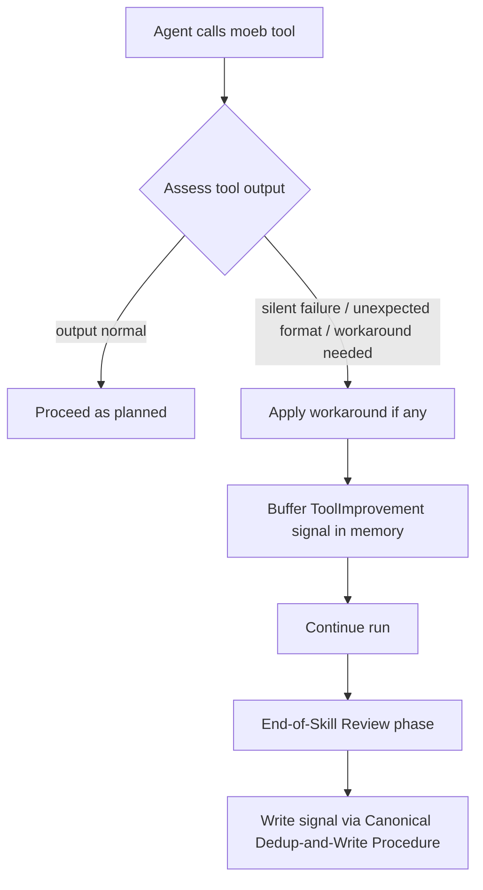

# Run Skill: ToolImprovement Signal on Moeb Tool Silent Failure or Unexpected Output

## Raw Requirement

Add an instruction to run.skill.md (Tool Origin Policy section) analogous to MissingMoebTool: if a moeb tool call produces output that indicates silent failure, unexpected format, or required a workaround, emit a ToolImprovement signal immediately with the observed behaviour, the workaround used, and the proposed fix.

## Description

The Tool Origin Policy section of `run.skill.md` currently instructs the agent to emit a `MissingMoebTool` signal when an external (non-moeb) tool is used because no moeb equivalent exists. There is no symmetric instruction covering the case where a moeb tool is called but produces output indicating silent failure, unexpected format, or necessitating a workaround.

This specification adds a parallel instruction block to `run.skill.md`'s Tool Origin Policy section. When a moeb tool call produces output indicating silent failure (the tool returns success but the intended effect was not applied), unexpected format (the tool returns data in a form the agent cannot use directly), or required a workaround (the agent had to compensate for the tool's limitations), the agent must immediately buffer a `ToolImprovement` signal entry. The signal captures the observed output, the workaround applied, and a proposed fix, feeding moeb's self-improvement queue.

The change is purely additive: a new numbered-item instruction with a JSON signal template is appended after the existing `MissingMoebTool` block within the Tool Origin Policy section. No existing instructions are modified or removed. The physical target is `src/moeb/internal/skills/run.skill.md`.



## Backlinks

### Parents

| Label | Path | Purpose |
|-------|------|---------|
| Harness README | [.moeb/README.md](.moeb/README.md) | Governing harness index and policies |
| MCP/CLI Tool Origin Rubric | [specifications/moeb/moeb.moeb-tool-origin-rubric.md](specifications/moeb/moeb.moeb-tool-origin-rubric.md) | Introduces the moeb-tool-origin criterion and MissingMoebTool signal pattern that this spec extends with a symmetric ToolImprovement counterpart |
| Agent Skills | [specifications/moeb/moeb.agent-skills.md](specifications/moeb/moeb.agent-skills.md) | Established the skill file system and run.skill.md as the governing workflow document |
| Protected Baseline Skills | [specifications/moeb/moeb.protected-baseline-skills.md](specifications/moeb/moeb.protected-baseline-skills.md) | Declares run.skill.md a protected baseline skill stored at src/moeb/internal/skills/ |

## Steps

1. **Read** `src/moeb/internal/skills/run.skill.md` using `read_file`.

2. **Locate the insertion point.** In the Tool Origin Policy section, find the closing triple-backtick (` ``` `) that terminates the `MissingMoebTool` JSON block — the block that begins with `"category": "NewCapability"` and ends with `"gating_condition": null`. The insertion point is the line immediately following that closing ` ``` `.

3. **Compose the insertion block.** The exact text to insert at the insertion point is:

   ```
   
   Additionally, if a moeb tool call returns output that indicates silent failure, unexpected format, or required a workaround to proceed, buffer a ToolImprovement signal immediately and incorporate it via the Canonical Signal Dedup-and-Write Procedure during the End-of-Skill Review phase:
   
   ```json
   {
     "category": "ToolImprovement",
     "severity": "Minor",
     "title": "Tool output issue: <tool_name> — <brief description of issue>",
     "description": "Tool <tool_name> returned output indicating <silent failure | unexpected format | required workaround>. Observed: <verbatim or summarised tool output>. Workaround applied: <what was done to compensate, or 'none' if the call was retried>.",
     "proposed_resolution": "Update <tool_name> to <fix description> so that <expected behaviour> without requiring agent workarounds.",
     "gating_condition": null
   }
   ```
   
   Escalate `severity` to `"Major"` when the tool's silent failure caused the intended operation not to complete correctly (e.g. a write that returned success but left the file unchanged, or a patch that silently applied to the wrong location).
   ```

4. **Apply the change.** Use `patch_file` with `old_string` set to the exact text of the last line of the `MissingMoebTool` JSON block through the closing ` ``` ` line (including any trailing blank lines before the next section), and `new_string` set to that same text with the insertion block appended. If `patch_file` fails, read the full file content, apply the insertion in working memory, and write the complete updated content using `write_file`. Do not retry `patch_file`.

5. **Verify mandatory phases.** Confirm that the following six heading strings are still present in the written file: `"Verify"`, `"End-of-Skill Review"`, `"Metrics Recording"`, `"Commit"`, `"Tag"`, `"Complete"`. If any are absent, the write was destructive — re-read the file immediately, restore the original content via `write_file`, and raise a Critical `Error` signal before proceeding.

6. **Call `verify_rubrics`** with verdicts for all criteria listed in `## Rubric / ### Structured`.

## Decisions

### Decision 1 — Scope limited to run.skill.md

**Rationale:** The requirement explicitly targets `run.skill.md`'s Tool Origin Policy section. Both `spec.skill.md` and `fix_signal.skill.md` contain analogous Tool Origin Policy sections, but extending scope beyond the stated requirement increases blast radius and makes the spec harder to revert if wording needs iteration.

**Rejected alternative:** Apply the same instruction to all three protected baseline skills in one specification. Rejected because the requirement is scoped to `run.skill.md` and each skill's context differs enough to warrant separate authoring if broader coverage is needed.

**Consequence:** `spec.skill.md` and `fix_signal.skill.md` will not emit ToolImprovement signals under the analogous condition until separate specifications address them.

### Decision 2 — Signal category is ToolImprovement, not SkillImprovement or Error

**Rationale:** The QA Architect persona schema defines `ToolImprovement` as the category for signals about moeb tool behaviour that falls short of expectations. This is distinct from `SkillImprovement` (workflow instruction gaps) and `Error` (fatal run failures). A tool returning unexpected output or silently failing to apply its intended effect is a tool-quality concern, not a skill-instruction gap.

**Rejected alternative:** Category `SkillImprovement`. Rejected because the signal describes a problem with the tool's output contract, not with the skill's workflow instructions.

**Consequence:** The signal feeds the `ToolImprovement` queue, which by convention drives specifications that fix the tool rather than specifications that adjust workaround instructions.

### Decision 3 — Default severity Minor, escalated to Major for silent failures that caused incomplete work

**Rationale:** Most unexpected-format or workaround situations do not cause the operation to fail — the agent compensates and the run continues. Minor is appropriate for these. Silent failures where the intended effect was not applied (e.g. a file write that appeared to succeed but left the file unchanged) represent a more serious integrity issue warranting Major.

**Rejected alternative:** Always Major regardless of impact. Rejected because agents emitting Major signals for every minor format deviation would dilute the signal queue and obscure genuine high-priority issues.

**Consequence:** The agent must assess outcome correctness when choosing severity, requiring a brief judgment call at signal-emission time.

### Decision 4 — Signal is buffered and written via Canonical Dedup-and-Write Procedure, not immediately

**Rationale:** The existing `MissingMoebTool` pattern instructs agents to "buffer... to be incorporated into the signals file during the End-of-Skill Review phase." The ToolImprovement instruction follows the same pattern for consistency. Immediate writes during the main task loop could produce partial signal records if the run terminates mid-phase; batching to the review phase is the established moeb convention.

**Rejected alternative:** Write the signal to disk immediately at the point of detection. Rejected for consistency with the MissingMoebTool convention and to avoid interrupting the main tool-call sequence with catalogue dedup reads.

**Consequence:** If the run terminates unexpectedly before the End-of-Skill Review phase, buffered ToolImprovement signals are lost. This is acceptable given the advisory-only nature of these signals.

## Rubric

### Structured

| Name | Description | Threshold | Pass Condition |
|------|-------------|-----------|----------------|
| `tool-errors` | No ToolHandler errors were recorded during this command invocation. Covers all tool calls on both CLI and MCP paths via `RealToolExecutor::execute`. Applies to every moeb command. | Zero tool errors | Kernel-authoritative: injected by `verify_rubrics` from `RunState.tool_errors`. Do not supply a verdict — any agent-supplied entry is overridden. |
| `rubric-qualification` | No Pass verdicts with acknowledged failures were issued during this command invocation. An agent that observes a failure but passes a criterion must populate `acknowledged_failures` in the verdict object. Applies to every moeb command. | Zero qualified Pass verdicts | Kernel-authoritative: injected by `verify_rubrics` by scanning `acknowledged_failures` on incoming Pass verdicts. Do not supply a verdict — any agent-supplied entry is overridden. |
| `skill-mandatory-phases` | The skill loaded for this run contains all mandatory phase headings. The agent checks its own prompt context (the loaded skill content is already present) for the exact strings: "Verify", "End-of-Skill Review", "Metrics Recording", "Commit", "Tag", "Complete". No file read is required. | All six mandatory headings present | Agent scans skill content in its loaded context; fails if any mandatory heading string is absent |
| `no-drift` | The specification does not violate any decision recorded in a linked parent specification | Zero contradictions | Manual review of every decision in every parent spec listed in Backlinks |
| `spec-schema-compliance` | All required frontmatter fields and body sections are present and correctly ordered | 100% of required fields and sections | Validation in `domain/spec.rs` exits 0 during `moeb spec` |
| `ai-first-org` | The specification's Steps prescribe file layouts, naming, and helper placement that satisfy the four AI-first organisation principles: one concern per file, context locality, grep-discoverable names, no cross-cutting helpers. | All four principles followed | Manual review: no step produces a file that mixes concerns, no name is generic across the codebase, all helpers are co-located with their callers or promoted to a precisely named module |
| `branch-clean-at-exit` | After Phase 9 (Commit), the working tree contains no uncommitted changes; any dirty state detected in Phase 9a has been resolved by retry commit (Case A) or by signal emission and cleanup commit (Case B) | Zero uncommitted changes at spec skill exit | Agent verifies that `git_status` returned empty output after Phase 9, or that a retry (Case A) or cleanup commit (Case B) was issued and the branch is clean |
| `kernel-thin-and-parity` | No domain-specific or workflow-specific coordination logic may be placed in kernel Rust code when it can live in skill markdown or role files. Every tool registered in the CLI tool registry must also be registered in the MCP stdio server tool list. | Zero violations | Spec review: no proposed step places review/coordination logic in Rust; Run review: grep confirms no skill-specific logic in kernel tools; tool lists in tools/mod.rs and the MCP server match exactly |
| `moeb-tool-origin` | All tool calls made during this invocation must originate from moeb's own tool registry. If an external tool (not in the moeb registry) was used because no moeb equivalent exists, the agent must write a MissingMoebTool signal immediately after each such call. The criterion always fails when any external tool is used, whether or not a signal was written. | Zero external tool calls | Agent reviews the conversation for calls to non-moeb tools (e.g. Bash, Edit, Write, Read, Glob, Grep, WebFetch, WebSearch in Claude Code MCP mode). Supplies Pass if none were made. If external tools were used with MissingMoebTool signals, supplies Fail with `acknowledged_failures` listing each signal title. If external tools were used without signals, supplies Fail with the unlogged tool names in the note. |
| `new-skill-mandatory-phases` | Any `*.skill.md` file written during this run contains all mandatory phase heading strings: "Verify", "End-of-Skill Review", "Metrics Recording", "Commit", "Tag", "Complete" | All six strings present in the written skill file | Agent verifies the six mandatory heading strings remain present in `run.skill.md` after the patch is applied (Step 5 of this spec) |

### Qualitative

- The inserted instruction block uses consistent voice and formatting with the surrounding Tool Origin Policy prose already in `run.skill.md`.
- The signal template fields (`title`, `description`, `proposed_resolution`) provide concrete placeholders enabling an implementing agent to produce a specific, actionable signal without ambiguity.
- The severity escalation note clearly distinguishes the two severity cases (Minor for compensated issues, Major for uncompleted work) without requiring complex judgment.
