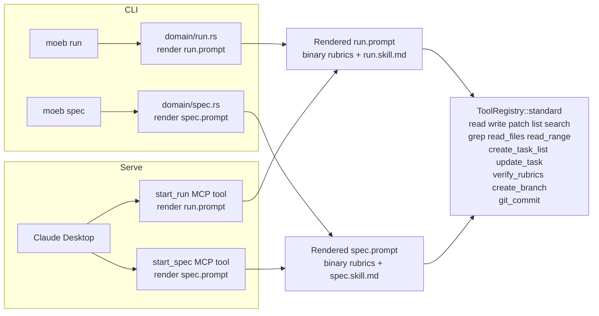

# MCP Serve / CLI Parity

## Raw Requirement

Make `moeb serve` (MCP mode) and `moeb spec` / `moeb run` (CLI) share the same context
delivery pipeline, rubric layers, and workflow skill, so that Claude Desktop receives an
identical rendered prompt to the one the internal agent loop receives, and can execute both
spec creation and run operations with full tool parity including VCS.

## Description

`moeb serve` currently diverges from the CLI in three structural ways. First, `start_run`
constructs an ad-hoc markdown string rather than rendering `run.prompt`, and skips the
binary-bundled rubric layers entirely. Second, no `start_spec` equivalent exists, making
spec creation unavailable via MCP. Third, VCS operations (branch creation, commit) and
README linking in the spec workflow are hardcoded Rust post-processing steps inside
`domain/spec.rs`, not agent-callable tools; Claude Desktop therefore cannot replicate them.

This specification fixes all three. It adds `create_branch` and `git_commit` as standard
tools registered in every tool registry variant so that both the CLI agent and Claude
Desktop can invoke them. It expands `spec.skill.md` to drive file writing, branching,
README linking, and committing as explicit skill phases — making the spec workflow fully
tool-driven and skill-authoritative. It thins `spec.prompt` to a context-delivery wrapper
matching `run.prompt`'s structure, moving all authoring and output instructions into the
skill. It refactors `start_run` to render `run.prompt` with binary rubrics and support
name-based spec discovery (matching `moeb run`'s CLI behaviour). It adds a `start_spec`
MCP tool that renders `spec.prompt` with all rubric layers. Finally, it simplifies
`domain/spec.rs` to remove Rust-side file writing, VCS invocation, and README linking,
delegating those responsibilities to the skill-driven agent.



## Backlinks

- Parents: [README.md](../../README.md)
- Related: [moeb.mcp-stdio-server](moeb.mcp-stdio-server.md), [moeb.agent-skills](moeb.agent-skills.md), [moeb.rubric-context-layers](moeb.rubric-context-layers.md), [vcs.spec-creation-branch-commit-format](../vcs/vcs.spec-creation-branch-commit-format.md)

## Steps

### Step 1 — Add `create_branch` tool

Create `src/moeb/src/tools/create_branch.rs` implementing `ToolHandler` for a new
`create_branch` tool.

- `name()` returns `"create_branch"`.
- `definition()` declares two required string parameters: `domain` and `slug`.
- `execute()` calls `crate::vcs::create_spec_branch(domain, slug)` and returns the
  branch name on success (e.g. `"Branch created: chore/moeb-serve-cli-parity"`).
- The `working_dir` argument is unused (git finds the repository root automatically).
- Add a `#[cfg(test)]` companion block (using `#[path = "create_branch_tests.rs"]`) with
  at least one unit test verifying that a missing `domain` argument produces an error.

### Step 2 — Add `git_commit` tool

Create `src/moeb/src/tools/git_commit.rs` implementing `ToolHandler` for a new
`git_commit` tool.

- `name()` returns `"git_commit"`.
- `definition()` declares four required string parameters: `spec_path`, `readme_path`,
  `domain`, and `slug`. `spec_path` and `readme_path` are paths relative to the tool's
  `working_dir`.
- `execute()` resolves `working_dir.join(spec_path)` and `working_dir.join(readme_path)`
  to absolute paths, then calls `crate::vcs::commit_spec(&abs_spec, &abs_readme, domain,
  slug)`. Returns a confirmation string on success.
- Add a `#[cfg(test)]` companion block (using `#[path = "git_commit_tests.rs"]`) with at
  least one unit test verifying that a missing required argument produces an error.

### Step 3 — Register new tools in `src/moeb/src/tools/mod.rs`

- Add `pub mod create_branch;` and `pub mod git_commit;` to the module declarations.
- In `ToolRegistry::standard()`, register `CreateBranchTool` and `GitCommitTool` after
  `verify_rubrics`.
- In `ToolRegistry::definitions()`, add `"create_branch"` and `"git_commit"` to the `order`
  array after `"verify_rubrics"` (before `"spawn_agent"`, `"start_run"`,
  `"get_run_status"`).
- No change to `mcp()` or `with_spawn_agent()` is required: both call `standard()` first
  and the new tools are inherited automatically.

### Step 4 — Expand `src/moeb/internal/skills/spec.skill.md`

Replace Phase 4 and append Phases 5–7. The skill becomes the sole authority for the
spec authoring and commit lifecycle.

**Phase 4 — Write**

Replace the current Phase 4 ("Output — Your response must be the complete specification
document and nothing else") with instructions to write the authored content to disk:

- Derive `domain` and `slug` from the YAML frontmatter of the specification you authored.
- Call `write_file` with path `specifications/<domain>/<domain>.<slug>.md` (relative to
  the `.moeb/` working directory) and the complete specification document as content.
  Begin the content with `---` (the YAML opening delimiter).

Incorporate the authoring-format instructions currently inline in `spec.prompt`
(frontmatter field rules, required section order, rubric-table passes) into Phase 2
(Author) of the skill so that all authoring guidance is co-located in the skill rather
than split between the prompt and the skill.

**Phase 5 — Branch**

After the file is written, call `create_branch` with `domain` and `slug` extracted from
the frontmatter. The tool creates `chore/<domain>-<slug>` per the Conventional Branch
convention.

**Phase 6 — Link README**

Read `README.md` using `read_file`. Locate the `### <domain>` section (create it if
absent). Append a new table row for this specification using `patch_file`:

```
| <Title> | <one-sentence description> | [specifications/<domain>/<domain>.<slug>.md](specifications/<domain>/<domain>.<slug>.md) | active |
```

Use `patch_file` with a minimal unified diff targeting only the insertion point.

**Phase 7 — Commit**

Call `git_commit` with:
- `spec_path`: `specifications/<domain>/<domain>.<slug>.md`
- `readme_path`: `README.md`
- `domain` and `slug` from frontmatter.

### Step 5 — Thin `src/prompts/spec.prompt`

Remove all content after the `{{skill_content}}` section through to (but not including)
`Requirement:\n{{input}}`, except for the two framing blocks that belong in the prompt
rather than the skill:

1. The no-re-read directive ("Do not re-read any file already present in your context
   window…").
2. The repository boundary block ("Your working directory is `.moeb/`…") and the
   `spec-schema-validation.json` note.

The authoring-format instructions (frontmatter structure, section ordering, rubric passes,
CRITICAL delimiter reminder) are removed from the prompt because they now live in
`spec.skill.md` Phase 2. The resulting `spec.prompt` has the same shape as `run.prompt`:
role → pre-loaded context sections → workflow → lightweight constraints → requirement.

### Step 6 — Refactor `src/moeb/src/tools/start_run.rs`

Replace the ad-hoc context string with a fully rendered `run.prompt`.

- Load the `run.prompt` template via `Prompts::get("run.prompt")`.
- Load binary rubrics using `Internal::get("rubrics/global.rubrics.md")` and
  `Internal::get("rubrics/run.rubrics.md")`, combining them with any project-level
  `.moeb/rubrics/global.rubrics.md` and `.moeb/rubrics/run.rubrics.md` in the same
  four-layer order as `domain/run.rs` (`command_rubrics` block, lines 103–136 of the
  current `run.rs`).
- Load `role_content` via `crate::skills::load_role(working_dir, "run")` and
  `skill_content` via `crate::skills::load_skill(working_dir, "run")`.
- Load `readme_content` from `working_dir.join(".moeb/README.md")`.
- Change the `spec_path` parameter to accept either a full relative path or a partial name.
  When the value does not point to an existing file, search under
  `working_dir.join(".moeb/specifications/")` for `.md` files whose name contains the
  value (replicating the `find_specs` logic from `domain/run.rs`). Return an error if
  zero or more than one file matches.
- Load `spec_content` from the resolved path; the `{{spec}}` token receives the resolved
  relative path string.
- Render `run.prompt` by substituting all six tokens: `{{role_content}}`,
  `{{readme_content}}`, `{{spec}}`, `{{spec_content}}`, `{{skill_content}}`,
  `{{command_rubrics}}`.
- Return the rendered prompt as the tool result.
- Add or update tests in `start_run_tests.rs` to verify that binary rubrics appear in the
  rendered output and that name-based spec discovery works.

### Step 7 — Add `src/moeb/src/tools/start_spec.rs`

Create a new `StartSpecTool` implementing `ToolHandler`.

- `name()` returns `"start_spec"`.
- `definition()` declares one required string parameter: `requirement`.
- `execute()`:
  - Loads `spec.prompt` via `Prompts::get("spec.prompt")`.
  - Loads binary rubrics (`Internal::get("rubrics/global.rubrics.md")` and
    `Internal::get("rubrics/spec.rubrics.md")`) plus project-level
    `working_dir.join(".moeb/rubrics/global.rubrics.md")` and
    `.moeb/rubrics/spec.rubrics.md`, combined in the same four-layer order as
    `domain/spec.rs`.
  - Loads `readme_content` from `working_dir.join("README.md")`.
  - Loads `spec_schema_content` via `Internal::get("spec-schema.yaml")`.
  - Loads `rubrics_content` (catalogue) from
    `working_dir.join("rubrics/catalogue.rubrics.md")`, falling back to the not-found
    message used in `domain/spec.rs`.
  - Loads `skill_content` via `crate::skills::load_skill(working_dir, "spec")`.
  - Loads `role_content` via `crate::skills::load_role(working_dir, "spec")`.
  - Substitutes all seven tokens in the template: `{{role_content}}`,
    `{{readme_content}}`, `{{spec_schema_content}}`, `{{rubrics_content}}`,
    `{{skill_content}}`, `{{command_rubrics}}`, `{{input}}` (← the `requirement`
    argument).
  - Returns the rendered prompt.
- Add a `#[cfg(test)]` companion block (using `#[path = "start_spec_tests.rs"]`) with at
  least one test verifying that binary rubrics and the requirement text appear in the
  returned string.

### Step 8 — Register `start_spec` in the MCP registry

In `src/moeb/src/tools/mod.rs`:

- Add `pub mod start_spec;` to the module declarations.
- In `ToolRegistry::mcp()`, register `StartSpecTool` alongside `StartRunTool`.
- In `ToolRegistry::definitions()`, add `"start_spec"` to the `order` array alongside
  `"start_run"` and `"get_run_status"`.

### Step 9 — Simplify `src/moeb/src/domain/spec.rs`

Remove Rust-side file writing, VCS invocation, and README linking. The agent now
performs these via tools directed by the skill.

- Remove the `link_readme()` method entirely.
- Remove the `vcs::create_spec_branch(...)` call.
- Remove the `fs::create_dir_all` / `fs::write` spec file creation block.
- Remove the `vcs::commit_spec(...)` call.
- Remove the `spec_parser::parse_frontmatter` and `spec_parser::validate_sections`
  calls from the retry loop (frontmatter validity is now enforced by the skill's Phase 3
  self-validation step and write_file tool).
- Retain the retry loop structure; each attempt now simply runs
  `run_agent_loop_run_mode()` (replacing `run_agent_loop_traced()`). An attempt is
  considered successful when the loop returns `Ok(_)`. On failure, retry until
  `retry_limit` is exhausted.
- Retain `spec_parser.rs` and `spec_schema.rs` as sub-modules (they may be used by
  future callers); do not remove their exports or tests.
- Update `spec_integration_tests.rs` to the minimum extent required to compile and pass
  against the new `run_in()` signature: remove assertions that depend on Rust-side file
  writing, VCS branch creation, and README linking, since those outcomes are now
  agent-driven via tools and cannot be exercised by a stub AI. Preserve all test
  functions; update their bodies to assert only that `run_in()` returns `Ok(())` when the
  stub AI satisfies the write-before-completion requirement.

## Decisions

### Decision 1 — VCS tools in `ToolRegistry::standard()`, not a separate registry

`create_branch` and `git_commit` are registered in `standard()` so that every registry
variant (standard, with_spawn_agent, mcp) inherits them automatically. This avoids a new
registry variant and keeps the tool surface consistent across all execution contexts.

**Rejected alternatives:** A separate `ToolRegistry::with_vcs()` variant was considered
but rejected because it would require changing the three call sites that currently call
`standard()` and would create a new combinatorial dimension in the registry.

**Consequences:** `moeb run` agents will also see `create_branch` and `git_commit` in
their tool list. These tools are harmless when unused; the run skill does not mention
them and agents follow the skill.

### Decision 2 — Retry loop retained but validation reduced to loop success

The retry loop in `domain/spec.rs` is retained because it provides a safety net when the
agent fails to produce a write_file call (loop returns `Err`). Frontmatter validation is
removed from the retry criterion because the spec agent now writes the file directly and
self-validates in the skill's Phase 3; adding a post-write Rust validation scan would
require heuristics to identify which file the agent wrote and would add complexity without
reliable payoff.

**Rejected alternatives:** Removing the retry loop entirely was considered and rejected
because it would regress error handling when the agent produces no output at all.

**Consequences:** Structural spec errors (malformed frontmatter, missing sections) that
slip past the skill's self-validation are not automatically retried. The remaining
disparity section documents this.

### Decision 3 — `spec.prompt` retains path-constraint framing

The repository boundary block and the no-re-read directive remain in `spec.prompt` rather
than moving to `spec.skill.md`. These are environmental constraints (facts about the
filesystem) rather than workflow steps, and belong closer to the context delivery layer.

**Rejected alternatives:** Moving all prose to the skill was considered but rejected
because environmental constraints can change independently of the workflow and co-locating
them with context delivery makes that separation legible.

**Consequences:** `spec.prompt` is not purely a passthrough wrapper; it retains two
constraint blocks. This is acceptable because `start_spec` renders the full `spec.prompt`
and therefore delivers identical framing to both CLI and serve.

## Rubric

### Structured

| Name | Description | Threshold | Pass Condition |
|------|-------------|-----------|----------------|
| `context-budget` | All implementation files created or modified during this run are ≤ 300 lines; `*_tests.rs` companion files are ≤ 400 lines. If any file exceeds budget, refactor it before passing this criterion. | Zero over-budget files after any required refactoring | Agent checks line counts of every file written; refactors any over-budget file, then marks pass only after all files meet the budget |

### Qualitative

- **Prompt identity:** The string returned by `start_run` for a given spec must be identical to the initial user message that `domain/run.rs` would pass to `run_agent_loop_run_mode` for the same spec (same role, same rubrics, same skill, same prompt template).
- **Prompt identity (spec):** The string returned by `start_spec` for a given requirement must be identical to the initial user message that the refactored `domain/spec.rs` passes to `run_agent_loop_run_mode` for the same requirement.
- **No double-VCS:** The CLI path must not invoke `vcs::create_spec_branch` or `vcs::commit_spec` directly after this change; all VCS is agent-driven via the `create_branch` and `git_commit` tools.
