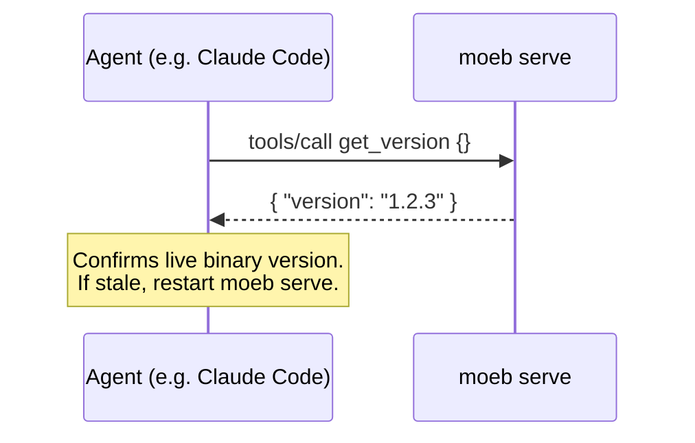

# MCP Serve: get_version Tool

## Raw Requirement

Add a `get_version` tool to the moeb MCP server that returns the running binary's
semantic version string. The tool takes no input and returns `{ "version": "x.y.z" }`
where the version is `env!("CARGO_PKG_VERSION")` embedded at compile time. The purpose
is to allow an MCP client (e.g. Claude Code) to verify mid-session which version of
moeb serve is running — specifically to distinguish between a freshly deployed binary
with new functionality and a stale serve that has not yet been restarted.

## Description

The MCP `initialize` handshake (from `moeb.serve-version-handshake.md`) communicates
the server version at connection time, but this value cannot be re-queried once the
session is established. A `get_version` tool closes this gap: any agent connected via
MCP can call it at any point in a session to confirm the binary version currently
serving requests. The implementation is a single `env!("CARGO_PKG_VERSION")` expression
returning a JSON object; no input schema, no file I/O, no state. The tool is registered
in both the CLI tool registry and the MCP stdio and HTTP server tool lists, consistent
with the `kernel-thin-and-parity` baseline rubric.



## Backlinks

### Parents

| Label | Path | Purpose |
|-------|------|---------|
| Harness README | README.md | Root index |
| MCP Stdio Server | specifications/moeb/moeb.mcp-stdio-server.md | Tool registry where get_version is registered |
| MCP HTTP + OAuth Server | specifications/moeb/moeb.mcp-http-oauth-server.md | HTTP transport tool list also requires get_version |
| MCP Serve: Binary Version in Initialize Handshake | specifications/moeb/moeb.serve-version-handshake.md | Complementary spec: handshake version at connect time; get_version for mid-session queries |
| Query Agent Tool | specifications/moeb/moeb.query-agent-tool.md | Establishes kernel-thin-and-parity rubric; get_version must comply |

## Steps

### Step 1 — Create `src/moeb/src/tools/get_version.rs`

Create a new file `src/moeb/src/tools/get_version.rs` with the following content.
Follow the tool handler pattern established by existing tools in `src/moeb/src/tools/`
(locate the pattern via `grep_files` for `ToolHandler` or `fn handle`):

The tool:
- **Name:** `"get_version"`
- **Input schema:** empty object `{}` — no parameters
- **Handler:** return a `ToolResult` containing the JSON string
  `{ "version": "<CARGO_PKG_VERSION>" }` where the version is produced by
  `env!("CARGO_PKG_VERSION")` at compile time.

Concrete implementation (adapt struct/trait names to match the existing pattern):

```rust
const VERSION: &str = env!("CARGO_PKG_VERSION");

// In the handle method:
Ok(ToolResult::text(format!(r#"{{"version":"{}"}}"#, VERSION)))
```

No imports beyond what the existing tool handler pattern requires. No file reads, no
state, no error paths.

### Step 2 — Register `get_version` in `src/moeb/src/tools/mod.rs`

Read `src/moeb/src/tools/mod.rs`. Add `mod get_version;` alongside the existing tool
module declarations and register the `get_version` handler in the tool registry using
the same pattern as other registered tools. Apply in a single `patch_file` call.

### Step 3 — Register `get_version` in the MCP server tool list

Locate the MCP stdio server tool list (search for existing tool registrations in the
serve command implementation via `grep_files` for `get_version`'s neighbours, e.g.
`"create_task_list"` or `"read_file"`). Add `get_version` to the list with its input
schema (`{}`) in a single `patch_file` call. If the HTTP and stdio transports share
one tool list registration site, one patch suffices; if they are separate, patch both.

### Step 4 — Verify registration completeness

Use `grep_files` to confirm `get_version` appears in:
1. `src/moeb/src/tools/mod.rs` (module declaration + registry entry)
2. The MCP server tool list registration site(s)

Confirm no construction site still omits `get_version`.

## Decisions

### Decision 1 — Tool over MCP resource for mid-session version query

**Rationale:** MCP resources are pull-based and require the client to know the resource
URI in advance. Tools are callable by name from within a conversation without prior
knowledge of the URI scheme. Since the use case is an agent asking "what version is
running?" during a session, a tool call is the natural fit: the agent can be instructed
to call `get_version` and report the result directly.

**Rejected alternatives:**
- MCP resource `moeb://version`: requires the client to enumerate resources or know
  the URI; less discoverable than a named tool in the conversation context.
- Rely solely on `serverInfo.version` from the handshake: cannot be re-queried
  mid-session; does not solve the stale-serve detection use case.

**Consequences:** `get_version` appears in the tool list surfaced to the agent. It is
intentionally trivial — one line of logic — so it adds negligible noise to the tool
catalogue.

### Decision 2 — Return JSON object `{ "version": "..." }` rather than a bare string

**Rationale:** Bare string tool results are valid but non-standard for structured data.
A JSON object with a named `version` key is unambiguous, parseable, and consistent
with how other moeb tools return structured results. An agent reading the result can
extract the version field without string parsing heuristics.

**Rejected alternatives:**
- Return bare string `"1.2.3"`: valid, but loses the field name; an agent receiving
  it mid-conversation needs context to know it's a version string.
- Return richer metadata (name, build date, git SHA): out of scope; version is
  sufficient for the stale-serve detection use case.

**Consequences:** Callers expect JSON. The format is `{ "version": "x.y.z" }` — no
other fields. If additional metadata is needed in future, a superseding spec adds them.

## Rubric

### Structured

| Name | Description | Threshold | Pass Condition |
|------|-------------|-----------|----------------|
| `no-drift` | The specification does not violate any decision recorded in a linked parent specification | Zero contradictions | Manual review of every decision in every parent spec listed in Backlinks |
| `spec-schema-compliance` | All required frontmatter fields and body sections are present and correctly ordered | 100% of required fields and sections | Validation in `domain/spec.rs` exits 0 during `moeb spec` |
| `ai-first-org` | The specification's Steps prescribe file layouts, naming, and helper placement that satisfy the four AI-first organisation principles: one concern per file, context locality, grep-discoverable names, no cross-cutting helpers. | All four principles followed | Manual review: get_version.rs contains only the version tool; no other logic is introduced |
| `kernel-thin-and-parity` | No coordination logic in kernel Rust; tool registered in both CLI registry and MCP server tool list | Zero violations | grep_files confirms get_version in tools/mod.rs and MCP server list; handler is a single env! expression with no branching |
| `no-input-schema` | Tool accepts no parameters | Empty input schema `{}` | Tool definition in MCP server list has empty properties object and no required fields |
| `registration-complete` | get_version appears in all required registration sites | All sites covered | Step 4 grep confirms presence in tools/mod.rs and MCP server list; zero omissions |

### Qualitative

- The `get_version.rs` handler contains no conditional logic, no imports beyond the
  tool handler trait, and no more than ~10 lines of code including the struct definition.
- Calling `get_version` from a Claude Code conversation immediately confirms whether
  a newly deployed moeb serve binary is active without requiring a session restart
  or a CLI check.
