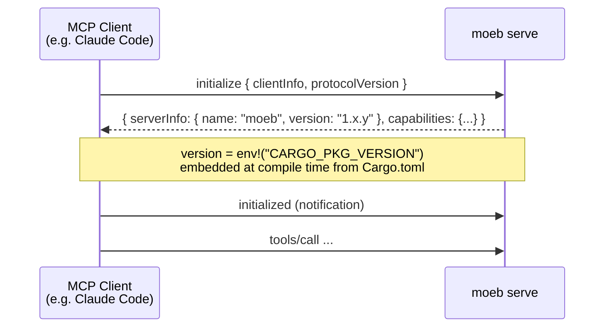

# MCP Serve: Binary Version in Initialize Handshake

## Raw Requirement

Ensure `moeb serve` populates the MCP `initialize` response `serverInfo.version` field
with the binary's actual semantic version string, embedded at compile time via
`env!("CARGO_PKG_VERSION")` from `src/moeb/Cargo.toml`. Currently the version field
may be hardcoded, absent, or set to a placeholder. After this change, any MCP client
connecting to `moeb serve` receives the correct binary version in the protocol handshake
without requiring a separate tool call.

## Description

The MCP protocol requires a `serverInfo` object in the `initialize` response containing
at minimum `name` and `version` fields. Populating `version` with a static string or
omitting it means clients cannot verify they are connected to the intended binary
version. This specification wires `env!("CARGO_PKG_VERSION")` — the semver string from
`src/moeb/Cargo.toml`, embedded at compile time by the Rust toolchain — into the
`serverInfo.version` field for both the stdio and HTTP MCP transports. The fix is a
one-line change at the `initialize` response construction site in each transport; no
new structures, no runtime config, and no new tools are required.



## Backlinks

### Parents

| Label | Path | Purpose |
|-------|------|---------|
| Harness README | README.md | Root index |
| MCP Stdio Server | specifications/moeb/moeb.mcp-stdio-server.md | Introduces moeb serve stdio transport; initialize response constructed here |
| MCP HTTP + OAuth Server | specifications/moeb/moeb.mcp-http-oauth-server.md | Introduces moeb serve HTTP transport; same initialize response must carry the version |
| Binary Release and Semantic Versioning | specifications/moeb/moeb.binary-release-and-semver.md | Establishes Cargo.toml as the canonical version source; CARGO_PKG_VERSION is derived from it |

## Steps

### Step 1 — Locate the `initialize` response construction site

Use `grep_files` to find where the MCP `initialize` response is constructed in
`src/moeb/`. Search for `serverInfo`, `server_info`, `initialize`, or
`InitializeResult` to locate the relevant file and line. There may be one shared
construction site or separate sites per transport (stdio and HTTP).

### Step 2 — Wire `env!("CARGO_PKG_VERSION")` into `serverInfo.version`

At each `initialize` response construction site found in Step 1, set the
`serverInfo.version` (or equivalent field) to:

```rust
env!("CARGO_PKG_VERSION")
```

`env!("CARGO_PKG_VERSION")` is a compile-time macro that reads the `version` field
from the nearest `Cargo.toml` — for `src/moeb/`, this is `src/moeb/Cargo.toml`, which
is the authoritative version source per `moeb.binary-release-and-semver.md`. No import
or dependency is required; `env!` is part of the Rust standard prelude.

If the field is currently a string literal (e.g. `"0.1.0"`, `"1.0.0"`, `""`, or
`"unknown"`), replace it with `env!("CARGO_PKG_VERSION")`. If the field is absent from
the response struct, add it.

Apply the change to every transport's construction site (stdio and HTTP) in a single
`patch_file` call per file.

### Step 3 — Verify both transports are covered

After patching, use `grep_files` to confirm that no remaining `serverInfo`
construction site in `src/moeb/` still contains a string literal for the version
field. The only version string in the `initialize` response path must be
`env!("CARGO_PKG_VERSION")`.

## Decisions

### Decision 1 — Compile-time `env!` macro over runtime version string

**Rationale:** The version string is a property of the binary, not of the runtime
environment. Embedding it at compile time via `env!("CARGO_PKG_VERSION")` guarantees
the advertised version always matches the binary that was built — it cannot drift due
to a misconfigured environment variable or a stale config file. It also adds zero
runtime overhead.

**Rejected alternatives:**
- Read version from `Cargo.toml` at runtime: requires file I/O and a parser at startup;
  the file may not exist in the deployment environment (only the binary is shipped).
- Hardcode the version string: drifts immediately when the version is bumped in
  `Cargo.toml` by `moeb.run-semver-bump-and-candidate-tag.md`.
- Expose a `get_version` MCP tool: unnecessary — the MCP protocol handshake is the
  correct place for server metadata; a tool call would be needed before any other call,
  adding a round-trip for information already available in the standard handshake.

**Consequences:** The advertised version is always the version at compile time. If a
client connects to a stale binary it will see the stale version — which is the correct
and expected behaviour.

### Decision 2 — Apply to both stdio and HTTP transports in the same spec

**Rationale:** Both transports are served by the same binary and must advertise the
same version. Fixing only the stdio transport would leave the HTTP transport with an
incorrect version, creating inconsistency for clients connecting via different
transports.

**Rejected alternatives:**
- Separate specs per transport: unnecessary overhead for a one-line fix at each site;
  the concern is identical for both.

**Consequences:** The implementing agent must locate and patch both construction sites.
Step 3 includes a verification grep to confirm completeness.

## Rubric

### Structured

| Name | Description | Threshold | Pass Condition |
|------|-------------|-----------|----------------|
| `no-drift` | The specification does not violate any decision recorded in a linked parent specification | Zero contradictions | Manual review of every decision in every parent spec listed in Backlinks |
| `spec-schema-compliance` | All required frontmatter fields and body sections are present and correctly ordered | 100% of required fields and sections | Validation in `domain/spec.rs` exits 0 during `moeb spec` |
| `ai-first-org` | The specification's Steps prescribe file layouts, naming, and helper placement that satisfy the four AI-first organisation principles: one concern per file, context locality, grep-discoverable names, no cross-crossing helpers. | All four principles followed | Manual review: no step produces a file that mixes concerns |
| `version-macro-used` | The initialize response uses `env!("CARGO_PKG_VERSION")` and no string literal for the version field | Zero string literals remaining at serverInfo version construction sites | grep_files for serverInfo version field in src/moeb/ returns only env!("CARGO_PKG_VERSION") references, no string literals |
| `both-transports-covered` | Both stdio and HTTP transport initialize response sites are patched | Two sites patched (or one shared site confirmed) | Step 3 grep returns zero remaining literal version strings across all moeb serve source files |

### Qualitative

- The change is a one-line substitution per construction site; the diff produced by
  the implementing agent should touch no more than 2–4 lines total across all patched
  files.
- No new structs, enums, traits, or modules are introduced by this specification.
