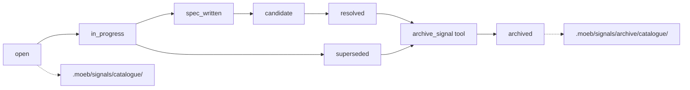

# Signal Archive Lifecycle, Schema Extension, and Dedup Identity Key Fix

## Raw Requirement

1. Add `resolution_summary`, `superseded_by`, and `archived_on` fields to the signal JSON schema and the binary-bundled `signal.schema.json`.
2. Implement a lifecycle-transition MCP tool (or extend `fix_signal`) that atomically: updates status, sets `archived_on`, moves the file to `archive/catalogue/`, and moves the index row to `archive/index.md`.
3. Update the dedup identity key to use `normalised(title + category)` instead of file path (fixes 6bfc810c).
4. Add a post-run hook to `run.skill.md` and `fix_signal.skill.md` that calls the lifecycle tool on any signal whose status changed during the run.
5. Add an archive integrity check: run signal counts in `index.md` must equal count of files in `catalogue/` at all times.

## Description

This specification extends the signal lifecycle system across five areas.

**Schema extension.** Three new nullable string fields are appended to the canonical signal record after `occurrences`: `resolution_summary` (human-readable explanation of resolution), `superseded_by` (signal_id of a superseding signal), and `archived_on` (ISO 8601 archive timestamp). All three default to `null` in existing records; no migration of existing files is required. Both the skill-file schema comment block and the binary-bundled `signal.schema.json` asset are updated.

**Archive tool.** A new `archive_signal` MCP tool accepts a `signal_id` and optional `resolution_summary`. It validates that the signal's status is `"resolved"` or `"superseded"`, performs an integrity check (active index row count must equal active catalogue file count), then atomically: sets `status` to `"archived"` and writes `archived_on`; moves the file from `.moeb/signals/catalogue/` to `.moeb/signals/archive/catalogue/`; removes the row from `.moeb/signals/index.md`; appends it to `.moeb/signals/archive/index.md`. The tool is registered in both the CLI tool registry and the MCP server tool list.

**Dedup identity key fix.** The Canonical Signal Dedup-and-Write Procedure in all three canonical skill files currently attempts to read `.moeb/signals/catalogue/<identity_key>.signal.json`, using the `<category>-<title-slug>` as a filename. Since signal files are named by UUID (not slug), this lookup always returns not-found, causing every signal to be re-created on each run. The fix replaces the filename lookup with an index.md scan: search for a row whose Title and Category columns match the signal, extract the Signal ID, then read `.moeb/signals/catalogue/<signal_id>.signal.json`. This aligns with the index.md-first strategy established in `moeb.signal-catalogue-id-based-naming.md`.

**Post-run archive hooks.** `run.skill.md` and `fix_signal.skill.md` each gain an "Archive Resolved Signals" phase that iterates over `emittedSignals` from the current run file and calls `archive_signal` on any entry whose catalogue record has status `"resolved"` or `"superseded"`.

**Archive integrity check.** The `archive_signal` tool gates each archive operation on confirming that the active `index.md` row count equals the active `catalogue/` file count. Mismatches return an error, preventing the archive from masking prior data drift.



## Backlinks

### Parents

| Label | Path | Purpose |
|-------|------|---------|
| Harness README | README.md | Root specification index governing all specifications |
| Signal Deduplication and Lifecycle | specifications/moeb/moeb.signal-deduplication-and-lifecycle.md | Established the canonical signal store and identity-key dedup procedure |
| Signal Catalogue UUID-Based Naming | specifications/moeb/moeb.signal-catalogue-id-based-naming.md | Changed signal filenames to UUID; established index.md-first lookup strategy |
| Signal Status Lifecycle Tracking | specifications/moeb/moeb.signal-status-lifecycle-tracking.md | Defined the open→in_progress→spec_written→candidate→resolved status pipeline |
| Run Skill: Signal Retrospective Phase and Signal Schema Bundling | specifications/moeb/moeb.run-skill-retrospective-and-signal-schema.md | Wired signal.schema.json into the binary bundle |
| MCP Serve / CLI Parity | specifications/moeb/moeb.serve-cli-parity.md | Governs the requirement that CLI and MCP tool registries match exactly |

## Steps

### Step 1 — Extend the canonical signal record schema

**1a. Skill files.** In each of `src/moeb/internal/skills/run.skill.md`, `src/moeb/internal/skills/spec.skill.md`, and `src/moeb/internal/skills/fix_signal.skill.md`, locate the canonical signal record schema comment block (the `# { "signal_id", "category", ... }` comment) and append three new fields after `"occurrences"`, in this order:

```
"resolution_summary": string | null,  -- Human-readable explanation of how the signal was resolved.
                                         Set by accept_candidate or the post-run archive hook. Null until resolved.
"superseded_by": string | null,       -- signal_id of the signal that supersedes this one.
                                         Null unless status is "superseded".
"archived_on": string | null          -- ISO 8601 timestamp set by archive_signal when the file is
                                         moved to archive/catalogue/. Null until archived.
```

**1b. Signal schema asset.** Locate the binary-bundled `signal.schema.json` file (introduced by `moeb.run-skill-retrospective-and-signal-schema.md`). Add the three new fields as optional, nullable string properties in the JSON Schema `properties` object. No existing `required` array entries are modified; all three fields are optional.

No existing signal records require migration; all three fields default to `null` for records authored before this spec.

### Step 2 — Fix the Canonical Signal Dedup-and-Write Procedure in all three skill files

In each of the three canonical skill files, locate step 2 of the Canonical Signal Dedup-and-Write Procedure and replace the filename-based lookup with an index.md scan:

**Replace:**
```
2. Attempt to read `.moeb/signals/catalogue/<identity_key>.signal.json` using read_file.
   If the file does not exist (read returns an error), treat as not_found.
```

**With:**
```
2. Read `.moeb/signals/index.md`. Scan for a row whose `Title` column matches S.title
   (case-insensitive) and `Category` column matches S.category (case-insensitive).
   If a matching row is found, extract its `Signal ID` cell as `existing_id`, then
   read `.moeb/signals/catalogue/<existing_id>.signal.json`; if the read succeeds,
   treat the signal as found with record E. If no matching row is found in index.md,
   or if the catalogue file read fails, treat as not_found.
   (The identity_key slug is retained for audit logging but must not be used as a
   filename.)
```

Apply this replacement identically to all three skill files.

### Step 3 — Create `src/moeb/tools/archive_signal.rs`

Create a new file `src/moeb/tools/archive_signal.rs` containing `ArchiveSignalHandler` implementing the `ToolHandler` trait.

**Input schema:**
```json
{
  "signal_id": {
    "type": "string",
    "description": "UUID of the signal to archive"
  },
  "resolution_summary": {
    "type": "string",
    "description": "Optional human-readable explanation of resolution"
  }
}
```

`resolution_summary` is optional (may be absent or null).

**Implementation logic (in order):**
1. Read `.moeb/signals/catalogue/<signal_id>.signal.json`. If absent, return: `"Signal not found: .moeb/signals/catalogue/<signal_id>.signal.json"`.
2. Parse the JSON record. If `status` is not `"resolved"` or `"superseded"`, return: `"Cannot archive signal with status '<status>': only 'resolved' or 'superseded' signals may be archived."`.
3. **Integrity check.** Count data rows in `.moeb/signals/index.md` (lines beginning with `|` that are not the header or separator row). Count `.signal.json` files in `.moeb/signals/catalogue/`. If the counts differ, return: `"Signal integrity mismatch: index.md has <N> rows but catalogue/ has <M> files. Resolve the discrepancy before archiving."`.
4. Mutate the parsed record: set `status = "archived"`, set `archived_on = <ISO 8601 timestamp now>`. If `resolution_summary` input is non-empty, set `resolution_summary = <input>`.
5. Write the mutated record to `.moeb/signals/archive/catalogue/<signal_id>.signal.json`, creating intermediate directories as needed.
6. Delete `.moeb/signals/catalogue/<signal_id>.signal.json`.
7. Read `.moeb/signals/index.md`. Remove the table row whose `Signal ID` cell equals `signal_id`. Write the updated content back.
8. If `.moeb/signals/archive/index.md` does not exist, create it with the same column header and separator row as `index.md`. Append a new table row for the archived signal with `Status` = `"archived"` and `Last Seen` = the `archived_on` timestamp. Write the file.
9. Return: `"Archived: .moeb/signals/archive/catalogue/<signal_id>.signal.json"`.

### Step 4 — Register `archive_signal` in the tool registry and MCP server

In `src/moeb/tools/mod.rs`, add `mod archive_signal;` and register `ArchiveSignalHandler` in `ToolRegistry::standard()` following the same pattern as existing tool registrations.

In the file where the MCP stdio server builds its tool list (e.g. `src/moeb/serve.rs` or a dedicated MCP tool-list module), register `archive_signal` with an input schema identical to the CLI registry entry. The description, parameter names, types, and result contract must be byte-for-byte identical between both registrations.

### Step 5 — Extend `accept_candidate` with an optional `resolution_summary` parameter

In the source file implementing the `accept_candidate` tool, add an optional `resolution_summary` string field to the tool's input schema. When the input provides a non-empty value, write it to the signal record's `resolution_summary` field before saving the updated record.

No change to any existing required fields; `resolution_summary` is purely additive. Update the MCP server registration for `accept_candidate` in the same edit to keep CLI/MCP schemas in sync.

### Step 6 — Add "Archive Resolved Signals" phase to `run.skill.md`

In `src/moeb/internal/skills/run.skill.md`, add a new phase **after** the "Signal Retrospective" phase (or after the last emittedSignals-writing phase if no retrospective phase exists) and **before** the "Complete" phase, with the following content:

```markdown
## Phase N — Archive Resolved Signals

For each `{ "id": signal_id, ... }` entry in the current run file's `emittedSignals` array:

1. Read `.moeb/signals/catalogue/<signal_id>.signal.json`. If the file does not exist
   (the signal may already be archived or the entry is stale), skip this entry.
2. Parse the `status` field.
   - If `status` is `"resolved"` or `"superseded"`:
     a. Call `archive_signal` with `signal_id` and the signal record's
        `proposed_resolution` value as `resolution_summary`.
     b. If `archive_signal` returns an error, emit a SkillImprovement signal:
        - `category`: `"SkillImprovement"`, `severity`: `"Minor"`
        - `title`: `"archive_signal failed during post-run hook: <signal_id>"`
        - `description`: the verbatim error returned by `archive_signal`
        - `proposed_resolution`: `"Investigate and manually archive or repair the signal record before the next run."`
     c. Continue to the next entry regardless.
   - Otherwise skip this entry.
```

Replace `N` with the sequential phase number that places this phase after the last signal-writing step and before Complete.

### Step 7 — Add "Archive Resolved Signal" phase to `fix_signal.skill.md`

In `src/moeb/internal/skills/fix_signal.skill.md`, add a new phase **after** the `accept_candidate` call that marks the signal as `"resolved"`, with the following content:

```markdown
## Phase N — Archive Resolved Signal

Call `archive_signal` with:
- `signal_id`: the UUID of the signal resolved in this run
- `resolution_summary`: a one-sentence description of what the implementing run changed

If `archive_signal` returns an error, emit a SkillImprovement signal:
- `category`: `"SkillImprovement"`, `severity`: `"Minor"`
- `title`: `"archive_signal failed in fix_signal post-resolution hook: <signal_id>"`
- `description`: the verbatim error
- `proposed_resolution`: `"Investigate and manually archive the signal record."`

Continue to the next phase regardless.
```

Replace `N` with the sequential phase number that follows the `accept_candidate` call.

### Step 8 — Document `archive_signal` usage in all three skill files

In the Canonical Signal Dedup-and-Write Procedure section of each of the three skill files, add the following subsection immediately after the Index Update subsection:

```markdown
### archive_signal usage

Call `archive_signal` only after a signal's status has reached `"resolved"` or `"superseded"`.
The tool performs an integrity check before moving the file; if the active catalogue and index
are out of sync, the call returns an error rather than proceeding.
Pass the optional `resolution_summary` argument to record a human-readable explanation
alongside the archive timestamp. Archived signals are moved to
`.moeb/signals/archive/catalogue/` and their index rows are moved to
`.moeb/signals/archive/index.md`.
```

## Decisions

### Decision 1 — Dedicated `archive_signal` tool over extending `accept_candidate`

**Rationale:** `accept_candidate` marks a signal as `"resolved"` — a logical state transition. Archiving is a physical file operation (move and delete). Separating them allows a signal to be resolved without immediately archiving, which supports multi-run fix cycles where the resolved signal is still referenced. A dedicated tool also makes the archive operation explicitly auditable in skill logs.

**Rejected alternative:** Extend `accept_candidate` to atomically archive on resolution. Rejected because it couples two distinct lifecycle stages and prevents deferred archiving in orchestrated workflows.

**Consequence:** Two calls are required to fully retire a signal: `accept_candidate` (logical resolution) then `archive_signal` (physical move). Skill files automate this via the post-run archive hooks in Steps 6–7.

### Decision 2 — index.md scan for dedup lookup replaces filename-based lookup

**Rationale:** Signal files are named `<signal_id>.signal.json` (UUID-based, per `moeb.signal-catalogue-id-based-naming.md`). The previous dedup step 2 attempted to read `<identity_key>.signal.json` (slug-based), which always returns not-found because no file with that name exists. The `moeb.signal-catalogue-id-based-naming.md` spec adopted index.md-first lookup as the authoritative strategy; the skill file step 2 was never updated to match. The fix applies that strategy to the dedup procedure.

**Rejected alternative:** Rename signal files from UUID to slug-based names. Rejected because UUID-based naming was deliberately chosen for collision-resistance and is established in the canonical spec.

**Consequence:** The dedup step performs a linear scan of `index.md` per signal write. For typical run sizes (fewer than 100 signals per run) this is acceptable. If the index grows beyond that, a future spec may introduce a secondary in-memory map.

### Decision 3 — Active and archive directories as separate subtrees

**Rationale:** Separating `.moeb/signals/catalogue/` (active) from `.moeb/signals/archive/catalogue/` (archived) keeps the active index small, makes the integrity check O(file-count), and prevents archived signals from being selected by `fix_signal` without any change to that tool.

**Rejected alternative:** Keep all signals in one directory and filter by `status: archived`. Rejected because it does not reduce the active-signal scan overhead and requires all consumers to apply status filters.

**Consequence:** Tools that need to query both active and archived signals must address both subtrees. `fix_signal` selection logic continues scanning only `.moeb/signals/catalogue/` unmodified.

### Decision 4 — Integrity check gates each archive operation

**Rationale:** Gating the archive on a count equality between `index.md` rows and `catalogue/` file count prevents the tool from silently masking data drift introduced by prior dedup bugs. If drift exists, the first archive attempt surfaces it immediately rather than hiding it in an incorrect archive state.

**Rejected alternative:** Log a warning about drift but proceed. Rejected because silently archiving when the catalogue is inconsistent makes the inconsistency harder to diagnose later.

**Consequence:** If drift exists from prior runs, archives are blocked until the catalogue is manually repaired. The error message returned by the tool must describe the discrepancy so the agent or user knows what to fix.

## Rubric

### Structured

| Name | Description | Threshold | Pass Condition |
|------|-------------|-----------|----------------|
| `tool-errors` | No ToolHandler errors were recorded during this command invocation. Covers all tool calls on both CLI and MCP paths via `RealToolExecutor::execute`. Applies to every moeb command. | Zero tool errors | Kernel-authoritative: injected by `verify_rubrics` from `RunState.tool_errors`. Do not supply a verdict — any agent-supplied entry is overridden. |
| `rubric-qualification` | No Pass verdicts with acknowledged failures were issued during this command invocation. An agent that observes a failure but passes a criterion must populate `acknowledged_failures` in the verdict object. Applies to every moeb command. | Zero qualified Pass verdicts | Kernel-authoritative: injected by `verify_rubrics` by scanning `acknowledged_failures` on incoming Pass verdicts. Do not supply a verdict — any agent-supplied entry is overridden. |
| `skill-mandatory-phases` | The skill loaded for this run contains all mandatory phase headings. The agent checks its own prompt context (the loaded skill content is already present) for the exact strings: "Verify", "End-of-Skill Review", "Metrics Recording", "Commit", "Tag", "Complete". No file read is required. | All six mandatory headings present | Agent scans skill content in its loaded context; fails if any mandatory heading string is absent |
| `no-drift` | The specification does not violate any decision recorded in a linked parent specification | Zero contradictions | Manual review of every decision in every parent spec listed in Backlinks |
| `spec-schema-compliance` | All required frontmatter fields and body sections are present and correctly ordered | 100% of required fields and sections | Validation in `domain/spec.rs` exits 0 during `moeb spec` |
| `ai-first-org` | The specification's Steps prescribe file layouts, naming, and helper placement that satisfy the four AI-first organisation principles: one concern per file, context locality, grep-discoverable names, no cross-cutting helpers. | All four principles followed | Manual review: no step produces a file that mixes concerns, no name is generic across the codebase, all helpers are co-located with their callers or promoted to a precisely named module |
| `branch-clean-at-exit` | After Phase 9 (Commit), the working tree contains no uncommitted changes; any dirty state detected in Phase 9a has been resolved by retry commit (Case A) or by signal emission and cleanup commit (Case B) | Zero uncommitted changes at spec skill exit | Agent verifies that `git_status` returned empty output after Phase 9, or that a retry (Case A) or cleanup commit (Case B) was issued and the branch is clean |
| `kernel-thin-and-parity` | No domain-specific or workflow-specific coordination logic may be placed in kernel Rust code when it can live in skill markdown or role files. Every tool registered in the CLI tool registry must also be registered in the MCP stdio server tool list. | Zero violations | Spec review: no proposed step places review/coordination logic in Rust; Run review: grep confirms no skill-specific logic in kernel tools; tool lists in tools/mod.rs and the MCP server match exactly |
| `moeb-tool-origin` | All tool calls made during this invocation must originate from moeb's own tool registry. If an external tool (not in the moeb registry) was used because no moeb equivalent exists, the agent must write a MissingMoebTool signal immediately after each such call. The criterion always fails when any external tool is used, whether or not a signal was written. | Zero external tool calls | Agent reviews the conversation for calls to non-moeb tools (e.g. Bash, Edit, Write, Read, Glob, Grep, WebFetch, WebSearch in Claude Code MCP mode). Supplies Pass if none were made. If external tools were used with MissingMoebTool signals, supplies Fail with `acknowledged_failures` listing each signal title. If external tools were used without signals, supplies Fail with the unlogged tool names in the note. |
| `thin-kernel` | New Rust code in tools/, commands/, or domain/ must be either (a) a primitive operation wrapper (filesystem, git, or HTTP with no domain logic) or (b) a thin dispatcher that calls into skills, tools, or agents and returns the result unchanged. Workflow logic — sequencing, conditionals, review loops, retry strategy, branching decisions — must live in skill markdown or role files, not in compiled Rust. If the same capability can be achieved by updating a skill file, that path is mandatory. | Zero workflow-logic functions in new Rust | Spec review: no Step proposes placing sequencing or conditional workflow logic in Rust when a skill-file change would suffice; Run review: every new function in tools/ or commands/ either wraps a single OS/VCS/HTTP call or contains no domain-specific branching |
| `mcp-cli-behavioural-parity` | For any operation exposed through both the CLI agent loop and the MCP server, the observable outcome must be identical: same file mutations, same tool result string format, same rendered prompt template. No MCP-only or CLI-only code paths may alter the final output. Any tool registered in the standard registry must be registered in the MCP registry with an identical input schema and result contract. | Zero divergent outcomes | Run review: `archive_signal` registered in both ToolRegistry::standard() and the MCP server with identical input schema and result contract; `accept_candidate` MCP registration updated in sync with its new optional parameter |
| `no-signal-reoccurrence` | No canonical signal in `.moeb/signals/catalogue/` has `status: reopened` due to this run | Zero reopened signals introduced by this run | Run agent verifies no signal that was previously `"resolved"` is re-emitted with `"reopened"` status by this run |

### Qualitative

- All three new schema fields are nullable strings; no existing signal records are invalidated by this change and no data migration is required.
- `archive_signal` is the sole setter of `archived_on`; no skill step or other tool writes this field.
- The dedup identity key fix is applied identically to all three canonical skill files, preventing split-brain dedup behaviour where one skill context dedupes correctly and another re-creates existing signals.
- The post-run archive hooks use `emittedSignals` from the run file as input — they do not re-scan the catalogue — bounding execution time to the number of signals emitted in the current run.
- The archive subtree (`.moeb/signals/archive/`) is not gitignored; archived signal records are part of the committed harness state and remain queryable.
