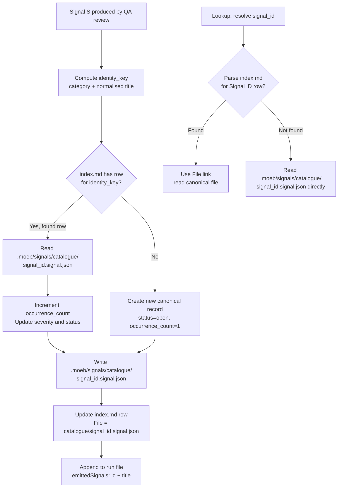

# Signal Catalogue: UUID-Based Filenames and Eliminated Run-Level Signals File

## Raw Requirement

Change the signal catalogue naming convention from <identity-key>.signal.json to <signal_id>.signal.json. Replace the run-level .moeb/signals/<run_id>.signals.json file with a thin emittedSignals array stored inside the run file (emittedSignals: [{ id: <signal_id>, description: <short-name> }]) so the separate signals file is eliminated entirely. Update signal lookup (used by start_spec and fix_signal when resolving a signal_id) to: (1) parse .moeb/signals/index.md for a row whose Signal ID column matches, then use that row's File link to read the canonical record; (2) fallback to reading .moeb/signals/catalogue/<signal_id>.signal.json directly if not indexed. Update all three canonical binary-bundled skills (run.skill.md, spec.skill.md, fix_signal.skill.md) to write catalogue files using the new <signal_id>.signal.json filename format. Migrate all existing catalogue files from <identity-key>.signal.json names to <signal_id>.signal.json names. Capture the signal file naming convention as an artifact schema document at src/moeb/internal/schemas/signal.schema.json. Add a new-artifact-naming-schema rubric criterion to .moeb/rubrics/run.rubrics.md requiring that any specification introducing a new persisted artifact type ships with a documented naming schema in src/moeb/internal/schemas/. Supersede moeb.start-spec-signal-catalogue-fallback.md entirely with corrected start_spec lookup logic aligned to the new convention (index.md lookup then direct-filename fallback instead of scanning all catalogue files).

## Description

This specification makes three coordinated changes to the signal persistence layer, implemented exclusively in skill markdown and Rust data-access code — no new kernel tools are introduced.

**1. UUID-based catalogue filenames.** The canonical signal file in `.moeb/signals/catalogue/` is renamed from `<category>-<title-slug>.signal.json` (identity-key format) to `<signal_id>.signal.json`. This makes any signal directly addressable by its UUID without parsing — constructing the path is `catalogue_dir/<signal_id>.signal.json` with no normalisation step. The identity key is retained as a deduplication tool written inside the record but removed from the filename.

**2. Eliminated run-level signals file.** The separate `.moeb/signals/<run_id>.signals.json` JSON array is removed. Each run file gains an `emittedSignals` array containing one `{ "id": "<signal_id>", "description": "<title>" }` object per signal emitted during that run. The full signal body remains exclusively in the canonical catalogue file; the run file carries only a lightweight reference.

**3. Simplified signal lookup.** The `resolve_requirement` function in `start_spec.rs` currently scans run-level arrays and catalogue files for a matching `signal_id` field. With run-level arrays eliminated and catalogue files directly addressable by name, the new lookup is: (1) parse `index.md` for a row whose Signal ID column matches — use that row's File link; (2) fallback to `.moeb/signals/catalogue/<signal_id>.signal.json` directly. The same index-first approach applies wherever `fix_signal` resolves a signal by ID.



## Backlinks

### Parents

| Label | Path | Purpose |
|-------|------|---------|
| Harness README | README.md | Root index and policy source |
| Signal Deduplication, Occurrence Tracking, and Lifecycle Reopening | specifications/moeb/moeb.signal-deduplication-and-lifecycle.md | Established the original catalogue directory and identity-key filename format superseded here |
| start_spec: Signal-ID Input and Correlation Token | specifications/moeb/moeb.start-spec-from-signal.md | Introduced `resolve_requirement`; this spec replaces its scanning logic with index-based lookup |
| start_spec: Signal-ID Lookup Falls Back to Signal Catalogue | specifications/moeb/moeb.start-spec-signal-catalogue-fallback.md | Entirely superseded by this spec; its lookup mechanism and catalogue scan approach are replaced |
| Run File Artifact | specifications/moeb/moeb.run-file-artifact.md | Introduced the run file format including `signals_path` field being replaced by `emittedSignals` |
| Skill Baseline Sync: Merge Canonical Signal Dedup into Binary-Bundled Skills | specifications/moeb/moeb.skill-baseline-sync.md | Placed the Canonical Signal Dedup-and-Write Procedure in binary-bundled skills updated here |

## Steps

### Step 1 — Create src/moeb/internal/schemas/signal.schema.json

Create the directory `src/moeb/internal/schemas/` if absent. Write `src/moeb/internal/schemas/signal.schema.json`:

```json
{
  "$schema": "https://json-schema.org/draft/2020-12/schema",
  "title": "Canonical Signal Record",
  "description": "Schema for a canonical signal file in .moeb/signals/catalogue/.",
  "filename_convention": "<signal_id>.signal.json",
  "location": ".moeb/signals/catalogue/",
  "type": "object",
  "required": ["signal_id", "category", "severity", "title", "description", "proposed_resolution", "gating_condition", "status", "occurrence_count", "first_seen", "last_seen", "occurrences"],
  "properties": {
    "signal_id": { "type": "string", "format": "uuid", "description": "UUID v4. Also the filename stem: <signal_id>.signal.json." },
    "category": { "type": "string", "enum": ["Error", "SkillImprovement", "ToolImprovement", "NewCapability", "ReasoningImprovement", "ProcessImprovement"] },
    "severity": { "type": "string", "enum": ["Info", "Minor", "Major", "Critical"] },
    "title": { "type": "string" },
    "description": { "type": "string" },
    "proposed_resolution": { "type": ["string", "null"] },
    "gating_condition": {},
    "status": { "type": "string", "enum": ["open", "resolved", "reopened"] },
    "occurrence_count": { "type": "integer", "minimum": 1 },
    "first_seen": { "type": "string", "format": "date-time" },
    "last_seen": { "type": "string", "format": "date-time" },
    "occurrences": {
      "type": "array",
      "items": {
        "type": "object",
        "required": ["timestamp", "run_id"],
        "properties": {
          "timestamp": { "type": "string", "format": "date-time" },
          "run_id": { "type": "string", "format": "uuid" }
        }
      }
    }
  }
}
```

### Step 2 — Add new-artifact-naming-schema criterion to .moeb/rubrics/run.rubrics.md

Read `.moeb/rubrics/run.rubrics.md`. Append the following row to its criteria table:

```
| `new-artifact-naming-schema` | Any specification that introduces a new persisted artifact type must ship with a machine-readable naming schema in `src/moeb/internal/schemas/` whose `filename_convention` field documents the exact file naming pattern. | One schema file per new artifact type | Run review: confirm `src/moeb/internal/schemas/<artifact>.schema.json` exists for each new artifact type and its `filename_convention` field is present and non-empty |
```

### Step 3 — Update the Canonical Signal Dedup-and-Write Procedure in all three skill files

Apply the following changes to each of `src/moeb/internal/skills/run.skill.md`, `src/moeb/internal/skills/spec.skill.md`, and `src/moeb/internal/skills/fix_signal.skill.md`. All three changes must be applied to each file; the resulting text must be identical across all three skill files.

**3a — Update canonical path comment.** Replace:
```
# Canonical path: .moeb/signals/catalogue/<identity-key>.signal.json
```
With:
```
# Canonical path: .moeb/signals/catalogue/<signal_id>.signal.json
```

**3b — Update write-new-record instruction.** Replace:
```
Write canonical record to `.moeb/signals/catalogue/<identity_key>.signal.json`.
```
With:
```
Write canonical record to `.moeb/signals/catalogue/<signal_id>.signal.json`.
```

**3c — Update write-updated-record instruction.** Replace:
```
Write updated E back to `.moeb/signals/catalogue/<identity_key>.signal.json`.
```
With:
```
Write updated E back to `.moeb/signals/catalogue/<signal_id>.signal.json`.
```

**3d — Update the Index Update sub-procedure row format.** Replace:
```
`| <signal_id> | <title> | <category> | <severity> | <status> | <occurrence_count> | <last_seen> | [catalogue/<identity_key>.signal.json](catalogue/<identity_key>.signal.json) |`
```
With:
```
`| <signal_id> | <title> | <category> | <severity> | <status> | <occurrence_count> | <last_seen> | [catalogue/<signal_id>.signal.json](catalogue/<signal_id>.signal.json) |`
```

**3e — Remove the run-based signals file sentence.** Remove the block that begins:
```
The run-based signals file `.moeb/signals/
```
and ends with the closing sentence referencing `signals.json`. Replace with:
```
After all catalogue writes complete, add each emitted signal as { "id": signal_id, "description": title } to the emittedSignals array in the run file (written in the Metrics Recording phase).
```

### Step 4 — Update run file writing in all three skill files

In each skill file's Metrics Recording phase, locate the run file JSON template. Remove the `signals_path` line. Add an `emittedSignals` array key after `metrics_path`:

**Remove:**
```json
"signals_path": ".moeb/signals/<run_id>.signals.json",
```

**Add (after `metrics_path`):**
```json
"emittedSignals": [
  { "id": "<signal_id_1>", "description": "<title_1>" }
],
```

Each entry in `emittedSignals` must correspond to one signal emitted during the run, in the order it was processed by the Canonical Signal Dedup-and-Write Procedure. The array is empty (`[]`) when no signals are emitted.

### Step 5 — Rewrite resolve_requirement in start_spec.rs

In `src/moeb/src/tools/start_spec.rs`, replace the entire body of `resolve_requirement` (keeping its signature unchanged) and add two new private helper functions immediately below it:

```rust
fn resolve_requirement(
    working_dir: &std::path::Path,
    requirement: &str,
    signal_id: &str,
) -> Result<String, String> {
    if !requirement.is_empty() {
        return Ok(requirement.to_string());
    }
    if signal_id.is_empty() {
        return Err("Either 'requirement' or 'signal_id' must be provided".to_string());
    }

    // Pass 1: look up signal_id in .moeb/signals/index.md
    let index_path = working_dir.join(".moeb/signals/index.md");
    if let Ok(index_content) = std::fs::read_to_string(&index_path) {
        for line in index_content.lines() {
            let cells: Vec<&str> = line.split('|').map(str::trim).collect();
            // Table row: | signal_id | title | category | severity | status | occurrences | last_seen | file |
            if cells.len() >= 9 && cells[1] == signal_id {
                if let Some(href) = extract_md_link_href(cells[8]) {
                    let file_path = working_dir.join(".moeb/signals").join(href);
                    if let Ok(resolved) = read_signal_from_file(&file_path) {
                        return Ok(resolved);
                    }
                }
            }
        }
    }

    // Pass 2: direct filename fallback
    let direct = working_dir
        .join(".moeb/signals/catalogue")
        .join(format!("{}.signal.json", signal_id));
    read_signal_from_file(&direct)
        .map_err(|_| format!("No signal found with signal_id '{}'", signal_id))
}

fn extract_md_link_href(cell: &str) -> Option<&str> {
    let start = cell.find('(')? + 1;
    let end = cell.rfind(')')?;
    if start < end { Some(&cell[start..end]) } else { None }
}

fn read_signal_from_file(path: &std::path::Path) -> Result<String, String> {
    let content = std::fs::read_to_string(path)
        .map_err(|e| format!("Cannot read {:?}: {}", path, e))?;
    let record: serde_json::Value = serde_json::from_str(&content)
        .map_err(|e| format!("Cannot parse {:?}: {}", path, e))?;
    let resolution = record.get("proposed_resolution").and_then(|v| v.as_str()).unwrap_or("");
    if !resolution.is_empty() {
        return Ok(resolution.to_string());
    }
    let title = record.get("title").and_then(|v| v.as_str()).unwrap_or("");
    let desc = record.get("description").and_then(|v| v.as_str()).unwrap_or("");
    Ok(format!("{}. {}", title, desc))
}
```

Remove all previous run-level `.signals.json` scanning code (the block that called `std::fs::read_dir` on `.moeb/signals/` and iterated `*.signals.json` files). Also remove any catalogue-scan fallback code introduced by `moeb.start-spec-signal-catalogue-fallback`.

### Step 6 — Replace start_spec_tests.rs test suite

Replace the existing tests in `src/moeb/src/tools/start_spec_tests.rs` with the following five tests (removing all tests that relied on run-level `.signals.json` files):

1. `test_resolve_requirement_uses_requirement_when_present`: non-empty `requirement` and non-empty `signal_id` → returned value equals `requirement`.

2. `test_resolve_requirement_errors_on_both_empty`: both arguments empty → `Err` returned.

3. `test_resolve_requirement_finds_signal_via_index`: tempdir contains:
   - `.moeb/signals/index.md` with a header row and a data row whose Signal ID column equals a known UUID, File column `catalogue/<uuid>.signal.json`
   - `.moeb/signals/catalogue/<uuid>.signal.json` with a known `proposed_resolution`
   Asserts returned value equals `proposed_resolution`.

4. `test_resolve_requirement_finds_signal_via_direct_filename`: tempdir contains only `.moeb/signals/catalogue/<uuid>.signal.json` (no `index.md`). Asserts returned value equals `proposed_resolution`.

5. `test_resolve_requirement_title_description_fallback`: tempdir contains a catalogue file with `proposed_resolution: ""`, `title: "Missing tool"`, `description: "No moeb equivalent"`. Asserts returned value equals `"Missing tool. No moeb equivalent"`.

### Step 7 — Migrate existing catalogue files to UUID-based names

For each file in `.moeb/signals/catalogue/` whose name does not already match the pattern `<uuid>.signal.json` (36-character UUID v4 followed by `.signal.json`):

1. Read the file and parse the `signal_id` field from the JSON.
2. Write the file content unchanged to `.moeb/signals/catalogue/<signal_id>.signal.json`.
3. Delete the old file. There is no moeb delete-file tool; use an available external mechanism and buffer a MissingMoebTool signal for this operation.
4. Update the corresponding row in `.moeb/signals/index.md`: replace the File cell value `catalogue/<old-name>.signal.json` with `catalogue/<signal_id>.signal.json`.

After migrating all files, verify the catalogue directory contains only UUID-named `.signal.json` files.

### Step 8 — Remove all .moeb/signals/*.signals.json files

Delete any files matching `.moeb/signals/*.signals.json`. These are the old run-level signal array files superseded by `emittedSignals` in the run file. Use an available external mechanism and buffer a MissingMoebTool signal for each delete operation.

Existing `.moeb/runs/*.json` files that contain a `signals_path` field are left as-is — they are archival and `signals_path` becomes a harmless dangling reference.

### Step 9 — Build and test

From `src/moeb/`:
1. `cargo build` — confirm compilation without errors or warnings.
2. `cargo test` — confirm all tests pass including the five new `start_spec_tests.rs` tests.

## Decisions

### Decision 1 — signal_id as the filename stem, not the identity key

**Rationale:** The identity key (`<category>-<title-slug>`) requires the reader to parse two fields and apply string normalisation to construct a filename. The `signal_id` is a UUID assigned at creation time; once known (from the index or a `fix_signal` event), the file path is directly constructable in one format string with no normalisation. This changes O(n) catalogue scans to O(1) path lookups.

**Rejected alternative:** Retaining identity-key naming was considered. Rejected because it forces any signal lookup by `signal_id` to either scan the index table row-by-row or read every catalogue file — the precise problem that triggered the `start-spec-signal-catalogue-fallback` signal. UUID naming eliminates the scan.

**Consequences:** The identity key is no longer visible in the filename. Deduplication continues to use the identity key (computed from category and title and written inside the record), but a file cannot be located by identity key without the index or a directory scan. The index.md remains the bridge between identity key and signal_id for human operators.

### Decision 2 — emittedSignals inline array replaces the run-level signals file

**Rationale:** The run-level `.signals.json` file duplicated signal body data that already exists in the catalogue. Its only unique value was "which signals did this run emit." A thin `emittedSignals: [{ id, description }]` array in the run file provides that reference at a fraction of the payload. Eliminating the duplicate file removes one write per run and removes the ambiguity of "which copy is authoritative."

**Rejected alternative:** Keeping the run-level file as a list of catalogue paths (rather than full signal bodies) was considered. Rejected because the thin inline array in the run file achieves the same reference function without a separate file on disk.

**Consequences:** Historical run files containing `signals_path` become archival with a dangling reference; they are not migrated. Forward: all new run files use `emittedSignals`.

### Decision 3 — index.md as primary lookup, direct filename as fallback

**Rationale:** The index provides O(n-lines) lookup that yields severity, status, and a file link without reading the catalogue file itself. It also handles cases where a file was re-written and the index updated — the index is the authoritative file-link source. The direct-filename fallback handles new signals that have been written to the catalogue but whose index row has not yet been flushed (e.g., mid-run state).

**Rejected alternative:** Direct filename only (no index lookup) was considered. Rejected because it requires the catalogue file to always exist at exactly the expected path, with no fallback for indexing inconsistency. The index lookup is the safer primary path.

**Consequences:** If a signal_id row exists in the index but the File link is stale, the index lookup fails and the fallback succeeds with the direct path. This is correct degradation behaviour.

### Decision 4 — extract_md_link_href and read_signal_from_file as private helpers in start_spec.rs

**Rationale:** Both helpers have exactly one call site within `resolve_requirement` in `start_spec.rs`. Promoting them to a shared module adds a cross-file dependency for functionality not yet needed elsewhere, violating the AI-first principle of no premature cross-cutting helpers. If a second tool needs the same logic, a dedicated spec should promote it at that time.

**Rejected alternative:** A shared `signal_lookup.rs` module — rejected as a premature abstraction.

**Consequences:** Any future caller must either duplicate the functions or promote them to a shared module via a dedicated specification.

### Decision 5 — Migrate existing catalogue files; no dual-format support

**Rationale:** Retaining both old identity-key filenames and new UUID filenames would require all skill dedup procedures to handle both formats indefinitely, doubling catalogue complexity. A one-time migration to UUID-only naming is cleaner and eliminates the dual-format handling.

**Rejected alternative:** Keeping old identity-key files as aliases — rejected because it doubles catalogue size and forces all readers to check both naming patterns.

**Consequences:** After migration, any cached reference to an old identity-key path (e.g., in old run file `signals_path` fields) becomes a dangling reference. Old run files are archival and are not updated.

## Rubric

### Structured

| Name | Description | Threshold | Pass Condition |
|------|-------------|-----------|----------------|
| `tool-errors` | No ToolHandler errors were recorded during this command invocation. Covers all tool calls on both CLI and MCP paths via `RealToolExecutor::execute`. Applies to every moeb command. | Zero tool errors | Kernel-authoritative: injected by `verify_rubrics` from `RunState.tool_errors`. Do not supply a verdict — any agent-supplied entry is overridden. |
| `rubric-qualification` | No Pass verdicts with acknowledged failures were issued during this command invocation. An agent that observes a failure but passes a criterion must populate `acknowledged_failures` in the verdict object. Applies to every moeb command. | Zero qualified Pass verdicts | Kernel-authoritative: injected by `verify_rubrics` by scanning `acknowledged_failures` on incoming Pass verdicts. Do not supply a verdict — any agent-supplied entry is overridden. |
| `skill-mandatory-phases` | The skill loaded for this run contains all mandatory phase headings. | All six mandatory headings present | Agent scans skill content in its loaded context; fails if any mandatory heading string is absent |
| `no-drift` | The specification does not violate any decision recorded in a linked parent specification. | Zero contradictions | Manual review of every decision in every parent spec listed in Backlinks |
| `spec-schema-compliance` | All required frontmatter fields and body sections are present and correctly ordered. | 100% of required fields and sections | Validation in `domain/spec.rs` exits 0 during `moeb spec` |
| `ai-first-org` | The specification's Steps prescribe file layouts, naming, and helper placement satisfying the four AI-first organisation principles. | All four principles followed | `extract_md_link_href` and `read_signal_from_file` co-located in `start_spec.rs`; `signal.schema.json` in its own file under `schemas/`; no cross-cutting helpers introduced |
| `kernel-thin-and-parity` | No domain-specific or workflow-specific coordination logic in kernel Rust code. Every tool registered in the CLI tool registry must also be registered in the MCP stdio server tool list. | Zero violations | Spec review: no Step places sequencing or conditional workflow logic in Rust; `resolve_requirement` and its helpers perform only filesystem reads and string parsing |
| `moeb-tool-origin` | All tool calls made during this invocation must originate from moeb's own tool registry. | Zero external tool calls | Agent reviews the conversation for calls to non-moeb tools; supplies Pass if none were made; supplies Fail with `acknowledged_failures` for each MissingMoebTool signal if external tools were used |
| `thin-kernel` | New Rust code in tools/, commands/, or domain/ must be a primitive operation wrapper or thin dispatcher. | Zero workflow-logic functions in new Rust | Run review: `resolve_requirement`, `extract_md_link_href`, and `read_signal_from_file` perform filesystem reads and string field extraction only; no domain-specific sequencing or retry logic |
| `mcp-cli-behavioural-parity` | For any operation exposed through both CLI and MCP, the observable outcome must be identical. | Zero divergent outcomes | Run review: `start_spec` is MCP-only; skill files are shared between both paths; no MCP/CLI divergence introduced |
| `signal-naming-schema-present` | `src/moeb/internal/schemas/signal.schema.json` exists and its `filename_convention` field contains `<signal_id>.signal.json`. | File exists, field present | Run review: confirm the file exists and `filename_convention` equals `"<signal_id>.signal.json"` |
| `catalogue-uuid-only` | After migration, no file in `.moeb/signals/catalogue/` has a name that is not a UUID v4 followed by `.signal.json`. | Zero non-UUID filenames in catalogue | Run review: list `.moeb/signals/catalogue/` and confirm all entries match the 36-char UUID pattern |
| `new-artifact-naming-schema` | Any specification introducing a new persisted artifact type must ship with a naming schema in `src/moeb/internal/schemas/`. | One schema file per new artifact type | Run review: `signal.schema.json` is present in `schemas/` with a valid `filename_convention` field |

### Qualitative

- `extract_md_link_href` and `read_signal_from_file` must remain private functions within `start_spec.rs`; neither may be promoted to a shared module without a dedicated specification.
- The Canonical Signal Dedup-and-Write Procedure changes in Step 3 must produce verbatim-identical text across all three canonical skill files, with the only allowed divergence being the `current_run_id` source note.
- The `emittedSignals` array in the run file must contain exactly one entry per signal emitted during the run — neither a subset nor a superset.
- After migration in Step 7, the `.moeb/signals/catalogue/` directory must contain only UUID-named `.signal.json` files; all `index.md` File links must resolve to existing files.
- The Rust changes must not alter the external signature of `resolve_requirement` (arguments and return type unchanged from `moeb.start-spec-from-signal`).
