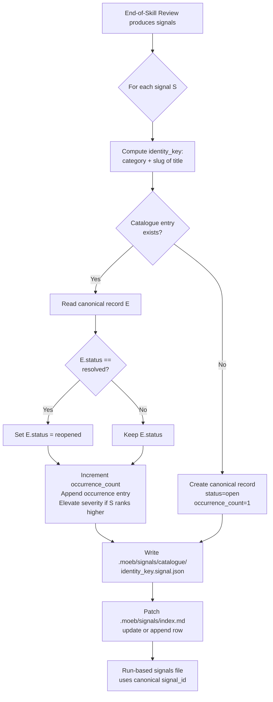

# Signal Deduplication, Occurrence Tracking, and Lifecycle Reopening

## Raw Requirement

When outputting signals we have wound up with duplicates which makes things unclear for future runs of the fix_signal skill. When we are to record signals for a run, check for existing signals that match criteria, if they already exist, may want to elevate their severity or keep track of a count of occurrences, timestamps of occurrence + run_id + overall count? We will likely benefit from a signal index md file to link out to specific signal instances. Once we have 'fixed' a signal cause also, given a scenario that the signal becomes present again, we could use a rubric to highlight no reoccurrence of old fixed signals i.e. once fixed, a signal can be reopened if a signal matching the same criteria is raised again.

## Description

This specification introduces three coordinated improvements to the signal system, all implemented exclusively in skill markdown and the rubrics catalogue — no kernel Rust changes.

**1. Canonical signal store** at `.moeb/signals/catalogue/`. One `.signal.json` file per unique signal identity, keyed by `category` + normalised `title`. Before writing any new signal, the skill agent reads the catalogue directory to detect an existing record with a matching identity key. If found, the record is updated (occurrence count incremented, occurrence entry appended, severity elevated if the new signal ranks higher, and status transitioned from `resolved` to `reopened`). If not found, a new canonical record is created with `occurrence_count: 1`.

**2. Signal index** at `.moeb/signals/index.md`. A markdown table maintained by the skill listing every canonical signal with its current severity, status, occurrence count, last-seen timestamp, and a link to its catalogue file. The index is patched — not rewritten — on each run; only rows for signals touched in the current run are updated or appended.

**3. Lifecycle reopening and rubric gate**. When a canonical signal transitions from `resolved` to `reopened`, a new `no-signal-reoccurrence` rubric criterion (added to `.moeb/rubrics/catalogue.rubrics.md`) fires on the run that triggered the reopen, marking that run's rubric as failed for that criterion. This surfaces signal regressions directly in the rubric score and drives future `fix_signal` selection.



## Backlinks

### Parents

| Label | Path | Purpose |
|-------|------|---------|
| Harness README | README.md | Parent index; registration target |
| Signal Fix Command | specifications/moeb/moeb.signal-fix-command.md | Existing signal production and fix_signal workflow |
| Fix Signal Skill Hardening | specifications/moeb/moeb.fix-signal-skill-hardening.md | Per-step review, commit, and signal-tag phases in fix_signal.skill.md |
| Run File Artifact | specifications/moeb/moeb.run-file-artifact.md | Run-based signals file format and signals_path reference in run file |

## Steps

### Step 1 — Define the canonical signal record schema

The canonical signal record extends the existing signal shape with five new fields. Document this schema as a prose comment at the top of the dedup-and-write procedure block added in Steps 2 and 3.

```json
{
  "signal_id": "<uuid-v4>",
  "category": "<Correctness|Performance|Security|NewCapability|Debt|...>",
  "severity": "<Info|Minor|Major|Critical>",
  "title": "<string>",
  "description": "<string>",
  "proposed_resolution": "<string>",
  "gating_condition": null,
  "status": "<open|resolved|reopened>",
  "occurrence_count": 1,
  "first_seen": "<ISO 8601>",
  "last_seen": "<ISO 8601>",
  "occurrences": [
    { "timestamp": "<ISO 8601>", "run_id": "<uuid>" }
  ]
}
```

**Severity ordering** (lowest to highest): `Info` < `Minor` < `Major` < `Critical`. Severity elevation replaces the stored severity only when the incoming signal's rank is strictly higher. Severity never decreases on an update.

**Identity key derivation**: `<category>-<title-slug>` where `title-slug` is the title lowercased, with any run of characters that is not `[a-z0-9]` replaced by a single hyphen, leading and trailing hyphens stripped, and the result truncated to 80 characters. Example: category `Correctness`, title `Missing moeb tool: Bash` → identity key `Correctness-missing-moeb-tool-bash`.

**Canonical file path**: `.moeb/signals/catalogue/<identity-key>.signal.json`

No Rust struct changes are needed — signal files are JSON artefacts managed entirely by skill instructions.

### Step 2 — Update `run.skill.md` End-of-Skill Review phase to write canonical signals

Open `.moeb/skills/run.skill.md`. In the End-of-Skill Review phase, locate the step that writes the signals array to `.moeb/signals/<run_id>.signals.json`. Before that write, insert the following **Dedup-and-Write Procedure** as new skill prose:

```
## Canonical Signal Dedup-and-Write Procedure
# Identity key: "<category>-<title-slug>"  (slug = lowercase, [^a-z0-9]+ → '-', strip edges, max 80 chars)
# Canonical path: .moeb/signals/catalogue/<identity-key>.signal.json
# Severity order: Info < Minor < Major < Critical

For each signal S in the ReviewSignalReport:
  1. Compute identity_key as described above.
  2. Attempt to read `.moeb/signals/catalogue/<identity_key>.signal.json` using read_file.
     If the file does not exist (read returns an error), treat as not_found.
  3. If not_found:
       Assign S.signal_id = new UUID v4.
       Set S.status         = "open".
       Set S.occurrence_count = 1.
       Set S.first_seen     = current ISO 8601 timestamp.
       Set S.last_seen      = current ISO 8601 timestamp.
       Set S.occurrences    = [{ "timestamp": S.first_seen, "run_id": current_run_id }].
       Write canonical record to `.moeb/signals/catalogue/<identity_key>.signal.json`.
  4. If found:
       Parse existing record E.
       If severity_rank(S.severity) > severity_rank(E.severity): E.severity = S.severity.
       If E.status == "resolved": E.status = "reopened".
       E.occurrence_count += 1.
       E.last_seen = current ISO 8601 timestamp.
       Append { "timestamp": E.last_seen, "run_id": current_run_id } to E.occurrences.
       Write updated E back to `.moeb/signals/catalogue/<identity_key>.signal.json`.
       S.signal_id = E.signal_id.
  5. After processing all signals, update `.moeb/signals/index.md` (see Step 4).

The run-based signals file `.moeb/signals/<run_id>.signals.json` is then written as normal,
using the signal_id values assigned in steps 3–4 above.
```

The run-based signals file retains backward compatibility. Each entry's `signal_id` now references the canonical record, enabling cross-run lookups.

### Step 3 — Update `spec.skill.md` End-of-Skill Review phase identically

Open `.moeb/skills/spec.skill.md`. Apply the identical Dedup-and-Write Procedure from Step 2. The text must be verbatim-identical to the `run.skill.md` addition, with only the inline comment about `current_run_id` source updated to note that in the spec skill the run_id is injected via `{{run_id}}` in the prompt template.

### Step 4 — Maintain `signals/index.md`

After completing the Dedup-and-Write Procedure for all signals in a run, the skill must update `.moeb/signals/index.md`.

**Index file structure** (create if absent):
```markdown
# Signal Index

| Signal ID | Title | Category | Severity | Status | Occurrences | Last Seen | File |
|-----------|-------|----------|----------|--------|-------------|-----------|------|
```

For each canonical signal written in the current run:
- Attempt to read `.moeb/signals/index.md` using `read_file`. If missing, create it with the header above using `write_file`.
- Search the existing table for a row whose `Signal ID` cell matches the canonical `signal_id`.
  - If found: use `patch_file` to update the `Severity`, `Status`, `Occurrences`, and `Last Seen` cells on that row only.
  - If not found: use `patch_file` to append a new row with all fields populated.

Row format:
```
| <signal_id> | <title> | <category> | <severity> | <status> | <occurrence_count> | <last_seen> | [catalogue/<identity_key>.signal.json](catalogue/<identity_key>.signal.json) |
```

### Step 5 — Add `no-signal-reoccurrence` criterion to `catalogue.rubrics.md`

Open `.moeb/rubrics/catalogue.rubrics.md`. Append the following row to the Criteria table:

```
| `no-signal-reoccurrence` | No Signal Reoccurrence | No canonical signal in `.moeb/signals/catalogue/` has `status: reopened` due to this run | Zero reopened signals introduced by this run | `moeb` | `signal-lifecycle` | `run` | active |
```

The **pass condition** is: in the Verify phase, the run agent lists `.moeb/signals/catalogue/` and reads each `.signal.json`. If any record has `status: "reopened"` and its latest `occurrences` entry carries the current `run_id`, the criterion fails. If no such record exists, the criterion passes.

### Step 6 — Wire `no-signal-reoccurrence` check into `run.skill.md` Verify phase

Open `.moeb/skills/run.skill.md`. In the Verify phase (where rubric verdicts are assembled), add the following check for the `no-signal-reoccurrence` criterion:

```
no-signal-reoccurrence check:
  1. Use list_directory on `.moeb/signals/catalogue/` to enumerate *.signal.json files.
     If the directory does not exist or is empty, verdict = pass.
  2. For each file, read it. If any record has status == "reopened" and its last occurrences
     entry has run_id == current_run_id: verdict = fail, note each reopened signal title.
  3. If no such record found: verdict = pass.
```

Include this check in the `verify_rubrics` call alongside the other criteria.

### Step 7 — Catalogue directory bootstrap note

Add a comment to the Dedup-and-Write Procedure in both skill files:

```
# Note: .moeb/signals/catalogue/ is created on first use.
# write_file creates parent directories automatically — no explicit mkdir required.
```

No `moeb init` change is needed since the catalogue directory is created on demand.

## Decisions

### Decision 1 — Identity key from category + normalised title

**Rationale**: `category` (a bounded set) combined with a slug of `title` provides a stable, human-readable, grep-discoverable key that survives minor description rewording while grouping true semantic duplicates. Title alone risks cross-category collisions; a UUID defeats dedup entirely.

**Rejected alternative**: Hash of full signal body — rejected because minor rewording in `description` would create false new canonical entries, defeating deduplication.

**Consequences**: If a signal title is significantly rephrased between runs a new canonical entry is created. This is acceptable — rephrasing implies the author considers it a distinct signal class.

### Decision 2 — Canonical files in `.moeb/signals/catalogue/` subdirectory

**Rationale**: A `catalogue/` subdirectory preserves backward compatibility with the existing run-based convention (`<run_id>.signals.json` at the signals root) while making canonical records visually and path-distinct. The `index.md` at the signals root gives a flat human view.

**Rejected alternative**: A single monolithic `catalogue.json` file — rejected because it grows unboundedly, causes patch conflicts under concurrent runs, and makes per-signal `grep_files` lookups require loading all signals.

**Consequences**: Each canonical signal is a standalone file; `grep_files` locates any signal by title or status without loading the full catalogue. The index provides a consolidated view.

### Decision 3 — Severity elevation is monotonically increasing

**Rationale**: The canonical record should preserve the worst-seen severity. Allowing downgrade would mask regressions where a once-Critical signal reappears at Minor.

**Rejected alternative**: Always use the latest run's severity — rejected because transient severity drops would lose the historical peak.

**Consequences**: Severity in the canonical record can only increase over time. The per-occurrence entry captures the severity at the time of each occurrence if finer-grained history is needed (this spec does not prescribe per-occurrence severity storage).

### Decision 4 — Reoccurrence transitions status, does not create a new signal

**Rationale**: Creating a new canonical entry on reoccurrence of a resolved signal would loop the dedup logic (two entries for the same identity key). A `resolved → reopened` transition keeps one canonical record per identity and makes regression explicitly visible in the index and rubric.

**Rejected alternative**: New signal with backlink to resolved signal — rejected because it requires a new `predecessor_id` field, complicates fix_signal selection (which must now also scan `reopened` entries), and breaks the one-record-per-identity invariant.

**Consequences**: The `status` field has three values: `open`, `resolved`, `reopened`. The `fix_signal` skill currently selects unresolved signals; a future spec must update it to also select `reopened` signals. This spec defers that update intentionally to keep scope minimal.

### Decision 5 — Skill-only implementation; no Rust kernel changes

**Rationale**: The dedup logic is sequential read → compute → write over harness JSON files. This is exactly the domain of skill markdown instructions. Encoding it in Rust would violate `kernel-thin-and-parity`.

**Rejected alternative**: A new `write_signal` kernel tool encapsulating dedup — rejected because it would embed domain-specific workflow logic (severity ordering, status transitions) in compiled code when a skill instruction achieves the same result.

**Consequences**: The skill prose must be precise enough for an agent to execute unambiguously. Each conditional branch is fully specified in the procedure blocks in Steps 2 and 3.

### Decision 6 — Index patched, not rewritten

**Rationale**: Full rewrite on every run requires reading all canonical files, grows in cost with catalogue size, and produces large write payloads. Patching only the rows for signals touched in the current run keeps diffs minimal and respects the minimum-diff hard rule.

**Rejected alternative**: Full rewrite for consistent ordering — rejected because ordering is cosmetic and does not justify the cost penalty.

**Consequences**: The index may accumulate rows in append order rather than alphabetically. Sorting or re-ordering is deferred to a future maintenance spec.

## Rubric

### Structured

| Name | Description | Threshold | Pass Condition |
|------|-------------|-----------|----------------|
| `tool-errors` | No ToolHandler errors were recorded during this command invocation. Covers all tool calls on both CLI and MCP paths via `RealToolExecutor::execute`. Applies to every moeb command. | Zero tool errors | Kernel-authoritative: injected by `verify_rubrics` from `RunState.tool_errors`. Do not supply a verdict — any agent-supplied entry is overridden. |
| `rubric-qualification` | No Pass verdicts with acknowledged failures were issued during this command invocation. An agent that observes a failure but passes a criterion must populate `acknowledged_failures` in the verdict object. Applies to every moeb command. | Zero qualified Pass verdicts | Kernel-authoritative: injected by `verify_rubrics` by scanning `acknowledged_failures` on incoming Pass verdicts. Do not supply a verdict — any agent-supplied entry is overridden. |
| `skill-mandatory-phases` | The skill loaded for this run contains all mandatory phase headings. The agent checks its own prompt context (the loaded skill content is already present) for the exact strings: "Verify", "End-of-Skill Review", "Metrics Recording", "Commit", "Tag", "Complete". No file read is required. | All six mandatory headings present | Agent scans skill content in its loaded context; fails if any mandatory heading string is absent. |
| `no-drift` | The specification does not violate any decision recorded in a linked parent specification. | Zero contradictions | Manual review of every decision in every parent spec listed in Backlinks. |
| `spec-schema-compliance` | All required frontmatter fields and body sections are present and correctly ordered. | 100% of required fields and sections | Validation in `domain/spec.rs` exits 0 during `moeb spec`. |
| `ai-first-org` | The specification's Steps prescribe file layouts, naming, and helper placement that satisfy the four AI-first organisation principles: one concern per file, context locality, grep-discoverable names, no cross-cutting helpers. | All four principles followed | Manual review: no step produces a file that mixes concerns, no name is generic across the codebase, all helpers are co-located with their callers or promoted to a precisely named module. |
| `kernel-thin-and-parity` | No domain-specific or workflow-specific coordination logic may be placed in kernel Rust code when it can live in skill markdown or role files. Every tool registered in the CLI tool registry must also be registered in the MCP stdio server tool list. | Zero violations | Spec review: no proposed step places review/coordination logic in Rust; Run review: grep confirms no skill-specific logic in kernel tools; tool lists in tools/mod.rs and the MCP server match exactly. |
| `moeb-tool-origin` | All tool calls made during this invocation must originate from moeb's own tool registry. If an external tool (not in the moeb registry) was used because no moeb equivalent exists, the agent must write a MissingMoebTool signal immediately after each such call. The criterion always fails when any external tool is used, whether or not a signal was written. | Zero external tool calls | Agent reviews the conversation for calls to non-moeb tools (e.g. Bash, Edit, Write, Read, Glob, Grep, WebFetch, WebSearch in Claude Code MCP mode). Supplies Pass if none were made. If external tools were used with MissingMoebTool signals, supplies Fail with `acknowledged_failures` listing each signal title. If external tools were used without signals, supplies Fail with the unlogged tool names in the note. |
| `thin-kernel` | New Rust code in tools/, commands/, or domain/ must be either (a) a primitive operation wrapper (filesystem, git, or HTTP with no domain logic) or (b) a thin dispatcher that calls into skills, tools, or agents and returns the result unchanged. Workflow logic must live in skill markdown or role files, not in compiled Rust. | Zero workflow-logic functions in new Rust | Spec review: no Step proposes placing sequencing or conditional workflow logic in Rust when a skill-file change would suffice. |

### Qualitative

- The Dedup-and-Write Procedure prose in `run.skill.md` and `spec.skill.md` must be verbatim-identical except for the `run_id` source note; any divergence constitutes a signal-writing inconsistency that will surface as a duplicate.
- The canonical record schema must list all fields in the order defined in Step 1: `signal_id`, `category`, `severity`, `title`, `description`, `proposed_resolution`, `gating_condition`, `status`, `occurrence_count`, `first_seen`, `last_seen`, `occurrences`.
- The `index.md` header row must exactly match the template in Step 4; deviations will cause `patch_file` hunk-relocation failures on future runs.
- The identity key derivation rule must produce the same result across both skill files and across runs; any implementation inconsistency creates phantom duplicate catalogue entries.
- Steps 5 and 6 together must be sufficient for the run implementation agent to add the rubric criterion and wire its verification without reading any additional file.
