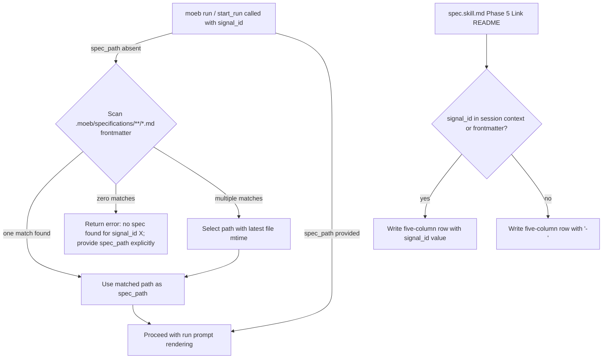

# Signal ID as First-Class Workflow Handle: start_run Auto-Resolution and README Spec Index Signal ID Column

## Raw Requirement

**start_run and moeb run CLI (from a1000083):**
1. Make spec_path optional in start_run when signal_id is provided. Add a resolution step: scan .moeb/specifications/*/*.md frontmatter for signal_id match and use the matched path as spec_path. If multiple specs share the same signal_id, prefer the most recently authored (by frontmatter date or file mtime). If no match is found, return a clear error: 'no spec found for signal_id <id>; provide spec_path explicitly'.
2. Apply the equivalent change to the moeb run CLI: --signal-id alone is sufficient to start a run when a matching spec exists.
3. Update start_run parameter description to reflect spec_path is optional when signal_id resolves a unique spec.

**README spec index (from a1000084):**
4. Add a Signal ID column (nullable — value or '-') to the README.md specification index table.
5. Update spec.skill.md Phase 5 (Link README) to populate the Signal ID column with the frontmatter signal_id value when present, and '-' when absent.
6. Update the spec index row format documentation in spec.skill.md to include the new column definition.
7. Backfill existing spec rows with signal_id values where the frontmatter field is set.

## Description

This specification closes two complementary gaps that prevent `signal_id` from being a complete, self-sufficient handle for the spec-to-run workflow.

**Part 1 — start_run auto-resolution:** `start_run` and `moeb run` currently require `spec_path` as a mandatory parameter. This spec makes `spec_path` optional when `signal_id` is provided by adding a frontmatter scan in `src/moeb/tools/start_run.rs`: the tool reads all `.moeb/specifications/**/*.md` files, parses YAML frontmatter blocks, and matches on the `signal_id` field. The matched path is used as `spec_path`. The `moeb run` CLI (`src/moeb/commands/run.rs`) receives the same treatment: `--spec-path` becomes optional when `--signal-id` resolves a unique spec. The MCP tool schema for `start_run` is updated to remove `spec_path` from the `required` array.

**Part 2 — README spec index Signal ID column:** A new nullable `Signal ID` column is added to the `.moeb/README.md` specification index. `spec.skill.md` Phase 5 is updated to write the fifth column (`signal_id` from the session context or spec frontmatter, or `-` when absent). The README column documentation table is updated, all domain table headers and separator rows are updated to five columns, and all existing spec rows are backfilled with `signal_id` values extracted from their frontmatter (or `-` when absent).



## Backlinks

### Parents

| Label | Path | Purpose |
|-------|------|---------|
| Harness README | README.md | Root specification index, policies, and column schema for spec registration |
| start_spec: Signal-ID Input and Correlation Token | specifications/moeb/moeb.start-spec-from-signal.md | Established signal_id as a spec frontmatter field and start_spec signal parameter |
| Run Partial Resolution Recovery and Fix Signal Direct Invocation | specifications/moeb/moeb.run-partial-recovery-and-fix-signal-direct.md | Extended fix_signal with direct signal_id invocation; sets precedent for signal-driven workflow entry |
| Tool Executor Extraction | specifications/moeb/moeb.tool-executor-extraction.md | Established tools/ module, ToolHandler trait, and ToolRegistry pattern that start_run follows |

## Steps

### Step 1 — Read current start_run tool implementation

Read `src/moeb/tools/start_run.rs` to understand the current parameter struct, how `spec_path` is used, and the return type pattern used by sibling tools.

### Step 2 — Extend start_run with spec_path auto-resolution

In `src/moeb/tools/start_run.rs`:

1. Change the `spec_path` field in the tool input struct to `Option<String>` (or equivalent nullable type).
2. Update the `spec_path` field description in the JSON schema string to: `"Relative path to the spec file. Optional when signal_id resolves a unique spec via frontmatter scan."`.
3. Remove `spec_path` from the `required` array in the tool's JSON schema.
4. After input parsing, when `spec_path` is `None` and `signal_id` is `Some(id)`, execute the resolution procedure:
   a. Enumerate all files matching `.moeb/specifications/**/*.md` using recursive directory traversal.
   b. For each file, read its content. Extract the YAML frontmatter block: the text between the opening `---\n` at byte offset 0 and the next standalone `---\n` line.
   c. Within the frontmatter text, check for a line matching `signal_id: <id>` where `<id>` is the provided signal_id (exact string match, whitespace-trimmed).
   d. Collect all matching file paths into a `Vec<PathBuf>`.
   e. If zero matches: return a tool error result string: `"no spec found for signal_id <id>; provide spec_path explicitly"`.
   f. If one match: set `spec_path = Some(<matched path as relative string>)`.
   g. If multiple matches: sort by `std::fs::metadata(path).modified()` descending; use the first (most recent) path. Log a warning to stderr: `"warning: multiple specs found for signal_id <id>; using most recently modified: <path>"`.
5. After the resolution block, `spec_path` is guaranteed `Some` or the function has already returned an error. Proceed with the existing run prompt rendering logic using the resolved `spec_path`.

### Step 3 — Update the MCP server registration for start_run

Read the file in `src/moeb/` that registers tools in the MCP stdio server tool list (the file that builds the MCP tool schema array). Locate the `start_run` entry. Update its `spec_path` parameter: change `required: true` to `required: false` (or remove it from the `required` array if the schema uses a JSON Schema `required` array). Confirm the `signal_id` field description already reflects it can drive resolution; if not, update it to: `"Optional UUID of the signal in .moeb/signals/catalogue/ that triggered this run. When provided without spec_path, the tool scans spec frontmatter to resolve spec_path automatically."`.

### Step 4 — Update moeb run CLI command

Read `src/moeb/commands/run.rs` (or the source file that handles the `moeb run` subcommand and its argument parsing) to understand how `--spec-path` and `--signal-id` are currently defined.

1. Change `--spec-path` from a required argument to an optional argument (e.g. from `required(true)` to `required(false)` in clap, or equivalent).
2. After argument parsing, add a guard: if both `--spec-path` and `--signal-id` are absent, print `"error: one of --spec-path or --signal-id is required"` and exit with a non-zero code.
3. If `--spec-path` is absent but `--signal-id` is provided, pass `spec_path: None` to `start_run`; the tool will resolve it via frontmatter scan (Step 2).
4. If the CLI re-implements the resolution rather than delegating to `start_run`, apply the same resolution logic as Step 2 directly and pass the resolved path to `start_run` as `spec_path: Some(resolved)`. Prefer delegation to avoid duplicate logic.

### Step 5 — Read spec.skill.md

Read `src/moeb/internal/skills/spec.skill.md` to locate:
- Phase 5 (Link README) and the row format comment.
- Any existing documentation of the `signal_id` session context variable in Phase 5.

### Step 6 — Update spec.skill.md Phase 5 row format

In `src/moeb/internal/skills/spec.skill.md`, locate the Phase 5 row format instruction. It currently reads (approximately):

```
New row format (four columns, Status value `active`):
| <Title> | <one-sentence description> | [specifications/<domain>/<domain>.<slug>.md](specifications/<domain>/<domain>.<slug>.md) | active |
```

Replace it with:

```
New row format (five columns, Status value `active`, Signal ID from session context or frontmatter):
| <Title> | <one-sentence description> | [specifications/<domain>/<domain>.<slug>.md](specifications/<domain>/<domain>.<slug>.md) | active | <signal_id> |
```

Where `<signal_id>` is derived as follows (add this instruction immediately before the row format line):

> **Signal ID value:** Use the `signal_id` session context variable if non-empty. Otherwise, read the `signal_id` field from the spec file's YAML frontmatter (already written in Phase 4). If neither is set, use `-`.

Also update the `patch_file` old_string example and any other location in Phase 5 that shows the row format to use five columns.

### Step 7 — Update README.md column documentation

In `.moeb/README.md`, locate the column documentation table (under "Specification requirements"):

```
| Column | Content |
|--------|---------|
| **Name** | The human-readable title of the specification |
| **Description** | A single sentence describing the specification's subject and scope |
| **Path** | The relative path to the specification file from the repo root |
| **Status** | Lifecycle state: `active`, `superseded`, or `draft` |
```

Add a fifth row immediately after the Status row:

```
| **Signal ID** | The `signal_id` from the spec's YAML frontmatter if a signal triggered this spec; `-` otherwise |
```

### Step 8 — Update all specification index table headers in README.md

Every `### <domain>` section in `.moeb/README.md` contains a table with a four-column header:

```
| Name | Description | Path | Status |
|------|-------------|------|--------|
```

Replace every occurrence with the five-column header:

```
| Name | Description | Path | Status | Signal ID |
|------|-------------|------|--------|-----------|
```

Apply this to all domain sections: `harness`, `moeb`, and any others present.

### Step 9 — Backfill existing spec rows with Signal ID values

For each data row in every domain table in `.moeb/README.md`:

1. Extract the path from the row's Path cell. The cell contains a markdown link; the href is the relative path from the `.moeb/` root, e.g. `specifications/moeb/moeb.kernel.md`.
2. Read the spec file at `.moeb/<path>` using `read_file`.
3. Parse the YAML frontmatter block to extract the `signal_id` field value. If the field is absent or the file cannot be read, use `-`.
4. Append `| <signal_id_or_dash> |` as a fifth cell to the row, so a row that was:
   `| Title | Description | [path](path) | active |`
   becomes:
   `| Title | Description | [path](path) | active | - |`
   or, when a signal_id is present:
   `| Title | Description | [path](path) | active | a1000094-0610-4000-8000-000000000094 |`

Write the complete updated `.moeb/README.md` using `write_file` once all rows have been backfilled. Do not make any other changes to the file.

### Step 10 — all-skill-files-parity: run.skill.md (exclusion rationale)

`run.skill.md` has no Phase 5 equivalent — it governs code implementation runs, not spec registration. It never writes to the README specification index. No changes to `run.skill.md` are required.

### Step 11 — all-skill-files-parity: fix_signal.skill.md (exclusion rationale)

`fix_signal.skill.md` orchestrates signal selection and spec authoring but delegates README linking entirely to the spec skill invoked in its Phase 5. It has no step that writes spec index rows directly. No changes to `fix_signal.skill.md` are required.

## Decisions

### Decision 1 — spec_path resolution via frontmatter scan rather than README index lookup

The simplest reliable way to find which spec was authored for a given signal is to scan spec frontmatter directly. The README index is the natural cache, but it lacks the Signal ID column until Part 2 of this spec is implemented and backfilled. Making Part 1 depend on Part 2 would create a sequencing problem: the run that implements this spec would need the README index updated before start_run auto-resolution works. Frontmatter is the authoritative source and is available without a prior migration step.

After Part 2 lands, a future optimisation could add an index-first lookup with frontmatter fallback, but that optimisation is out of scope here.

**Rejected:** Index-first lookup from README.md — creates a sequencing dependency between Part 1 and Part 2.

**Rejected:** A separate signal-to-spec map file — premature; frontmatter is the canonical store.

**Consequences:** Resolution adds one file-read sweep over all specs at `start_run` invocation time. At typical spec counts (< 200 files, each < 20 KiB) the added latency is negligible.

### Decision 2 — Tie-breaking multiple signal_id matches by most-recent file mtime

Multiple specs sharing the same signal_id should not occur in a well-governed harness, but the system must be defensive. Most-recently-modified is the simplest deterministic tie-breaker that favours the newest authored spec, which is the most likely intent when a signal has been addressed more than once (e.g. first spec superseded, new spec carries same signal_id).

**Rejected:** Error on multiple matches — would break valid cases where a signal's first spec was superseded and a successor carries the same signal_id.

**Rejected:** Alphabetical sort by path — no semantic relevance to authoring recency.

### Decision 3 — Signal ID column appended at end of README index table

Adding the column at the end minimises diff noise in the backfill step and avoids reordering existing columns, which could break any tooling that parses the table by column position. Signal ID is a traceability field; it naturally belongs after the primary descriptive columns.

**Rejected:** Signal ID as first column — maximises diff noise in backfill.

**Rejected:** Signal ID between Path and Status — no clear advantage over end-of-row placement.

### Decision 4 — all-skill-files-parity: run.skill.md and fix_signal.skill.md excluded

This spec modifies `spec.skill.md` Phase 5 to add the Signal ID column to README rows. `run.skill.md` has no Phase 5 Link README step — it governs code implementation and never writes to the README index. `fix_signal.skill.md` delegates README linking entirely to the spec skill and has no equivalent step. Both files are intentionally excluded. See Steps 10 and 11.

### Decision 5 — spec_path remains accepted when provided; resolution is a fallback only

When a caller provides `spec_path` explicitly, the resolution scan is skipped entirely. This preserves full backward compatibility: all existing callers that pass `spec_path` continue to work unchanged. The resolution step fires only when `spec_path` is absent and `signal_id` is present.

## Rubric

### Structured

| Name | Description | Threshold | Pass Condition |
|------|-------------|-----------|----------------|
| `tool-errors` | No ToolHandler errors were recorded during this command invocation. Covers all tool calls on both CLI and MCP paths via `RealToolExecutor::execute`. Applies to every moeb command. | Zero tool errors | Kernel-authoritative: injected by `verify_rubrics` from `RunState.tool_errors`. Do not supply a verdict — any agent-supplied entry is overridden. |
| `rubric-qualification` | No Pass verdicts with acknowledged failures were issued during this command invocation. An agent that observes a failure but passes a criterion must populate `acknowledged_failures` in the verdict object. Applies to every moeb command. | Zero qualified Pass verdicts | Kernel-authoritative: injected by `verify_rubrics` by scanning `acknowledged_failures` on incoming Pass verdicts. Do not supply a verdict — any agent-supplied entry is overridden. |
| `skill-mandatory-phases` | The skill loaded for this run contains all mandatory phase headings. The agent checks its own prompt context (the loaded skill content is already present) for the exact strings: "Verify", "End-of-Skill Review", "Metrics Recording", "Commit", "Tag", "Complete". No file read is required. | All six mandatory headings present | Agent scans skill content in its loaded context; fails if any mandatory heading string is absent |
| `moeb-tool-origin` | All tool calls made during this invocation must originate from moeb's own tool registry. If an external tool (not in the moeb registry) was used because no moeb equivalent exists, the agent must write a MissingMoebTool signal immediately after each such call. The criterion always fails when any external tool is used, whether or not a signal was written. | Zero external tool calls | Agent reviews the conversation for calls to non-moeb tools (e.g. Bash, Edit, Write, Read, Glob, Grep, WebFetch, WebSearch in Claude Code MCP mode). Supplies Pass if none were made. If external tools were used with MissingMoebTool signals, supplies Fail with `acknowledged_failures` listing each signal title. If external tools were used without signals, supplies Fail with the unlogged tool names in the note. |
| `no-drift` | The specification does not violate any decision recorded in a linked parent specification | Zero contradictions | Manual review of every decision in every parent spec listed in Backlinks |
| `spec-schema-compliance` | All required frontmatter fields and body sections are present and correctly ordered | 100% of required fields and sections | Validation in `domain/spec.rs` exits 0 during `moeb spec` |
| `ai-first-org` | The specification's Steps prescribe file layouts, naming, and helper placement that satisfy the four AI-first organisation principles: one concern per file, context locality, grep-discoverable names, no cross-cutting helpers. | All four principles followed | Manual review: no step produces a file that mixes concerns, no name is generic across the codebase, all helpers are co-located with their callers or promoted to a precisely named module |
| `branch-clean-at-exit` | After Phase 9 (Commit), the working tree contains no uncommitted changes; any dirty state detected in Phase 9a has been resolved by retry commit (Case A) or by signal emission and cleanup commit (Case B) | Zero uncommitted changes at spec skill exit | Agent verifies that `git_status` returned empty output after Phase 9, or that a retry (Case A) or cleanup commit (Case B) was issued and the branch is clean |
| `kernel-thin-and-parity` | No domain-specific or workflow-specific coordination logic may be placed in kernel Rust code when it can live in skill markdown or role files. Every tool registered in the CLI tool registry must also be registered in the MCP stdio server tool list. | Zero violations | Spec review: no proposed step places review/coordination logic in Rust; Run review: grep confirms no skill-specific logic in kernel tools; tool lists in tools/mod.rs and the MCP server match exactly |
| `all-skill-files-parity` | Whenever a spec adds, removes, or modifies a workflow phase in any one of the three canonical skill files (run.skill.md, spec.skill.md, fix_signal.skill.md), the spec must contain an explicit Step for each of the other two files — either applying the equivalent change or documenting with rationale why that file is intentionally excluded. | Zero unaddressed canonical skill files when any canonical skill file phase is modified | Run agent reviews the steps of the spec under implementation. If no canonical skill file phase is added, removed, or modified, mark `na`. If one or more canonical skill file phases are modified, verify that the spec contains a step for each of the other two canonical skill files (addressing the equivalent change or stating an exclusion rationale). Fail if any of the other two files has neither a qualifying step nor a documented exclusion rationale. |
| `thin-kernel` | New Rust code in tools/, commands/, or domain/ must be either (a) a primitive operation wrapper (filesystem, git, or HTTP with no domain logic) or (b) a thin dispatcher that calls into skills, tools, or agents and returns the result unchanged. Workflow logic — sequencing, conditionals, review loops, retry strategy, branching decisions — must live in skill markdown or role files, not in compiled Rust. | Zero workflow-logic functions in new Rust | Spec review: no Step proposes placing sequencing or conditional workflow logic in Rust when a skill-file change would suffice; Run review: every new function in tools/ or commands/ either wraps a single OS/VCS/HTTP call or contains no domain-specific branching |
| `mcp-cli-behavioural-parity` | For any operation exposed through both the CLI agent loop and the MCP server, the observable outcome must be identical: same file mutations, same tool result string format, same rendered prompt template. Any tool registered in the standard registry must be registered in the MCP registry with an identical input schema and result contract. | Zero divergent outcomes | Run review: for every tool added or modified, both ToolRegistry::standard() and the MCP server carry identical registrations with identical input schema and result contract |

### Qualitative

- The `start_run` resolution error message must exactly match: `"no spec found for signal_id <id>; provide spec_path explicitly"` with `<id>` substituted with the actual signal_id value — not a variant wording.
- The README backfill must not alter any content in existing Name, Description, Path, or Status cells — only the new fifth cell is added per row.
- The spec.skill.md Phase 5 update must ensure that new spec rows written after this change always include five columns; the Signal ID derivation instruction must be unambiguous to a cold-reading agent.
