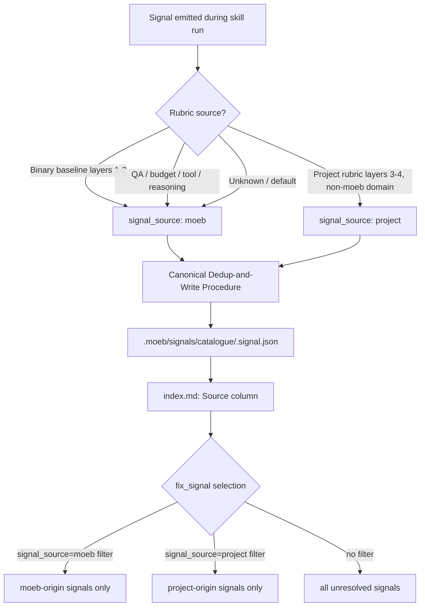

# Signal Source Field: Separating moeb-origin and Project-origin Signals

## Raw Requirement

**Signal title:** Signals must be separable into moeb-origin and project-origin categories

**Signal description:** All signals are currently stored in a single catalogue without distinguishing whether they relate to the moeb harness itself or to the project under development. When signals are pushed to remote sources (GitHub Issues, telemetry endpoints), moeb-origin signals must route to the moeb repository and project-origin signals to the project repository. Without this separation the routing is impossible and telemetry would be polluted.

**Proposed resolution:** Add a `signal_source` field to the signal schema with values: `moeb | project`. Populate based on rubric_source: signals arising from moeb rubrics or moeb tool-origin violations are moeb-origin; signals arising from project rubrics are project-origin. Update signal_fix, the fix_signal tool, and all signal reporting to support filtering by signal_source. Document the convention in the signal schema and README.

## Description

This specification adds a required `signal_source` field (enum: `"moeb"` | `"project"`) to the canonical signal record schema, the `signal.schema.json` binary asset, and the Canonical Signal Dedup-and-Write Procedure in all three binary-bundled skill files (`spec.skill.md`, `run.skill.md`, `fix_signal.skill.md`).

`signal_source` identifies whether a signal relates to the quality of the moeb harness itself (`"moeb"`) or the quality of the project under development with moeb (`"project"`). Population rule: signals arising from binary-bundled baseline rubric criteria (layers 1–2), or from harness skill execution concerns (QA review, budget breaches, missing moeb tools, reasoning review, uncommitted paths, partial recovery, signal reoccurrence) are tagged `"moeb"`. Signals arising from project-specific rubric criteria (layers 3–4 `.moeb/rubrics/` files for non-moeb domains) are tagged `"project"`. Default when rubric source is indeterminate: `"moeb"`.

The `fix_signal` MCP tool is extended with an optional `signal_source` filter parameter so orchestrators can target only moeb-origin or only project-origin signals. The skill selection phase uses the injected filter. The signal index gains a `Source` column. All existing catalogue signals are migrated to include `signal_source: "moeb"` (all current signals in this repository are moeb-origin). The QA Architect role file is updated to include `signal_source` in its output signal schema. The README gains a Signal Routing subsection documenting the field and routing convention.

## Diagram



## Backlinks

### Parents

| Label | Path | Purpose |
|-------|------|---------|
| README | [.moeb/README.md](.moeb/README.md) | Harness root; signal system overview |
| Signal Deduplication and Lifecycle | [specifications/moeb/moeb.signal-deduplication-and-lifecycle.md](specifications/moeb/moeb.signal-deduplication-and-lifecycle.md) | Defines the canonical signal record schema and dedup-and-write procedure this spec extends |
| Signal Catalogue: UUID-Based Filenames | [specifications/moeb/moeb.signal-catalogue-id-based-naming.md](specifications/moeb/moeb.signal-catalogue-id-based-naming.md) | Established current catalogue file naming; schema extended here |
| Run Skill: Signal Retrospective and Signal Schema Bundling | [specifications/moeb/moeb.run-skill-retrospective-and-signal-schema.md](specifications/moeb/moeb.run-skill-retrospective-and-signal-schema.md) | Wired signal.schema.json into the binary bundle; updated here |
| Fix Signal Catalogue Alignment | [specifications/moeb/moeb.fix-signal-catalogue-alignment.md](specifications/moeb/moeb.fix-signal-catalogue-alignment.md) | Aligned fix_signal.skill.md with canonical signal procedure; extended here |
| Signal Status Lifecycle Tracking | [specifications/moeb/moeb.signal-status-lifecycle-tracking.md](specifications/moeb/moeb.signal-status-lifecycle-tracking.md) | Defines signal status field; schema extended alongside here |
| Gating Condition: Array of Signal UUIDs | [specifications/moeb/moeb.gating-condition-must-be-an-array-of-full-signal-uuids.md](specifications/moeb/moeb.gating-condition-must-be-an-array-of-full-signal-uuids.md) | Most recent prior signal schema change; no contradiction |
| Run Partial Resolution Recovery and Fix Signal Direct Invocation | [specifications/moeb/moeb.run-partial-recovery-and-fix-signal-direct.md](specifications/moeb/moeb.run-partial-recovery-and-fix-signal-direct.md) | Introduced optional signal_id parameter to fix_signal; pattern followed here for signal_source |

## Steps

### Step 1 — Update signal.schema.json

File: `src/moeb/internal/schemas/signal.schema.json`

Read the current file. Add `"signal_source"` as a required property. Insert it between `"category"` and `"severity"` in both the `required` array and the `properties` object, establishing the canonical field order:

`signal_id → category → signal_source → severity → title → description → proposed_resolution → gating_condition → status → occurrence_count → first_seen → last_seen → occurrences`

Property definition to insert:

```json
"signal_source": {
  "type": "string",
  "enum": ["moeb", "project"],
  "description": "Origin of the signal. 'moeb': relates to the moeb harness itself (baseline rubric criteria, skill execution quality, tool capability gaps, kernel behaviour). 'project': relates to the project under development with moeb (project-specific rubric criteria, layers 3-4). Default when indeterminate: 'moeb'."
}
```

Write the complete updated file. Run the Per-Step Review Sub-Loop.

### Step 2 — Update Canonical Signal Dedup-and-Write Procedure in spec.skill.md

File: `src/moeb/internal/skills/spec.skill.md`

Locate the `## Canonical Signal Dedup-and-Write Procedure` section. Apply the following changes:

**2a. Schema comment:** Update the canonical signal record schema comment to include `signal_source` between `category` and `severity`:
```
# Canonical signal record schema (all fields in this order):
# { "signal_id", "category", "signal_source", "severity", "title", "description", "proposed_resolution",
#   "gating_condition", "status", "occurrence_count", "first_seen", "last_seen", "occurrences" }
```

**2b. not_found branch (step 3):** After `Set S.status = "open"`, insert:
```
Set S.signal_source = S.signal_source if present in the buffered signal definition, else "moeb".
```
All signals emitted by `spec.skill.md` relate to harness quality; the default `"moeb"` is always correct here.

**2c. found branch (step 4):** After parsing existing record `E`, insert:
```
If E.signal_source is absent (legacy record without field): set E.signal_source = "moeb".
```

**2d. Index Update sub-procedure — header:** Change the index table header to:
```markdown
| Signal ID | Title | Category | Source | Severity | Status | Occurrences | Last Seen | File |
|-----------|-------|----------|--------|----------|--------|-------------|-----------|------|
```

**2e. Index Update sub-procedure — new row template:** Change the new-row append template to:
```
| <signal_id> | <title> | <category> | <signal_source> | <severity> | <status> | <occurrence_count> | <last_seen> | [catalogue/<signal_id>.signal.json](catalogue/<signal_id>.signal.json) |
```

Write the complete updated file. Run the Per-Step Review Sub-Loop.

### Step 3 — Update Canonical Signal Dedup-and-Write Procedure in run.skill.md

File: `src/moeb/internal/skills/run.skill.md`

Apply the same five changes described in Step 2 (schema comment, not_found branch, found branch, index header, row template).

Additionally, in the not_found branch (`step 3`), replace the simple default rule with the full population rule:

```
Set S.signal_source = S.signal_source if present in the buffered signal definition, else determine by source:
  - If the signal was triggered by a project-domain rubric criterion (layers 3-4 in .moeb/rubrics/ for a non-moeb spec domain): "project"
  - All other signals (QA End-of-Skill Review, budget breach, missing moeb tool, uncommitted path,
    reasoning review, partial recovery, no-signal-reoccurrence): "moeb"
  - Default: "moeb"
```

Write the complete updated file. Run the Per-Step Review Sub-Loop.

### Step 4 — Update Canonical Signal Dedup-and-Write Procedure in fix_signal.skill.md

File: `src/moeb/internal/skills/fix_signal.skill.md`

Apply the same five changes described in Step 2 (schema comment, not_found branch default `"moeb"`, found branch legacy migration, index header, row template).

Additionally, locate the signal selection phase (the phase that selects the most-critical unresolved signal). After the existing selection criteria (most-critical, unresolved, no blocking gating conditions), add:

> If the template variable `{{fix_signal_source}}` is non-empty, restrict the candidate pool to signals where `signal_source == "{{fix_signal_source}}"` before applying severity ranking. When `{{fix_signal_source}}` is empty, all unresolved signals regardless of source are eligible.

Write the complete updated file. Run the Per-Step Review Sub-Loop.

### Step 5 — Add signal_source filter parameter to the fix_signal tool

The implementing agent must locate the `fix_signal` tool handler. Search `src/moeb/tools/` for a file containing `fix_signal` or the `FixSignalInput` struct (or equivalent). If not found there, search `src/moeb/commands/`.

Apply the following changes to the found file:

**5a. Input struct:** Add an optional field to the input struct:
```rust
pub signal_source: Option<String>,
```

**5b. JSON schema registration:** In the tool's `parameters` JSON object, add under `properties`:
```json
"signal_source": {
  "type": "string",
  "enum": ["moeb", "project"],
  "description": "Optional. Restrict signal selection to signals of this origin. When absent, all unresolved signals are eligible."
}
```
Do not add `"signal_source"` to the `required` array — it is optional.

If `fix_signal` registers its parameters in more than one location (e.g. both the CLI tool registry and the MCP server tool registry), update all registration locations identically. The `kernel-thin-and-parity` policy requires CLI and MCP registrations to carry identical input schemas.

**5c. Template variable injection:** Where the fix_signal skill prompt template variables are assembled, add:
```rust
("fix_signal_source", signal_source.as_deref().unwrap_or(""))
```
so that `{{fix_signal_source}}` resolves to the provided value or an empty string.

This change is a thin pass-through: no workflow logic lives in Rust. All filtering logic is in `fix_signal.skill.md` (Step 4).

Write the updated file. Run the Per-Step Review Sub-Loop.

### Step 6 — Update QA Architect role file

File: `src/moeb/internal/roles/qa-architect.role.md` (or `assets/roles/qa-architect.role.md` — the implementing agent must locate the file by searching for `qa-architect` under `src/moeb/internal/roles/` then `assets/roles/`)

Locate the signal output schema section showing the JSON object shape returned by the QA Architect. Add `"signal_source"` between `"category"` and `"severity"`:

```json
{
  "category": "Error" | "SkillImprovement" | "ToolImprovement" | "NewCapability",
  "signal_source": "moeb" | "project",
  "severity": "Critical" | "Major" | "Minor",
  ...
}
```

Add a population rule immediately after the schema block:

> `signal_source`: Set to `"moeb"` for all QA Architect signals by default, because QA review signals assess harness skill quality. Set to `"project"` only when the signal explicitly identifies a failing criterion that belongs to a project-specific rubric layer (layers 3–4, non-moeb domain). Default: `"moeb"`.

Write the updated file. Run the Per-Step Review Sub-Loop.

### Step 7 — Migrate existing catalogue signals

For each file in `.moeb/signals/catalogue/` whose name ends in `.signal.json`:

1. Read the file.
2. Parse the JSON.
3. If `signal_source` is absent, insert `"signal_source": "moeb"` immediately after the `"category"` field value.
4. Write the updated JSON back to the same path.

All existing signals in this repository are moeb-origin. The implementing agent must process every catalogue file, not only a subset.

### Step 8 — Update .moeb/signals/index.md Source column

Read `.moeb/signals/index.md`.

1. If the table header does not already contain a `Source` column, update the header row and separator row to add `Source` between `Category` and `Severity`:
   ```markdown
   | Signal ID | Title | Category | Source | Severity | Status | Occurrences | Last Seen | File |
   |-----------|-------|----------|--------|----------|--------|-------------|-----------|------|
   ```
2. For every existing data row, insert `moeb` in the Source column position (between Category and Severity values).

Write the complete updated file. Run the Per-Step Review Sub-Loop.

### Step 9 — Add Signal Routing subsection to .moeb/README.md

Read `.moeb/README.md`. Locate the `## Event Files` section. Insert a new `## Signal Routing` section immediately before `## Event Files`:

```markdown
## Signal Routing

Every signal record in `.moeb/signals/catalogue/` carries a `signal_source` field with one of two values:

| Value | Meaning |
|-------|---------|
| `moeb` | The signal relates to the quality or capability of the moeb harness itself — baseline rubric criteria, skill execution quality, missing tool capabilities, kernel behaviour. Route to the moeb repository when pushing to remote issue trackers. |
| `project` | The signal relates to the quality of the project under development with moeb — project-specific rubric criteria (layers 3–4). Route to the project repository when pushing to remote issue trackers. |

**Population rule.** Signals arising from binary-bundled baseline rubric criteria (layers 1–2) or harness skill execution (QA End-of-Skill Review, budget breaches, missing moeb tools, reasoning review, uncommitted paths, partial recovery) are always `moeb`. Signals arising from project rubric criteria (layers 3–4, `.moeb/rubrics/` files for non-moeb spec domains) are `project`. When the source cannot be determined, default to `moeb`.

**fix_signal filtering.** The `fix_signal` MCP tool accepts an optional `signal_source` parameter. When provided, signal selection is restricted to signals of that origin before severity ranking is applied.

---
```

Write the complete updated file. Run the Per-Step Review Sub-Loop.

## Decisions

### Decision 1 — Required field, not optional

`signal_source` is defined as required rather than optional. An optional field would leave routing consumers unable to distinguish legacy-missing from genuinely unknown, and would require a three-state handler (moeb / project / null). Every signal has a clear origin; the default `"moeb"` handles all ambiguous cases safely.

**Rejected alternative:** Optional field with `null` default. Rejected because `null` introduces a third state that complicates routing logic without adding information. Any router must resolve `null` to a heuristic anyway, so the field should carry the resolved value directly.

**Consequence:** Migration of all existing catalogue signals is required (Step 7). All existing signals in this repository are moeb-origin, so the migration is mechanical and safe.

### Decision 2 — Binary enum: moeb | project

The field uses a closed two-value enum rather than an open string or domain-based taxonomy. Two values match the stated routing use case exactly: one sink per origin. A domain-based taxonomy would require routing consumers to maintain a domain-to-sink mapping table and would need updating whenever a new domain is introduced.

**Rejected alternative:** Free-form string (domain name). Rejected because the requirement is sink selection for routing, not signal taxonomy. Domain classification is already derivable from the spec path and `category`.

**Consequence:** If a future requirement needs finer-grained routing (e.g. routing by spec domain within a project), a new field must be introduced. This is acceptable; `signal_source` solves the stated problem without over-engineering.

### Decision 3 — Population at write time in skill files, not in kernel

`signal_source` is assigned by the writing agent inside the skill file's Canonical Signal Dedup-and-Write Procedure, not by the kernel from rubric layer metadata. This follows the existing pattern: skills govern signal semantics, the kernel provides storage primitives.

**Rejected alternative:** Kernel-side assignment derived from which rubric layer triggered the signal. Rejected because the kernel would need to carry rubric layer provenance through `RunState`, which is workflow logic that belongs in skills per the `kernel-thin-and-parity` policy.

**Consequence:** Each skill file must explicitly specify `signal_source` for every signal-writing context. Step 2 (spec), Step 3 (run), and Step 4 (fix_signal) each carry a complete population rule.

### Decision 4 — Default to moeb

When the rubric source is ambiguous or the signal definition omits `signal_source`, the default is `"moeb"`. The moeb repository is the safer misrouting destination: a false-positive moeb signal arriving in the moeb issue tracker is easier for moeb maintainers to triage than a moeb-origin signal polluting a project issue tracker whose maintainers may not understand moeb internals.

**Rejected alternative:** Default to `"project"`. Rejected for the reason above — the asymmetry of harm favours defaulting to moeb.

### Decision 5 — fix_signal source filter is optional

The `fix_signal` tool's `signal_source` parameter is optional. The default behaviour (select the most-critical unresolved signal of any source) is preserved so that all existing orchestration flows continue to work without modification.

**Rejected alternative:** Mandatory `signal_source` parameter. Rejected because fix_signal operates on both moeb-origin and project-origin signals depending on the project context. A mandatory filter would break callers that want the current any-source behaviour.

**Consequence:** Orchestrators that need source isolation must pass the filter explicitly. The README (Step 9) documents this.

### Decision 6 — Migrate all existing signals to moeb

All existing `.moeb/signals/catalogue/` entries in this repository are moeb-origin (they were generated by moeb's own spec and run skill sessions operating on the moeb codebase). Migrating them all to `"moeb"` is correct and safe; no manual review of individual signals is required.

**Rejected alternative:** Leave existing signals without the field until they are next updated. Rejected because the schema marks the field as required; an absent field would fail schema validation and complicate downstream routing consumers.

## Rubric

### Structured

| Name | Description | Threshold | Pass Condition |
|------|-------------|-----------|----------------|
| `tool-errors` | No ToolHandler errors were recorded during this command invocation. Covers all tool calls on both CLI and MCP paths via `RealToolExecutor::execute`. Applies to every moeb command. | Zero tool errors | Kernel-authoritative: injected by `verify_rubrics` from `RunState.tool_errors`. Do not supply a verdict — any agent-supplied entry is overridden. |
| `rubric-qualification` | No Pass verdicts with acknowledged failures were issued during this command invocation. An agent that observes a failure but passes a criterion must populate `acknowledged_failures` in the verdict object. Applies to every moeb command. | Zero qualified Pass verdicts | Kernel-authoritative: injected by `verify_rubrics` by scanning `acknowledged_failures` on incoming Pass verdicts. Do not supply a verdict — any agent-supplied entry is overridden. |
| `skill-mandatory-phases` | The skill loaded for this run contains all mandatory phase headings. The agent checks its own prompt context (the loaded skill content is already present) for the exact strings: "Verify", "End-of-Skill Review", "Metrics Recording", "Commit", "Tag", "Complete". No file read is required. | All six mandatory headings present | Agent scans skill content in its loaded context; fails if any mandatory heading string is absent |
| `no-drift` | The specification does not violate any decision recorded in a linked parent specification | Zero contradictions | Manual review of every decision in every parent spec listed in Backlinks |
| `spec-schema-compliance` | All required frontmatter fields and body sections are present and correctly ordered | 100% of required fields and sections | Validation in `domain/spec.rs` exits 0 during `moeb spec` |
| `ai-first-org` | The specification's Steps prescribe file layouts, naming, and helper placement that satisfy the four AI-first organisation principles: one concern per file, context locality, grep-discoverable names, no cross-cutting helpers. | All four principles followed | Manual review: no step produces a file that mixes concerns, no name is generic across the codebase, all helpers are co-located with their callers or promoted to a precisely named module |
| `branch-clean-at-exit` | After Phase 9 (Commit), the working tree contains no uncommitted changes; any dirty state detected in Phase 9a has been resolved by retry commit (Case A) or by signal emission and cleanup commit (Case B) | Zero uncommitted changes at spec skill exit | Agent verifies that `git_status` returned empty output after Phase 9, or that a retry (Case A) or cleanup commit (Case B) was issued and the branch is clean |
| `kernel-thin-and-parity` | No domain-specific or workflow-specific coordination logic may be placed in kernel Rust code when it can live in skill markdown or role files. Every tool registered in the CLI tool registry must also be registered in the MCP stdio server tool list. | Zero violations | Spec review: no proposed step places review/coordination logic in Rust; Run review: grep confirms no skill-specific logic in kernel tools; tool lists in tools/mod.rs and the MCP server match exactly |
| `moeb-tool-origin` | All tool calls made during this invocation must originate from moeb's own tool registry. If an external tool (not in the moeb registry) was used because no moeb equivalent exists, the agent must write a MissingMoebTool signal immediately after each such call. The criterion always fails when any external tool is used, whether or not a signal was written. | Zero external tool calls | Agent reviews the conversation for calls to non-moeb tools (e.g. Bash, Edit, Write, Read, Glob, Grep, WebFetch, WebSearch in Claude Code MCP mode). Supplies Pass if none were made. If external tools were used with MissingMoebTool signals, supplies Fail with `acknowledged_failures` listing each signal title. If external tools were used without signals, supplies Fail with the unlogged tool names in the note. |
| `thin-kernel` | New Rust code in tools/, commands/, or domain/ must be either (a) a primitive operation wrapper (filesystem, git, or HTTP with no domain logic) or (b) a thin dispatcher that calls into skills, tools, or agents and returns the result unchanged. Workflow logic must live in skill markdown or role files. | Zero workflow-logic functions in new Rust | Run review: every new Rust function in tools/ or commands/ either adds a field to an input struct, passes a value to a template variable, or wraps a single OS/VCS/HTTP call; no domain-specific branching or conditional sequencing exists in Rust |
| `no-signal-reoccurrence` | No canonical signal in `.moeb/signals/catalogue/` has `status: reopened` due to this run | Zero reopened signals introduced by this run | Agent verifies each written catalogue signal file has `status` that is not `reopened` |
| `signal-schema-consistency` | All signal record files written or migrated during this run include a `signal_source` field with a valid value (`moeb` or `project`) | 100% of written or migrated signal files contain a valid `signal_source` | Run agent verifies each `write_file` call on a `.signal.json` path includes `signal_source` before completing the migration step |

### Qualitative

- Each step references a specific file path and is unambiguous enough for an implementing agent reading cold.
- The migration step (Step 7) must process every file in `.moeb/signals/catalogue/`; partial migration leaves the catalogue in a mixed state that fails schema validation.
- Population rules in skill file updates are deterministic: no signal-writing context is left without a `signal_source` assignment.
- The fix_signal tool change (Step 5) is confined to adding one field to an input struct and one template variable injection; no workflow logic is added to Rust.
- The index update (Step 8) and README update (Step 9) are the final consistency checks ensuring that human-readable artefacts reflect the new field.
