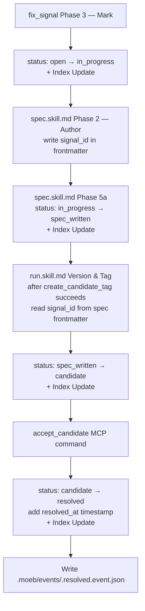

# Signal Status Lifecycle Tracking

## Raw Requirement

1. fix_signal Phase 3 (Mark): after writing `picked_up_at` and `fix_branch`, also set `status` to `"in_progress"` in the signal JSON, then update the corresponding index.md row's Status cell via the Index Update sub-procedure.
2. spec skill: after the spec file is linked to the README, read the signal identified by the run's `signal_id` context variable, set `status` to `"spec_written"`, and run the Index Update sub-procedure.
3. run skill: after `End-of-Skill Review` returns a passing result, set signal `status` to `"candidate"` and run the Index Update sub-procedure.
4. Introduce an `accept_candidate` MCP command that accepts `signal_id` as its sole parameter. It must: (a) read the signal catalogue entry, (b) set `status` to `"resolved"` with a `resolved_at` ISO 8601 timestamp, (c) run the Index Update sub-procedure, and (d) write a `signal.resolved` event to `.moeb/events/<signal_id>.resolved.event.json`. The command should be wired into the event bus so that merging a PR tagged with a candidate tag can trigger it automatically.

## Description

This specification closes the lifecycle-tracking gap where signal status stagnates at `"open"` regardless of pipeline progress. Four coordinated changes — all confined to skill markdown files, one schema update, and one new MCP tool with thin Rust wrapper — produce a fully auditable pipeline trail: `open` → `in_progress` → `spec_written` → `candidate` → `resolved`.

**Status enum expansion**: `signal.schema.json` is updated to enumerate all valid status values including the new pipeline stages (`in_progress`, `spec_written`, `candidate`) and the reoccurrence value (`reopened`) that the Canonical Signal Dedup-and-Write Procedure already writes but the schema currently omits.

**signal_id frontmatter field**: An optional `signal_id` field is added to the spec frontmatter schema. When `start_spec` is invoked with a `signal_id`, the spec skill writes it into the spec frontmatter, so downstream consumers (the run skill) can read it without needing signal_id injected into the run prompt separately.

**Skill updates**: Three binary-bundled skill files receive additive status-update instructions:
- `fix_signal.skill.md` Phase 3 (Mark): sets `status: "in_progress"` after recording `picked_up_at` and the `links` branch entry, then runs Index Update.
- `spec.skill.md` Phase 2 (Author): writes `signal_id` into the spec frontmatter when the context variable is non-empty. New Phase 5a (after Link README): reads the signal and sets `status: "spec_written"`, then runs Index Update.
- `run.skill.md` Version and Tag phase: after `create_candidate_tag` succeeds, reads `signal_id` from the spec frontmatter (if present) and sets signal `status: "candidate"`, then runs Index Update.

**accept_candidate MCP command**: A new thin Rust tool (`accept_candidate.rs`) renders `accept_candidate.prompt`, which embeds `accept_candidate.skill.md`. The skill reads the signal, sets `status: "resolved"` with a `resolved_at` timestamp, updates the index, and emits a `signal.resolved` event to `.moeb/events/<signal_id>.resolved.event.json`. Event-bus automation (auto-trigger on PR merge) is deferred to a separate specification.



## Backlinks

### Parents

| Label | Path | Purpose |
|-------|------|---------|
| Harness README | README.md | Root index and policy source |
| Signal Deduplication, Occurrence Tracking, and Lifecycle Reopening | specifications/moeb/moeb.signal-deduplication-and-lifecycle.md | Defines canonical signal record schema, status lifecycle, and Index Update procedure; Decision 4 superseded by Decision 1 of this spec |
| Signal Fix Command: MCP-Driven Autonomous Signal Resolution | specifications/moeb/moeb.signal-fix-command.md | Defines fix_signal Phase 3 (Mark) that this spec extends; establishes MCP-only tool pattern |
| Fix Signal: Event Emission Replaces spec/run Orchestration | specifications/moeb/moeb.fix-signal-event-emission.md | Establishes .moeb/events/ directory and event schema; .resolved.event.json follows the same pattern |
| Run Skill: Signal Retrospective Phase, Signal Schema Bundling, and fix_branch Migration | specifications/moeb/moeb.run-skill-retrospective-and-signal-schema.md | Establishes signal.schema.json binary bundling; introduces superseded status and links[] migration |
| start_spec: Signal-ID Input and Correlation Token | specifications/moeb/moeb.start-spec-from-signal.md | Establishes signal_id injection into spec.prompt session context variable consumed here |
| Run Skill: Gate Candidate Tag on QA Review Pass | specifications/moeb/moeb.run-skill-must-only-emit-candidate-tag-when-qa-rev.md | Defines the QA gate on create_candidate_tag; status=candidate update is conditioned on that gate passing |
| MCP Serve / CLI Parity | specifications/moeb/moeb.serve-cli-parity.md | Establishes ToolRegistry::mcp() for MCP-only tools; accept_candidate follows this pattern |

## Steps

### Step 1 — Expand signal status enum in signal.schema.json

Read `src/moeb/internal/signal.schema.json`. Locate the `status` property's `enum` array (currently `["open", "resolved", "superseded"]`). Replace it with the full lifecycle set and update the `description`. Write the updated file using `write_file`.

The new `status` property value:
```json
"status": {
  "type": "string",
  "enum": [
    "open",
    "in_progress",
    "spec_written",
    "candidate",
    "resolved",
    "superseded",
    "reopened"
  ],
  "description": "Lifecycle state of the signal. open: the issue persists and no fix has been applied; eligible for fix_signal selection. in_progress: fix_signal has selected and marked this signal with picked_up_at; spec authoring is in progress. spec_written: a specification has been authored and registered in the harness README. candidate: the run implementing the specification passed QA review and a candidate tag was created. resolved: the issue was accepted via accept_candidate and a resolved event was emitted. superseded: a different design decision made the proposed_resolution unnecessary. reopened: a previously resolved signal has recurred and is eligible for re-selection by fix_signal."
}
```

Also add an optional `resolved_at` property to the `properties` object, placed after `picked_up_at`:
```json
"resolved_at": {
  "type": "string",
  "format": "date-time",
  "description": "ISO 8601 timestamp set by accept_candidate when the signal is marked resolved. Absent on all other status values."
}
```

### Step 2 — Add optional signal_id field to spec-schema.yaml and spec-schema-validation.json

**2a** — Read `.moeb/spec-schema.yaml`. In the `spec_frontmatter` section, after the `role: string # optional` entry, add:

```yaml
  signal_id: string      # optional
  # UUID of the signal in .moeb/signals/catalogue/ that this specification was authored to resolve.
  # Written by spec.skill.md when the signal_id session context variable is non-empty.
  # Consumed by run.skill.md to update signal status after candidate tagging.
```

Write the updated file using `write_file`.

**2b** — Read `.moeb/spec-schema-validation.json`. Add `"signal_id"` to the `frontmatter.optional` array so it reads `["supersedes", "skill", "role", "signal_id"]`. Write the updated file using `write_file`.

### Step 3 — Update spec.skill.md: write signal_id into frontmatter and add Phase 5a

Read `src/moeb/internal/skills/spec.skill.md`. Apply two additive changes and write the updated file using `write_file`.

**Change A — Phase 2 (Author) frontmatter clause**: In the Phase 2 instructions, locate the sentence or bullet that describes the required YAML frontmatter fields (`domain`, `slug`, `status`). Immediately after the `status` field instruction, insert:

```
- If the session context variable `signal_id` is non-empty, include `signal_id: <value>` in the frontmatter immediately after the `status: active` line.
```

**Change B — New Phase 5a after Phase 5**: Immediately after the Phase 5 Per-Step Review Sub-Loop for the README patch (after the `complete_review` call for `.moeb/README.md`) and before Phase 5b (Budget Breach Check), insert the following block:

```markdown
## Phase 5a — Signal Status Update <!-- condition: signal_id non-empty -->

If the session context variable `signal_id` is empty or absent, skip this phase entirely and proceed to Phase 5b.

1. Call `read_file` on `.moeb/signals/catalogue/<signal_id>.signal.json` where `<signal_id>` is the `signal_id` context variable. If the file does not exist, skip the remaining steps and proceed to Phase 5b.
2. Parse the returned JSON. Set `"status"` to `"spec_written"`. Do not alter any other field.
3. Write the updated JSON back to the same path using `write_file`.
4. Run the **Index Update sub-procedure**: read `.moeb/signals/index.md`, find the row whose `Signal ID` cell matches `signal_id`, update its `Status` cell to `spec_written`, write the complete updated `index.md` using `write_file`. If no matching row is found, append a new row with current field values.
```

### Step 4 — Update fix_signal.skill.md Phase 3 to set status=in_progress

Read `src/moeb/internal/skills/fix_signal.skill.md`. In Phase 3 (Mark), locate the step that writes the signal's `picked_up_at` timestamp and `links` branch entry to the signal file. After that write operation, insert the following two steps:

```
5. Parse the signal JSON in memory. Set `"status"` to `"in_progress"`. Write the updated signal back to `.moeb/signals/catalogue/<signal_id>.signal.json` using `write_file`.
6. Run the **Index Update sub-procedure**: read `.moeb/signals/index.md`, find the row whose `Signal ID` cell matches the selected signal's `signal_id`, update its `Status` cell to `in_progress`, write the complete updated `index.md` using `write_file`. If no matching row exists, append a new row with the current signal's field values.
```

Write the updated file using `write_file`.

### Step 5 — Update run.skill.md Version and Tag phase to set status=candidate

Read `src/moeb/internal/skills/run.skill.md`. In the Version and Tag phase, locate the step that calls `create_candidate_tag`. After the `create_candidate_tag` call returns without error, insert the following conditional block:

```
**Signal status update (conditional on signal_id in spec frontmatter)**:
1. Call `read_file` on the spec file at `spec_path`.
2. Parse the YAML frontmatter. If `signal_id` is absent or empty, skip steps 3–6 entirely.
3. Construct the catalogue path: `.moeb/signals/catalogue/<signal_id>.signal.json`.
4. Call `read_file` on that path. If the file does not exist, skip steps 5–6.
5. Parse the signal JSON. Set `"status"` to `"candidate"`. Write the updated JSON back using `write_file`.
6. Run the **Index Update sub-procedure**: read `.moeb/signals/index.md`, find the row matching `signal_id`, update its `Status` cell to `candidate`, write the complete updated `index.md` using `write_file`.
```

This block must only execute when `create_candidate_tag` succeeded (no error). If the candidate tag was skipped because QA failed, this block is also skipped.

Write the updated file using `write_file`.

### Step 6 — Create accept_candidate.skill.md

Create `src/moeb/internal/skills/accept_candidate.skill.md`. All six mandatory heading strings must appear: "Verify", "End-of-Skill Review", "Metrics Recording", "Commit", "Tag", "Complete".

The skill drives a 9-phase workflow:

**Phase 1 — Read Signal**: Call `read_file` on `.moeb/signals/catalogue/{{signal_id}}.signal.json`. If the call returns an error (file not found), emit a Critical signal with title `"accept_candidate: signal not found — {{signal_id}}"`, write it via the Canonical Signal Dedup-and-Write Procedure, and proceed to Phase 9 (Complete) with a failure summary. Do not proceed to Phase 2 in this case.

**Phase 2 — Resolve**: Parse the signal JSON. Set `"status"` to `"resolved"`. Set `"resolved_at"` to the current ISO 8601 timestamp. Do not alter any other field. Write the updated signal to `.moeb/signals/catalogue/{{signal_id}}.signal.json` using `write_file`. Then run the **Index Update sub-procedure** from the Canonical Signal Dedup-and-Write Procedure: read `.moeb/signals/index.md`, find the row whose `Signal ID` cell matches `{{signal_id}}`, update its `Status` cell to `resolved`, write the complete updated `index.md` using `write_file`. If no row is found, append one. Record a StepMetric with `step_id: "resolve-signal"`.

**Phase 3 — Emit Resolved Event**: Construct:
```json
{
  "type": "signal.resolved",
  "signal_id": "{{signal_id}}",
  "resolved_at": "<resolved_at timestamp from Phase 2>",
  "timestamp": "<current ISO 8601 timestamp>"
}
```
Call `write_file` with path `.moeb/events/{{signal_id}}.resolved.event.json` and the pretty-printed (2-space indent) JSON. Record a StepMetric with `step_id: "emit-resolved-event"`.

**Phase 4 — Verify**: Evaluate all rubric criteria from the injected rubric baseline. Call `verify_rubrics` with the complete list of verdicts. Do not supply verdicts for kernel-authoritative criteria.

**Phase 5 — End-of-Skill Review**: Adopt the QA Architect Persona pre-loaded in your context. Evaluate the signal status update, the event emission, and the accumulated StepMetrics. Produce a ReviewSignalReport JSON. Process any emitted signals via the Canonical Signal Dedup-and-Write Procedure, then run the Index Update sub-procedure.

**Phase 6 — Metrics Recording**: Call `get_run_status` immediately before writing to capture `tools_used` and `token_usage`. Write metrics to `.moeb/metrics/{{run_id}}.metrics.json`. Write the run file to `.moeb/runs/{{run_file_path}}` with fields: `run_id`, `timestamp` (run start), `command: "accept_candidate"`, `signal_id: "{{signal_id}}"`, `event_path: ".moeb/events/{{signal_id}}.resolved.event.json"`, `metrics_path`, `emittedSignals`, `tools_used`, `token_usage`.

**Phase 7 — Commit**: No implementation source files are modified; all changes are harness artefacts in `.moeb/`. No `git_commit` call is made in this phase.

**Phase 8 — Tag**: Call `tag_run` with `run_id: "{{run_id}}"`, `domain: "signal"`, `slug: "accept"`. The tool creates an annotated git tag `run/{{run_id}}` with annotation `moeb signal/accept @ <timestamp>`.

**Phase 9 — Complete**: Respond with a concise summary: which signal was accepted (signal_id, title, previous status), the resolved_at timestamp, and the path of the emitted resolved event.

Write the skill file using `write_file`.

### Step 7 — Create accept_candidate.prompt

Create `src/prompts/accept_candidate.prompt` with this content (verbatim):

```
{{role_content}}

Session context:
- run_id: {{run_id}}
- run_file_path: {{run_file_path}}
- signal_id: {{signal_id}}

The following file has been pre-loaded — do not call read_file for it:

=== .moeb/README.md ===
{{readme_content}}

=== Workflow ===
{{skill_content}}

{{command_rubrics}}

Do not re-read any file already present in your context window. If you need to refer to content from a pre-loaded section or from a tool result returned in an earlier turn, locate it in your context directly rather than making another tool call.

Working directory is the repository root. Use `.moeb/`-prefixed paths for all harness artefacts.
```

Write the file using `write_file`.

### Step 8 — Create accept_candidate.rs

Create `src/moeb/src/tools/accept_candidate.rs` implementing `ToolHandler` for `AcceptCandidateTool`:

- `name()` returns `"accept_candidate"`.
- `definition()` declares an input schema with one required string parameter `signal_id`:
  ```json
  {
    "type": "object",
    "required": ["signal_id"],
    "properties": {
      "signal_id": {
        "type": "string",
        "description": "UUID of the signal catalogue entry to mark as resolved."
      }
    }
  }
  ```
- `execute()`:
  1. Extract `signal_id` as a string from the tool input JSON. Return an error result if absent or not a string.
  2. Load template: `Prompts::get("accept_candidate.prompt")`.
  3. Load rubrics: layer 1 (`Internal::get("rubrics/global.rubrics.md")`), skip layer 2 (no binary command rubric), layer 3 (`working_dir.join(".moeb/rubrics/global.rubrics.md")`), layer 4 (`working_dir.join(".moeb/rubrics/accept_candidate.rubrics.md")`, skip if absent). Concatenate non-empty layers into `command_rubrics`.
  4. Load `role_content` via `crate::skills::load_role(working_dir, "run")`.
  5. Load `skill_content` via `crate::skills::load_skill(working_dir, "accept_candidate")`.
  6. Load `readme_content` from `working_dir.join(".moeb/README.md")`; use empty string on read failure.
  7. Obtain `run_id` and `run_file_path` from `run_state` (same pattern as `fix_signal.rs`).
  8. Substitute all template tokens: `{{role_content}}`, `{{readme_content}}`, `{{skill_content}}`, `{{command_rubrics}}`, `{{run_id}}`, `{{run_file_path}}`, `{{signal_id}}`.
  9. Return the rendered string.
- Add `#[cfg(test)] #[path = "accept_candidate_tests.rs"] mod tests;`.

### Step 9 — Create accept_candidate_tests.rs

Create `src/moeb/src/tools/accept_candidate_tests.rs` with two unit tests:

1. `test_accept_candidate_name`: calls `name()` and asserts the result equals `"accept_candidate"`.
2. `test_accept_candidate_definition_requires_signal_id`: calls `definition()`, parses the input schema, and asserts `required` contains `"signal_id"`.

### Step 10 — Register AcceptCandidateTool in tools/mod.rs

In `src/moeb/src/tools/mod.rs`:

1. Add `pub mod accept_candidate;` to the module declarations.
2. In `ToolRegistry::mcp()`, register `AcceptCandidateTool` after `FixSignalTool`.
3. In `ToolRegistry::definitions()`, add `"accept_candidate"` to the `order` array after `"fix_signal"`.

Do **not** add `AcceptCandidateTool` to `ToolRegistry::standard()` — it is MCP-only, following the same pattern as `fix_signal`, `start_spec`, and `start_run`.

### Step 11 — Bundle accept_candidate skill and prompt in binary

Verify both new files are included in the binary:

- `src/moeb/internal/skills/accept_candidate.skill.md`: confirm reachable via `crate::skills::load_skill(_, "accept_candidate")`. If the bundling mechanism uses an explicit match arm or file list, add an entry for `"accept_candidate"`.
- `src/prompts/accept_candidate.prompt`: confirm reachable via `Prompts::get("accept_candidate.prompt")`. Add to the explicit list or match arm if required.

Run `cargo build` to verify compilation and `cargo test` to confirm no regressions.

## Decisions

### Decision 1 — Full signal status lifecycle enum supersedes the three-value constraint

**Rationale**: The pipeline produces seven distinct observable states: `open` (newly emitted), `in_progress` (fix_signal selected it), `spec_written` (spec authored and registered), `candidate` (run passed QA and candidate tag created), `resolved` (accept_candidate invoked), `superseded` (different approach taken), `reopened` (previously resolved signal reappears). Each state corresponds to a discrete, observable transition event driven by a specific skill phase or command; omitting intermediate states makes the catalogue useless as a pipeline monitor. The `reopened` value was already written by the Canonical Signal Dedup-and-Write Procedure ("If E.status == 'resolved': E.status = 'reopened'") but absent from the schema, creating a latent schema violation that this spec corrects.

**Rejected alternative**: A separate `pipeline_state` field alongside `status` — rejected because it duplicates the lifecycle concern and requires two fields to be kept in sync. A single `status` field with a richer enum is grep-discoverable and schema-validated in one place.

**Consequences**: Supersedes the claim in Decision 4 of `moeb.signal-deduplication-and-lifecycle.md` that "the status field has three values: open, resolved, reopened." The core behavior of that decision — that reoccurrence transitions status rather than creating a new canonical entry — is preserved unchanged. The `fix_signal` skill's unresolved-signal identification mechanism (absence of `picked_up_at`) is also unchanged; the new status values supplement rather than replace that marker.

### Decision 2 — signal_id propagated to run via spec frontmatter

**Rationale**: The `run` skill needs the `signal_id` to update signal status to `candidate` after tagging. The `spec_path` is the only artifact the run skill receives. Reading the spec frontmatter is already a natural first step in the run discovery phase; adding an optional `signal_id` field requires no Rust changes and no new tool calls — the agent reads what is already in scope. This follows the pattern of `skill:` and `role:` frontmatter fields that already propagate author intent to the run agent.

**Rejected alternative**: Injecting `signal_id` into `run.prompt` via a new template variable in `start_run.rs` — rejected because it requires Rust changes to the run rendering path, violating the `thin-kernel` principle when a skill-level read achieves the same result.

**Rejected alternative**: Grepping `.moeb/signals/catalogue/` for signals whose status is `in_progress` or `spec_written` — rejected because multiple signals may be in-flight simultaneously; matching by frontmatter `signal_id` is unambiguous.

**Consequences**: All specs authored via `fix_signal → start_spec` carry a `signal_id` frontmatter field. Specs authored directly without a signal (standalone `moeb spec`) omit this field, and the status-update steps in all three skills skip gracefully when it is absent. The `spec-schema-validation.json` must be updated atomically with `spec-schema.yaml` to maintain the derived-from relationship established in `moeb.schema-split.md`.

### Decision 3 — accept_candidate is MCP-only with no event-bus automation in this spec

**Rationale**: Like `fix_signal`, `start_spec`, and `start_run`, `accept_candidate` orchestrates a multi-phase harness workflow through a rendered skill prompt and must not appear in `ToolRegistry::standard()` where CLI loop agents could call it mid-run. Automatic triggering on PR merge (detecting a candidate tag and invoking `accept_candidate`) requires GitHub Actions integration or a webhook consumer — infrastructure that does not exist in moeb today. Including it in this spec would couple a simple status-update concern with infrastructure-level event sourcing.

**Rejected alternative**: A CLI `moeb accept <signal_id>` subcommand — rejected because the MCP tool path already handles all orchestration commands, and a parallel CLI path doubles the implementation surface without adding capability.

**Consequences**: After a run creates a candidate tag, a human operator must manually invoke `accept_candidate` via MCP to mark the signal resolved. A follow-on signal should track this automation gap and propose GitHub Actions or scheduler integration.

## Rubric

### Structured

| Name | Description | Threshold | Pass Condition |
|------|-------------|-----------|----------------|
| `tool-errors` | No ToolHandler errors were recorded during this command invocation. Covers all tool calls on both CLI and MCP paths via `RealToolExecutor::execute`. Applies to every moeb command. | Zero tool errors | Kernel-authoritative: injected by `verify_rubrics` from `RunState.tool_errors`. Do not supply a verdict — any agent-supplied entry is overridden. |
| `rubric-qualification` | No Pass verdicts with acknowledged failures were issued during this command invocation. An agent that observes a failure but passes a criterion must populate `acknowledged_failures` in the verdict object. Applies to every moeb command. | Zero qualified Pass verdicts | Kernel-authoritative: injected by `verify_rubrics` by scanning `acknowledged_failures` on incoming Pass verdicts. Do not supply a verdict — any agent-supplied entry is overridden. |
| `skill-mandatory-phases` | The skill loaded for this run contains all mandatory phase headings. The agent checks its own prompt context for the exact strings: "Verify", "End-of-Skill Review", "Metrics Recording", "Commit", "Tag", "Complete". No file read is required. | All six mandatory headings present | Agent scans skill content in its loaded context; fails if any mandatory heading string is absent. |
| `no-drift` | The specification does not violate any decision recorded in a linked parent specification. | Zero contradictions | Manual review of every decision in every parent spec listed in Backlinks. The superseded Decision 4 of moeb.signal-deduplication-and-lifecycle.md is addressed in Decision 1 of this spec with full rationale and a formal supersedes frontmatter entry. |
| `spec-schema-compliance` | All required frontmatter fields and body sections are present and correctly ordered. | 100% of required fields and sections | Validation in `domain/spec.rs` exits 0 during `moeb spec`. |
| `ai-first-org` | The specification's Steps prescribe file layouts, naming, and helper placement that satisfy the four AI-first organisation principles: one concern per file, context locality, grep-discoverable names, no cross-cutting helpers. | All four principles followed | Manual review: accept_candidate.rs contains only thin dispatch; accept_candidate.skill.md contains all workflow logic; signal_id travels via spec frontmatter (co-located with spec artifact); all skill changes are additive insertions scoped to named phases. |
| `kernel-thin-and-parity` | No domain-specific or workflow-specific coordination logic may be placed in kernel Rust code when it can live in skill markdown or role files. Every tool registered in the CLI tool registry must also be registered in the MCP stdio server tool list. | Zero violations | Spec review: accept_candidate.rs performs only token substitution and prompt rendering; all status update, index update, and event emission logic lives in accept_candidate.skill.md; accept_candidate registered only in mcp() not standard(); no CLI/MCP asymmetry introduced for existing tools. |
| `moeb-tool-origin` | All tool calls made during this invocation must originate from moeb's own tool registry. If an external tool was used because no moeb equivalent exists, the agent must write a MissingMoebTool signal immediately after each such call. | Zero external tool calls | Agent reviews the conversation for calls to non-moeb tools. Supplies Pass if none were made. If external tools were used with MissingMoebTool signals, supplies Fail with `acknowledged_failures` listing each signal title. If used without signals, supplies Fail with the unlogged tool names. |
| `thin-kernel` | New Rust code in tools/, commands/, or domain/ must be a primitive operation wrapper or thin dispatcher; workflow logic must live in skill markdown. | Zero workflow-logic functions in new Rust | Run review: accept_candidate.rs performs only token substitution on a prompt template; all signal resolution, index update, and event emission logic is in accept_candidate.skill.md; no conditionals or domain logic appear in the Rust code. |
| `new-skill-mandatory-phases` | Any *.skill.md file written during this run contains all mandatory phase heading strings: "Verify", "End-of-Skill Review", "Metrics Recording", "Commit", "Tag", "Complete". | All six strings present in each written skill file. | Run review: confirm accept_candidate.skill.md contains all six mandatory heading strings as phase headings. |
| `no-signal-reoccurrence` | No canonical signal in `.moeb/signals/catalogue/` has `status: reopened` due to this run. | Zero reopened signals introduced by this run. | Run review: no previously resolved signal reappears as reopened after this run. |
| `signal-status-transition-correctness` | Each skill phase transition sets exactly the documented status value for the correct condition. | Zero incorrect or missing status transitions in the implemented skill files. | Run review: after implementing all steps, grep the modified skill files for the status strings `in_progress`, `spec_written`, `candidate`, and confirm each appears in its documented phase and condition. Confirm accept_candidate.skill.md sets status to `resolved` and writes `resolved_at`. |

### Qualitative

- The additive instructions in fix_signal.skill.md, spec.skill.md, and run.skill.md must not alter any existing phase logic beyond the documented insertion points; no phase should be removed or renumbered.
- The `signal_id` frontmatter field must be written to the spec file in Phase 2 (before Write in Phase 4), so that the committed spec carries the correlation without any separate post-authoring patch.
- `accept_candidate.skill.md` must treat a missing or unreadable signal file as a graceful failure that still completes the skill (reaches Phase 9) rather than aborting mid-skill.
- The `resolved_at` field set in accept_candidate Phase 2 is an external-acceptance timestamp distinct from `last_seen` (which records internal run observations); it must not overwrite or conflict with `last_seen` or `occurrences`.
- `spec-schema-validation.json` must be updated atomically with `spec-schema.yaml` in Step 2; any run that writes only one of the two files produces a schema inconsistency.
