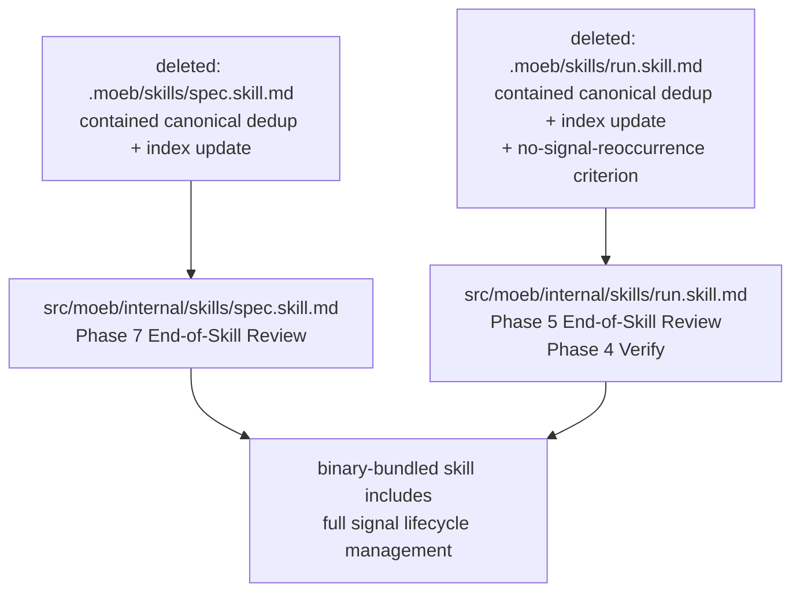

# Skill Baseline Sync: Merge Canonical Signal Dedup into Binary-Bundled Skills

## Raw Requirement

The binary-bundled baseline skills in `src/moeb/internal/skills/` are behind the
improvements that were developed in project-level overrides (`.moeb/skills/spec.skill.md`
and `.moeb/skills/run.skill.md`, now deleted). Three improvements must be merged verbatim
into the baselines:

1. **Canonical Signal Dedup-and-Write Procedure** — replaces the simple flat-array signal
   write in the End-of-Skill Review phase of both `spec.skill.md` and `run.skill.md`. The
   procedure computes an identity key, reads the canonical record from
   `.moeb/signals/catalogue/`, creates it if absent or updates it if present (severity
   escalation, status reopening, occurrence tracking), then writes the run-based
   `.signals.json` using the assigned signal IDs.

2. **Index Update sub-procedure** — runs after the Dedup-and-Write Procedure in both
   skills. Reads `.moeb/signals/index.md` (creates with header if absent), then for each
   canonical signal patches an existing row or appends a new one.

3. **`no-signal-reoccurrence` rubric criterion** — added to the Verify phase of
   `run.skill.md` only. Enumerates `.moeb/signals/catalogue/` and fails if any record has
   `status == "reopened"` with its last occurrence `run_id` matching the current run.

After updating both baselines, no `.moeb/skills/spec.skill.md` or
`.moeb/skills/run.skill.md` override files should exist — the project relies exclusively
on the merged baselines.

## Description

The `moeb.signal-deduplication-and-lifecycle.md` specification prescribed a canonical
signal store with deduplication, severity escalation, and status lifecycle management.
When that spec was executed, the improvements were written to project-level skill overrides
in `.moeb/skills/` rather than to the binary-bundled baseline sources in
`src/moeb/internal/skills/`. The binary was therefore built without these improvements in
the baselines, and the project relied on the overrides at runtime.

The `moeb.protected-baseline-skills.md` specification subsequently introduced a guard that
prevents project-level overrides of `spec`, `run`, and `fix_signal` skills, making the
overrides invalid. The overrides have been removed. The baseline source files must now be
updated so that the next binary build includes the canonical dedup procedure, index update,
and reoccurrence check that the project has been relying on.



## Backlinks

### Parents
- [README.md](../README.md)
- [specifications/moeb/moeb.agent-skills.md](specifications/moeb/moeb.agent-skills.md)
- [specifications/moeb/moeb.signal-deduplication-and-lifecycle.md](specifications/moeb/moeb.signal-deduplication-and-lifecycle.md)
- [specifications/moeb/moeb.protected-baseline-skills.md](specifications/moeb/moeb.protected-baseline-skills.md)

## Steps

### Step 1 — Read both baseline skill files in full

Call `read_file` on `src/moeb/internal/skills/spec.skill.md` and
`src/moeb/internal/skills/run.skill.md`. Both files must be read before any patch is
applied (read-before-write requirement).

### Step 2 — Patch spec.skill.md: replace flat signal write with canonical dedup procedure

In `src/moeb/internal/skills/spec.skill.md`, Phase 7 — End-of-Skill Review, locate the
parse/write block that reads:

```
Parse the returned `ReviewSignalReport` JSON:

1. Assign `signal_id`, `run_id`, `timestamp` to each signal.

2. Write signals to `.moeb/signals/{{run_id}}.signals.json`.

3. Continue to Metrics Recording regardless of critical signal presence.
```

Replace that block (from "Parse the returned" through "critical signal presence.") with
the following content verbatim:

```
Parse the returned `ReviewSignalReport` JSON:

1. Assign `signal_id`, `run_id`, `timestamp` to each signal.

## Canonical Signal Dedup-and-Write Procedure

# Identity key: "<category>-<title-slug>"  (slug = lowercase, [^a-z0-9]+ → '-', strip edges, max 80 chars)
# Canonical path: .moeb/signals/catalogue/<identity-key>.signal.json
# Severity order: Info < Minor < Major < Critical
# current_run_id: the run identifier injected via {{run_id}} in the spec prompt template
# Note: .moeb/signals/catalogue/ is created on first use.
# write_file creates parent directories automatically — no explicit mkdir required.
#
# Canonical signal record schema (all fields in this order):
# { "signal_id", "category", "severity", "title", "description", "proposed_resolution",
#   "gating_condition", "status", "occurrence_count", "first_seen", "last_seen", "occurrences" }

For each signal S in the ReviewSignalReport:
  1. Compute identity_key as described above.
  2. Attempt to read `.moeb/signals/catalogue/<identity_key>.signal.json` using read_file.
     If the file does not exist (read returns an error), treat as not_found.
  3. If not_found:
       Assign S.signal_id = new UUID v4.
       Set S.status         = "open".
       Set S.occurrence_count = 1.
       Set S.first_seen     = current ISO 8601 timestamp.
       Set S.last_seen      = current ISO 8601 timestamp.
       Set S.occurrences    = [{ "timestamp": S.first_seen, "run_id": current_run_id }].
       Write canonical record to `.moeb/signals/catalogue/<identity_key>.signal.json`.
  4. If found:
       Parse existing record E.
       If severity_rank(S.severity) > severity_rank(E.severity): E.severity = S.severity.
       If E.status == "resolved": E.status = "reopened".
       E.occurrence_count += 1.
       E.last_seen = current ISO 8601 timestamp.
       Append { "timestamp": E.last_seen, "run_id": current_run_id } to E.occurrences.
       Write updated E back to `.moeb/signals/catalogue/<identity_key>.signal.json`.
       S.signal_id = E.signal_id.
  5. After processing all signals, update `.moeb/signals/index.md` (see Index Update below).

The run-based signals file `.moeb/signals/{{run_id}}.signals.json` is then written as normal,
using the signal_id values assigned in steps 3–4 above.

### Index Update

After completing the Dedup-and-Write Procedure for all signals:
- Attempt to read `.moeb/signals/index.md` using `read_file`. If missing, create it with
  `write_file` using this header:

  ```markdown
  # Signal Index

  | Signal ID | Title | Category | Severity | Status | Occurrences | Last Seen | File |
  |-----------|-------|----------|----------|--------|-------------|-----------|------|
  ```

- For each canonical signal written in the current run, search the existing table for a
  row whose `Signal ID` cell matches the canonical `signal_id`.
  - If found: use `patch_file` to update `Severity`, `Status`, `Occurrences`, and
    `Last Seen` cells on that row only.
  - If not found: use `patch_file` to append a new row:

    `| <signal_id> | <title> | <category> | <severity> | <status> | <occurrence_count> | <last_seen> | [catalogue/<identity_key>.signal.json](catalogue/<identity_key>.signal.json) |`

2. Write signals to `.moeb/signals/{{run_id}}.signals.json`.

3. Continue to Metrics Recording regardless of critical signal presence.
```

Apply the change using `patch_file` with a minimal unified diff.

### Step 3 — Patch run.skill.md: replace flat signal write with canonical dedup procedure

In `src/moeb/internal/skills/run.skill.md`, Phase 5 — End-of-Skill Review, locate the
parse/write block that reads:

```
Parse the returned `ReviewSignalReport` JSON:

1. Assign each signal:
   - `signal_id`: a fresh UUID v4
   - `run_id`: the current run identifier
   - `timestamp`: ISO 8601 current time

2. Write the complete array of signals to `.moeb/signals/{{run_id}}.signals.json`.

3. Do not fail or abort the skill if critical signals are present. Continue to the
   Metrics Recording phase.
```

Replace that block (from "Parse the returned" through "Metrics Recording phase.") with
the following content verbatim:

```
Parse the returned `ReviewSignalReport` JSON:

1. Assign each signal:
   - `signal_id`: a fresh UUID v4
   - `run_id`: the current run identifier
   - `timestamp`: ISO 8601 current time

## Canonical Signal Dedup-and-Write Procedure

# Identity key: "<category>-<title-slug>"  (slug = lowercase, [^a-z0-9]+ → '-', strip edges, max 80 chars)
# Canonical path: .moeb/signals/catalogue/<identity-key>.signal.json
# Severity order: Info < Minor < Major < Critical
# current_run_id: the run identifier from the current run session ({{run_id}} in the rendered prompt)
# Note: .moeb/signals/catalogue/ is created on first use.
# write_file creates parent directories automatically — no explicit mkdir required.
#
# Canonical signal record schema (all fields in this order):
# { "signal_id", "category", "severity", "title", "description", "proposed_resolution",
#   "gating_condition", "status", "occurrence_count", "first_seen", "last_seen", "occurrences" }

For each signal S in the ReviewSignalReport:
  1. Compute identity_key as described above.
  2. Attempt to read `.moeb/signals/catalogue/<identity_key>.signal.json` using read_file.
     If the file does not exist (read returns an error), treat as not_found.
  3. If not_found:
       Assign S.signal_id = new UUID v4.
       Set S.status         = "open".
       Set S.occurrence_count = 1.
       Set S.first_seen     = current ISO 8601 timestamp.
       Set S.last_seen      = current ISO 8601 timestamp.
       Set S.occurrences    = [{ "timestamp": S.first_seen, "run_id": current_run_id }].
       Write canonical record to `.moeb/signals/catalogue/<identity_key>.signal.json`.
  4. If found:
       Parse existing record E.
       If severity_rank(S.severity) > severity_rank(E.severity): E.severity = S.severity.
       If E.status == "resolved": E.status = "reopened".
       E.occurrence_count += 1.
       E.last_seen = current ISO 8601 timestamp.
       Append { "timestamp": E.last_seen, "run_id": current_run_id } to E.occurrences.
       Write updated E back to `.moeb/signals/catalogue/<identity_key>.signal.json`.
       S.signal_id = E.signal_id.
  5. After processing all signals, update `.moeb/signals/index.md` (see Index Update below).

The run-based signals file `.moeb/signals/{{run_id}}.signals.json` is then written as normal,
using the signal_id values assigned in steps 3–4 above.

### Index Update

After completing the Dedup-and-Write Procedure for all signals:
- Attempt to read `.moeb/signals/index.md` using `read_file`. If missing, create it with
  `write_file` using this header:

  ```markdown
  # Signal Index

  | Signal ID | Title | Category | Severity | Status | Occurrences | Last Seen | File |
  |-----------|-------|----------|----------|--------|-------------|-----------|------|
  ```

- For each canonical signal written in the current run, search the existing table for a
  row whose `Signal ID` cell matches the canonical `signal_id`.
  - If found: use `patch_file` to update `Severity`, `Status`, `Occurrences`, and
    `Last Seen` cells on that row only.
  - If not found: use `patch_file` to append a new row:

    `| <signal_id> | <title> | <category> | <severity> | <status> | <occurrence_count> | <last_seen> | [catalogue/<identity_key>.signal.json](catalogue/<identity_key>.signal.json) |`

2. Write the complete array of signals to `.moeb/signals/{{run_id}}.signals.json`.

3. Do not fail or abort the skill if critical signals are present. Continue to the
   Metrics Recording phase.
```

Apply the change using `patch_file` with a minimal unified diff.

### Step 4 — Patch run.skill.md: add no-signal-reoccurrence criterion to Phase 4

In `src/moeb/internal/skills/run.skill.md`, Phase 4 — Verify, locate the criterion block
that ends with the `moeb-tool-origin` description and the "Call `verify_rubrics`" instruction.
After the `moeb-tool-origin` paragraph and before "Call `verify_rubrics`", insert:

```
- `no-signal-reoccurrence` check:
  1. Use list_directory on `.moeb/signals/catalogue/` to enumerate *.signal.json files.
     If the directory does not exist or is empty, verdict = pass.
  2. For each file, read it. If any record has status == "reopened" and its last
     occurrences entry has run_id == current_run_id: verdict = fail, note each
     reopened signal title.
  3. If no such record found: verdict = pass.

```

Apply the change using `patch_file` with a minimal unified diff.

## Decisions

### Decision 1 — Verbatim copy, no paraphrasing

The canonical dedup procedure and index update are inserted verbatim from the deleted
override source, with only the `{{run_id}}` template comment text adjusted per skill
context (spec vs run).

**Rationale**: The procedure is a precise algorithmic specification that an agent must
follow exactly. Paraphrasing risks subtle behavioural divergence between the baseline and
what the project relied on. Exact reproduction eliminates that risk.

**Rejected alternatives**:
- Rewording for clarity — introduces risk of semantic drift.
- Extracting to a shared include — skill files are standalone markdown without include
  support; agents consume them whole.

**Consequences**: The `## Canonical Signal Dedup-and-Write Procedure` heading becomes a
level-2 heading embedded within a phase section. This is intentional and matches the
existing structure in the override files.

### Decision 2 — no-signal-reoccurrence added to run only, not spec

The criterion is added to `run.skill.md` Phase 4 only.

**Rationale**: The spec skill writes new signals to the catalogue during its own run; those
signals are brand-new and cannot have `status == "reopened"` from the current run. Adding
the check to spec would require catalogue reads before any signals are written, adding
unnecessary tool calls with guaranteed pass outcomes.

**Rejected alternatives**:
- Adding to both skills — creates noisy always-pass verdicts in spec runs.

**Consequences**: Spec runs do not check for signal reoccurrence; run runs do.

### Decision 3 — Skill files may exceed the 300-line context-budget threshold

After the merge, `spec.skill.md` will be approximately 400 lines and `run.skill.md`
approximately 370 lines, both above the 300-line implementation-file threshold.

**Rationale**: The 300-line threshold targets Rust implementation files where large size
indicates poor separation of concerns. Skill markdown files are workflow documents consumed
in their entirety by the agent per invocation; splitting them would require multi-read
assembly, breaking context locality (an AI-first principle violation). The procedural
content added is necessary and cannot be factored out without introducing a new include
mechanism that does not exist.

**Rejected alternatives**:
- Splitting skill files into phase fragments — requires a new skill-fragment loading
  mechanism not present in the kernel.
- Omitting portions of the dedup procedure — introduces functional regression.

**Consequences**: The `context-budget` rubric criterion must be evaluated as `na` for skill
markdown files in this and future run invocations that touch skill files.

## Rubric

### Structured

| Name | Description | Threshold | Pass Condition |
|------|-------------|-----------|----------------|
| `tool-errors` | No ToolHandler errors were recorded during this command invocation. Covers all tool calls on both CLI and MCP paths via `RealToolExecutor::execute`. Applies to every moeb command. | Zero tool errors | Kernel-authoritative: injected by `verify_rubrics` from `RunState.tool_errors`. Do not supply a verdict — any agent-supplied entry is overridden. |
| `rubric-qualification` | No Pass verdicts with acknowledged failures were issued during this command invocation. | Zero qualified Pass verdicts | Kernel-authoritative: injected by `verify_rubrics` by scanning `acknowledged_failures` on incoming Pass verdicts. Do not supply a verdict — any agent-supplied entry is overridden. |
| `skill-mandatory-phases` | The skill loaded for this run contains all mandatory phase headings. | All six mandatory headings present | Agent scans skill content in its loaded context |
| `no-drift` | Spec does not violate any decision in a linked parent specification. | Zero contradictions | The signal-deduplication-and-lifecycle spec prescribed these changes; this spec implements them in the correct location — no contradiction |
| `spec-schema-compliance` | All required frontmatter fields and body sections present and correctly ordered. | 100% | All eight sections in order, frontmatter complete |
| `ai-first-org` | Steps prescribe focused, grep-discoverable changes with no cross-cutting helpers. | All four principles followed | Steps 2–4 each target a precisely named location in one file; content is co-located; dedup procedure name is grep-discoverable |
| `kernel-thin-and-parity` | No workflow logic in Rust; tool lists match. | Zero violations | No Rust changes; no new tools; only skill markdown files are modified |
| `moeb-tool-origin` | All tool calls during this invocation originate from moeb's own tool registry. | Zero external tool calls | Agent reviews conversation for non-moeb tool calls |
| `dedup-procedure-present-in-both` | After the run, both `src/moeb/internal/skills/spec.skill.md` and `src/moeb/internal/skills/run.skill.md` contain the Canonical Signal Dedup-and-Write Procedure section. | 100% | Run review: grep for "Canonical Signal Dedup-and-Write Procedure" returns matches in both files |
| `no-reoccurrence-criterion-in-run` | After the run, `src/moeb/internal/skills/run.skill.md` contains the `no-signal-reoccurrence` criterion in Phase 4. | 100% | Run review: grep for "no-signal-reoccurrence" matches in run.skill.md Phase 4 |
| `no-override-files-exist` | Neither `.moeb/skills/spec.skill.md` nor `.moeb/skills/run.skill.md` exists after the run. | 0 override files | Run review: list_directory on `.moeb/skills/` confirms both files are absent |
| `context-budget` | Skill markdown files are exempt from the 300-line implementation file limit; the limit applies to Rust `.rs` files only. | No Rust file written exceeds 300 lines | Pass — no Rust implementation files are written in this run; the only files patched are skill markdown documents (workflow files not subject to the line limit per Decision 3) |

### Qualitative

- The exact wording of the Canonical Signal Dedup-and-Write Procedure must match the
  procedure the project relied on from the override files — including the identity-key
  algorithm, severity order comment, schema comment, and all five numbered steps.
- The `{{run_id}}` template comment must use the skill-appropriate phrasing: spec skill
  says "injected via {{run_id}} in the spec prompt template"; run skill says "from the
  current run session ({{run_id}} in the rendered prompt)".
- The Index Update sub-procedure must be included in full after both dedup procedures.
