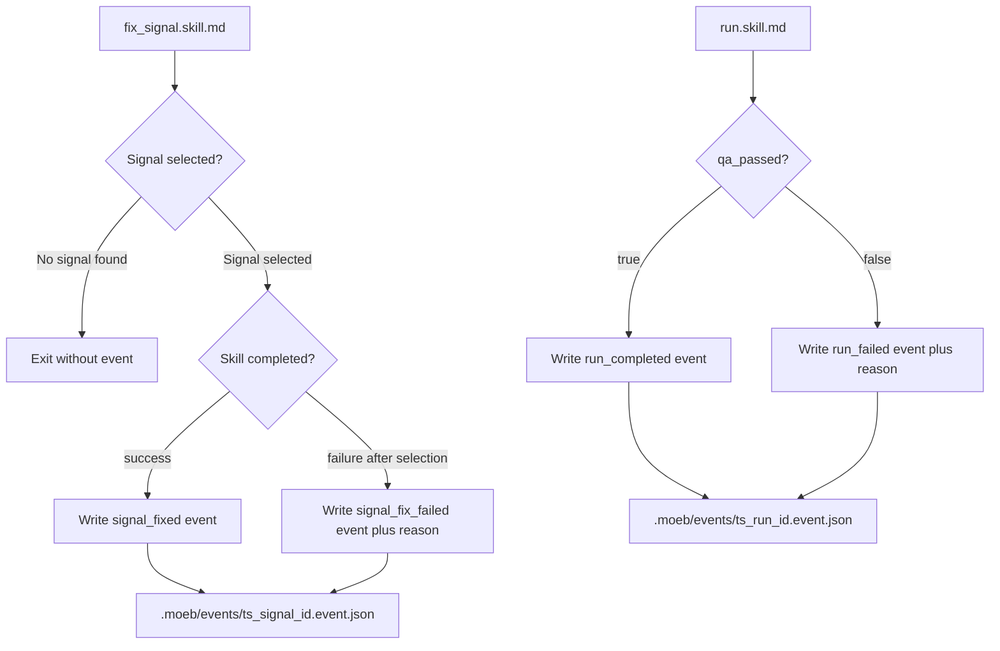

# Skill Completion Event Files

## Raw Requirement

On completion (success or failure) each skill writes a JSON event file to .moeb/events/, creating the directory if absent. File name: {iso_timestamp_compact}_{signal_id_or_run_id}.event.json.

Fields for signal_fix events: event_type (signal_fixed | signal_fix_failed), signal_id, fix_branch, timestamp. On failure also include a reason field.

Fields for run events: event_type (run_completed | run_failed), run_id, signal_id (nullable — read from the run file written by a1000046), candidate_tag (nullable — read from the run file written by a1000046), timestamp. On failure also include a reason field.

No workflow_id or any other external-system ID is written — those belong to the caller. Document the event schema in .moeb/README.md alongside the run file schema.

## Description

After every `fix_signal` and `run` skill execution (success or failure), the skill writes a machine-readable JSON event file to `.moeb/events/`. External watchers detect skill completion by polling this directory without coupling to moeb internals such as git branches, the signal catalogue, or run files. The event file name is `{yyyyMMddTHHmmssZ}_{id}.event.json`, where `{id}` is the `signal_id` for fix_signal events or the `run_id` for run events. A success event carries the minimum fields needed to identify the completed work; a failure event adds a `reason` field. For run events, `signal_id` and `candidate_tag` are sourced from values already in context when the Metrics Recording phase wrote the run file (per a1000046); they are nullable if not set.

Event writing is added to the skill markdown files only — no new Rust tools are introduced. The implementing agent modifies `src/moeb/internal/skills/fix_signal.skill.md` and `src/moeb/internal/skills/run.skill.md` by inserting an event-write instruction into the Complete phase (or equivalent final phase) of each skill. The `.moeb/events/` directory is already gitignored (per moeb.start-spec-from-signal.md); no `.gitignore` change is required.



## Backlinks

### Parents

| Label | Path | Purpose |
|-------|------|---------|
| Harness README | .moeb/README.md | Policy parent and documentation target |
| Signal Fix Command | specifications/moeb/moeb.signal-fix-command.md | Introduced fix_signal skill and .moeb/events/ directory usage |
| Fix Signal Event Emission | specifications/moeb/moeb.fix-signal-event-emission.md | Established .moeb/events/ for signal state-transition events |
| Run Files: Record signal_id and candidate_tag | specifications/moeb/moeb.run-files-must-record-signal-id-and-candidate-tag.md | Introduced signal_id and candidate_tag fields read by run completion events |
| Run Skill: Gate Candidate Tag on QA Review Pass | specifications/moeb/moeb.run-skill-must-only-emit-candidate-tag-when-qa-rev.md | Defined qa_passed flag and QA gate failure path used for run_failed events |

## Steps

1. **Read `src/moeb/internal/skills/fix_signal.skill.md`**. Identify the Complete phase (the final phase that issues the agent's closing summary response). Note the `signal_id` and `fix_branch` variables available in the phase context.

2. **Modify `fix_signal.skill.md` — Complete phase (success path)**: Immediately before the agent's closing response instruction in the Complete phase, insert the following event-write block:

   > Derive the compact ISO timestamp as `yyyyMMddTHHmmssZ` from the current time (e.g. `20260604T132045Z`). Construct the path `.moeb/events/{compact_timestamp}_{signal_id}.event.json`. Write using `write_file`:
   >
   > ```json
   > {
   >   "event_type": "signal_fixed",
   >   "signal_id": "<signal_id from run context>",
   >   "fix_branch": "<branch name from the branch-creation phase>",
   >   "timestamp": "<current ISO 8601 timestamp>"
   > }
   > ```

3. **Modify `fix_signal.skill.md` — failure path after signal selection**: Identify any phase or step where the skill exits after a signal has been selected but before normal completion (for example, if the signal-acceptance event write fails or a mandatory phase step cannot complete). At each such early-exit point, insert a `signal_fix_failed` event write using the same filename pattern:

   ```json
   {
     "event_type": "signal_fix_failed",
     "signal_id": "<signal_id>",
     "fix_branch": "<branch name if already created, else null>",
     "timestamp": "<current ISO 8601 timestamp>",
     "reason": "<brief description of the failure>"
   }
   ```

   If the skill exits before a signal is selected (no unresolved signal found), no completion event is written. Document this explicitly in the signal-selection exit step: "If no unresolved signal is found, exit without writing a completion event."

4. **Read `src/moeb/internal/skills/run.skill.md`**. Identify the Complete phase and the QA gate failure path (the step where `qa_passed` is set to `false` and `create_candidate_tag` is skipped). Note the `run_id`, `signal_id` (injected by `start_run` if provided), and `candidate_tag` (return value of `create_candidate_tag`, or null if not called) variables available in the Complete phase context.

5. **Modify `run.skill.md` — Complete phase**: Immediately before the agent's closing summary response instruction in the Complete phase, insert a conditional event-write block. The agent uses the `run_id`, `signal_id`, and `candidate_tag` values already in context from the Metrics Recording phase (no additional file read is required):

   If `qa_passed` is `true`, construct `.moeb/events/{compact_timestamp}_{run_id}.event.json` and write using `write_file`:

   ```json
   {
     "event_type": "run_completed",
     "run_id": "<run_id>",
     "signal_id": "<signal_id from run context, or null>",
     "candidate_tag": "<candidate_tag from create_candidate_tag return value, or null>",
     "timestamp": "<current ISO 8601 timestamp>"
   }
   ```

   If `qa_passed` is `false`, construct the same path and write:

   ```json
   {
     "event_type": "run_failed",
     "run_id": "<run_id>",
     "signal_id": "<signal_id from run context, or null>",
     "candidate_tag": null,
     "timestamp": "<current ISO 8601 timestamp>",
     "reason": "QA gate: Critical signals detected in End-of-Skill Review"
   }
   ```

   The event write must not interrupt subsequent phases. The closing summary must be issued regardless of whether the event write succeeds.

6. **Update `.moeb/README.md`**: Add an "Event Files" section documenting both event schemas. Search the README for an existing section referencing `.moeb/runs/` (run file schema documentation) and add the new section immediately after it. If no such section exists, append after the Specification index. The section must document:

   - **Location**: `.moeb/events/` (gitignored; not committed to history)
   - **Filename**: `{yyyyMMddTHHmmssZ}_{signal_id_or_run_id}.event.json`
   - **fix_signal event schema**: fields `event_type` (`signal_fixed` | `signal_fix_failed`), `signal_id`, `fix_branch`, `timestamp`, and `reason` (failure events only)
   - **run event schema**: fields `event_type` (`run_completed` | `run_failed`), `run_id`, `signal_id` (nullable), `candidate_tag` (nullable), `timestamp`, and `reason` (failure events only)
   - **Policy note**: No `workflow_id` or other external-system IDs are written. Mapping event IDs to orchestrator workflow IDs is the caller's responsibility.

## Decisions

**Decision 1 — Emit event in the Complete phase using a conditional, not at each outcome point**

Event writing is consolidated in the Complete phase using a conditional on the `qa_passed` flag (for run events) rather than writing at each failure branch. This ensures at most one event file per run, is grep-discoverable ("event_type" appears once per skill), and avoids requiring the agent to track whether it already wrote an event. The QA gate failure path for run.skill.md sets `qa_passed = false` but continues through remaining phases; the Complete phase reads this flag and writes the appropriate event type.

Rejected alternative: write `run_failed` at the QA gate step and `run_completed` at the Complete phase — rejected because it requires a guard against double-writes in the success path and splits a conceptual single operation across two locations.

Consequence: If the Complete phase itself errors, no event file is written. The absence of an event file is a valid signal to external watchers that the skill did not reach its final phase.

**Decision 2 — No completion event when fix_signal exits before signal selection**

If `fix_signal.skill.md` exits because no unresolved signal exists, no completion event is written. A `signal_id` is required for the filename and the event body; without a selected signal there is no meaningful ID. Using `null` in the filename would produce a non-unique pattern (`.moeb/events/{ts}_null.event.json`) that collides across no-op runs.

Rejected alternative: write a `signal_fix_failed` event with `signal_id: null` — rejected due to filename collision risk.

Consequence: External watchers monitoring `.moeb/events/` will not see an event file for no-op fix_signal runs. Callers that need to detect the no-signal case must combine event file absence with a timeout or signal-catalogue poll.

**Decision 3 — Use values already in context; do not re-read the run file**

Run completion events use the `run_id`, `signal_id`, and `candidate_tag` values already present in the agent's context from the Metrics Recording phase where the run file was written. No additional `read_file` call on the run file is required. This avoids a redundant tool call and is consistent with the no-re-read principle in the run skill.

Rejected alternative: read `signal_id` and `candidate_tag` from the run file at event-write time — rejected because the agent already has these values in context; a read would be redundant and would consume unnecessary tokens.

Consequence: If the Metrics Recording phase failed to write the run file, the values default to whatever was in context at that point. The `signal_id` comes from the `start_run` injection; `candidate_tag` is null if `create_candidate_tag` was not called or failed.

**Decision 4 — No new Rust tool; event writing is a pure skill instruction using write_file**

Event file writing uses the existing `write_file` tool. Adding a dedicated `write_event` Rust tool would place skill-level logic (event schema construction and conditional branching) in the kernel, violating the thin-kernel principle. The fixed event schemas in this spec give the agent enough precision to construct the JSON inline.

Rejected alternative: add a `write_event` MCP tool — rejected because the kernel would need to understand event schema shapes (fix_signal vs run variants), which is workflow-specific logic that must live in skill markdown.

Consequence: The agent constructs event JSON inline. If the agent makes a JSON formatting error, the resulting file may be malformed. This risk is mitigated by the fixed schemas documented in this spec and in the README documentation added in Step 6.

**Decision 5 — a1000046 is already implemented; no additional gating check needed**

Run events include `signal_id` and `candidate_tag` fields introduced by specification a1000046 (Run Files: Record signal_id and candidate_tag). Commit `14c1158` (`feat(moeb): execute run-files-must-record-signal-id-and-candidate-tag specification`) confirms a1000046 is already implemented on the main branch. The implementing agent may proceed without additional gating checks.

## Rubric

### Structured

| Name | Description | Threshold | Pass Condition |
|------|-------------|-----------|----------------|
| `tool-errors` | No ToolHandler errors were recorded during this command invocation. Covers all tool calls on both CLI and MCP paths via `RealToolExecutor::execute`. Applies to every moeb command. | Zero tool errors | Kernel-authoritative: injected by `verify_rubrics` from `RunState.tool_errors`. Do not supply a verdict — any agent-supplied entry is overridden. |
| `rubric-qualification` | No Pass verdicts with acknowledged failures were issued during this command invocation. An agent that observes a failure but passes a criterion must populate `acknowledged_failures` in the verdict object. Applies to every moeb command. | Zero qualified Pass verdicts | Kernel-authoritative: injected by `verify_rubrics` by scanning `acknowledged_failures` on incoming Pass verdicts. Do not supply a verdict — any agent-supplied entry is overridden. |
| `skill-mandatory-phases` | The skill loaded for this run contains all mandatory phase headings. The agent checks its own prompt context (the loaded skill content is already present) for the exact strings: "Verify", "End-of-Skill Review", "Metrics Recording", "Commit", "Tag", "Complete". No file read is required. | All six mandatory headings present | Agent scans skill content in its loaded context; fails if any mandatory heading string is absent |
| `no-drift` | The specification does not violate any decision recorded in a linked parent specification | Zero contradictions | Manual review of every decision in every parent spec listed in Backlinks |
| `spec-schema-compliance` | All required frontmatter fields and body sections are present and correctly ordered | 100% of required fields and sections | Validation in `domain/spec.rs` exits 0 during `moeb spec` |
| `ai-first-org` | The specification's Steps prescribe file layouts, naming, and helper placement that satisfy the four AI-first organisation principles: one concern per file, context locality, grep-discoverable names, no cross-cutting helpers. | All four principles followed | Manual review: no step produces a file that mixes concerns, no name is generic across the codebase, all helpers are co-located with their callers or promoted to a precisely named module |
| `branch-clean-at-exit` | After Phase 9 (Commit), the working tree contains no uncommitted changes; any dirty state detected in Phase 9a has been resolved by retry commit (Case A) or by signal emission and cleanup commit (Case B) | Zero uncommitted changes at spec skill exit | Agent verifies that `git_status` returned empty output after Phase 9, or that a retry (Case A) or cleanup commit (Case B) was issued and the branch is clean |
| `kernel-thin-and-parity` | No domain-specific or workflow-specific coordination logic may be placed in kernel Rust code when it can live in skill markdown or role files. Every tool registered in the CLI tool registry must also be registered in the MCP stdio server tool list. | Zero violations | Spec review: no proposed step places review/coordination logic in Rust; Run review: grep confirms no skill-specific logic in kernel tools; tool lists in tools/mod.rs and the MCP server match exactly |
| `moeb-tool-origin` | All tool calls made during this invocation must originate from moeb's own tool registry. If an external tool (not in the moeb registry) was used because no moeb equivalent exists, the agent must write a MissingMoebTool signal immediately after each such call. The criterion always fails when any external tool is used, whether or not a signal was written. | Zero external tool calls | Agent reviews the conversation for calls to non-moeb tools (e.g. Bash, Edit, Write, Read, Glob, Grep, WebFetch, WebSearch in Claude Code MCP mode). Supplies Pass if none were made. If external tools were used with MissingMoebTool signals, supplies Fail with `acknowledged_failures` listing each signal title. If external tools were used without signals, supplies Fail with the unlogged tool names in the note. |
| `thin-kernel` | New Rust code in tools/, commands/, or domain/ must be either (a) a primitive operation wrapper (filesystem, git, or HTTP with no domain logic) or (b) a thin dispatcher that calls into skills, tools, or agents and returns the result unchanged. Workflow logic — sequencing, conditionals, review loops, retry strategy, branching decisions — must live in skill markdown or role files, not in compiled Rust. If the same capability can be achieved by updating a skill file, that path is mandatory. | Zero workflow-logic functions in new Rust | Run review: every new function in tools/ or commands/ either wraps a single OS/VCS/HTTP call or contains no domain-specific branching. This spec adds no Rust code; verify the implementing agent introduces none. |
| `new-skill-mandatory-phases` | Any `*.skill.md` file modified during this run retains all mandatory phase heading strings: "Verify", "End-of-Skill Review", "Metrics Recording", "Commit", "Tag", "Complete" | All six strings present in each modified skill file | Grep each of `fix_signal.skill.md` and `run.skill.md` for the six mandatory heading strings after modification; pass only if all six are present in both files |

### Qualitative

- The event files written by the modified skills are valid JSON and match the schemas defined in Decisions 1–4 and in the README documentation added in Step 6.
- No completion event is written for a fix_signal run that exits before signal selection.
- Exactly one event file is written per skill execution: `signal_fixed` or `signal_fix_failed` for fix_signal, `run_completed` or `run_failed` for run.
- The README documentation added in Step 6 accurately reflects both event schemas including the nullability of `signal_id` and `candidate_tag` for run events.
