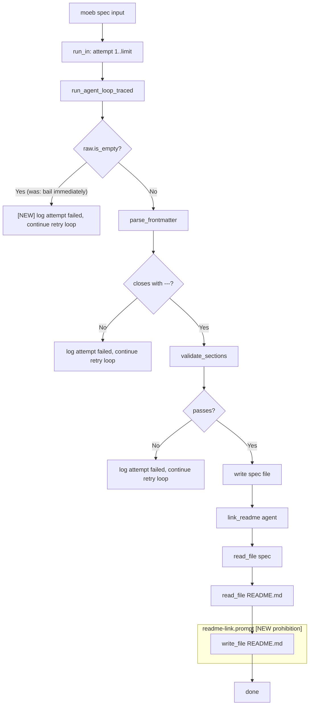

# Spec Command: Failure Mode Fixes for Frontmatter Closure, README Patch Format, and Empty Response Retry

## Raw Requirement

spec attempt 1/3 failed: Frontmatter block is not closed with '---'.

patch_file: patch_file: failed to parse diff for 'README.md': error parsing patch: unable to parse hunk header. Ensure the diff uses @@ hunk headers with context lines.

Error: Agent returned an empty response.

## Description

Three independent failure modes were observed during `moeb spec` runs. Each requires a targeted fix:

1. **Frontmatter not closed** — The spec agent writes the opening `---` delimiter but omits the closing `---`, causing `parse_frontmatter` to fail with "Frontmatter block is not closed with '---'.". This is a retryable validation error, but the prompt does not currently emphasise the closing delimiter with enough clarity. The `spec.prompt` gains an explicit closing-delimiter instruction alongside the existing CRITICAL block.

2. **README patch with malformed diff** — The `link_readme` agent is selecting `patch_file` with an incorrectly formatted diff (no `@@` hunk headers) when updating `README.md`. The `readme-link.prompt` already says to use `write_file` in step 5, but does not explicitly prohibit `patch_file`. The prompt gains an explicit prohibition on `patch_file` and a reminder that `write_file` is the required tool.

3. **Empty response not retried** — When `run_agent_loop_traced` returns an empty string, `run_in` currently returns the error immediately before the retry loop can act on it. Moving the empty-response check inside the retry loop allows the remaining attempts to fire, matching the retry behaviour for parse/validate failures.

## Diagram



## Backlinks

### Parents

| Label | Path | Purpose |
|-------|------|---------|
| README | [README.md](../../README.md) | Root index |
| Spec Validation Retry | [specifications/moeb/moeb.spec-retry-on-validation-failure.md](specifications/moeb/moeb.spec-retry-on-validation-failure.md) | Established the retry loop in run_in; this spec extends its coverage to empty responses |
| Patch File Tool | [specifications/moeb/moeb.patch-file-tool.md](specifications/moeb/moeb.patch-file-tool.md) | Introduced patch_file tool that the link_readme agent is incorrectly selecting |

### External

*(none)*

## Steps

### Step 1 — Move empty-response check inside the retry loop in `src/moeb/src/domain/spec.rs`

Read `src/moeb/src/domain/spec.rs` in full.

Locate the block immediately after the `run_agent_loop_traced` call inside the `for attempt in 1..=retry_limit` loop:

```rust
                if raw.is_empty() {
                    return Err(anyhow::anyhow!("Agent returned an empty response."));
                }
```

Replace it with:

```rust
                if raw.is_empty() {
                    let e = anyhow::anyhow!("Agent returned an empty response.");
                    eprintln!("[moeb] spec attempt {}/{} failed: {}", attempt, retry_limit, e);
                    last_err = e;
                    continue;
                }
```

This converts an immediate fatal return into a retryable validation failure that matches the existing pattern for parse/validate errors.

### Step 2 — Add closing-delimiter instruction to `src/prompts/spec.prompt`

Read `src/prompts/spec.prompt` in full.

Locate the CRITICAL block at the bottom of the file:

```
CRITICAL: The very first characters of your response must be the three-character sequence "---"
on its own line, with absolutely no text, whitespace, or BOM before it. Do not write any
introduction, explanation, or preamble before the frontmatter block. A response that does not
start with "---" is invalid, will be rejected immediately, and the run will be retried at
additional cost. Start your response now with "---".
```

Replace it with:

```
CRITICAL: Your response must begin and end its YAML frontmatter with "---" delimiters. The
structure is exactly:

---
domain: <value>
slug: <value>
status: active
---

The opening "---" must be the very first characters of your response, with no text, whitespace,
or BOM before it. The closing "---" on its own line is equally required — omitting it causes
"Frontmatter block is not closed with '---'" and the run will be retried. Do not write any
introduction or preamble before the opening "---". Start your response now with "---".
```

### Step 3 — Prohibit `patch_file` in `src/prompts/readme-link.prompt`

Read `src/prompts/readme-link.prompt` in full.

Append the following prohibition block at the end of the file (after the existing content):

```

IMPORTANT: Use `write_file` to update README.md — never `patch_file`. The `patch_file` tool
requires a valid unified diff with `@@` hunk headers; generating a correct diff for an
arbitrary README position is error-prone and unnecessary. Always read the full file in step 2
and write the complete updated content in step 5 using `write_file`.
```

### Step 4 — Verify

Run `cargo build --release` — zero errors. Run `cargo test` — all existing tests pass.

Confirm the empty-response path is covered by the existing unit test `run_in_retries_on_validation_failure` or add a new test `run_in_retries_on_empty_response` in `src/moeb/src/domain/spec_tests.rs`:

- Provide a `MockAi` that returns an empty string on the first call and a valid spec on the second call.
- Set `retry_limit = 2`.
- Assert that the service succeeds and writes the spec file.

## Decisions

### Decision 1 — Treat empty response as a retryable failure rather than a fatal error

**Rationale:** An empty response from the AI adapter is indistinguishable in cause from a blank or truncated response that parse/validate would catch — both are transient content failures. The retry loop exists precisely to handle these cases without requiring the user to restart the command. Returning immediately discards the remaining retry budget unnecessarily.

**Alternatives:**

| Option | Reason Rejected |
|--------|-----------------|
| Keep immediate return; user re-runs manually | Wastes user time; violates the principle that the retry loop should absorb transient spec-generation failures |
| Feed the empty-response error back to the AI agent on the next attempt | Decision 1 of `moeb.spec-retry-on-validation-failure` prohibits feeding validation errors back to the agent; each attempt uses the same initial prompt |

**Consequences:** An empty response consumes one retry attempt and emits a `[moeb] spec attempt N/M failed:` line to stderr, consistent with other failure modes.

---

### Decision 2 — Strengthen the closing-delimiter instruction in `spec.prompt` rather than adding a post-processing heuristic

**Rationale:** The frontmatter parser requires a syntactically correct closing `---`. Attempting to infer or insert the delimiter in the kernel would mask the model's error and could corrupt specs that intentionally use `---` inside code blocks. The correct fix is to make the prompt instruction unambiguous about both delimiters.

**Alternatives:**

| Option | Reason Rejected |
|--------|-----------------|
| Kernel heuristic: append `---` if frontmatter appears unclosed | Masks model error; could produce corrupted frontmatter if `---` appears elsewhere in the output |
| Add a validator that suggests the closing delimiter in the retry error message | Requires parsing incomplete YAML; adds complexity for a problem better solved at the prompt layer |

**Consequences:** The CRITICAL block in `spec.prompt` now specifies both the opening and closing `---` delimiters explicitly. The parsing behaviour in `spec_parser.rs` is unchanged.

---

### Decision 3 — Prohibit `patch_file` in `readme-link.prompt` rather than fixing the diff format

**Rationale:** The `readme-link.prompt` already instructs `write_file` in step 5. The agent is violating that instruction by selecting `patch_file` instead. The fix is to make the prohibition explicit. Teaching the agent to produce a correct unified diff for an arbitrary README position is unnecessary complexity — `write_file` with the full updated content is the correct and reliable tool for this task.

**Alternatives:**

| Option | Reason Rejected |
|--------|-----------------|
| Add diff-format guidance and allow `patch_file` for README | README.md is a moderate-size file; the efficiency gain from `patch_file` is not worth the error risk, and diff generation for table rows is fragile |
| Remove `patch_file` from the ToolRegistry during the link_readme agent loop | Over-engineered; the prohibition in the prompt is sufficient and preserves the existing tool API surface |

**Consequences:** The `readme-link.prompt` explicitly forbids `patch_file`. The `write_file` path for README updates is the only permitted route.

## Rubric

### Structured

| Name | Description | Threshold | Pass Condition |
|------|-------------|-----------|----------------|
| `binary-builds` | `cargo build --release` exits 0 | Zero errors | CI build exits 0 |
| `all-tests-pass` | `cargo test` exits 0 | Zero failures | `cargo test` exits 0 |
| `empty-response-retried` | An empty agent response consumes a retry attempt and emits the per-attempt stderr line instead of failing immediately | 100% | Unit test `run_in_retries_on_empty_response` passes with retry_limit = 2, MockAi returning empty then valid |
| `prompt-closing-delimiter` | The CRITICAL block in `spec.prompt` explicitly names both the opening and closing `---` delimiters | Present | `grep "closing" src/prompts/spec.prompt` or equivalent returns a match |
| `readme-link-patch-prohibited` | `readme-link.prompt` contains an explicit prohibition on `patch_file` | Present | `grep "patch_file" src/prompts/readme-link.prompt` returns a match in a prohibition context |

### Qualitative

- **Retry consistency:** All three failure modes (empty response, frontmatter parse error, section validation error) now emit the same `[moeb] spec attempt N/M failed:` pattern to stderr and consume a retry slot before exhausting the limit.
- **Prompt clarity:** A developer or agent reading the updated CRITICAL block cannot misidentify which delimiter is optional — both are shown explicitly with the full frontmatter template.
