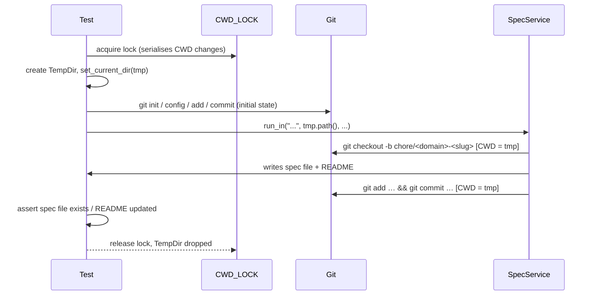

# Spec Integration Tests: Git CWD Isolation

## Raw Requirement

> vcs integration tests failing due to `(they fail with Unable to read current working directory in a temp dir` we need these to pass or otherwise be removed as they keep getting flagged in test runs

## Description

The five integration tests in `spec_integration_tests.rs` call `SpecService::run_in`, which invokes `crate::vcs::create_spec_branch` and `crate::vcs::commit_spec`. Both functions spawn `git` subprocesses that inherit the current working directory (CWD) of the test binary. Many other tests use `CWD_LOCK` + `std::env::set_current_dir` to swap the CWD to a temporary directory, then drop that directory when the test ends. Because `spec_integration_tests.rs` holds no `CWD_LOCK`, it can race with those tests: git is launched after a CWD-owning test has deleted its tempdir, producing the fatal git error "Unable to read current working directory." The fix is to give each integration test its own CWD via `CWD_LOCK` + `set_current_dir`, and to initialise a minimal git repository inside the tempdir so that the `git checkout -b` and `git commit` calls succeed without touching the real project repository.

## Backlinks

### Parents

| Label | Path | Purpose |
|-------|------|---------|
| README | [README.md](../../README.md) | Root harness index and policy source |
| Moeb Kernel | [specifications/moeb/moeb.kernel.md](specifications/moeb/moeb.kernel.md) | Defines the spec command and run_in interface under test |
| Specification Creation: Precise Branch and Commit Format | [specifications/vcs/vcs.spec-creation-branch-commit-format.md](specifications/vcs/vcs.spec-creation-branch-commit-format.md) | Introduced create_spec_branch and commit_spec calls into run_in, making the integration tests depend on git |

## Steps

### Step 1 — Add a `git_init` helper to `spec_integration_tests.rs`

Add a private helper function `git_init(dir: &Path)` that creates a minimal, self-contained git repository inside `dir`. The helper must:

1. Run `git init` with `--initial-branch=main` (or fall back gracefully if the flag is unsupported — some CI git versions do not accept it; omit the flag rather than hard-failing).
2. Set `user.email` and `user.name` locally (`--local`) so the test does not depend on a global git config being present.
3. Run `git add .` to stage the files already written by `setup_harness`.
4. Run `git commit --no-gpg-sign -m "initial"` to create HEAD so that `git checkout -b` has a base to branch from.

All git invocations must use `.current_dir(dir)` and must be treated as fatal (`unwrap()`) — a failure here means the test environment is broken, not that the spec logic is wrong.

### Step 2 — Call `git_init` from `setup_harness`

After the existing file-creation lines in `setup_harness`, add a call to `git_init(dir)`. The order must be: create files first, then `git_init`, so that the initial commit captures the README and specifications directory.

### Step 3 — Add `CWD_LOCK` + `set_current_dir` to every test that calls `run_in` successfully

For `run_in_creates_spec_file_at_correct_path`, `run_in_readme_updated_when_agent_writes_it`, `run_in_retries_on_validation_failure`, and `run_in_retries_on_empty_response`:

1. Import `crate::config::tests::CWD_LOCK`.
2. At the start of each test body, acquire the lock: `let _guard = CWD_LOCK.lock().unwrap_or_else(|e| e.into_inner());`
3. After acquiring the lock and before calling `run_in`, change the process CWD to the tempdir: `std::env::set_current_dir(tmp.path()).unwrap();`

The lock must be held for the entire test so no other test can move the CWD while git is running.

### Step 4 — Verify `run_in_fails_after_exhausting_retries` needs no change

This test exhausts the retry loop before reaching the VCS code path. It does not call `create_spec_branch` or `commit_spec` and does not change the CWD. No `CWD_LOCK` is required. Confirm this by tracing the execution path: `run_in` breaks out of the retry loop and calls `bail!` before the `create_spec_branch` line is reached.

### Step 5 — Run the test suite and confirm

Run `cargo test -p moeb` and verify that all five integration tests in `spec_integration_tests.rs` pass. No other test should regress.

## Decisions

### Use CWD_LOCK + set_current_dir rather than passing working_dir to git functions

**Rationale:** The alternative — adding a `repo_root: &Path` parameter to `create_spec_branch` and `commit_spec` — would require updating those function signatures, their call site in `spec.rs`, and would introduce complexity around resolving the repo root from a sub-directory path. The `CWD_LOCK` pattern is already established across the codebase (14 existing uses). Adopting it here is consistent, minimal, and localises all changes to the test file.

**Alternatives:**

| Option | Reason Rejected |
|--------|-----------------|
| Add `repo_root: &Path` to `create_spec_branch` and `commit_spec` | Larger surface change; requires callers to compute the git root, which is implicit in CWD in production but ambiguous when `working_dir` is a sub-directory |
| Remove the failing tests entirely | Loses coverage of the spec-creation happy path; the tests have value and the fix is straightforward |
| Make git errors non-fatal in `create_spec_branch` (soft-fail like `commit_spec`) | Violates the vcs.spec-creation-branch-commit-format requirement that the branch must be created before any file write; masking git failures in production is worse than fixing the tests |
| Introduce a VCS trait/port and mock git in tests | Correct architectural direction but disproportionate effort for a two-file fix; can be done in a future spec |

**Consequences:** Integration tests serialise through `CWD_LOCK`, meaning they run one at a time. This is already the norm for CWD-sensitive tests and has no measurable impact on test suite runtime.

### Initialise a real git repository in `setup_harness` rather than stubbing git

**Rationale:** `create_spec_branch` and `commit_spec` invoke real `git` subprocesses. Mocking them would require a VCS port (deferred above). Initialising a minimal real repository is the simplest approach that exercises the actual code path and verifies that the git commands the production binary issues are correct.

**Alternatives:**

| Option | Reason Rejected |
|--------|-----------------|
| Stub git with a fake binary on PATH | Fragile; platform-dependent; obscures whether the git command arguments are correct |
| Skip git assertions entirely | Already done for `run_in_fails_after_exhausting_retries`; not appropriate for the success-path tests |

**Consequences:** Tests require `git` to be installed in the test environment (CI already has git; this is not a new requirement).

## Rubric

### Structured

| Name | Description | Threshold | Pass Condition |
|------|-------------|-----------|----------------|
| no-drift | No contradiction with parent specs | Implementation does not violate any decision in linked parent specs | Zero contradictions with moeb.kernel.md or vcs.spec-creation-branch-commit-format.md decisions |
| spec-schema-compliance | Spec conforms to schema | All required frontmatter fields and body sections present and correctly ordered | `moeb spec` validation exits 0 |
| All five integration tests pass | Every test in `spec_integration_tests.rs` exits green | Zero test failures | `cargo test -p moeb` shows 5 passing tests in the integration_tests module |
| No other tests regress | Changes must not break any previously passing test | Zero regressions | Full `cargo test -p moeb` suite passes |
| CWD_LOCK acquired before set_current_dir | Lock must be held before the CWD is changed in each test | Exact ordering enforced | Code inspection: `CWD_LOCK.lock()` call precedes `set_current_dir` in all four modified tests |
| git_init uses --local config | user.email and user.name must be set with --local to avoid requiring global git config | --local flag present in both config calls | Code inspection of `git_init` helper |

### Qualitative

- **git_init is self-contained:** The helper should work in a fresh CI environment with no global git config and no pre-existing repository. No test should accidentally write to the real project git repository.
- **Minimal diff:** Only `spec_integration_tests.rs` should change. No production code modifications are required.
