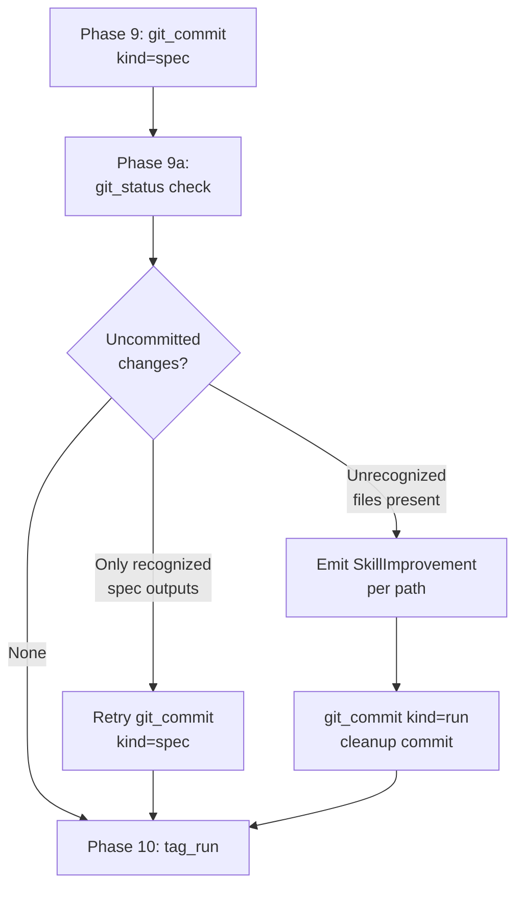

# Spec Skill: Git Status Check and Branch Cleanliness at Exit

## Raw Requirement

Add a git status check at spec skill exit. If uncommitted changes are detected: (1) if the files are recognised spec outputs (spec file, README update), commit them before exit; (2) if the files are unexpected, emit a SkillImprovement signal identifying the uncommitted paths and clean up. This is a hard constraint on skill exit — the branch must be clean. Add a corresponding rubric to the spec skill.

## Description

The spec skill's Phase 9 (Commit) calls `git_commit` with `kind: "spec"`, which stages and commits only the spec file and `README.md`. After Phase 9, any files written in later phases — signals, metrics, run file — remain uncommitted. There is currently no verification that the working tree is clean before the skill completes.

This specification adds:

1. A `git_status` tool — a thin kernel wrapper around `git status --porcelain` that returns the porcelain-format working-tree state as a string.
2. A **Phase 9a — Exit Cleanliness Check** in `src/moeb/internal/skills/spec.skill.md`, inserted between Phase 9 (Commit) and Phase 10 (Tag), that:
   - Calls `git_status` to read the current working-tree state.
   - If the tree is clean: proceeds immediately to Phase 10.
   - If only recognized spec outputs (the spec file and `README.md`) are uncommitted: retries `git_commit` with `kind: "spec"` to recover from a Phase 9 failure.
   - If unrecognized files are uncommitted: emits a `SkillImprovement` signal per unrecognized path via the Canonical Signal Dedup-and-Write Procedure, then calls `git_commit` with `kind: "run"` to stage and commit all remaining changes (including the newly written signals), achieving branch cleanliness.
3. A `branch-clean-at-exit` rubric criterion added to `src/moeb/internal/rubrics/spec.rubrics.md`, requiring the working tree to be clean at spec skill exit.

The `git_status` tool is registered in both the CLI `ToolRegistry::standard()` and the MCP stdio server tool list to maintain MCP/CLI parity.



## Backlinks

### Parents

| Label | Path | Purpose |
|-------|------|---------|
| Harness README | .moeb/README.md | Parent harness index governing all specifications |
| Spec Skill Path Correction | specifications/moeb/moeb.spec-skill-path-correction.md | Established `.moeb/`-prefixed paths in spec.skill.md |
| AI-First Artifact Refinement | specifications/moeb/moeb.ai-first-artifact-refinement.md | Introduced mandatory phase headings and `tag_run` tool |
| MCP Serve / CLI Parity | specifications/moeb/moeb.serve-cli-parity.md | Established MCP/CLI tool parity requirement |
| Tool Executor Extraction | specifications/moeb/moeb.tool-executor-extraction.md | Established `ToolHandler` trait and `ToolRegistry` pattern |
| Rubric Context Layers | specifications/moeb/moeb.rubric-context-layers.md | Established binary-bundled rubric file placement policy |
| Run Command: Post-Completion Git Commit | specifications/moeb/moeb.run-git-commit.md | Established `git_commit` kind parameter and run-skill commit pattern |
| Tool Executor Test Assertion Count | specifications/moeb/moeb.tool-executor-test-assertion-count.md | Established the pattern for updating the standard registry tool count assertion |

## Steps

### Step 1 — Create `src/moeb/tools/git_status.rs`

Create a new file `src/moeb/tools/git_status.rs` containing a single `GitStatusTool` struct that implements `ToolHandler`:

- `fn name(&self) -> &'static str` returns `"git_status"`.
- `fn schema(&self) -> Value` returns `json!({ "type": "object", "properties": {}, "required": [] })`.
- `fn execute(&self, _input: Value, ctx: &ToolContext) -> Result<String, String>` runs `std::process::Command::new("git").args(["status", "--porcelain"]).current_dir(&ctx.working_dir)`, captures combined stdout, and returns it as a `String`. If the process fails to spawn or exits non-zero, returns `Err` with the stderr content. An empty string return means the working tree is clean.

No helper functions outside the `impl ToolHandler` block. The execute body must contain no domain-specific branching — only the OS call and output conversion.

### Step 2 — Register `GitStatusTool` in `src/moeb/tools/mod.rs`

In `src/moeb/tools/mod.rs`:
1. Add `mod git_status;` among the existing `mod` declarations.
2. Add `use git_status::GitStatusTool;` in the use block.
3. In `ToolRegistry::standard()`, add `Box::new(GitStatusTool)` to the registered tools vector, maintaining the ordering convention of adjacent entries.

### Step 3 — Register `git_status` in the MCP stdio server tool list

Use `grep_files` with pattern `"git_commit"` in `src/moeb/serve/` to locate the file and line where MCP tools are registered. In the same registration block, add an entry for `git_status` with:

- `name`: `"git_status"`
- `description`: `"Return the current working-tree state as a --porcelain git status string. An empty string means the tree is clean."`
- `inputSchema`: `{ "type": "object", "properties": {}, "required": [] }`

The entry must be structurally identical to adjacent entries (same JSON shape, same field order).

### Step 4 — Update the tool count assertion in tests

Use `grep_files` with pattern `standard_registry` or `tool_count` in `src/moeb/tools/` to locate the test asserting the standard registry tool count. Increment the expected count by 1 to account for `GitStatusTool`. If multiple assertions exist, update all that reference the standard registry count.

### Step 5 — Insert Phase 9a into `src/moeb/internal/skills/spec.skill.md`

Read `src/moeb/internal/skills/spec.skill.md`. Locate the boundary between the `## Phase 9 — Commit` section and the `## Phase 10 — Tag` section. Insert the following block between them:

```
## Phase 9a — Exit Cleanliness Check

Call `git_status` (no input required) to retrieve the current working-tree state as a `--porcelain` string.

If the output is empty, the branch is clean — proceed to Phase 10.

If the output is non-empty, parse each line and classify each reported path:

- A **recognized spec output** is a path matching `.moeb/specifications/<domain>/<domain>.<slug>.md` or `.moeb/README.md`, where `<domain>` and `<slug>` are the values from the spec frontmatter authored in Phase 2.
- All other paths are **unrecognized**.

**Case A — only recognized spec outputs are uncommitted:**
Phase 9 `git_commit` did not persist these files. Call `git_commit` with `kind: "spec"`, using the same `spec_path`, `readme_path`, `domain`, and `slug` values used in Phase 9. Proceed to Phase 10.

**Case B — one or more unrecognized files are uncommitted (whether or not recognized outputs are also uncommitted):**
1. For each unrecognized path `P`, write a signal via the Canonical Signal Dedup-and-Write Procedure:
   - `category`: `"SkillImprovement"`
   - `severity`: `"Minor"`
   - `title`: `"Uncommitted path at spec skill exit: <P>"`
   - `description`: `"spec.skill.md exited with <P> uncommitted. This path is not a recognised spec output and was not staged by any git_commit call in this run."`
   - `proposed_resolution`: `"Determine whether <P> should be committed in an existing skill phase or handled by a dedicated cleanup step in spec.skill.md."`
   - `gating_condition`: `null`
2. After writing all signals, call `git_commit` with `kind: "run"` to stage and commit all remaining working-tree changes, including the newly written signal files. This achieves branch cleanliness.
3. Proceed to Phase 10.
```

After patching, verify that all six mandatory heading strings ("Verify", "End-of-Skill Review", "Metrics Recording", "Commit", "Tag", "Complete") remain present in the file.

### Step 6 — Add `branch-clean-at-exit` to `src/moeb/internal/rubrics/spec.rubrics.md`

Read `src/moeb/internal/rubrics/spec.rubrics.md`. Append the following row to the criteria table:

```
| `branch-clean-at-exit` | After Phase 9 (Commit), the working tree contains no uncommitted changes; any dirty state detected in Phase 9a has been resolved by retry commit (Case A) or by signal emission and cleanup commit (Case B) | Zero uncommitted changes at spec skill exit | Agent verifies that `git_status` returned empty output after Phase 9, or that a retry (Case A) or cleanup commit (Case B) was issued and the branch is clean |
```

## Decisions

### Decision 1 — Introduce a new `git_status` tool rather than inferring dirty state

**Rationale:** The requirement explicitly asks for a "git status check." Inferring dirty state from the run's write log (which files were written during this session) is unreliable — it cannot detect files modified by git operations themselves, files left behind by an earlier interrupted run, or files written outside the expected skill paths. An explicit tool call against git's porcelain output is authoritative.

**Rejected alternative:** Infer dirty state from `RunState.tool_calls` write log. Rejected because inference is incomplete, cannot detect pre-existing dirty state from prior interrupted runs, and does not satisfy the "git status check" language in the requirement.

**Consequences:** A new `git_status` tool must be registered in both `ToolRegistry::standard()` and the MCP server tool list. The standard registry tool count assertion in tests must be incremented by 1.

### Decision 2 — Insert Phase 9a between Phase 9 (Commit) and Phase 10 (Tag)

**Rationale:** The run tag in Phase 10 (`run/<run_id>`) should annotate a clean commit. Placing the cleanliness check between Phase 9 and Phase 10 ensures the tag points to a commit that is free of working-tree debt. Placing it after Phase 12 would leave the tag on a potentially dirty commit.

**Rejected alternative:** Insert Phase 9a after Phase 12 (Complete). Rejected because the run tag would point to the pre-cleanup commit HEAD, making the tagged state inconsistent with the final branch HEAD after cleanup.

### Decision 3 — Commit unrecognized files with `kind: "run"` rather than deleting them

**Rationale:** Every file written by the spec skill during a run is a legitimate harness artifact (signals, metrics, run file). Deleting them to achieve cleanliness would destroy data. Committing them with `kind: "run"` achieves branch cleanliness without data loss. The `SkillImprovement` signal per unexpected path identifies the gap so a future spec can address it.

**Rejected alternative:** Delete unrecognized files using `git clean`. Rejected as destructive — harness artifact files are not transient and must not be discarded.

**Rejected alternative:** Stash uncommitted changes. Rejected because a stash does not commit the artifacts; it achieves superficial cleanliness while leaving the data unversioned.

### Decision 4 — Add `branch-clean-at-exit` to the binary-bundled `spec.rubrics.md` (layer 2)

**Rationale:** Placing the criterion in `src/moeb/internal/rubrics/spec.rubrics.md` injects it automatically into every future spec run prompt via the layer-2 command-baseline rubric. This applies the constraint universally without requiring each specification author to include it in their `## Rubric` table.

**Rejected alternative:** Add the criterion only to this specification's `## Rubric / ### Structured` table. Rejected because this would apply only to runs of this specific specification, leaving all other spec runs unguarded against dirty-exit state.

## Rubric

### Structured

| Name | Description | Threshold | Pass Condition |
|------|-------------|-----------|----------------|
| `tool-errors` | No ToolHandler errors were recorded during this command invocation. Covers all tool calls on both CLI and MCP paths via `RealToolExecutor::execute`. Applies to every moeb command. | Zero tool errors | Kernel-authoritative: injected by `verify_rubrics` from `RunState.tool_errors`. Do not supply a verdict — any agent-supplied entry is overridden. |
| `rubric-qualification` | No Pass verdicts with acknowledged failures were issued during this command invocation. An agent that observes a failure but passes a criterion must populate `acknowledged_failures` in the verdict object. Applies to every moeb command. | Zero qualified Pass verdicts | Kernel-authoritative: injected by `verify_rubrics` by scanning `acknowledged_failures` on incoming Pass verdicts. Do not supply a verdict — any agent-supplied entry is overridden. |
| `skill-mandatory-phases` | The skill loaded for this run contains all mandatory phase headings. The agent checks its own prompt context (the loaded skill content is already present) for the exact strings: "Verify", "End-of-Skill Review", "Metrics Recording", "Commit", "Tag", "Complete". No file read is required. | All six mandatory headings present | Agent scans skill content in its loaded context; fails if any mandatory heading string is absent |
| `no-drift` | The specification does not violate any decision recorded in a linked parent specification | Zero contradictions | Manual review of every decision in every parent spec listed in Backlinks |
| `spec-schema-compliance` | All required frontmatter fields and body sections are present and correctly ordered | 100% of required fields and sections | Validation in `domain/spec.rs` exits 0 during `moeb spec` |
| `ai-first-org` | The specification's Steps prescribe file layouts, naming, and helper placement that satisfy the four AI-first organisation principles: one concern per file, context locality, grep-discoverable names, no cross-cutting helpers. | All four principles followed | Manual review: no step produces a file that mixes concerns, no name is generic across the codebase, all helpers are co-located with their callers or promoted to a precisely named module |
| `kernel-thin-and-parity` | No domain-specific or workflow-specific coordination logic may be placed in kernel Rust code when it can live in skill markdown or role files. Every tool registered in the CLI tool registry must also be registered in the MCP stdio server tool list. | Zero violations | Spec review: no proposed step places review/coordination logic in Rust; Run review: grep confirms no skill-specific logic in kernel tools; tool lists in tools/mod.rs and the MCP server match exactly |
| `moeb-tool-origin` | All tool calls made during this invocation must originate from moeb's own tool registry. If an external tool (not in the moeb registry) was used because no moeb equivalent exists, the agent must write a MissingMoebTool signal immediately after each such call. The criterion always fails when any external tool is used, whether or not a signal was written. | Zero external tool calls | Agent reviews the conversation for calls to non-moeb tools (e.g. Bash, Edit, Write, Read, Glob, Grep, WebFetch, WebSearch in Claude Code MCP mode). Supplies Pass if none were made. If external tools were used with MissingMoebTool signals, supplies Fail with `acknowledged_failures` listing each signal title. If external tools were used without signals, supplies Fail with the unlogged tool names in the note. |
| `thin-kernel` | New Rust code in tools/, commands/, or domain/ must be either (a) a primitive operation wrapper (filesystem, git, or HTTP with no domain logic) or (b) a thin dispatcher that calls into skills, tools, or agents and returns the result unchanged. Workflow logic — sequencing, conditionals, review loops, retry strategy, branching decisions — must live in skill markdown or role files, not in compiled Rust. | Zero workflow-logic functions in new Rust | Run review: `git_status.rs` contains only a single `std::process::Command` invocation and output conversion — no domain-specific branching |
| `new-skill-mandatory-phases` | Any `*.skill.md` file written during this run contains all mandatory phase heading strings: "Verify", "End-of-Skill Review", "Metrics Recording", "Commit", "Tag", "Complete" | All six strings present in the written skill file | After patching `spec.skill.md`, confirm all six mandatory heading strings remain present in the file |
| `mcp-cli-behavioural-parity` | For any operation exposed through both the CLI agent loop and the MCP server, the observable outcome must be identical: same file mutations, same tool result string format, same rendered prompt template. Any tool registered in the standard registry must be registered in the MCP registry with an identical input schema and result contract. | Zero divergent outcomes | Run review: `git_status` is present in both `ToolRegistry::standard()` and the MCP server tool list with identical empty input schema and string result contract |

### Qualitative

- The `git_status` tool body must contain no domain-specific branching — only a single `std::process::Command` call returning raw stdout. All classification logic lives in spec.skill.md Phase 9a.
- Phase 9a instructions must be unambiguous about which case (A or B) applies. The classification rule is literal path matching — the agent must not make a judgment call about whether a path is "expected."
- After the Case B cleanup commit, the spec skill must not call `git_status` again to verify cleanliness. Phase 9a prescribes deterministic cleanup, not a verification loop.
