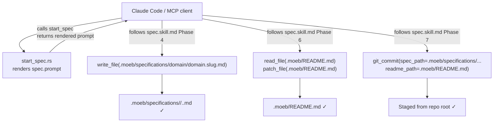

# Spec Skill Path Correction: MCP Working Directory Alignment

## Raw Requirement

When running spec from a local stdio mcp moeb, claude code created the specification in a folder at the root level of the working directory, the location of specifications generated by moeb should be found as .moeb/specifications/<domain>/<domain>.<spec-name>.md, adjust our prompts, tools and skills as necessary to achieve this

## Description

The `spec.skill.md` phases introduced by `moeb.serve-cli-parity` contain file paths
written as if `.moeb/` were the tool working directory (e.g. `write_file` target
`specifications/<domain>/...`, `read_file` target `README.md`). The MCP server's file
tools resolve paths relative to the repository root, not `.moeb/`. The mismatch causes
spec files to be written to `<repo-root>/specifications/<domain>/...` instead of
`<repo-root>/.moeb/specifications/<domain>/...`.

This specification corrects three artefacts:

1. **`spec.skill.md`** — Phases 4-7 are updated so all tool paths are prefixed with
   `.moeb/` where required, making them correct from the project-root working directory.
2. **`spec.prompt`** — The repository boundary block is corrected to state that the
   working directory is the repository root, not `.moeb/`.
3. **`start_spec.rs`** — The README and rubrics catalogue load paths are verified and,
   if wrong, corrected to use `.moeb/`-prefixed paths.

No schema, harness policy, or workflow phase ordering is changed. This is a pure
path-literal correction.

## Backlinks

### Parents

| Label | Path | Purpose |
|-------|------|---------|
| README | README.md | root index |
| MCP Serve / CLI Parity | specifications/moeb/moeb.serve-cli-parity.md | parent spec that introduced spec.skill.md phases with incorrect paths |
| Moeb Spec: .moeb Root Boundary | specifications/moeb/moeb.moeb-spec-moeb-root-boundary.md | parent spec establishing .moeb/ as harness-only; this spec aligns tool paths with that boundary |

## Steps

### Step 1 — Correct Phase 4 write path in `spec.skill.md`

In `src/moeb/internal/skills/spec.skill.md`, locate Phase 4 (Write). Find the instruction
that reads:

> Call `write_file` with path `specifications/<domain>/<domain>.<slug>.md` (relative to
> the `.moeb/` working directory)

Replace it with:

> Call `write_file` with path `.moeb/specifications/<domain>/<domain>.<slug>.md` and the
> complete specification document as content. The content must begin with `---` (the YAML
> opening delimiter) as its very first characters.

Remove the parenthetical "(relative to the `.moeb/` working directory)" — the path is now
explicit from the repository root and requires no annotation.

### Step 2 — Correct Phase 6 README paths in `spec.skill.md`

In the same `spec.skill.md`, locate Phase 6 (Link README).

1. Change the `read_file` call target from `README.md` to `.moeb/README.md`.
2. Change the `patch_file` call target from `README.md` to `.moeb/README.md`.
3. The link text inside the appended table row (`[specifications/<domain>/...](...)`)
   must remain unchanged — those are relative links within the README document and are
   correct relative to `.moeb/README.md`'s own location.

### Step 3 — Correct Phase 7 git_commit paths in `spec.skill.md`

In the same `spec.skill.md`, locate Phase 7 (Commit). Update the `git_commit` call
arguments:

- `spec_path`: change from `specifications/<domain>/<domain>.<slug>.md` to
  `.moeb/specifications/<domain>/<domain>.<slug>.md`
- `readme_path`: change from `README.md` to `.moeb/README.md`

### Step 4 — Correct the boundary block in `spec.prompt`

In `src/prompts/spec.prompt`, locate the repository boundary block. It currently contains
a statement asserting that `.moeb/` is the working directory, similar to:

> Your working directory is `.moeb/`. All paths you pass to tools are resolved relative to
> `.moeb/`, not the repository root.

Replace the working-directory claim with:

> Your working directory is the **repository root**. All harness files live under `.moeb/`
> at the repository root. Use explicit `.moeb/`-prefixed paths when calling any file tool
> that targets harness artefacts: `.moeb/specifications/<domain>/<domain>.<slug>.md` for
> spec files, `.moeb/README.md` for the harness index. Do not use bare `specifications/`
> or bare `README.md` — those resolve to the repository root and will place files in the
> wrong location.

Retain all other content in the boundary block unchanged (the `.moeb/` tree scope
description, the no-inferred-destinations note, the `spec-schema-validation.json` note).

### Step 5 — Verify and fix `start_spec.rs` load paths

In `src/moeb/src/tools/start_spec.rs`, locate the two file-system loads described in
`moeb.serve-cli-parity` Step 7:

1. `readme_content` — currently `working_dir.join("README.md")`. If this is not already
   `working_dir.join(".moeb/README.md")` or `working_dir.join(".moeb").join("README.md")`,
   change it to `working_dir.join(".moeb/README.md")`.
2. `rubrics_content` (catalogue) — currently `working_dir.join("rubrics/catalogue.rubrics.md")`.
   If this is not already `.moeb/rubrics/catalogue.rubrics.md`, change it to
   `working_dir.join(".moeb/rubrics/catalogue.rubrics.md")`.

If either path was already correct, make no change to it. In either case, confirm by
reading the file that the content loads without error before finishing the run.

### Step 6 — Verify no other prompt templates contain the incorrect path assumption

Search `src/prompts/` and `src/moeb/internal/skills/` for any remaining occurrence of the
pattern `"working directory is .moeb"` or `"relative to the .moeb"` or a bare
`specifications/<domain>` path instruction (without the `.moeb/` prefix). If any are
found, apply the same correction as Steps 1-4. If none are found, document the search
result in a comment in the commit message body.

## Decisions

### Decision 1 — Fix paths in skill and prompt; do not change tool working directory

The tool working directory is the repository root and should remain so. Changing it to
`.moeb/` would break any relative paths the `run` workflow uses that are already correct
from the repository root (e.g. `src/` references, rubrics paths). The correct fix is to
make the skill and prompt paths explicit from the repository root.

**Alternatives rejected:**
- *Set tool working_dir to `.moeb/` in MCP serve mode:* Rejected — this would be a
  contextual divergence between CLI and serve modes, violating the parity goal of
  `moeb.serve-cli-parity`. It would also break `src/` paths used in run workflows.
- *Add a `moeb_root` prefix variable to templates:* Rejected — adds a new template
  token for a one-time fix; explicit literals are simpler and less fragile.

**Consequences:** All skill and prompt path literals that reference harness artefacts must
use the `.moeb/` prefix. Future spec.skill.md changes must follow the same convention.

### Decision 2 — README link row paths stay relative to README's own location

The link text inside the README table rows (e.g.
`[specifications/moeb/moeb.foo.md](specifications/moeb/moeb.foo.md)`) must remain as-is.
These are markdown relative links inside `.moeb/README.md` and correctly resolve to
`.moeb/specifications/moeb/moeb.foo.md` relative to that file's directory.

**Alternatives rejected:**
- *Change link text to `.moeb/specifications/...`:* Rejected — markdown links inside a
  file are relative to the file, not to the repo root. Prefixing them with `.moeb/` would
  produce broken links.

**Consequences:** The write_file path (`.moeb/specifications/...`) and the README link
text (`specifications/...`) will differ in prefix; this is correct and intentional.

### Decision 3 — No change to git_commit tool implementation

The `git_commit` tool in `git_commit.rs` resolves `working_dir.join(spec_path)` to an
absolute path before staging. With working_dir = repo root and spec_path =
`.moeb/specifications/<domain>/...`, the absolute path resolves to the correct location
without any change to the tool's Rust implementation.

**Alternatives rejected:**
- *Update git_commit to strip/add .moeb/ prefix internally:* Rejected — the tool should
  accept the path as provided by the caller; path normalization belongs in the caller
  (the skill).

**Consequences:** The git_commit tool's `spec_path` and `readme_path` parameters must
always be supplied as repository-root-relative paths by the skill.

## Rubric

### Structured

| Name | Description | Threshold | Pass Condition |
|------|-------------|-----------|----------------|
| `no-drift` | The specification does not violate any decision recorded in a linked parent specification | Zero contradictions | Manual review of every decision in every parent spec listed in Backlinks |
| `spec-schema-compliance` | All required frontmatter fields and body sections are present and correctly ordered | 100% of required fields and sections | Validation in `domain/spec.rs` exits 0 during `moeb spec` |
| `ai-first-org` | The specification's Steps prescribe file layouts, naming, and helper placement that satisfy the four AI-first organisation principles: one concern per file, context locality, grep-discoverable names, no cross-cutting helpers. | All four principles followed | Manual review: no step produces a file that mixes concerns, no name is generic across the codebase, all helpers are co-located with their callers or promoted to a precisely named module |
| `spec-output-location` | After implementation, `moeb spec` via MCP produces the spec file at `.moeb/specifications/<domain>/<domain>.<slug>.md` | File absent from repo root `specifications/` directory; present under `.moeb/specifications/` | Smoke-test: run `moeb spec` via MCP for a trivial requirement; confirm file location in the working tree |

### Qualitative

- **Minimal diff:** Only the path literals in skill, prompt, and start_spec.rs are changed. No phase structure, section ordering, schema, or harness policy is altered.
- **Parity preserved:** The corrected paths are identical whether the agent is driven by `moeb spec` CLI or `moeb serve` MCP — both resolve from the repository root.
- **No broken README links:** Existing README index rows (written by prior spec sessions with the incorrect path) are historical and immutable; this spec does not require retroactive correction of those rows.
