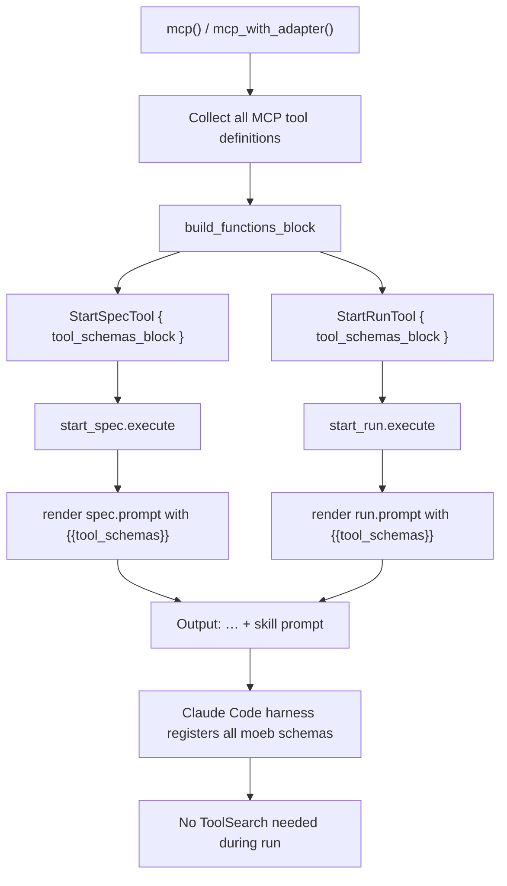

# start_spec and start_run: Embed Tool Schema Preload Block in Output

## Raw Requirement

Pre-include required tool schemas in start_run and start_spec output, or introduce a schema-preload mechanism that eliminates ToolSearch calls during moeb runs.

## Description

When moeb runs as an MCP server inside Claude Code, the client defers loading full tool schemas for context-budget reasons. Agents must call the external `ToolSearch` tool to obtain schemas before invoking the corresponding moeb tools. Every such `ToolSearch` call violates the `moeb-tool-origin` rubric criterion and appears in the conversation as an external tool call, causing every run to register a criterion failure.

This specification resolves the post-`start_spec`/`start_run` phase of the problem: once the orchestrating agent has received the `start_spec` or `start_run` output it should have all moeb tool schemas immediately available without any further `ToolSearch` calls during that run.

The fix embeds a `<functions>` block — matching the exact format that ToolSearch produces — at the very beginning of the rendered `start_spec` and `start_run` output. When Claude Code's harness encounters this block in a tool result, it registers the schemas and makes the tools callable, eliminating subsequent `ToolSearch` invocations for the remainder of the run.

Implementation adds a `tool_schemas_block: String` field to `StartSpecTool` and `StartRunTool`, a private `build_functions_block` helper in `tools/mod.rs`, and a `{{tool_schemas}}` template variable at the top of `src/prompts/spec.prompt` and `src/prompts/run.prompt`. The `ToolRegistry::mcp()` and `ToolRegistry::mcp_with_adapter()` constructors compute the complete schema block from all MCP tool definitions and inject it into the two entry-point tools at construction time.



## Backlinks

### Parents

| Label | Path | Purpose |
|-------|------|---------|
| Harness README | .moeb/README.md | Governing policies and specification index |
| MCP Serve / CLI Parity | specifications/moeb/moeb.serve-cli-parity.md | Introduced start_spec and start_run as MCP entry-point tools |
| Agent File-Read Optimization | specifications/moeb/moeb.agent-read-optimization.md | Established the pattern of pre-loading content into start_run/start_spec output |
| MCP/CLI Tool Origin Rubric | specifications/moeb/moeb.moeb-tool-origin-rubric.md | The moeb-tool-origin criterion that ToolSearch calls violate |

## Steps

### Step 1 — Add `build_functions_block` to `src/moeb/src/tools/mod.rs`

Add a private function in `mod.rs` (before the `#[cfg(test)]` block if one is present, otherwise at the bottom of the file):

```rust
fn build_functions_block(defs: &[crate::adapters::ToolDef]) -> String {
    let mut lines = vec!["<functions>".to_string()];
    for def in defs {
        let obj = serde_json::json!({
            "description": def.description,
            "name": def.name,
            "parameters": def.parameters
        });
        lines.push(format!("<function>{}</function>", obj));
    }
    lines.push("</functions>".to_string());
    lines.join("\n")
}
```

### Step 2 — Update `ToolRegistry::mcp()` in `src/moeb/src/tools/mod.rs`

Replace the existing `mcp()` body with the two-step approach below. Step A builds the standard registry and collects all definitions including MCP-only tool definitions (instantiated with empty/default values solely for their `definition()` return value). Step B builds the schema block and registers all tools.

```rust
pub fn mcp(state: SharedRunState, read_paths: Arc<Mutex<HashSet<String>>>) -> Self {
    let mut r = Self::standard(Arc::clone(&state), Arc::clone(&read_paths));

    // Collect definitions for all MCP tools (standard + MCP-only)
    let mut all_defs = r.definitions();
    all_defs.extend([
        start_run::StartRunTool {
            state: Arc::clone(&state),
            tool_schemas_block: String::new(),
        }.definition(),
        start_spec::StartSpecTool {
            tool_schemas_block: String::new(),
        }.definition(),
        fix_signal::FixSignalTool.definition(),
        accept_candidate::AcceptCandidateTool.definition(),
        get_run_status::GetRunStatusTool {
            state: Arc::clone(&state),
        }.definition(),
    ]);
    let schema_block = build_functions_block(&all_defs);

    r.register(Box::new(start_run::StartRunTool {
        state: Arc::clone(&state),
        tool_schemas_block: schema_block.clone(),
    }));
    r.register(Box::new(start_spec::StartSpecTool {
        tool_schemas_block: schema_block,
    }));
    r.register(Box::new(fix_signal::FixSignalTool));
    r.register(Box::new(accept_candidate::AcceptCandidateTool));
    r.register(Box::new(get_run_status::GetRunStatusTool {
        state: Arc::clone(&state),
    }));
    r
}
```

### Step 3 — Update `ToolRegistry::mcp_with_adapter()` in `src/moeb/src/tools/mod.rs`

Apply the same two-step pattern to `mcp_with_adapter()`. Build from `with_query_agent()`, compute the schema block, then register MCP-only tools with the block:

```rust
pub fn mcp_with_adapter(
    state: SharedRunState,
    adapter: std::sync::Arc<dyn crate::ports::AiPort>,
    read_paths: Arc<Mutex<HashSet<String>>>,
) -> Self {
    let mut r = Self::with_query_agent(
        Arc::clone(&state),
        Arc::clone(&adapter),
        Arc::clone(&read_paths),
    );

    let mut all_defs = r.definitions();
    all_defs.extend([
        start_run::StartRunTool {
            state: Arc::clone(&state),
            tool_schemas_block: String::new(),
        }.definition(),
        start_spec::StartSpecTool {
            tool_schemas_block: String::new(),
        }.definition(),
        fix_signal::FixSignalTool.definition(),
        accept_candidate::AcceptCandidateTool.definition(),
        get_run_status::GetRunStatusTool {
            state: Arc::clone(&state),
        }.definition(),
    ]);
    let schema_block = build_functions_block(&all_defs);

    r.register(Box::new(start_run::StartRunTool {
        state: Arc::clone(&state),
        tool_schemas_block: schema_block.clone(),
    }));
    r.register(Box::new(start_spec::StartSpecTool {
        tool_schemas_block: schema_block,
    }));
    r.register(Box::new(fix_signal::FixSignalTool));
    r.register(Box::new(accept_candidate::AcceptCandidateTool));
    r.register(Box::new(get_run_status::GetRunStatusTool {
        state: Arc::clone(&state),
    }));
    r
}
```

### Step 4 — Add `tool_schemas_block` field to `StartSpecTool`

In `src/moeb/src/tools/start_spec.rs`, change the unit struct to a named-field struct:

```rust
pub struct StartSpecTool {
    pub tool_schemas_block: String,
}
```

In the `execute` method, add one line to the `.replace()` chain:

```rust
.replace("{{tool_schemas}}", &self.tool_schemas_block)
```

### Step 5 — Add `tool_schemas_block` field to `StartRunTool`

In `src/moeb/src/tools/start_run.rs`, add the field to the existing struct:

```rust
pub struct StartRunTool {
    pub state: SharedRunState,
    pub tool_schemas_block: String,
}
```

In the `execute` method, add one line to the `.replace()` chain:

```rust
.replace("{{tool_schemas}}", &self.tool_schemas_block)
```

### Step 6 — Insert `{{tool_schemas}}` at the top of `src/prompts/spec.prompt`

Prepend two lines to `spec.prompt` so that `{{tool_schemas}}` appears as the very first content in the rendered output, separated from the role content by a blank line:

```
{{tool_schemas}}

{{role_content}}
...remainder of file unchanged...
```

### Step 7 — Insert `{{tool_schemas}}` at the top of `src/prompts/run.prompt`

Apply the same change to `src/prompts/run.prompt`:

```
{{tool_schemas}}

{{role_content}}
...remainder of file unchanged...
```

### Step 8 — Update construction sites in tests

Grep for `StartSpecTool` and `StartRunTool` in all source files. Update every construction site:

- `StartSpecTool` (formerly unit struct) → `StartSpecTool { tool_schemas_block: String::new() }`
- `StartRunTool { state: ... }` → `StartRunTool { state: ..., tool_schemas_block: String::new() }`

Files expected to require updates: `start_spec_tests.rs`, `start_run_tests.rs`, and any other file that directly constructs these structs.

## Decisions

### Decision 1 — Embed `<functions>` block in tool output rather than modifying `tools/list` response

**Rationale**: Claude Code's tool deferral is a client-side decision made for context-budget reasons. The MCP server already returns full schemas in its `tools/list` response (`handle_list_tools` sends `def.parameters`). Changing the server-side response cannot override client-side deferral. Embedding a `<functions>` block in `start_spec`/`start_run` output replicates the exact ToolSearch result format, which the Claude Code harness processes to register deferred schemas.

**Rejected alternatives**:
- Modifying `tools/list` — cannot override client-side deferral.
- Adding a dedicated `preload_schemas` MCP tool — still requires the calling agent to load that tool's own schema via ToolSearch first, solving nothing.
- Updating the fix_signal skill to call ToolSearch once at startup — moves the violation rather than eliminating it; ToolSearch remains an external tool call that fails `moeb-tool-origin`.

**Consequences**: After `start_spec` or `start_run` returns, all moeb tool schemas are registered and callable. The initial call to `start_spec`/`start_run` itself still requires the orchestrating agent to have loaded its schema (a session-setup concern outside the scope of a single run).

### Decision 2 — Compute schema block at `mcp()` / `mcp_with_adapter()` construction time

**Rationale**: The schema block is static for a given binary build. Computing it once at construction time avoids repeated serialization on every `start_spec`/`start_run` call. Passing it as a `String` field on each tool handler keeps the handlers self-contained.

**Rejected alternatives**:
- Computing the block inside `execute()` by reaching back to the registry — creates a circular dependency (handler needs the registry that holds the handler).
- A shared `Arc<String>` — unnecessary heap sharing for a constant value.

**Consequences**: `StartSpecTool` and `StartRunTool` are no longer unit structs; their construction sites in tests must be updated with `tool_schemas_block: String::new()`. The `mcp()` and `mcp_with_adapter()` methods instantiate MCP-only tool handlers once with an empty block (for `definition()` collection) and once with the real block (for registration); `definition()` is pure and does not observe the block value.

### Decision 3 — `{{tool_schemas}}` placed at the very top of prompt templates

**Rationale**: The `<functions>` block must appear at the start of the tool result so the Claude Code harness processes and registers schemas before the agent encounters any tool call instructions. Placing it after the skill content risks the agent attempting tool calls before schemas are registered.

**Rejected alternatives**:
- Appending at the end — schemas may be unreachable if output is truncated, and the agent may attempt tool calls before reaching them.
- Injecting inline within skill phase instructions — unnecessary coupling; the schema block is orthogonal to skill workflow content.

**Consequences**: The rendered `start_spec`/`start_run` output begins with a `<functions>` block, followed by role content and skill instructions as before.

### Decision 4 — `build_functions_block` is a private function in `tools/mod.rs`

**Rationale**: The function is used exclusively by `ToolRegistry::mcp()` and `ToolRegistry::mcp_with_adapter()` in the same file. Context locality (AI-first principle) dictates placing single-caller helpers adjacent to their callers.

**Rejected alternatives**:
- Separate `tool_schema_block.rs` module — violates context locality for a single-file, single-caller helper.

**Consequences**: `mod.rs` gains one small private function.

## Rubric

### Structured

| Name | Description | Threshold | Pass Condition |
|------|-------------|-----------|----------------|
| `tool-errors` | No ToolHandler errors were recorded during this command invocation. Covers all tool calls on both CLI and MCP paths via `RealToolExecutor::execute`. Applies to every moeb command. | Zero tool errors | Kernel-authoritative: injected by `verify_rubrics` from `RunState.tool_errors`. Do not supply a verdict — any agent-supplied entry is overridden. |
| `rubric-qualification` | No Pass verdicts with acknowledged failures were issued during this command invocation. An agent that observes a failure but passes a criterion must populate `acknowledged_failures` in the verdict object. Applies to every moeb command. | Zero qualified Pass verdicts | Kernel-authoritative: injected by `verify_rubrics` by scanning `acknowledged_failures` on incoming Pass verdicts. Do not supply a verdict — any agent-supplied entry is overridden. |
| `skill-mandatory-phases` | The skill loaded for this run contains all mandatory phase headings. The agent checks its own prompt context (the loaded skill content is already present) for the exact strings: "Verify", "End-of-Skill Review", "Metrics Recording", "Commit", "Tag", "Complete". No file read is required. | All six mandatory headings present | Agent scans skill content in its loaded context; fails if any mandatory heading string is absent |
| `no-drift` | The specification does not violate any decision recorded in a linked parent specification | Zero contradictions | Manual review of every decision in every parent spec listed in Backlinks |
| `spec-schema-compliance` | All required frontmatter fields and body sections are present and correctly ordered | 100% of required fields and sections | Validation in `domain/spec.rs` exits 0 during `moeb spec` |
| `ai-first-org` | The specification's Steps prescribe file layouts, naming, and helper placement that satisfy the four AI-first organisation principles: one concern per file, context locality, grep-discoverable names, no cross-cutting helpers. | All four principles followed | Manual review: no step produces a file that mixes concerns, no name is generic across the codebase, all helpers are co-located with their callers or promoted to a precisely named module |
| `kernel-thin-and-parity` | No domain-specific or workflow-specific coordination logic may be placed in kernel Rust code when it can live in skill markdown or role files. Every tool registered in the CLI tool registry must also be registered in the MCP stdio server tool list. | Zero violations | Spec review: no proposed step places review/coordination logic in Rust; Run review: grep confirms no skill-specific logic in kernel tools; tool lists in tools/mod.rs and the MCP server match exactly |
| `moeb-tool-origin` | All tool calls made during this invocation must originate from moeb's own tool registry. If an external tool (not in the moeb registry) was used because no moeb equivalent exists, the agent must write a MissingMoebTool signal immediately after each such call. The criterion always fails when any external tool is used, whether or not a signal was written. | Zero external tool calls | Agent reviews the conversation for calls to non-moeb tools. Supplies Pass if none were made. If external tools were used with MissingMoebTool signals, supplies Fail with `acknowledged_failures` listing each signal title. If external tools were used without signals, supplies Fail with the unlogged tool names in the note. |
| `thin-kernel` | New Rust code in tools/, commands/, or domain/ must be either (a) a primitive operation wrapper or (b) a thin dispatcher that calls into skills, tools, or agents and returns the result unchanged. Workflow logic must live in skill markdown or role files. | Zero workflow-logic functions in new Rust | Spec review: no Step proposes placing sequencing or conditional workflow logic in Rust when a skill-file change would suffice; Run review: every new function in tools/ or commands/ either wraps a single OS/VCS/HTTP call or contains no domain-specific branching |
| `mcp-cli-behavioural-parity` | For any operation exposed through both the CLI agent loop and the MCP server, the observable outcome must be identical: same file mutations, same tool result string format, same rendered prompt template. No MCP-only or CLI-only code paths may alter the final output. Any tool registered in the standard registry must be registered in the MCP registry with an identical input schema and result contract. | Zero divergent outcomes | Run review: for every tool added or modified, both ToolRegistry::standard() and the MCP server carry identical registrations; start_run and domain/run.rs render from the same run.prompt template with the same rubric layers; start_spec and domain/spec.rs render from the same spec.prompt template |

### Qualitative

- The `build_functions_block` output must match the exact format that ToolSearch produces: a `<functions>` opening tag, one `<function>{json}</function>` line per tool, and a `</functions>` closing tag, with newlines between entries.
- The JSON object within each `<function>` tag must include `description`, `name`, and `parameters` fields matching the tool's `ToolDef`.
- No existing tool functionality, test coverage, or schema contract is removed or degraded by this change.
- `tool_schemas_block` on `StartSpecTool` and `StartRunTool` is populated only by `ToolRegistry::mcp()` and `ToolRegistry::mcp_with_adapter()`; test construction uses `String::new()`.
