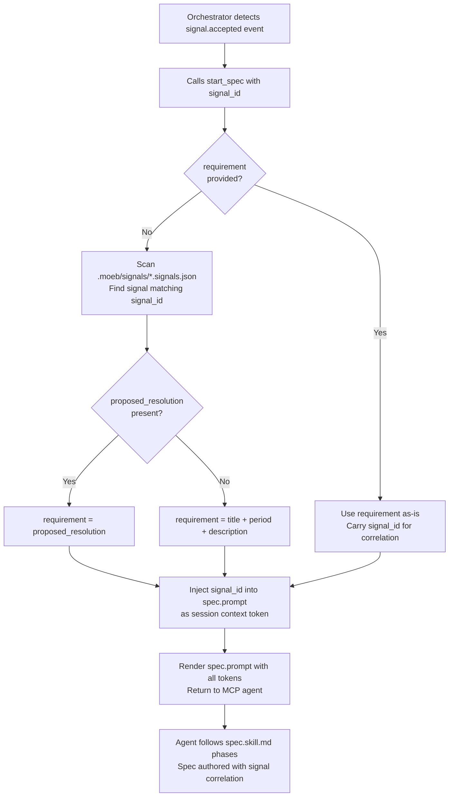

# start_spec: Signal-ID Input and Correlation Token

## Raw Requirement

When the orchestrator detects a `signal.accepted` event emitted by `fix_signal`, it
holds the `signal_id` from that event. It should be able to pass that `signal_id`
directly to `start_spec` without needing to read or parse the moeb signal schema itself.
`start_spec` should accept an optional `signal_id` parameter, look up the signal's
`proposed_resolution` internally, derive the requirement string, and run the full spec
workflow. The `signal_id` must also flow through into the prompt context as a correlation
token so the spec skill and its outputs can reference it. Additionally, `.moeb/events/`
must be excluded from git tracking since event artifacts are transient orchestration state,
not harness artefacts.

## Description

Extends `start_spec` with an optional `signal_id` string parameter. When `signal_id` is
supplied without a `requirement`, the tool scans all `*.signals.json` files under
`.moeb/signals/`, locates the signal object whose `signal_id` field matches, and derives
the requirement from `proposed_resolution` (falling back to `title + ". " + description`
when `proposed_resolution` is absent or empty). When both `signal_id` and `requirement`
are supplied, `requirement` is used as-is and `signal_id` is carried as a correlation
token only. When neither is supplied, the tool returns an error unchanged from the current
behaviour. A `{{signal_id}}` token is added to `spec.prompt`'s session context block
(empty string when absent) so the spec skill can embed the signal reference in spec
frontmatter descriptions or commit messages. A `.moeb/events/` entry is appended to the
repository's `.gitignore` so that event artifacts written by `fix_signal` are never
committed.



## Backlinks

### Parents

| Label | Path | Purpose |
|-------|------|---------|
| Harness README | README.md | Root index and policy source |
| MCP Serve / CLI Parity | specifications/moeb/moeb.serve-cli-parity.md | Introduced `start_spec` with `requirement` as sole required parameter; this spec extends that definition |
| Fix Signal: Event Emission Replaces spec/run Orchestration | specifications/moeb/moeb.fix-signal-event-emission.md | Established `.moeb/events/` as the event output directory and `signal_id` as the correlation identifier in `signal.accepted` events |
| Signal Fix Command | specifications/moeb/moeb.signal-fix-command.md | Defined signal schema including `signal_id`, `proposed_resolution`, `title`, and `description` fields consumed by the signal lookup in this spec |

## Steps

### Step 1 — Extend `start_spec.rs` with optional `signal_id` parameter

In `src/moeb/src/tools/start_spec.rs`:

1. In `definition()`, add `signal_id` as an optional string parameter alongside
   `requirement`. The updated schema has two properties: `requirement` (optional string,
   "The specification requirement text") and `signal_id` (optional string, "Signal
   identifier to look up from `.moeb/signals/`; used as requirement source when
   `requirement` is absent"). The `required` array must remain empty — neither parameter
   is individually required; the tool validates the combination in `execute()`.

2. In `execute()`, extract both `requirement` (defaulting to empty string) and `signal_id`
   (defaulting to empty string) from the input arguments.

3. Add a `resolve_requirement` helper function (private, within the same file) with
   signature:
   ```rust
   fn resolve_requirement(
       working_dir: &std::path::Path,
       requirement: &str,
       signal_id: &str,
   ) -> Result<String, String>
   ```
   Logic:
   - If `requirement` is non-empty, return `Ok(requirement.to_string())` immediately.
   - If `requirement` is empty and `signal_id` is empty, return
     `Err("Either 'requirement' or 'signal_id' must be provided".to_string())`.
   - If `requirement` is empty and `signal_id` is non-empty:
     a. Read the directory listing of `working_dir.join(".moeb/signals/")`.
        On read failure (directory absent), return
        `Err(format!("Signals directory not found: {}", e))`.
     b. For each entry ending in `.signals.json`, read the file content and parse as a
        JSON array of signal objects. Skip files that cannot be read or parsed.
     c. Search every parsed signal object for a `signal_id` field whose string value
        equals the supplied `signal_id`. Stop at the first match.
     d. On match: if `proposed_resolution` is a non-null non-empty string, return
        `Ok(proposed_resolution.clone())`. Otherwise, concatenate `title + ". " + description`
        and return `Ok(concatenated)`.
     e. If no matching signal is found after scanning all files, return
        `Err(format!("No signal found with signal_id '{}'", signal_id))`.

4. Call `resolve_requirement(working_dir, &requirement, &signal_id)` from `execute()`.
   On `Err`, return the error string as the tool result. On `Ok`, bind the resolved
   string to `resolved_requirement` and use it wherever `requirement` / `{{input}}`
   was previously used.

5. Pass `signal_id` (the raw input, empty string if absent) to the prompt rendering step
   as `{{signal_id}}`.

### Step 2 — Add `{{signal_id}}` token to `src/prompts/spec.prompt`

Locate the session context block in `spec.prompt`:

```
Session context:
- run_id: {{run_id}}
- run_file_path: {{run_file_path}}
```

Append a `signal_id` line to this block:

```
Session context:
- run_id: {{run_id}}
- run_file_path: {{run_file_path}}
- signal_id: {{signal_id}}
```

The token is substituted at render time; when no `signal_id` was supplied to `start_spec`,
the Rust code substitutes an empty string, producing `- signal_id: ` (a present but blank
line). This is intentional: it makes the token visible for skill authors without requiring
conditional template logic.

### Step 3 — Wire `{{signal_id}}` substitution in `start_spec.rs`

In `StartSpecTool::execute()`, add `signal_id` (the raw input string, empty string when
absent) to the template substitution call alongside the existing tokens
(`{{role_content}}`, `{{readme_content}}`, `{{spec_schema_content}}`,
`{{rubrics_content}}`, `{{skill_content}}`, `{{command_rubrics}}`, `{{input}}`).
The substitution must replace every occurrence of `{{signal_id}}` in the rendered
template with the `signal_id` value.

### Step 4 — Add tests to `start_spec_tests.rs`

Add the following tests to `src/moeb/src/tools/start_spec_tests.rs`:

1. `test_start_spec_signal_id_optional`: calls `definition()` and asserts that neither
   `"requirement"` nor `"signal_id"` appears in the `required` array (both are optional).

2. `test_resolve_requirement_uses_requirement_when_present`: calls `resolve_requirement`
   with a non-empty `requirement` and a non-empty `signal_id`; asserts the returned value
   equals `requirement` (signal lookup is not triggered).

3. `test_resolve_requirement_errors_on_both_empty`: calls `resolve_requirement` with empty
   strings for both `requirement` and `signal_id` against a tempdir; asserts `Err` is
   returned.

4. `test_resolve_requirement_finds_signal_by_id`: creates a tempdir with
   `.moeb/signals/test.signals.json` containing one signal object with a known
   `signal_id` and `proposed_resolution`; calls `resolve_requirement` with empty
   `requirement` and that `signal_id`; asserts the returned value equals
   `proposed_resolution`.

5. `test_resolve_requirement_falls_back_to_title_description`: creates a tempdir with a
   signal whose `proposed_resolution` is an empty string; calls `resolve_requirement`;
   asserts the returned value is `title + ". " + description`.

### Step 5 — Append `.moeb/events/` to `.gitignore`

Read the repository root `.gitignore`. Append the following block at the end of the file:

```
# Moeb event artifacts — transient orchestration state, not harness artefacts
.moeb/events/
```

### Step 6 — Build and test

Run `cargo build` from `src/moeb/` to confirm the binary compiles without errors or
warnings. Run `cargo test` to confirm no regressions in the existing test suite. Verify
that `start_spec_tests.rs` reports all five new tests as passing.

## Decisions

### Decision 1 — Signal lookup is performed in Rust, not delegated to the skill

**Rationale:** The orchestrator holds a `signal_id` correlation token and must not need
to understand the moeb signal JSON schema to pass it to `start_spec`. If the lookup were
delegated to the skill (by injecting an empty `{{input}}` and a populated `{{signal_id}}`
and letting the skill scan signals), the skill would need conditional logic — "if
`signal_id` is non-empty and input is empty, scan signals first". That conditional
couples the spec skill to the signals subsystem and violates the principle that skills
describe workflow phases, not data retrieval branching. Performing the lookup in Rust
keeps the skill unconditionally receiving a resolved `requirement` string, preserving
its existing structure.

**Rejected alternatives:** Delegating the lookup to the skill was considered and rejected
for the reason above. Adding a dedicated `get_signal` Rust tool that the skill calls
first was also considered, but it would require the spec skill to be aware of when to
call it — the same coupling problem.

**Consequences:** Signal schema awareness (field names `proposed_resolution`, `title`,
`description`, `signal_id`) is encoded in `start_spec.rs`. Any future schema change to
those field names requires a corresponding update to `resolve_requirement`.

### Decision 2 — `requirement` and `signal_id` are both optional in the JSON schema, with mutual-exclusion enforced in execute()

**Rationale:** JSON Schema does not natively express "exactly one of these must be
present" as a required constraint. Making both optional with validation in `execute()`
is the established moeb pattern (other tools use conditional validation in execute rather
than schema-level oneOf). This is consistent and keeps the definition() output simple.

**Rejected alternatives:** Using `oneOf` or `anyOf` in the schema was considered. Rejected
because the MCP client's parameter display interprets `required` arrays, not `oneOf`
constraints; providing no required fields ensures neither parameter is shown as mandatory
in client UIs, which matches the intent.

**Consequences:** A caller that supplies neither `requirement` nor `signal_id` receives a
tool-level error string rather than a schema validation error. The error message is
explicit ("Either 'requirement' or 'signal_id' must be provided") and actionable.

### Decision 3 — `{{signal_id}}` is always substituted, defaulting to empty string

**Rationale:** Conditional template substitution (substituting only when `signal_id` is
non-empty) would require the Rust rendering code to detect and remove partial token lines.
Always substituting — with empty string as the default — is simpler and keeps the session
context block structure stable. Skill authors and operators reading the rendered prompt
see the token line in all cases, making the contract visible even when no signal is
associated with a run.

**Rejected alternatives:** Omitting the `{{signal_id}}` line entirely from the prompt
when not supplied was considered. Rejected because it introduces conditional template
logic and makes the correlation channel invisible to spec authors who might want to use
it.

**Consequences:** Every rendered `spec.prompt` will contain `- signal_id: ` with a
potentially blank value. This is benign; the skill ignores it when the value is empty.

### Decision 4 — `.moeb/events/` is gitignored at the repository root

**Rationale:** Event artifacts are transient orchestration state written by `fix_signal`
and consumed by the conductor. They are not harness artefacts (they carry no design
decisions, no rubric criteria, no specification content) and must not appear in git
history. Gitignoring the directory at the repository root is the correct mechanism; no
application-level filtering is needed.

**Rejected alternatives:** Committing events and deleting them after the conductor
processes them was considered. Rejected because it pollutes git history with operational
noise and creates a merge-conflict surface when multiple agents emit events concurrently.
Storing events outside `.moeb/` (e.g. a system temp directory) was considered. Rejected
because `.moeb/` is the established harness output root and an external location would
require the conductor to be configured with a separate path.

**Consequences:** `.moeb/events/` and its contents will never appear in `git status` or
diffs. A fresh clone will not contain the directory; it is created on first event emission
by `write_file`'s existing behaviour of creating missing parent directories.

## Rubric

### Structured

| Name | Description | Threshold | Pass Condition |
|------|-------------|-----------|----------------|
| `tool-errors` | No ToolHandler errors during this invocation. | Zero tool errors | Kernel-authoritative |
| `rubric-qualification` | No Pass verdicts with acknowledged failures. | Zero qualified Pass verdicts | Kernel-authoritative |
| `no-drift` | No contradiction of any decision in linked parent specifications. | Zero contradictions | Manual review of decisions in all Backlinks parents |
| `spec-schema-compliance` | All required frontmatter fields and body sections present and correctly ordered. | 100% of required fields and sections | Schema validation passes |
| `ai-first-org` | Steps prescribe file layouts satisfying the four AI-first organisation principles. | All four principles followed | `resolve_requirement` is private to `start_spec.rs`; no cross-cutting helper introduced |
| `kernel-thin-and-parity` | No workflow logic in Rust; every CLI tool also in MCP list. | Zero violations | `start_spec.rs` contains only data-fetch and prompt-render logic; no workflow branching; `start_spec` remains MCP-only per `moeb.serve-cli-parity` Decision 1 |
| `moeb-tool-origin` | All tool calls use moeb-registered tools only. | Zero external tool calls | Agent review of conversation tool calls |
| `signal-id-lookup-correctness` | When `signal_id` is supplied without `requirement`, the resolved requirement matches the `proposed_resolution` of the matching signal (or `title + ". " + description` when `proposed_resolution` is absent). | 100% correct resolution in test cases | All five `start_spec_tests.rs` tests pass; `cargo test` exits 0 |
| `gitignore-events` | `.moeb/events/` appears in the repository root `.gitignore` after this run. | Entry present | `grep -q '.moeb/events/' .gitignore` exits 0 |

### Qualitative

- `resolve_requirement` must be a private function within `start_spec.rs`; it must not be
  extracted to a shared helper used by other tools.
- The spec skill workflow and `spec.prompt` structure must be unchanged except for the
  addition of the `{{signal_id}}` session context line.
- When `signal_id` is empty (i.e. `start_spec` was called with `requirement` only), the
  rendered prompt must contain `- signal_id: ` with an empty value — not a missing line
  and not an error.
- The signal scan in `resolve_requirement` must tolerate unreadable or malformed
  `.signals.json` files by skipping them rather than returning an error.
