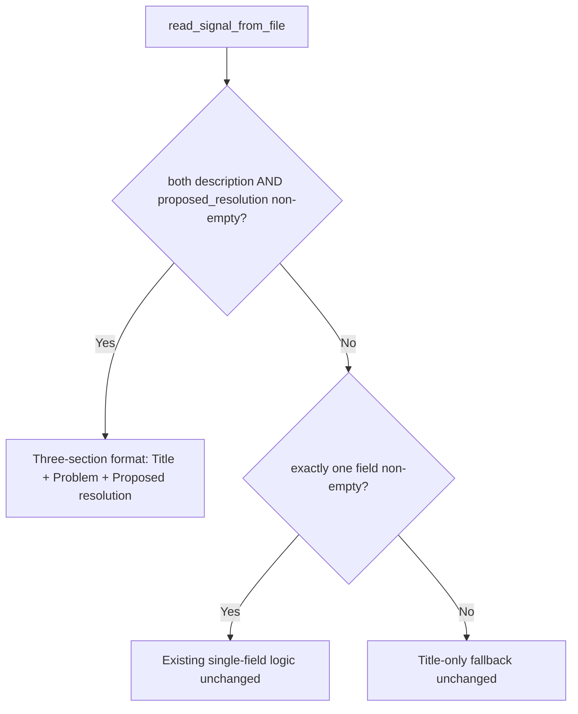

# start_spec: Compose Three-Field Requirement String from Signal

## Raw Requirement

Modify read_signal_from_file in src/moeb/src/tools/start_spec.rs to compose all three fields when both description and proposed_resolution are present:

  Title: <title>

  Problem: <description>

  Proposed resolution: <proposed_resolution>

When only one of description or proposed_resolution is non-empty, fall through to the existing single-field logic. When both are empty, fall back to the title-only format. Update start_spec_tests.rs to assert that a signal with all three fields populated produces all three sections in the resolved requirement string.

## Description

`read_signal_from_file` in `src/moeb/src/tools/start_spec.rs` constructs the requirement string injected into the spec prompt from a signal catalogue entry. The current implementation produces a single-field string — using `proposed_resolution` when present or falling back to the signal title. This specification adds a three-section composition branch: when both `description` and `proposed_resolution` are non-empty, the function returns a structured three-part string labelled `Title:`, `Problem:`, and `Proposed resolution:`, separated by double newlines. The single-field and title-only fallback branches are otherwise unchanged. A test is added to `start_spec_tests.rs` verifying the three-section output for a fully-populated signal.



## Backlinks

### Parents

| Label | Path | Purpose |
|-------|------|---------|
| Harness README | .moeb/README.md | Root index and policy document |
| start_spec: Signal-ID Input and Correlation Token | specifications/moeb/moeb.start-spec-from-signal.md | Introduced read_signal_from_file and the requirement-from-signal pattern |
| Signal Catalogue: UUID-Based Filenames and Eliminated Run-Level Signals File | specifications/moeb/moeb.signal-catalogue-id-based-naming.md | Defines the canonical signal record schema including description and proposed_resolution fields |

## Steps

1. **Read `src/moeb/src/tools/start_spec.rs`** using `read_file`. Identify the `read_signal_from_file` function and its current branching logic for composing the requirement string from signal fields.

2. **Modify `read_signal_from_file`** to add a three-field composition branch as the highest-priority check, evaluated before the existing single-field branches:

   - **Branch A — both fields non-empty:** when both `signal.description` and `signal.proposed_resolution` are non-empty strings, return the three-section format with two blank lines between each section:
     ```
     Title: <title>

     Problem: <description>

     Proposed resolution: <proposed_resolution>
     ```
   - **Branch B — exactly one field non-empty:** fall through to the existing single-field logic unchanged.
   - **Branch C — both fields empty:** return the title-only string unchanged.

   Use `patch_file` for targeted modification of the existing function body. If `patch_file` fails, fall back to `write_file` with the complete updated file content.

3. **Read `src/moeb/src/tools/start_spec_tests.rs`** using `read_file`. Identify the existing test structure and any helper functions used to construct signal fixtures.

4. **Add a test** to `start_spec_tests.rs` that constructs a signal record with all three fields populated (non-empty `title`, `description`, and `proposed_resolution`) and asserts that the resolved requirement string contains all three section labels in the correct order: `"Title: "` appears before `"Problem: "` which appears before `"Proposed resolution: "`. Use `patch_file` or `write_file` as appropriate.

5. **Run `cargo test -p moeb`** via `run_command` to verify the new test passes and no existing tests regress. If any test fails, diagnose and fix before proceeding.

## Decisions

### Decision 1 — Use "Problem:" as the label for the description field

**Rationale:** The signal requirement explicitly specifies `Problem:` as the label for the description section. In the context of a fix specification, "Problem:" frames the content as a statement of what is broken, which is more actionable for the implementing agent than a generic "Description:" label.

**Rejected alternatives:** `Description:` — rejected because the requirement prescribes `Problem:`.

**Consequences:** All three-section requirement strings produced from signals with both fields non-empty will use `Problem:` for the description section.

### Decision 2 — Three-field branch is highest-priority; single-field branches fall through unchanged

**Rationale:** Inserting the three-field branch before the existing single-field logic is the least-invasive approach — signals with only one field continue to use the existing path without modification. This preserves backwards compatibility for all partially-populated signals already in the catalogue.

**Rejected alternatives:** Rewriting the entire branching tree from scratch — rejected because it risks changing the output format for existing single-field signals and increases the diff size unnecessarily.

**Consequences:** Signals with only `proposed_resolution` still produce the same requirement string as before this change.

### Decision 3 — Title-only fallback is retained for the both-empty case

**Rationale:** The spec prompt requires a non-empty requirement string. The signal title is always populated (it is a required field in the catalogue schema). Using it as the last fallback guarantees the function always returns a non-empty string regardless of how sparsely the signal was populated.

**Rejected alternatives:** Returning an empty string or propagating an error — rejected because the prompt rendering layer expects a non-empty requirement.

**Consequences:** Minimal signal records (title only) continue to work exactly as before this change.

## Rubric

### Structured

| Name | Description | Threshold | Pass Condition |
|------|-------------|-----------|----------------|
| `tool-errors` | No ToolHandler errors were recorded during this command invocation. Covers all tool calls on both CLI and MCP paths via `RealToolExecutor::execute`. Applies to every moeb command. | Zero tool errors | Kernel-authoritative: injected by `verify_rubrics` from `RunState.tool_errors`. Do not supply a verdict — any agent-supplied entry is overridden. |
| `rubric-qualification` | No Pass verdicts with acknowledged failures were issued during this command invocation. An agent that observes a failure but passes a criterion must populate `acknowledged_failures` in the verdict object. Applies to every moeb command. | Zero qualified Pass verdicts | Kernel-authoritative: injected by `verify_rubrics` by scanning `acknowledged_failures` on incoming Pass verdicts. Do not supply a verdict — any agent-supplied entry is overridden. |
| `skill-mandatory-phases` | The skill loaded for this run contains all mandatory phase headings. The agent checks its own prompt context (the loaded skill content is already present) for the exact strings: "Verify", "End-of-Skill Review", "Metrics Recording", "Commit", "Tag", "Complete". No file read is required. | All six mandatory headings present | Agent scans skill content in its loaded context; fails if any mandatory heading string is absent |
| `all-skill-files-parity` | Whenever a spec adds, removes, or modifies a workflow phase in any one of the three canonical skill files (run.skill.md, spec.skill.md, fix_signal.skill.md), the spec must contain an explicit Step for each of the other two files — either applying the equivalent change or documenting with rationale why that file is intentionally excluded. | Zero unaddressed canonical skill files when any canonical skill file phase is modified | Run agent reviews the steps of the spec under implementation. If no canonical skill file phase is added, removed, or modified, mark `na`. If one or more canonical skill file phases are modified, verify that the spec contains a step for each of the other two canonical skill files (addressing the equivalent change or stating an exclusion rationale). Fail if any of the other two files has neither a qualifying step nor a documented exclusion rationale. |
| `no-drift` | The specification does not violate any decision recorded in a linked parent specification | Zero contradictions | Manual review of every decision in every parent spec listed in Backlinks |
| `spec-schema-compliance` | All required frontmatter fields and body sections are present and correctly ordered | 100% of required fields and sections | Validation in `domain/spec.rs` exits 0 during `moeb spec` |
| `ai-first-org` | The specification's Steps prescribe file layouts, naming, and helper placement that satisfy the four AI-first organisation principles: one concern per file, context locality, grep-discoverable names, no cross-cutting helpers. | All four principles followed | Manual review: no step produces a file that mixes concerns, no name is generic across the codebase, all helpers are co-located with their callers or promoted to a precisely named module |
| `branch-clean-at-exit` | After Phase 9 (Commit), the working tree contains no uncommitted changes; any dirty state detected in Phase 9a has been resolved by retry commit (Case A) or by signal emission and cleanup commit (Case B) | Zero uncommitted changes at spec skill exit | Agent verifies that `git_status` returned empty output after Phase 9, or that a retry (Case A) or cleanup commit (Case B) was issued and the branch is clean |
| `kernel-thin-and-parity` | No domain-specific or workflow-specific coordination logic may be placed in kernel Rust code when it can live in skill markdown or role files. Every tool registered in the CLI tool registry must also be registered in the MCP stdio server tool list. | Zero violations | Spec review: no proposed step places review/coordination logic in Rust; Run review: grep confirms no skill-specific logic in kernel tools; tool lists in tools/mod.rs and the MCP server match exactly |
| `thin-kernel` | New Rust code in tools/, commands/, or domain/ must be either (a) a primitive operation wrapper (filesystem, git, or HTTP with no domain logic) or (b) a thin dispatcher that calls into skills, tools, or agents and returns the result unchanged. Workflow logic — sequencing, conditionals, review loops, retry strategy, branching decisions — must live in skill markdown or role files, not in compiled Rust. If the same capability can be achieved by updating a skill file, that path is mandatory. | Zero workflow-logic functions in new Rust | Spec review: no Step proposes placing sequencing or conditional workflow logic in Rust when a skill-file change would suffice; Run review: every new function in tools/ or commands/ either wraps a single OS/VCS/HTTP call or contains no domain-specific branching |
| `mcp-cli-behavioural-parity` | For any operation exposed through both the CLI agent loop and the MCP server, the observable outcome must be identical: same file mutations, same tool result string format, same rendered prompt template. No MCP-only or CLI-only code paths may alter the final output. Any tool registered in the standard registry must be registered in the MCP registry with an identical input schema and result contract. | Zero divergent outcomes | Run review: for every tool added or modified, both ToolRegistry::standard() and the MCP server carry identical registrations; start_run and domain/run.rs render from the same run.prompt template with the same rubric layers; start_spec and domain/spec.rs render from the same spec.prompt template |

### Qualitative

- The three-section format must use exactly two newlines (`\n\n`) between sections, matching the indented layout in the raw requirement.
- The new composition branch must not alter any existing fallback paths for signals where `description` or `proposed_resolution` is empty or absent.
- The added test must exercise only the new three-field code path; existing tests for the single-field and title-only paths must remain untouched.
