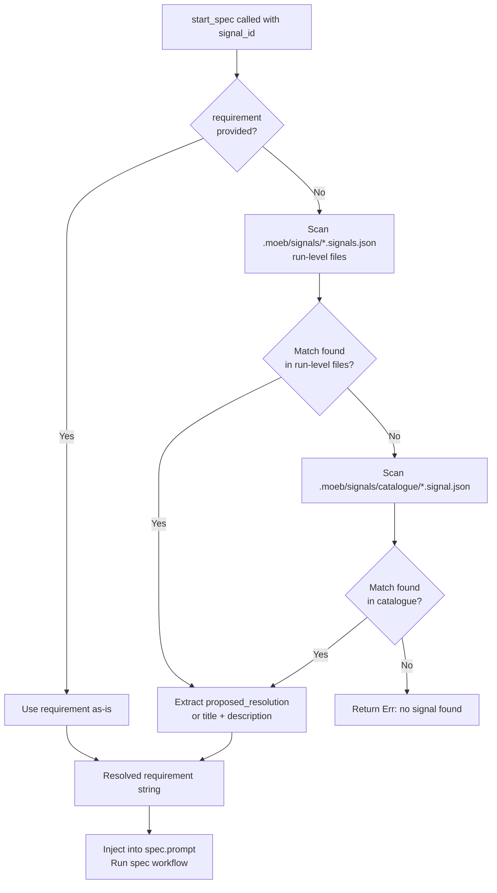

# start_spec: Signal-ID Lookup Falls Back to Signal Catalogue

## Raw Requirement

Update start_spec signal resolution to search .moeb/signals/catalogue/ (and .moeb/signals/index.md) when the signal_id is not found in any run-level .signals.json file. The catalogue is the authoritative signal store per moeb.signal-deduplication-and-lifecycle.

## Description

The `start_spec` tool's `resolve_requirement` function currently scans only run-level `.moeb/signals/<run_id>.signals.json` files when resolving a `signal_id`. Since `moeb.signal-deduplication-and-lifecycle` established `.moeb/signals/catalogue/` as the authoritative canonical signal store — with each signal deduplicated to a single `.signal.json` file keyed by identity — signals may exist exclusively in the catalogue (e.g. after run-file retention pruning, or when the signal was produced by a run whose signals file no longer exists). This spec extends `resolve_requirement` in `start_spec.rs` to add a second-pass scan over `.moeb/signals/catalogue/*.signal.json` when the primary run-level scan returns no match. Catalogue files are individual JSON objects (not arrays); the lookup reads each object and compares its `signal_id` field. On match, `proposed_resolution` is returned as the requirement (falling back to `title + ". " + description` when absent or empty), identical to the run-level resolution path. No changes are made to the prompt template, the `{{signal_id}}` correlation token, or the skill workflow.



## Backlinks

### Parents

| Label | Path | Purpose |
|-------|------|---------|
| Harness README | README.md | Root index and policy source |
| start_spec: Signal-ID Input and Correlation Token | specifications/moeb/moeb.start-spec-from-signal.md | Introduced `resolve_requirement` in `start_spec.rs`; this spec extends that function with catalogue fallback logic |
| Signal Deduplication, Occurrence Tracking, and Lifecycle Reopening | specifications/moeb/moeb.signal-deduplication-and-lifecycle.md | Established `.moeb/signals/catalogue/` as the authoritative canonical signal store and defined the per-file JSON object format consumed by the catalogue scan |

## Steps

### Step 1 — Extend `resolve_requirement` in `start_spec.rs` with catalogue fallback

In `src/moeb/src/tools/start_spec.rs`, locate the `resolve_requirement` private function. Find the final `Err(format!("No signal found with signal_id '{}'", signal_id))` line that terminates the function when no run-level file contains a matching signal. Replace that single line with the following catalogue fallback block followed by the same `Err` at the end:

```rust
// Fallback: scan .moeb/signals/catalogue/*.signal.json (authoritative store)
let catalogue_dir = working_dir.join(".moeb/signals/catalogue");
if let Ok(entries) = std::fs::read_dir(&catalogue_dir) {
    for entry in entries.flatten() {
        let path = entry.path();
        if path.extension().and_then(|e| e.to_str()) != Some("json") {
            continue;
        }
        let Ok(content) = std::fs::read_to_string(&path) else {
            continue;
        };
        let Ok(record) = serde_json::from_str::<serde_json::Value>(&content) else {
            continue;
        };
        if record.get("signal_id").and_then(|v| v.as_str()) == Some(signal_id) {
            let resolution = record
                .get("proposed_resolution")
                .and_then(|v| v.as_str())
                .unwrap_or("");
            if !resolution.is_empty() {
                return Ok(resolution.to_string());
            }
            let title = record.get("title").and_then(|v| v.as_str()).unwrap_or("");
            let desc = record.get("description").and_then(|v| v.as_str()).unwrap_or("");
            return Ok(format!("{}. {}", title, desc));
        }
    }
}
Err(format!("No signal found with signal_id '{}'", signal_id))
```

All existing run-level scan logic above this block must remain byte-for-byte unchanged. Only the final `Err(...)` line is replaced.

### Step 2 — Add catalogue-fallback tests to `start_spec_tests.rs`

Add the following two tests to `src/moeb/src/tools/start_spec_tests.rs`:

1. `test_resolve_requirement_finds_signal_in_catalogue`: creates a tempdir with:
   - No `.moeb/signals/*.signals.json` files (so the run-level scan produces no match)
   - `.moeb/signals/catalogue/error-test.signal.json` containing a single JSON object with a known `signal_id` UUID and a non-empty `proposed_resolution` string
   Calls `resolve_requirement` with empty `requirement` and that `signal_id`. Asserts the returned `Ok` value equals the `proposed_resolution`.

2. `test_resolve_requirement_catalogue_title_description_fallback`: creates a tempdir with a catalogue file whose `proposed_resolution` field is an empty string, and whose `title` is `"Missing tool"` and `description` is `"No moeb equivalent exists"`. Calls `resolve_requirement` with empty `requirement` and that `signal_id`. Asserts the returned `Ok` value equals `"Missing tool. No moeb equivalent exists"`.

### Step 3 — Build and test

From `src/moeb/`:

1. Run `cargo build` — confirm the binary compiles without errors or warnings.
2. Run `cargo test` — confirm all tests pass, including the two new catalogue-fallback tests added in Step 2. The five tests from `moeb.start-spec-from-signal` must also continue to pass.

## Decisions

### Decision 1 — Catalogue searched as fallback, not primary

**Rationale:** Run-level `.signals.json` files remain the first scan target so that signals recorded before `moeb.signal-deduplication-and-lifecycle` was implemented continue to resolve correctly. The catalogue fallback fires only when the run-level scan is exhausted, making this change backward-compatible for all existing signals regardless of how they were written.

**Rejected alternative:** Scanning the catalogue first was considered. Rejected because it would bypass run-level files that may contain a `signal_id` with a different `proposed_resolution` (e.g. an older wording), silently changing resolution behaviour for pre-catalogue signals. Preserving run-level precedence ensures no existing signal resolves differently after this change.

**Consequences:** If a `signal_id` appears in both a run-level file and the catalogue, the run-level record takes precedence. This is expected to be rare: the dedup procedure writes canonical `signal_id` values from the catalogue back into run-level files, so both sources reference the same identity. The ordering is a safety boundary, not a branch that fires in normal operation.

### Decision 2 — Catalogue files parsed as individual JSON objects, not arrays

**Rationale:** Per `moeb.signal-deduplication-and-lifecycle` Decision 2, each canonical signal is a standalone JSON object at `.moeb/signals/catalogue/<identity-key>.signal.json`. Run-level files are JSON arrays of signal objects. The two parse paths are structurally different and must be handled explicitly; attempting to unify them by wrapping catalogue files in an array would require rewriting all catalogue files and contradict the established format.

**Rejected alternative:** A shared helper that normalises both formats to `Vec<serde_json::Value>` was considered. Rejected because it adds indirection without reducing code size (the normalisation logic is one line per format) and would obscure the structural distinction that an implementing agent must understand to debug future parse failures.

**Consequences:** `resolve_requirement` contains two distinct parse paths: array-based for run-level files and object-based for catalogue files. The internal branching is localised entirely within the function, with no impact on the external signature or callers.

### Decision 3 — No change to prompt template or skill workflow

**Rationale:** The `{{signal_id}}` token and the resolved-requirement substitution are fully encapsulated in `resolve_requirement` and its caller in `execute()`. The caller passes the resolved requirement string downstream identically regardless of which file it was found in. No new prompt token, no new session context line, and no skill instruction update is needed.

**Rejected alternative:** Adding a `{{signal_source}}` token (`run-level` vs `catalogue`) to the rendered prompt was considered. Rejected because no existing skill instruction consumes source provenance, and adding an unused template variable increases template surface without benefit.

**Consequences:** The spec agent prompt is identical whether the requirement was resolved from a run-level file or the catalogue. Signal source provenance is not surfaced in rendered prompts; it is observable only in `start_spec.rs` logs if the tool adds trace output in a future spec.

## Rubric

### Structured

| Name | Description | Threshold | Pass Condition |
|------|-------------|-----------|----------------|
| `tool-errors` | No ToolHandler errors were recorded during this command invocation. Covers all tool calls on both CLI and MCP paths via `RealToolExecutor::execute`. Applies to every moeb command. | Zero tool errors | Kernel-authoritative: injected by `verify_rubrics` from `RunState.tool_errors`. Do not supply a verdict — any agent-supplied entry is overridden. |
| `rubric-qualification` | No Pass verdicts with acknowledged failures were issued during this command invocation. An agent that observes a failure but passes a criterion must populate `acknowledged_failures` in the verdict object. Applies to every moeb command. | Zero qualified Pass verdicts | Kernel-authoritative: injected by `verify_rubrics` by scanning `acknowledged_failures` on incoming Pass verdicts. Do not supply a verdict — any agent-supplied entry is overridden. |
| `skill-mandatory-phases` | The skill loaded for this run contains all mandatory phase headings. The agent checks its own prompt context (the loaded skill content is already present) for the exact strings: "Verify", "End-of-Skill Review", "Metrics Recording", "Commit", "Tag", "Complete". No file read is required. | All six mandatory headings present | Agent scans skill content in its loaded context; fails if any mandatory heading string is absent |
| `no-drift` | The specification does not violate any decision recorded in a linked parent specification. | Zero contradictions | Manual review of every decision in every parent spec listed in Backlinks |
| `spec-schema-compliance` | All required frontmatter fields and body sections are present and correctly ordered. | 100% of required fields and sections | Validation in `domain/spec.rs` exits 0 during `moeb spec` |
| `ai-first-org` | The specification's Steps prescribe file layouts, naming, and helper placement that satisfy the four AI-first organisation principles: one concern per file, context locality, grep-discoverable names, no cross-cutting helpers. | All four principles followed | Catalogue fallback block stays in `start_spec.rs` co-located with existing run-level scan; tests are in `start_spec_tests.rs`; no new file or cross-cutting helper introduced |
| `kernel-thin-and-parity` | No domain-specific or workflow-specific coordination logic may be placed in kernel Rust code when it can live in skill markdown or role files. Every tool registered in the CLI tool registry must also be registered in the MCP stdio server tool list. | Zero violations | Spec review: no proposed step places sequencing or conditional workflow logic in Rust when a skill-file change would suffice; `start_spec` is MCP-only so no CLI registry change is needed |
| `moeb-tool-origin` | All tool calls made during this invocation must originate from moeb's own tool registry. | Zero external tool calls | Agent reviews the conversation for calls to non-moeb tools; supplies Pass if none were made |
| `thin-kernel` | New Rust code in tools/, commands/, or domain/ must be a primitive operation wrapper or thin dispatcher; no workflow logic in compiled Rust. | Zero workflow-logic functions in new Rust | Run review: the catalogue fallback block performs `read_dir` + `from_str` + field comparison — filesystem primitives with no domain-specific sequencing, retry, or phase logic |
| `catalogue-fallback-correctness` | When `signal_id` is not found in any run-level `.signals.json` file, `resolve_requirement` correctly searches `.moeb/signals/catalogue/*.signal.json` and returns `proposed_resolution` (or `title + ". " + description` when `proposed_resolution` is absent or empty). | 100% correct for all test cases | `test_resolve_requirement_finds_signal_in_catalogue` and `test_resolve_requirement_catalogue_title_description_fallback` pass; `cargo test` exits 0 |

### Qualitative

- The catalogue fallback block must be inserted into `resolve_requirement` without restructuring the function; only the final `Err(...)` line is replaced. All run-level scan logic above it must remain byte-for-byte identical.
- The catalogue scan must skip unreadable or malformed `.signal.json` files (via `continue`) consistent with the existing run-level scan tolerance for bad files.
- No new public functions, no new modules, and no cross-cutting helpers may be introduced; the catalogue fallback is self-contained within `resolve_requirement`.
- The two new tests must use `tempdir`-isolated file trees and must not depend on the presence of `.moeb/signals/` in the real repository.
