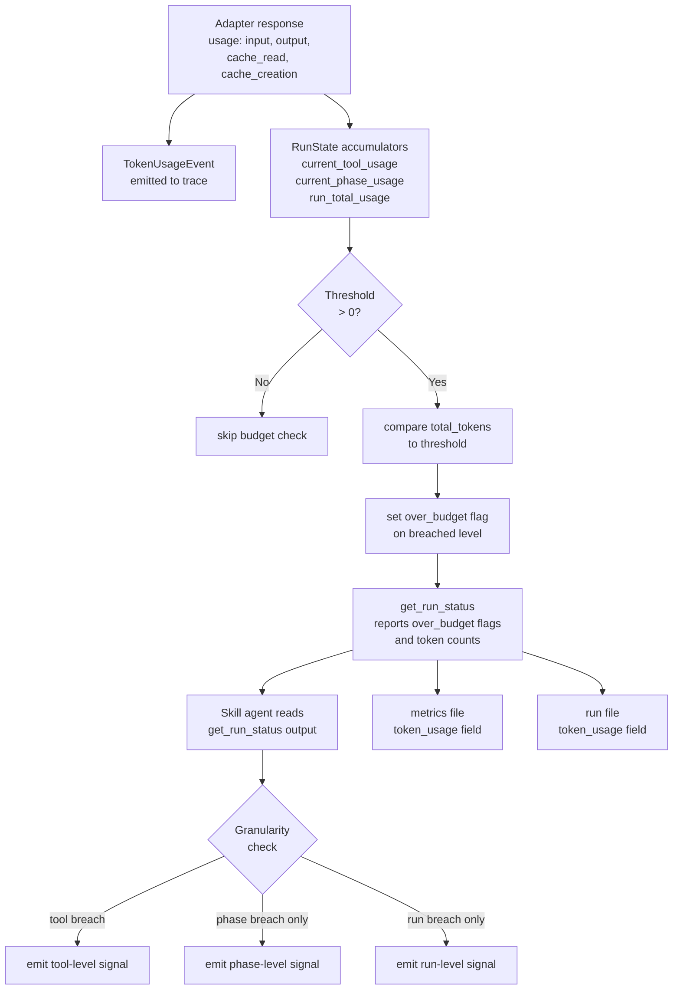

# Token Usage Instrumentation and Per-Level Budget Tracking

## Raw Requirement

Add token usage instrumentation and per-level budget tracking to the moeb harness. Token counts (input, output, cache read, cache creation) are captured from Claude API response usage fields at the Rust kernel level — zero additional model cost. Counts are accumulated per tool call, per phase, and as a run total, then written into the existing metrics and run files. Each level (tool, phase, run) has a configurable budget threshold; when a threshold is exceeded an over_budget flag is set at that level and a structured signal is emitted to the improvement queue. Signals are emitted at the lowest (most granular) level that diagnosed the over_budget condition: if a specific tool call caused the breach, emit a tool-level signal; if no single tool breached but the phase aggregate did, emit a phase-level signal; if no phase breached but the run total did, emit a run-level signal.

## Description

Each `moeb run` turn already parses the Anthropic response `usage` object for `cache_read_input_tokens` and `cache_creation_input_tokens` (via `moeb.prompt-caching`). The same object also carries `input_tokens` and `output_tokens` at zero additional API cost. This specification adds full token-count accumulation across three levels — tool call, phase, and run — using only data already present in the response.

**Data capture.** Both adapters read all four usage fields from every successful response. The counts are stored in a new `TokenUsage` struct and emitted as a `TokenUsageEvent` in the trace (alongside the existing `CacheUsageEvent`). The `TokenUsage` struct is also attached to `RunState` as three accumulators: `current_tool_usage` (cleared on each new tool call), `current_phase_usage` (cleared on each `enter_phase` call), and `run_total_usage` (accumulated for the entire run).

**Budget thresholds.** Three config keys are added to `MoebConfig`:
- `TOKEN_BUDGET_TOOL` — maximum total tokens (input + output + cache_read + cache_creation) for a single tool call turn.
- `TOKEN_BUDGET_PHASE` — maximum total tokens for a phase (sum of all tool call turns within the phase).
- `TOKEN_BUDGET_RUN` — maximum total tokens for the entire run.

All three default to `0` (disabled). When a threshold is `0`, budget checking is skipped for that level.

**Budget evaluation.** After every adapter response, the kernel updates `RunState` accumulators and compares each non-zero threshold. It sets an `over_budget` flag at the breached level. The `get_run_status` tool exposes the current accumulator values and any over_budget flags. The skill agent reads this output and, if any flag is set, emits the appropriate signal following the granularity rule: tool-level > phase-level > run-level (most granular level that fired).

**Output.** Token usage totals are added as a `token_usage` field to `RunMetrics` (metrics file) and the run file JSON. No monetary conversion is performed — raw token counts only.



## Backlinks

### Parents

| Label | Path | Purpose |
|-------|------|---------|
| README | [README.md](../../README.md) | Root index |
| Prompt Caching | [specifications/moeb/moeb.prompt-caching.md](specifications/moeb/moeb.prompt-caching.md) | Established CacheUsageEvent and usage-field parsing in both adapters; this spec extends that parsing to include input_tokens and output_tokens |
| Trace Capture, Replay, and Kernel Configuration | [specifications/moeb/moeb.trace-and-replay.md](specifications/moeb/moeb.trace-and-replay.md) | Introduced TraceEvent and TraceContext; TokenUsageEvent is added to this union |
| Phase-Level Tool Restriction and Run-Report Tool Usage Tracking | [specifications/moeb/moeb.phase-tool-restriction-and-usage-tracking.md](specifications/moeb/moeb.phase-tool-restriction-and-usage-tracking.md) | Introduced enter_phase and RunState.current_phase; phase accumulator is cleared in the enter_phase handler |
| Run File Artifact | [specifications/moeb/moeb.run-file-artifact.md](specifications/moeb/moeb.run-file-artifact.md) | Defined run file schema; this spec adds a token_usage field to it |
| Task-List Tools | [specifications/moeb/moeb.task-list-tools.md](specifications/moeb/moeb.task-list-tools.md) | Established RunMetrics and run.skill.md Metrics Recording phase; this spec adds token_usage to RunMetrics |

### External

*(none)*

## Steps

### Step 1 — Define `TokenUsage` struct in `run_state.rs`

In `src/moeb/src/run_state.rs`, add:

```rust
#[derive(Debug, Default, Clone, serde::Serialize, serde::Deserialize)]
pub struct TokenUsage {
    pub input_tokens: u64,
    pub output_tokens: u64,
    pub cache_read_tokens: u64,
    pub cache_creation_tokens: u64,
}

impl TokenUsage {
    /// Sum of all four token counts.
    pub fn total_tokens(&self) -> u64 {
        self.input_tokens
            + self.output_tokens
            + self.cache_read_tokens
            + self.cache_creation_tokens
    }

    /// Accumulate another TokenUsage into self.
    pub fn accumulate(&mut self, other: &TokenUsage) {
        self.input_tokens += other.input_tokens;
        self.output_tokens += other.output_tokens;
        self.cache_read_tokens += other.cache_read_tokens;
        self.cache_creation_tokens += other.cache_creation_tokens;
    }
}
```

Add three accumulator fields and two over_budget flag fields to `RunState`:

```rust
pub struct RunState {
    // ... existing fields ...
    /// Token counts for the current tool call turn (cleared before each adapter.send() per-turn).
    pub current_tool_usage: TokenUsage,
    /// Accumulated token counts for the current phase (cleared on enter_phase).
    pub current_phase_usage: TokenUsage,
    /// Accumulated token counts for the entire run.
    pub run_total_usage: TokenUsage,
    /// Set to Some(phase_id) when phase budget is breached; None otherwise.
    pub over_budget_phase: Option<String>,
    /// Set to true when run-total budget is breached.
    pub over_budget_run: bool,
}
```

Add methods to `RunState`:

```rust
impl RunState {
    // ... existing methods ...

    /// Called by the adapter after each successful response.
    /// Updates all three accumulators and evaluates thresholds.
    /// Returns the level at which a budget was first breached this call,
    /// or None if no breach occurred.
    pub fn record_token_usage(
        &mut self,
        usage: &TokenUsage,
        tool_budget: u64,
        phase_budget: u64,
        run_budget: u64,
    ) -> Option<BudgetBreachLevel> {
        self.current_tool_usage.accumulate(usage);
        self.current_phase_usage.accumulate(usage);
        self.run_total_usage.accumulate(usage);

        if tool_budget > 0 && self.current_tool_usage.total_tokens() > tool_budget {
            return Some(BudgetBreachLevel::Tool);
        }
        if phase_budget > 0 && self.current_phase_usage.total_tokens() > phase_budget {
            self.over_budget_phase = self.current_phase.clone();
            return Some(BudgetBreachLevel::Phase);
        }
        if run_budget > 0 && self.run_total_usage.total_tokens() > run_budget {
            self.over_budget_run = true;
            return Some(BudgetBreachLevel::Run);
        }
        None
    }

    /// Reset the per-tool accumulator. Called before each adapter.send() turn.
    pub fn reset_tool_usage(&mut self) {
        self.current_tool_usage = TokenUsage::default();
    }

    /// Reset the per-phase accumulator. Called from enter_phase.
    pub fn reset_phase_usage(&mut self) {
        self.current_phase_usage = TokenUsage::default();
        self.over_budget_phase = None;
    }
}

#[derive(Debug, Clone, PartialEq)]
pub enum BudgetBreachLevel {
    Tool,
    Phase,
    Run,
}
```

Note: `over_budget_run` is a cumulative flag (never reset within a run). `over_budget_phase` holds the phase id of the most recent breached phase. The tool-level breach is not stored as a flag on RunState — it is returned by `record_token_usage` and acted on by the caller before the flag would need to persist.

### Step 2 — Add budget config keys to `MoebConfig`

In `src/moeb/src/config.rs`, add three optional fields to `MoebConfig`:

```rust
#[serde(skip_serializing_if = "Option::is_none")]
pub token_budget_tool: Option<u64>,
#[serde(skip_serializing_if = "Option::is_none")]
pub token_budget_phase: Option<u64>,
#[serde(skip_serializing_if = "Option::is_none")]
pub token_budget_run: Option<u64>,
```

Add accessor methods to `MoebConfig`:

```rust
/// Returns the per-tool-call token budget. 0 means disabled.
pub fn effective_token_budget_tool(&self) -> u64 {
    self.token_budget_tool.unwrap_or(0)
}

/// Returns the per-phase token budget. 0 means disabled.
pub fn effective_token_budget_phase(&self) -> u64 {
    self.token_budget_phase.unwrap_or(0)
}

/// Returns the per-run token budget. 0 means disabled.
pub fn effective_token_budget_run(&self) -> u64 {
    self.token_budget_run.unwrap_or(0)
}
```

In the `moeb configure` command handler, add matching branches for the three new keys:

```rust
"TOKEN_BUDGET_TOOL" => {
    config.token_budget_tool = Some(value.parse::<u64>()
        .context("TOKEN_BUDGET_TOOL must be a non-negative integer")?);
    config.save()?;
    println!("TOKEN_BUDGET_TOOL set to {}", config.effective_token_budget_tool());
}
"TOKEN_BUDGET_PHASE" => {
    config.token_budget_phase = Some(value.parse::<u64>()
        .context("TOKEN_BUDGET_PHASE must be a non-negative integer")?);
    config.save()?;
    println!("TOKEN_BUDGET_PHASE set to {}", config.effective_token_budget_phase());
}
"TOKEN_BUDGET_RUN" => {
    config.token_budget_run = Some(value.parse::<u64>()
        .context("TOKEN_BUDGET_RUN must be a non-negative integer")?);
    config.save()?;
    println!("TOKEN_BUDGET_RUN set to {}", config.effective_token_budget_run());
}
```

Setting a key to `0` via `moeb configure TOKEN_BUDGET_TOOL 0` disables that level's budget.

### Step 3 — Add `TokenUsageEvent` to `trace.rs`

In `src/moeb/src/trace.rs`, add a new event struct:

```rust
#[derive(Debug, Clone, Serialize, Deserialize)]
pub struct TokenUsageEvent {
    pub attempt: u32,
    pub turn: u32,
    pub input_tokens: u64,
    pub output_tokens: u64,
    pub cache_read_tokens: u64,
    pub cache_creation_tokens: u64,
    /// Total tokens (sum of all four counts).
    pub total_tokens: u64,
}
```

Add to `TraceEvent`:

```rust
pub enum TraceEvent {
    // ... existing variants ...
    TokenUsage(TokenUsageEvent),   // ← new
}
```

`TokenUsageEvent` is emitted for every successful adapter response in which at least one token count is non-zero. It is distinct from `CacheUsageEvent` — the existing `CacheUsageEvent` remains unchanged and continues to be emitted under its existing conditions.

### Step 4 — Capture all token counts in `AnthropicAdapter`

In `src/moeb/src/adapters/anthropic.rs`, extend the successful-response block (where `CacheUsageEvent` is currently emitted) to also read `input_tokens` and `output_tokens` and emit a `TokenUsageEvent`:

```rust
if status.is_success() {
    let input = response_body
        .pointer("/usage/input_tokens")
        .and_then(|v| v.as_u64())
        .unwrap_or(0);
    let output = response_body
        .pointer("/usage/output_tokens")
        .and_then(|v| v.as_u64())
        .unwrap_or(0);
    let cache_read = response_body
        .pointer("/usage/cache_read_input_tokens")
        .and_then(|v| v.as_u64())
        .unwrap_or(0);
    let cache_created = response_body
        .pointer("/usage/cache_creation_input_tokens")
        .and_then(|v| v.as_u64())
        .unwrap_or(0);

    // Existing CacheUsageEvent — unchanged.
    if cache_read > 0 || cache_created > 0 {
        self.trace.push(TraceEvent::CacheUsage(CacheUsageEvent {
            attempt, turn,
            cache_read_tokens: cache_read,
            cache_created_tokens: cache_created,
        }));
    }

    // New TokenUsageEvent.
    let total = input + output + cache_read + cache_created;
    if total > 0 {
        self.trace.push(TraceEvent::TokenUsage(TokenUsageEvent {
            attempt, turn,
            input_tokens: input,
            output_tokens: output,
            cache_read_tokens: cache_read,
            cache_creation_tokens: cache_created,
            total_tokens: total,
        }));
    }

    // Budget accumulation via RunState.
    // run_state access: see Step 6 for how run_state is threaded into the adapter.
}
```

Import `TokenUsageEvent` alongside the existing `CacheUsageEvent` import.

### Step 5 — Capture all token counts in `OpenAiAdapter`

In `src/moeb/src/adapters/openai.rs`, extend the successful-response block similarly:

```rust
if status.is_success() {
    let input = response_body
        .pointer("/usage/prompt_tokens")
        .and_then(|v| v.as_u64())
        .unwrap_or(0);
    let output = response_body
        .pointer("/usage/completion_tokens")
        .and_then(|v| v.as_u64())
        .unwrap_or(0);
    let cache_read = response_body
        .pointer("/usage/prompt_tokens_details/cached_tokens")
        .and_then(|v| v.as_u64())
        .unwrap_or(0);

    // Existing CacheUsageEvent — unchanged.
    if cache_read > 0 {
        self.trace.push(TraceEvent::CacheUsage(CacheUsageEvent {
            attempt, turn,
            cache_read_tokens: cache_read,
            cache_created_tokens: 0,
        }));
    }

    // New TokenUsageEvent.
    let total = input + output + cache_read;
    if total > 0 {
        self.trace.push(TraceEvent::TokenUsage(TokenUsageEvent {
            attempt, turn,
            input_tokens: input,
            output_tokens: output,
            cache_read_tokens: cache_read,
            cache_creation_tokens: 0,
            total_tokens: total,
        }));
    }
}
```

Import `TokenUsageEvent` in `openai.rs`.

OpenAI does not report cache_creation_tokens, so `cache_creation_tokens` is always 0 in `TokenUsageEvent` for that adapter.

### Step 6 — Thread `SharedRunState` into adapters for budget accumulation

The adapters currently hold a `trace: Arc<TraceContext>` but not a `SharedRunState`. Budget accumulation requires calling `RunState::record_token_usage` after each response. Add an optional `run_state: Option<SharedRunState>` field to `AnthropicAdapter` and `OpenAiAdapter`:

```rust
pub struct AnthropicAdapter {
    // ... existing fields ...
    run_state: Option<crate::run_state::SharedRunState>,
}
```

Populate `run_state` from the builder/factory that creates adapters during a run (e.g. in `agent.rs` or wherever the adapter is instantiated in the run loop). When no run_state is provided (e.g. in unit tests), budget accumulation is skipped.

In the successful-response block, after emitting `TokenUsageEvent`, call:

```rust
if let Some(ref rs) = self.run_state {
    let cfg = MoebConfig::load().unwrap_or_default();
    let usage = crate::run_state::TokenUsage {
        input_tokens: input,
        output_tokens: output,
        cache_read_tokens: cache_read,
        cache_creation_tokens: cache_created,
    };
    let breach = rs.lock().unwrap().record_token_usage(
        &usage,
        cfg.effective_token_budget_tool(),
        cfg.effective_token_budget_phase(),
        cfg.effective_token_budget_run(),
    );
    if let Some(level) = breach {
        // Store the breach level in RunState so get_run_status can report it.
        rs.lock().unwrap().record_budget_breach(level, attempt, turn);
    }
}
```

Add a `record_budget_breach` method to `RunState` in `run_state.rs`:

```rust
#[derive(Debug, Clone, serde::Serialize, serde::Deserialize)]
pub struct BudgetBreach {
    pub level: String,          // "tool", "phase", or "run"
    pub phase_id: Option<String>,
    pub attempt: u32,
    pub turn: u32,
    pub total_tokens: u64,
    pub threshold: u64,
}

impl RunState {
    pub fn record_budget_breach(&mut self, level: BudgetBreachLevel, attempt: u32, turn: u32) {
        let (level_str, threshold) = match level {
            BudgetBreachLevel::Tool => ("tool".to_string(), 0u64),  // threshold sourced from config at call site
            BudgetBreachLevel::Phase => ("phase".to_string(), 0u64),
            BudgetBreachLevel::Run => ("run".to_string(), 0u64),
        };
        // Record in a Vec so get_run_status can report all breaches.
        self.budget_breaches.push(BudgetBreach {
            level: level_str,
            phase_id: self.current_phase.clone(),
            attempt,
            turn,
            total_tokens: 0,    // filled by caller
            threshold,
        });
    }
}
```

Revise `record_budget_breach` to accept the relevant token total and threshold directly:

```rust
pub fn record_budget_breach(
    &mut self,
    level: BudgetBreachLevel,
    phase_id: Option<String>,
    attempt: u32,
    turn: u32,
    total_tokens: u64,
    threshold: u64,
) {
    let level_str = match level {
        BudgetBreachLevel::Tool => "tool",
        BudgetBreachLevel::Phase => "phase",
        BudgetBreachLevel::Run => "run",
    };
    self.budget_breaches.push(BudgetBreach {
        level: level_str.to_string(),
        phase_id,
        attempt,
        turn,
        total_tokens,
        threshold,
    });
}
```

Add `budget_breaches: Vec<BudgetBreach>` to `RunState` and include it in `Default`.

### Step 7 — Reset per-tool accumulator in the agent loop

In `src/moeb/src/agent_inner.rs` (or wherever the per-turn adapter.send() call is made), call `run_state.lock().unwrap().reset_tool_usage()` immediately before each `adapter.send()` call. This ensures `current_tool_usage` always reflects exactly the tokens from the most recent single turn, not a cumulative total across turns.

### Step 8 — Reset per-phase accumulator in `enter_phase.rs`

In `src/moeb/src/tools/enter_phase.rs`, in the `execute` method, after recording the new current phase on `RunState`, call:

```rust
state.lock().unwrap().reset_phase_usage();
```

This clears `current_phase_usage` and `over_budget_phase` at the start of each new phase.

### Step 9 — Extend `get_run_status` to report token usage and budget breaches

In `src/moeb/src/tools/get_run_status.rs`, add two blocks to the output:

**Token usage block:**
```
token usage: input=<n> output=<n> cache_read=<n> cache_creation=<n> total=<n>
  phase: input=<n> output=<n> cache_read=<n> cache_creation=<n> total=<n>
  tool:  input=<n> output=<n> cache_read=<n> cache_creation=<n> total=<n>
```

The first line is the run total. `phase` is the current-phase accumulator. `tool` is the last tool call turn accumulator.

**Budget breaches block** (omit entirely if `budget_breaches` is empty):
```
budget breaches:
  - level=tool phase=<phase_id_or_none> turn=<n> total=<n> threshold=<n>
  - level=phase phase=<phase_id> total=<n> threshold=<n>
  - level=run total=<n> threshold=<n>
```

### Step 10 — Add `token_usage` to `RunMetrics` in `review.rs`

In `src/moeb/src/domain/review.rs`, add `token_usage` to `RunMetrics`:

```rust
#[derive(Debug, Clone, Serialize, Deserialize)]
pub struct RunMetrics {
    pub run_id: String,
    pub timestamp: String,
    pub rubric_score: f32,
    pub step_metrics: Vec<StepMetric>,
    pub end_review_error_count: u32,
    pub wall_time_ms: u64,
    #[serde(skip_serializing_if = "Option::is_none")]
    pub token_usage: Option<TokenUsageSummary>,
    #[serde(skip_serializing_if = "Option::is_none")]
    pub tools_used: Option<Vec<String>>,
}
```

Add `TokenUsageSummary` (co-located in `review.rs`):

```rust
#[derive(Debug, Clone, Serialize, Deserialize)]
pub struct TokenUsageSummary {
    pub input_tokens: u64,
    pub output_tokens: u64,
    pub cache_read_tokens: u64,
    pub cache_creation_tokens: u64,
    pub total_tokens: u64,
}
```

Note: `tools_used` is already injected by the kernel from RunState. The field is listed here for schema completeness; the existing kernel injection mechanism is unchanged.

### Step 11 — Update skill files to include `token_usage` in metrics and run file writes

In `src/moeb/internal/skills/run.skill.md`, update the RunMetrics assembly instruction in Phase 6 Part A to include:

```
   - `token_usage`: object with fields `input_tokens`, `output_tokens`, `cache_read_tokens`, `cache_creation_tokens`, `total_tokens` — read from the `token usage:` line in `get_run_status` output.
```

Update the run file JSON template in Phase 6 Part A step 3 to include:

```json
"token_usage": {
  "input_tokens": <from get_run_status>,
  "output_tokens": <from get_run_status>,
  "cache_read_tokens": <from get_run_status>,
  "cache_creation_tokens": <from get_run_status>,
  "total_tokens": <from get_run_status>
}
```

Add the same additions to `src/moeb/internal/skills/spec.skill.md` Phase 8 Part A and `src/moeb/internal/skills/fix_signal.skill.md` Phase 8.

### Step 12 — Add budget-breach signal emission instructions to skill files

In `src/moeb/internal/skills/run.skill.md`, in the Phase 5 (End-of-Skill Review / Signal Retrospective) section, add a **Budget Breach Check** step immediately after the existing QA review step:

```
### Budget Breach Check

After the QA Architect review and before writing signals, call `get_run_status` and inspect the `budget breaches:` section of the output.

For each breach listed, apply the granularity rule:
- If any breach has `level=tool`: emit one tool-level signal per unique (phase, turn) combination.
- Else if any breach has `level=phase`: emit one phase-level signal per unique phase.
- Else if any breach has `level=run`: emit one run-level signal.

Tool-level signal template:
```json
{
  "category": "SkillImprovement",
  "severity": "Major",
  "title": "Token budget exceeded at tool-call level: phase=<phase_id> turn=<n>",
  "description": "Tool call in phase <phase_id> at turn <n> used <total> tokens, exceeding the per-tool budget of <threshold>.",
  "proposed_resolution": "Review the tool call in phase <phase_id> that produced the most output. Consider splitting the operation into smaller steps or raising TOKEN_BUDGET_TOOL if the threshold is too conservative.",
  "gating_condition": null
}
```

Phase-level signal template:
```json
{
  "category": "SkillImprovement",
  "severity": "Major",
  "title": "Token budget exceeded at phase level: phase=<phase_id>",
  "description": "Phase <phase_id> consumed <total> tokens in aggregate, exceeding the per-phase budget of <threshold>.",
  "proposed_resolution": "Review whether phase <phase_id> can be decomposed, or raise TOKEN_BUDGET_PHASE if the threshold is too conservative.",
  "gating_condition": null
}
```

Run-level signal template:
```json
{
  "category": "SkillImprovement",
  "severity": "Major",
  "title": "Token budget exceeded at run level",
  "description": "The run consumed <total> tokens in total, exceeding the run budget of <threshold>.",
  "proposed_resolution": "Enable conversation compaction (COMPACTION_ENABLED), reduce the number of phases, or raise TOKEN_BUDGET_RUN if the threshold is appropriate for this workload.",
  "gating_condition": null
}
```

Apply the same Budget Breach Check step to `spec.skill.md` (before Phase 6 Verify) and `fix_signal.skill.md` (before Phase 6 Verify).
```

### Step 13 — Compile and test

Run `cargo build --release` in `src/moeb/` with zero errors.
Run `cargo test` in `src/moeb/` with zero new failures.

Write unit tests in `src/moeb/src/run_state_tests.rs` (or extend existing tests in `run_state.rs`) covering:

1. `TokenUsage::total_tokens()` sums all four fields correctly.
2. `TokenUsage::accumulate()` adds fields correctly.
3. `RunState::record_token_usage()` with a tool budget of 100 and usage of 150 returns `Some(BudgetBreachLevel::Tool)`.
4. `RunState::record_token_usage()` with a phase budget breached but no tool breach returns `Some(BudgetBreachLevel::Phase)` and sets `over_budget_phase`.
5. `RunState::record_token_usage()` with a run budget breached but no tool or phase breach returns `Some(BudgetBreachLevel::Run)` and sets `over_budget_run = true`.
6. `RunState::reset_tool_usage()` zeroes `current_tool_usage`.
7. `RunState::reset_phase_usage()` zeroes `current_phase_usage` and clears `over_budget_phase`.
8. `MoebConfig::effective_token_budget_tool()` returns 0 when the field is absent.

## Decisions

### Decision 1 — Token counts are captured at the Rust kernel level from existing response fields

**Rationale:** The Anthropic API response `usage` object always includes `input_tokens` and `output_tokens`. The kernel already reads `cache_read_input_tokens` and `cache_creation_input_tokens` from the same object for `CacheUsageEvent`. Extending the same read to capture the two remaining fields adds no API cost and requires no additional network round-trips. OpenAI returns `prompt_tokens` and `completion_tokens` at the same location.

**Rejected alternatives:**

| Option | Reason Rejected |
|--------|-----------------|
| Estimate token counts from message length heuristics | Inaccurate; the real counts are already in the response at no additional cost |
| Emit token counts only to the trace, not to RunState | Requires replaying the trace to compute budgets; adds latency and complexity |

**Consequences:** Token counts are only available for adapters that return a `usage` object. The Ollama adapter may return zero counts; this is acceptable — budget thresholds are disabled by default and no breach can fire when counts are zero.

---

### Decision 2 — Three-level accumulation: tool, phase, run

**Rationale:** The three levels map to the three granularities at which a budget signal is actionable. A tool-level breach tells the implementer exactly which step was expensive. A phase-level breach localises the problem to a workflow segment. A run-level breach provides coarse-grained protection against runaway sessions. Having all three allows the signal to be as specific as the data supports.

**Rejected alternatives:**

| Option | Reason Rejected |
|--------|-----------------|
| Run total only | Cannot pinpoint which phase or tool caused an overrun |
| Per-turn tracking only (no phase aggregation) | Phases aggregate multiple turns; a single turn may be under budget while the phase aggregate is not |
| Deferred to a follow-on spec | The requirement explicitly includes all three levels |

**Consequences:** Three accumulators are held in `RunState`. They are reset at well-defined points: tool accumulator before each `adapter.send()`, phase accumulator on `enter_phase`. The run accumulator is never reset.

---

### Decision 3 — Budget thresholds default to 0 (disabled)

**Rationale:** Token budgets are opt-in. An operator who has not set a threshold should not receive spurious over_budget signals. A threshold of 0 unambiguously means "no limit" because token counts are always non-negative integers; no legitimate run can have zero tokens, so 0 can never be confused with a real limit.

**Rejected alternatives:**

| Option | Reason Rejected |
|--------|-----------------|
| High default thresholds (e.g. 1,000,000) | Arbitrary; any reasonable default is wrong for some workload |
| No config key; budgets set only in the spec frontmatter | Requires per-spec authoring; operators want a global floor independent of individual specs |

**Consequences:** A fresh installation has no budget enforcement. Users must run `moeb configure TOKEN_BUDGET_RUN <n>` to enable run-level protection.

---

### Decision 4 — Signal emitted at the most granular level that breached (tool > phase > run)

**Rationale:** A signal that pinpoints the tool call is more actionable than one that only names the phase. Emitting at the finest granularity available gives the implementer the best chance of identifying the root cause. If the signal were emitted at every level that breached (tool, phase, and run for the same event), the signal queue would fill with duplicate entries describing the same root cause.

**Rejected alternatives:**

| Option | Reason Rejected |
|--------|-----------------|
| Emit a signal at every breached level | Produces 3 signals for the same root cause; floods the queue with duplicates |
| Emit only at the run level regardless of finer breaches | Loses granularity; makes root-cause analysis harder |

**Consequences:** If both a tool-level and a phase-level breach occur, only the tool-level signal is emitted. The phase-level breach is still recorded in `RunState.budget_breaches` for `get_run_status` reporting; only the skill-level emission is suppressed.

---

### Decision 5 — `run_state` is optional on adapters; budget accumulation is skipped when absent

**Rationale:** Adapters are constructed in multiple contexts: the live run loop, unit tests, the replay tool, and the spec command. Most of these contexts do not need budget tracking. Adding a mandatory `SharedRunState` dependency to all adapter construction paths would require changing every adapter factory call site, including tests. An `Option<SharedRunState>` field keeps the change minimal and backward-compatible — the adapter behaves identically to today when `run_state` is `None`.

**Rejected alternatives:**

| Option | Reason Rejected |
|--------|-----------------|
| Mandatory SharedRunState on adapters | Breaks all existing construction sites; disproportionate impact |
| Accumulate in TraceContext instead of RunState | TraceContext is append-only; reading back accumulated totals requires scanning all events |
| Accumulate in the agent loop after each adapter.send() return | Requires access to the raw token counts after parse_response has consumed the response body; the response body is not preserved past parse_response |

**Consequences:** Budget accumulation only occurs when the run loop explicitly wires a `SharedRunState` into the adapter. The spec and fix_signal commands do not accumulate tokens unless they also wire run_state; they should do so — this spec treats the run loop as the primary case and expects a follow-on fix if spec/fix_signal need it.

---

### Decision 6 — `TokenUsageEvent` is separate from `CacheUsageEvent`

**Rationale:** `CacheUsageEvent` was introduced by `moeb.prompt-caching` with a specific purpose: recording cache hit/miss metrics. Its event type is already used in trace analysis tooling and replay. Adding `input_tokens` and `output_tokens` to `CacheUsageEvent` would widen its scope beyond caching and force all existing consumers of `CacheUsageEvent` to handle the new fields. A new `TokenUsageEvent` cleanly separates the two concerns.

**Rejected alternatives:**

| Option | Reason Rejected |
|--------|-----------------|
| Extend CacheUsageEvent with input/output fields | Violates single-responsibility; forces consumers to handle fields they do not care about |
| Replace CacheUsageEvent with TokenUsageEvent | Would be a breaking change to the trace schema; existing `CacheUsageEvent` records in stored traces would no longer deserialise |

**Consequences:** Both `CacheUsageEvent` and `TokenUsageEvent` may be emitted on the same turn. `CacheUsageEvent` continues to be emitted only when cache_read > 0 or cache_creation > 0. `TokenUsageEvent` is emitted whenever total_tokens > 0 (i.e. on every successful response turn).

---

### Decision 7 — `token_usage` in `RunMetrics` is `Option<TokenUsageSummary>`

**Rationale:** Making `token_usage` optional (`Option`) preserves backward compatibility with existing metrics files written before this spec was implemented. A metrics file that pre-dates this spec will deserialise correctly with `token_usage: None`. A newly written metrics file will include the field.

**Rejected alternatives:**

| Option | Reason Rejected |
|--------|-----------------|
| Required field (non-Option) | Existing metrics files would fail to deserialise; `serde` would return an error for missing fields |
| Separate token-usage metrics file | Adds a new file class when the existing metrics file is the correct home |

**Consequences:** Callers that compute rolling averages on metrics files must handle `None` for `token_usage` when the file predates this spec.

## Rubric

### Structured

| Name | Description | Threshold | Pass Condition |
|------|-------------|-----------|----------------|
| `tool-errors` | No ToolHandler errors were recorded during this command invocation. Covers all tool calls on both CLI and MCP paths via `RealToolExecutor::execute`. Applies to every moeb command. | Zero tool errors | Kernel-authoritative: injected by `verify_rubrics` from `RunState.tool_errors`. Do not supply a verdict — any agent-supplied entry is overridden. |
| `rubric-qualification` | No Pass verdicts with acknowledged failures were issued during this command invocation. An agent that observes a failure but passes a criterion must populate `acknowledged_failures` in the verdict object. Applies to every moeb command. | Zero qualified Pass verdicts | Kernel-authoritative: injected by `verify_rubrics` by scanning `acknowledged_failures` on incoming Pass verdicts. Do not supply a verdict — any agent-supplied entry is overridden. |
| `skill-mandatory-phases` | The skill loaded for this run contains all mandatory phase headings. The agent checks its own prompt context (the loaded skill content is already present) for the exact strings: "Verify", "End-of-Skill Review", "Metrics Recording", "Commit", "Tag", "Complete". No file read is required. | All six mandatory headings present | Agent scans skill content in its loaded context; fails if any mandatory heading string is absent |
| `no-drift` | The specification does not violate any decision recorded in a linked parent specification | Zero contradictions | Manual review of every decision in every parent spec listed in Backlinks |
| `spec-schema-compliance` | All required frontmatter fields and body sections are present and correctly ordered | 100% of required fields and sections | Validation in `domain/spec.rs` exits 0 during `moeb spec` |
| `ai-first-org` | The specification's Steps prescribe file layouts, naming, and helper placement that satisfy the four AI-first organisation principles: one concern per file, context locality, grep-discoverable names, no cross-cutting helpers. | All four principles followed | Manual review: no step produces a file that mixes concerns, no name is generic across the codebase, all helpers are co-located with their callers or promoted to a precisely named module |
| `kernel-thin-and-parity` | No domain-specific or workflow-specific coordination logic may be placed in kernel Rust code when it can live in skill markdown or role files. Every tool registered in the CLI tool registry must also be registered in the MCP stdio server tool list. | Zero violations | Spec review: no proposed step places review/coordination logic in Rust; Run review: grep confirms no skill-specific logic in kernel tools; tool lists in tools/mod.rs and the MCP server match exactly |
| `moeb-tool-origin` | All tool calls made during this invocation must originate from moeb's own tool registry. If an external tool (not in the moeb registry) was used because no moeb equivalent exists, the agent must write a MissingMoebTool signal immediately after each such call. The criterion always fails when any external tool is used, whether or not a signal was written. | Zero external tool calls | Agent reviews the conversation for calls to non-moeb tools (e.g. Bash, Edit, Write, Read, Glob, Grep, WebFetch, WebSearch in Claude Code MCP mode). Supplies Pass if none were made. If external tools were used with MissingMoebTool signals, supplies Fail with `acknowledged_failures` listing each signal title. If external tools were used without signals, supplies Fail with the unlogged tool names in the note. |
| `thin-kernel` | New Rust code in tools/, commands/, or domain/ must be either (a) a primitive operation wrapper (filesystem, git, or HTTP with no domain logic) or (b) a thin dispatcher that calls into skills, tools, or agents and returns the result unchanged. Workflow logic — sequencing, conditionals, review loops, retry strategy, branching decisions — must live in skill markdown or role files, not in compiled Rust. If the same capability can be achieved by updating a skill file, that path is mandatory. | Zero workflow-logic functions in new Rust | Spec review: no Step proposes placing sequencing or conditional workflow logic in Rust when a skill-file change would suffice; Run review: every new function in tools/ or commands/ either wraps a single OS/VCS/HTTP call or contains no domain-specific branching |
| `mcp-cli-behavioural-parity` | For any operation exposed through both the CLI agent loop and the MCP server, the observable outcome must be identical: same file mutations, same tool result string format, same rendered prompt template. No MCP-only or CLI-only code paths may alter the final output. Any tool registered in the standard registry must be registered in the MCP registry with an identical input schema and result contract. | Zero divergent outcomes | Run review: for every tool added or modified, both ToolRegistry::standard() and the MCP server carry identical registrations; start_run and domain/run.rs render from the same run.prompt template with the same rubric layers; start_spec and domain/spec.rs render from the same spec.prompt template |
| `binary-builds` | `cargo build --release` exits 0 | Zero errors | CI build exits 0 |
| `all-tests-pass` | `cargo test` exits 0 | Zero failures | `cargo test` exits 0 |
| `no-test-regression` | All pre-existing tests pass without modification to test code | Zero failures | `cargo test` exits 0; no test file edited beyond compilation-required changes |
| `token-usage-in-run-file` | Run files for all three invocation types include a `token_usage` object with all five fields | Field present in all three skill file run-file templates | Inspect JSON schema instructions in `run.skill.md`, `spec.skill.md`, and `fix_signal.skill.md` |
| `budget-breach-signal-instructions` | All three skill files (run, spec, fix_signal) include a Budget Breach Check step with the granularity rule and all three signal templates | Present in all three skills | Inspect skill files for the Budget Breach Check step |
| `run-state-accumulator-reset` | `reset_tool_usage` is called before each `adapter.send()` in the agent loop; `reset_phase_usage` is called inside `enter_phase` | Both reset points present | grep for `reset_tool_usage` in `agent_inner.rs` and `reset_phase_usage` in `enter_phase.rs` |

### Qualitative

- **No monetary conversion:** The specification must not introduce any cost calculation, pricing constant, or dollar-denominated field anywhere in the codebase. All budget thresholds and reported values are raw token counts.
- **Backward-compatible schema changes:** `token_usage` on `RunMetrics` must be `Option` so that existing metrics files deserialise without error.
- **Signal granularity is enforced in skill instructions, not Rust:** The rule "emit at the most granular breached level" is stated in the skill file text. The Rust kernel sets flags and provides data via `get_run_status`; the agent applies the rule. This satisfies `thin-kernel`.
- **Existing `CacheUsageEvent` is unchanged:** The `CacheUsageEvent` struct, its emission conditions, and all existing tests that reference it must remain byte-for-byte identical after this spec is implemented.
