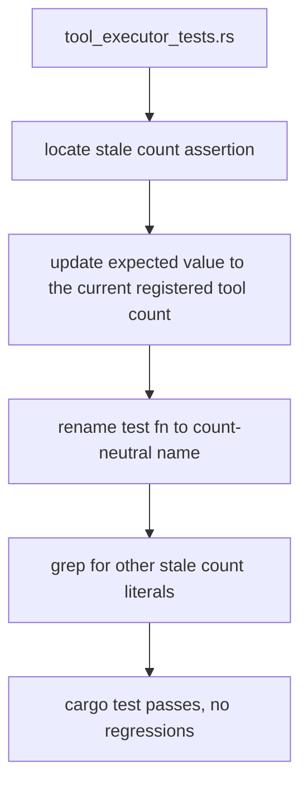

# Tool Executor Test: Fix Stale Registry Count Assertion

## Raw Requirement

Update the assertion in tool_executor_tests.rs to match the actual count or remove the stale assertion — the test name and value are both stale.

## Description

`src/tools/tool_executor_tests.rs` contains a test that asserts the number of tools registered in the standard tool registry. Both the assertion value and the test function name are stale: the registry has grown to include more entries but the test reflects an older count under an outdated name. The fix updates the expected count to the current registered tool count, renames the test function to a count-neutral, intent-describing name, and verifies no other stale count assertions exist in the test file. Registry behaviour is unchanged; only the test artefact is corrected.

## Backlinks

### Parents

| Label | Path | Purpose |
|-------|------|---------|
| Harness README | [.moeb/README.md](.moeb/README.md) | Parent index |
| Tool Executor Extraction | [specifications/moeb/moeb.tool-executor-extraction.md](specifications/moeb/moeb.tool-executor-extraction.md) | Governs the tool registry structure and test placement |

## Steps

1. **Read `src/tools/tool_executor_tests.rs`** — Locate the stale test function: find every assertion on the count of tools in the standard registry and note the current function name and expected value.

2. **Update the assertion count** — Change the expected count to the current registered tool count in the located assertion. Do not alter any other logic in the function.

3. **Rename the test function** — Rename the test function to a count-neutral, intent-describing name such as `standard_registry_has_expected_tool_count`. The new name must not encode the numeric count so that future registry additions do not immediately stale the name again.

4. **Grep for other stale count literals** — Search `src/tools/tool_executor_tests.rs` for any other numeric literals that assert on standard registry size. Update each to the current registered tool count if found. If no others exist, proceed.

5. **Run `cargo test -p moeb --test '*'` (or the project's equivalent test command)** — Confirm the modified test passes and no other tests regress. If no moeb shell-execution tool exists, record a `MissingMoebTool` signal for a shell-execution capability and note the expected outcome.

## Decisions

### Decision 1 — Update count to the current registered tool count rather than delete the assertion

**Rationale:** The requirement presents two options. Deleting the assertion removes a registry-size sentinel that catches accidental tool additions or removals during refactors. Updating to the current registered tool count preserves this coverage at minimal cost.

**Rejected alternative:** Remove the assertion entirely. Rejected because the registry-size assertion provides a low-cost invariant check; silent size changes become detectable only at runtime rather than at test time.

**Consequences:** The assertion must be updated whenever a tool is added to or removed from the standard registry. This is acceptable friction — it makes registry changes explicit and visible in code review.

### Decision 2 — Rename the test function to a count-neutral name

**Rationale:** The requirement states both the test name and value are stale, signalling that encoding the numeric count in the function name is the underlying fragility. A count-neutral name such as `standard_registry_has_expected_tool_count` describes the invariant being tested without becoming stale when the count changes again.

**Rejected alternative:** Keep the old test name and only update the value. Rejected because the requirement explicitly flags the name as stale, and a name encoding a concrete count will require renaming again each time the registry grows.

**Consequences:** The test function rename appears in git history. No runtime or API impact.

## Rubric

### Structured

| Name | Description | Threshold | Pass Condition |
|------|-------------|-----------|----------------|
| `tool-errors` | No ToolHandler errors were recorded during this command invocation. Covers all tool calls on both CLI and MCP paths via `RealToolExecutor::execute`. Applies to every moeb command. | Zero tool errors | Kernel-authoritative: injected by `verify_rubrics` from `RunState.tool_errors`. Do not supply a verdict — any agent-supplied entry is overridden. |
| `rubric-qualification` | No Pass verdicts with acknowledged failures were issued during this command invocation. | Zero qualified Pass verdicts | Kernel-authoritative: injected by `verify_rubrics` by scanning `acknowledged_failures` on incoming Pass verdicts. Do not supply a verdict — any agent-supplied entry is overridden. |
| `skill-mandatory-phases` | The skill loaded for this run contains all mandatory phase headings. The agent checks its own prompt context for the exact strings: "Verify", "End-of-Skill Review", "Metrics Recording", "Commit", "Tag", "Complete". | All six mandatory headings present | Agent scans skill content in its loaded context; fails if any mandatory heading string is absent |
| `no-drift` | The specification does not violate any decision recorded in a linked parent specification | Zero contradictions | Manual review of every decision in every parent spec listed in Backlinks |
| `spec-schema-compliance` | All required frontmatter fields and body sections are present and correctly ordered | 100% of required fields and sections | Validation in `domain/spec.rs` exits 0 during `moeb spec` |
| `ai-first-org` | The specification's Steps prescribe file layouts, naming, and helper placement that satisfy the four AI-first organisation principles: one concern per file, context locality, grep-discoverable names, no cross-cutting helpers. | All four principles followed | Manual review: no step produces a file that mixes concerns, no name is generic across the codebase, all helpers are co-located with their callers |
| `kernel-thin-and-parity` | No domain-specific or workflow-specific coordination logic may be placed in kernel Rust code when it can live in skill markdown or role files. Every tool registered in the CLI tool registry must also be registered in the MCP stdio server tool list. | Zero violations | Spec review: no proposed step places workflow logic in Rust; tool list parity unaffected by a test-only change |
| `moeb-tool-origin` | All tool calls made during this invocation must originate from moeb's own tool registry. | Zero external tool calls | Agent reviews conversation for calls to non-moeb tools; supplies Pass if none, Fail with signal titles if MissingMoebTool signals were filed, Fail with tool names if none were filed |
| `thin-kernel` | New Rust code in tools/, commands/, or domain/ must be either a primitive operation wrapper or a thin dispatcher with no domain logic. Workflow logic must live in skill markdown or role files. | Zero workflow-logic functions in new Rust | Spec review: no Step proposes placing sequencing or conditional workflow logic in Rust; run review: every changed function in tools/ is a test-only edit with no new domain branching |

### Qualitative

- The renamed test function must convey the invariant being tested (registry size matches expected count) without encoding the concrete count in the name.
- No source files outside `src/tools/tool_executor_tests.rs` (and any other file that contains a stale assertion on the same count) should be modified.
- The fix must leave all other tests in the file untouched and passing.
