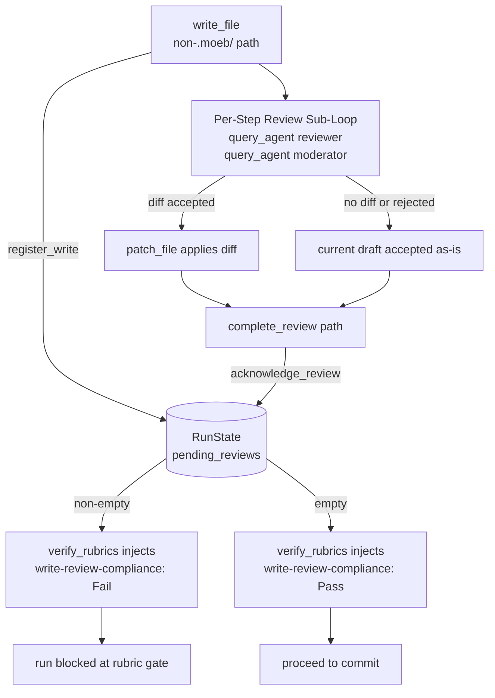

# Write→Review Compliance Enforcement

## Raw Requirement

Every `write_file` call made by the running agent must be paired with a completed
review cycle before `verify_rubrics` is called. The review cycle consists of:
(1) calling `query_agent` with `role: "reviewer"` to obtain a proposed diff;
(2) calling `query_agent` with `role: "moderator"` to obtain an accept/reject verdict;
(3) either applying the accepted diff via `patch_file` or accepting the current draft
as-is. Currently these steps are purely instructional — the agent can skip them
silently and the run proceeds to commit without any enforcement gap being surfaced.
The fix must not place orchestration logic in Rust (thin-kernel constraint); it must
detect unacknowledged writes at rubric-verification time and fail the criterion if
any write is unreviewed.

## Description

A lightweight compliance mechanism is added across `RunState`, `write_file`,
`verify_rubrics`, and a new thin-kernel tool `complete_review`. The mechanism has
three parts:

**Write registration.** `write_file` appends every successfully written path to a
`pending_reviews: HashSet<String>` in `RunState`. Only paths that do not start with
`.moeb/` are registered — signals, metrics, run files, and traces written by the
skill as output artifacts are not source-code artifacts subject to peer review.

**Review acknowledgement tool.** A new tool `complete_review(path)` removes a path
from `pending_reviews`. It contains no orchestration logic — it is a thin state
mutation. The Reviewer→Moderator `query_agent` sequence remains entirely in skill
files. The agent calls `complete_review` after every write→review cycle, whether the
outcome was an accepted diff (applied via `patch_file` first) or an accepted draft
(no diff applied). The tool is registered in both the standard registry and the MCP
server per the kernel-thin-and-parity requirement.

**Verify-rubrics gate.** `verify_rubrics` reads `pending_reviews` from `RunState`
before recording the agent-supplied verdicts. If any paths remain unacknowledged, the
tool injects an automatic `Fail` verdict for the criterion `write-review-compliance`
with the unreviewed paths listed in the note, overriding any agent-supplied verdict
for that criterion. If the set is empty, it injects `Pass`. This makes skipping the
review sub-loop a hard rubric failure that surfaces before the commit phase.

Both `run.skill.md` and `spec.skill.md` are updated to include a `complete_review`
call at the end of each Per-Step Review Sub-Loop, making the review-acknowledgement
obligation explicit.



## Backlinks

### Parents

| Label | Path | Purpose |
|-------|------|---------|
| Harness README | README.md | Root index |
| Composable Review Wrapper | specifications/moeb/moeb.composable-review-wrapper.md | Established the Reviewer→Moderator framework and Per-Step Review Sub-Loop instructions that this spec enforces at the kernel level |
| Reviewer and Moderator Roles | specifications/moeb/moeb.reviewer-and-moderator-roles.md | Role files used in the review sub-loop whose completion this spec tracks |
| Run-Time File Scope Enforcement | specifications/moeb/moeb.run-file-scope-enforcement.md | Established the RunState / RealToolExecutor pattern for write-time enforcement; this spec extends RunState with a parallel review-tracking set |
| Task-List Tools | specifications/moeb/moeb.task-list-tools.md | Established the SharedRunState injection pattern for tools that this spec follows for WriteFileTool and CompleteReviewTool |
| MCP Stdio Server | specifications/moeb/moeb.mcp-stdio-server.md | MCP tool registration pattern that complete_review must follow to satisfy kernel-thin-and-parity |

## Steps

### Step 1 — Extend `RunState` with pending-review tracking

In `src/moeb/src/run_state.rs`, add a `pending_reviews: std::collections::HashSet<String>`
field to `RunState`. Initialise it to `HashSet::new()` in `RunState::new()` (and via
`Default`). Add two public methods:

```rust
pub fn register_write(&mut self, path: &str) {
    self.pending_reviews.insert(path.to_string());
}

pub fn acknowledge_review(&mut self, path: &str) -> bool {
    self.pending_reviews.remove(path)
}
```

`acknowledge_review` returns `true` if the path was present and removed, `false` if
it was not in the set (idempotent call — not an error).

### Step 2 — Register writes in `write_file`

In `src/moeb/src/tools/write_file.rs`, add a `pub state: SharedRunState` field to
`WriteFileTool`, following the same pattern as `CreateTaskListTool`. After the file is
successfully written, call `register_write` on the shared state — but only when the
written path does not start with `.moeb/`:

```rust
if !rel.starts_with(".moeb/") {
    self.state.lock().unwrap().register_write(rel);
}
```

In `src/moeb/src/tools/mod.rs`, update the `WriteFileTool` construction in
`ToolRegistry::standard()` to pass `Arc::clone(&state)`:

```rust
r.register(Box::new(write_file::WriteFileTool { state: Arc::clone(&state) }));
```

### Step 3 — Create `src/moeb/src/tools/complete_review.rs`

Create a new file. Tool name: `"complete_review"`. The tool removes a path from
`pending_reviews` by calling `acknowledge_review` on the shared state.

Input schema — one required parameter:

```json
{
  "type": "object",
  "properties": {
    "path": {
      "type": "string",
      "description": "The file path passed to the most recent write_file call for which the review cycle is now complete."
    }
  },
  "required": ["path"]
}
```

Return value:
- `"Review acknowledged for <path>"` when the path was in `pending_reviews`.
- `"Path '<path>' not in pending_reviews (no-op)"` when the path was not registered
  (idempotent, not an error — handles new files created from scratch that were not
  previously on disk and may not have been registered by the scope-enforcement check).

The `CompleteReviewTool` struct holds `pub state: SharedRunState`.

### Step 4 — Inject `write-review-compliance` in `verify_rubrics`

In `src/moeb/src/tools/verify_rubrics.rs`, before building the final `verifications`
list from the agent-supplied criteria, read `pending_reviews` from `RunState`:

```rust
let unreviewed: Vec<String> = {
    let state = self.state.lock().unwrap();
    state.pending_reviews.iter().cloned().collect()
};
```

After processing the agent-supplied criteria array, remove any agent-supplied entry
whose `name` field equals `"write-review-compliance"` (the kernel value is
authoritative), then append one kernel-injected entry:

- If `unreviewed` is empty: `RubricVerification { name: "write-review-compliance", status: Pass, note: Some("All writes acknowledged".to_string()) }`
- Otherwise: `RubricVerification { name: "write-review-compliance", status: Fail, note: Some(format!("Unreviewed writes: {}", unreviewed.join(", "))) }`

Update the pass/fail/na counters to reflect this injected entry.

### Step 5 — Register `complete_review` in the tool registry and MCP server

In `src/moeb/src/tools/mod.rs`:
- Add `pub mod complete_review;`
- In `ToolRegistry::standard()`, register `CompleteReviewTool { state: Arc::clone(&state) }`
- In the `definitions()` method, insert `"complete_review"` into the ordered name list
  (after `"verify_rubrics"` and before `"create_branch"`)
- The `mcp()` and `mcp_with_adapter()` methods inherit `complete_review` automatically
  since they call `standard()` first

### Step 6 — Update `src/moeb/internal/skills/run.skill.md`

In the Per-Step Review Sub-Loop section (currently ending at step 8 — early rubric
evaluation), append a new final step:

```
9. Call `complete_review` with the path that was passed to `write_file` in this step.
   This acknowledges the review cycle and clears the review obligation for this path.
   Call it regardless of whether a diff was applied — once per write, after the
   sub-loop terminates. Omitting this call causes `verify_rubrics` to fail
   `write-review-compliance`.
```

### Step 7 — Update `src/moeb/internal/skills/spec.skill.md`

Apply the same new step to both Per-Step Review Sub-Loops in `spec.skill.md`:

- After the spec-file sub-loop (currently ending at step 7 — Record StepMetric for
  `step_id: "spec-file"`): append step 8 calling `complete_review` with the spec
  file path.
- After the README-patch sub-loop (currently ending at step 4 — Record StepMetric for
  `step_id: "readme-link"`): append step 5 calling `complete_review` with
  `.moeb/README.md`.

Note: `.moeb/README.md` starts with `.moeb/` and therefore will not be in
`pending_reviews` after `write_file` / `patch_file`. The `complete_review` call for
README is a no-op at the kernel level but is included for documentation symmetry and
to make the skill's intent explicit. The no-op path in `complete_review` handles this
gracefully.

## Decisions

### Decision 1 — State-tracking enforcement, not orchestration in Rust

**Rationale:** The `thin-kernel` and `kernel-thin-and-parity` rubric criteria prohibit
placing workflow sequencing or conditional review logic in Rust when a skill-file
approach is available. The enforcement mechanism is deliberately limited to three thin
operations: a set-insert on write, a set-remove on acknowledgement, and a gate-read
at verify time. No review orchestration logic — no sub-agent calls, no diff parsing,
no iteration — enters the kernel.

**Rejected alternatives:**
- `review_artifact` kernel tool (as described in `moeb.composable-review-wrapper.md`
  Step 4): encapsulates the Reviewer→Moderator triangle in Rust, violating the
  thin-kernel criterion. That approach predated the kernel-thin-and-parity rubric;
  this spec takes the compliant path.
- Blocking `write_file` until a review is provided: requires the write_file tool to
  make sub-agent calls, which requires adapter access inside a primitive file tool —
  a severe violation of separation of concerns.
- Post-run kernel check after agent loop exits: the kernel cannot surface a remediation
  opportunity after the loop; the agent cannot fix unreviewed writes once control
  returns to the kernel.

**Consequences:** An agent that calls `complete_review` without having conducted the
Reviewer→Moderator sub-agents satisfies the kernel obligation while violating the
skill instructions. The enforcement is not cryptographically provable — it relies on
the skill instructions being followed, with the kernel gate catching total omissions.

### Decision 2 — `.moeb/` prefix exclusion for write registration

**Rationale:** Signals, metrics, run files, and trace data are output artifacts that
the skill writes at the end of a run as records of that run. They are not implementation
files under peer review. Registering them in `pending_reviews` would require
`complete_review` calls for every output file, producing noise and a high false-fail
rate when the skill legitimately writes these files after the review sub-loop has
completed.

**Rejected alternatives:**
- `src/` prefix inclusion only: too narrow — a future skill may write implementation
  files at a path outside `src/` that should still require review.
- Track all writes unconditionally: creates spurious failures for every artifact file.

**Consequences:** The boundary is the `.moeb/` string prefix. This is consistent with
the existing `.moeb/` vs. `src/` layer separation established in `README.md`.

### Decision 3 — Kernel value overrides agent-supplied `write-review-compliance` verdict

**Rationale:** An agent under context pressure could supply a fabricated
`write-review-compliance: pass` verdict to bypass the gate. Reading `RunState`
directly and overriding the agent-supplied entry makes the gate authoritative
regardless of what the agent reports.

**Rejected alternatives:**
- Trust the agent-supplied verdict: an agent that skips reviews can trivially self-certify.
- Separate compliance check tool: the agent could omit the call, and two tools for the
  same enforcement concern violates the one-concern-per-mechanism principle.

**Consequences:** Any agent-supplied `write-review-compliance` entry in the `criteria`
array is silently removed and replaced with the kernel-computed value. Agents should
not include this criterion in their `verify_rubrics` call; the kernel always provides it.

## Rubric

### Structured

| Name | Description | Threshold | Pass Condition |
|------|-------------|-----------|----------------|
| `context-budget` | All implementation files created or modified during this run are ≤ 300 lines; `*_tests.rs` companion files are ≤ 400 lines | Zero over-budget files after any required refactoring | Agent checks line counts of every file written; refactors any over-budget file, then marks pass only after all files meet the budget |
| `binary-builds` | `cargo build --release` completes without error | Zero errors | CI build exits 0 |
| `all-tests-pass` | `cargo test` completes without failure | Zero failures | `cargo test` exits 0 |
| `no-test-regression` | All tests present before this change pass without modification to test code | Zero failures | `cargo test` exits 0; no test file edited beyond compilation-required changes |
| `thin-kernel` | New Rust code in tools/, commands/, or domain/ must be either a primitive operation wrapper or a thin dispatcher; no workflow logic or orchestration sequences in Rust | Zero workflow-logic functions in new Rust | Spec review: no Step proposes placing sequencing or conditional logic in Rust; Run review: register_write, acknowledge_review, and the verify_rubrics injection each perform exactly one state operation with no branching beyond the empty/non-empty check |
| `mcp-cli-behavioural-parity` | `complete_review` must be registered in both the standard tool registry and the MCP server with identical input schema and result contract | Both registrations present | grep for `complete_review` in tools/mod.rs and the MCP server source returns matches in both; tool definition produced by both registries is identical |
| `enforcement-completeness` | `write_file` registers every non-`.moeb/` path in `pending_reviews`; `verify_rubrics` injects `write-review-compliance` from `RunState`, overriding any agent-supplied value | Both mechanisms present | Code review: write_file guards on `.moeb/` prefix before calling register_write; verify_rubrics removes and replaces any agent-supplied `write-review-compliance` entry before recording verifications |
| `skill-update-completeness` | Both `run.skill.md` and `spec.skill.md` include a `complete_review` call at the end of each Per-Step Review Sub-Loop | Both files updated, all sub-loops covered | Read run.skill.md: complete_review step present after StepMetric recording in the single review sub-loop; read spec.skill.md: complete_review step present in both the spec-file and readme-link sub-loops |

### Qualitative

- `complete_review` has a self-contained description: a reader can determine its
  purpose, required parameter, and both return-value cases without consulting any
  skill file.
- The `pending_reviews` field uses `HashSet` so that a repeated `write_file` call to
  the same path does not inflate the count or require multiple `complete_review` calls.
- The `verify_rubrics` injection is deterministic: the criterion name
  `"write-review-compliance"` is a fixed string, making it grep-discoverable and
  preventing naming drift between the kernel and skill files.
