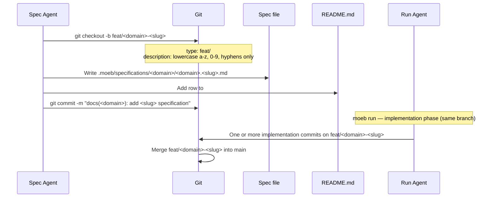

# Specification Creation: Branch Type Correction to `feat/`

## Raw Requirement

The current branches created during a spec authoring use the type chore which would be correct if the spec was the only thing to be committed on that branch, however the spec will be implemented as part of that branch before merging to main as part of another command, as such the branch naming needs reviewed, I expect we should be using feat instead when creating the branch

## Description

This specification supersedes the branch-type decision in `vcs.spec-creation-branch-commit-format.md`. Branches created during `moeb spec` must use the `feat/` prefix instead of `chore/`. The rationale is lifecycle correctness: a spec branch is not merged to main immediately after the spec commit — it remains the working branch for the subsequent `moeb run` implementation phase, which adds feature code. A branch whose full lifecycle spans a spec commit and one or more implementation commits is a feature branch, not a chore branch. The change requires updating the `create_branch` tool implementation, `spec.skill.md`, and `spec.prompt` to replace the `chore/` prefix with `feat/` in all branch-naming contexts. The commit type (`docs`) and all other conventions from the superseded spec are unchanged.

## Diagram

## Backlinks

### Parents

| Label | Path | Purpose |
|-------|------|---------|
| README | [README.md](../../README.md) | Root harness index and policy source |
| Specification Creation: Precise Branch and Commit Format | [specifications/vcs/vcs.spec-creation-branch-commit-format.md](specifications/vcs/vcs.spec-creation-branch-commit-format.md) | Superseded parent: established `chore/` as the branch type; this spec overrides that single decision |

### External

| Label | URL | Purpose |
|-------|-----|---------|
| Conventional Branch Specification | https://conventional-branch.github.io/#specification | Normative source for branch naming grammar and valid type prefixes |

## Steps

1. **Locate and update the `create_branch` tool implementation**

   Search `src/` for the file that implements the `create_branch` MCP tool. The file constructs a branch name by concatenating a type prefix with the domain-slug description. Find the string literal `"chore/"` in that construction and replace it with `"feat/"`. No other logic in that file changes.

   After the edit the tool must produce branch names of the form `feat/<domain>-<slug>` (e.g. `feat/vcs-spec-branch-type-feat`).

2. **Update `spec.skill.md`**

   Locate the canonical `spec.skill.md` file. Check `.moeb/skills/spec.skill.md` first; if absent, the canonical copy is at `src/skills/spec.skill.md` or `assets/skills/spec.skill.md`. In Phase 5 of that file, find every occurrence of `chore/<domain>-<slug>` or `chore/` used in the context of the spec-authoring branch name pattern and replace each occurrence with `feat/<domain>-<slug>` or `feat/` respectively.

3. **Update `spec.prompt`**

   Locate `src/prompts/spec.prompt`. In Phase 5, find the sentence containing "The tool creates the `chore/<domain>-<slug>` branch" and replace `chore/` with `feat/`. If the same pattern appears elsewhere in the file in a branch-naming context, update those occurrences too.

4. **Update tests that assert a `chore/` branch prefix in spec-authoring contexts**

   Search `src/` for test assertions that check for a `chore/` prefix in branch names produced by the `create_branch` tool or the spec authoring flow. Update each such assertion to expect `feat/` instead. Do not alter tests that are unrelated to spec-authoring branch creation.

5. **Verify**

   Run `cargo test` and confirm no regressions. Confirm that the `create_branch` tool (or a test that exercises it) produces a branch name beginning with `feat/`.

## Decisions

### Decision 1 — `feat/` is the correct Conventional Branch type for spec-authoring branches

**Rationale:** A branch created during `moeb spec` serves as the working branch for the subsequent `moeb run` implementation phase before it is merged to main. Its full lifecycle is: spec commit → implementation commits → merge. Conventional Branch 1.0.0 defines `feat/` (alias `feature/`) for branches that introduce new behaviour. A branch whose content spans both a documentation commit and feature-implementing commits is a feature branch by content.

The decision in `vcs.spec-creation-branch-commit-format.md` concluded that `chore/` was correct because specification authoring is a non-code task. That reasoning was valid for a branch containing only the spec commit, but the harness design places implementation commits on the same branch before merge. The branch classification must reflect the branch's full lifecycle, not only its first commit.

**Alternatives:**

| Option | Reason Rejected |
|--------|-----------------|
| Keep `chore/` | Semantically correct only for branches containing exclusively non-code commits; misclassifies branches that carry implementation work |
| `docs/` | Not a valid type in the Conventional Branch 1.0.0 ABNF grammar; the grammar enumerates: `feature`, `feat`, `bugfix`, `fix`, `hotfix`, `release`, `chore` |
| `fix/` | Reserved for bug-fix branches; a spec-plus-implementation is new behaviour, not a fix |
| Custom type | Requires team documentation of the custom type; `feat/` is semantically accurate and immediately understood with no additional overhead |

**Consequences:** All branches created by `moeb spec` will begin with `feat/`. Automated tooling that filters by branch type will correctly classify spec-plus-implementation branches as feature work. The commit type (`docs`) is unchanged — only the branch prefix changes.

### Decision 2 — Commit type remains `docs` for the spec-authoring commit

**Rationale:** The individual commit that introduces the specification file and its README row is a documentation-only commit. It adds no application behaviour. Conventional Commits 1.0.0 rule 14 permits `docs` for documentation changes, and the existing `docs(<domain>): add <slug> specification` pattern is precise and well-established in this harness. The branch type (`feat/`) describes the branch's full lifecycle; the commit type (`docs`) describes the individual commit's content. These are orthogonal and must not be conflated.

**Alternatives:**

| Option | Reason Rejected |
|--------|-----------------|
| Change commit type to `feat` | The spec commit itself adds no application feature; only the subsequent `moeb run` commits do |
| Change commit type to `chore` | Would contradict the established `docs` convention for documentation additions and reduce traceability in changelogs |

**Consequences:** The spec-authoring commit message continues to use `docs(<domain>): add <slug> specification`. Only the branch name prefix changes from `chore/` to `feat/`.

## Rubric

### Structured

| Name | Description | Threshold | Pass Condition |
|------|-------------|-----------|----------------|
| `no-drift` | The specification does not violate any decision recorded in a linked parent specification | Zero contradictions | Manual review of every decision in every parent spec listed in Backlinks |
| `spec-schema-compliance` | All required frontmatter fields and body sections are present and correctly ordered | 100% of required fields and sections | Validation in `domain/spec.rs` exits 0 during `moeb spec` |
| `ai-first-org` | The specification's Steps prescribe file layouts, naming, and helper placement that satisfy the four AI-first organisation principles: one concern per file, context locality, grep-discoverable names, no cross-cutting helpers. | All four principles followed | Manual review: no step produces a file that mixes concerns, no name is generic across the codebase, all helpers are co-located with their callers or promoted to a precisely named module |
| Branch type prefix is `feat/` | Branches created by `moeb spec` must begin with `feat/` | Exact prefix match | `git branch --show-current` output starts with `feat/` after a `moeb spec` invocation |
| No residual `chore/` in branch-naming paths | All source, skill, and prompt locations that previously produced `chore/` branch names must be updated | Zero remaining occurrences in branch-construction contexts | A targeted search of the `create_branch` implementation, `spec.skill.md`, and `spec.prompt` for `chore/` in branch-naming contexts returns no matches |
| Commit type unchanged | The spec-authoring commit type remains `docs` after this change | Exact type match | `git log --format=%s -1` after a `moeb spec` invocation matches `^docs\(` |

### Qualitative

- **Branch name remains self-documenting:** A reader of `git branch -a` should immediately understand which specification is being implemented from the branch name alone (e.g. `feat/vcs-spec-branch-type-feat`).
- **Minimal-diff discipline:** The implementation touches only the three identified locations (create_branch tool, skill file, prompt file) and their associated tests. No unrelated logic is modified alongside this change.
