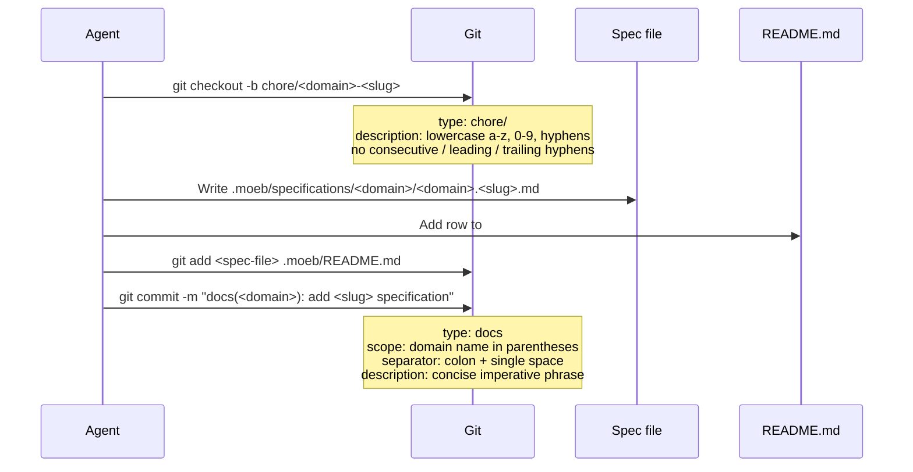

# Specification Creation: Precise Branch and Commit Format

**Domain:** vcs

**Status:** active

**Supersedes:**
- `specifications/vcs/vcs.specification-branch-and-commit.md` — decision "Dedicated branch required for new specification authoring"
- `specifications/vcs/vcs.specification-branch-and-commit.md` — decision "Conventional Commits format is required for the specification commit"

---

## Raw Requirement

> On specification being created, check out a new git branch and commit to it, the following references are critical to producing branches and commits in the right format: https://conventional-branch.github.io/#specification , https://www.conventionalcommits.org/en/v1.0.0/#specification

---

## Description

This specification supersedes the branch-and-commit decisions in `vcs.specification-branch-and-commit.md` by embedding the precise format rules derived from Conventional Branch 1.0.0 and Conventional Commits 1.0.0. When a new harness specification is created, the agent must (1) check out a new git branch whose name follows the `chore/<description>` pattern from the Conventional Branch grammar — using only lowercase alphanumerics and hyphens with no consecutive, leading, or trailing hyphens — and (2) record the spec file and README registration in a single commit whose message follows the `docs(<domain>): <description>` pattern from Conventional Commits. The branch must be created before any file is written, and the commit must atomically contain the specification file and its README index row.

---

## Diagram



---

## Backlinks

### Parents

| Label | Path | Purpose |
|-------|------|---------|
| README | [README.md](../../README.md) | Root harness index and policy source |
| Git Initialisation and Initial Commit | [specifications/vcs/vcs.git-init.md](specifications/vcs/vcs.git-init.md) | Establishes baseline git policy; this spec adds precise branch and commit format rules |
| Specification Branch and Conventional Commit for Harness Changes | [specifications/vcs/vcs.specification-branch-and-commit.md](specifications/vcs/vcs.specification-branch-and-commit.md) | Superseded parent: stated the requirement to branch and commit but did not embed the format rules from the normative references |

### External

| Label | URL | Purpose |
|-------|-----|---------|
| Conventional Branch Specification | https://conventional-branch.github.io/#specification | Normative source for branch naming grammar, type prefixes, and character rules |
| Conventional Commits Specification | https://www.conventionalcommits.org/en/v1.0.0/#specification | Normative source for commit message structure, type, scope, and description rules |

---

## Steps

1. **Create the git branch before writing any files**

   Run the following command before touching any file on disk:

   ```
   git checkout -b chore/<description>
   ```

   Derive `<description>` from the specification domain and slug, concatenated with a hyphen (e.g. for domain `vcs`, slug `spec-creation-branch-commit-format`, the description is `vcs-spec-creation-branch-commit-format`).

   The branch name **must** satisfy all of the following rules, taken directly from the Conventional Branch 1.0.0 specification:

   - **Type prefix:** Must be `chore/`. Specification authoring is a non-code task (documentation and governance), which is precisely the class of work the Conventional Branch specification assigns to `chore/`.
   - **Description characters:** Entirely lowercase letters (`a–z`), digits (`0–9`), and hyphens (`-`). No uppercase letters, underscores (`_`), spaces, or other special characters.
   - **No consecutive hyphens:** The string `--` must not appear anywhere in the description.
   - **No leading hyphen:** The description must not begin with a hyphen (e.g. `chore/-something` is invalid).
   - **No trailing hyphen:** The description must not end with a hyphen (e.g. `chore/something-` is invalid).
   - **Full ABNF grammar match:** The branch name must match `prefixed-branch = type "/" description` where `type = "chore"` and `description = desc-segment *("-" desc-segment)`, each `desc-segment` being one or more `ALPHA / DIGIT` characters optionally followed by dot-separated alphanumeric sub-segments.

   Valid examples: `chore/vcs-spec-creation-branch-commit-format`, `chore/moeb-kernel-update`, `chore/harness-rubric-catalogue`.
   Invalid examples: `chore/Vcs-Spec` (uppercase), `chore/vcs--spec` (consecutive hyphens), `chore/-vcs-spec` (leading hyphen), `feat/vcs-spec` (wrong type).

2. **Write the specification file**

   Create the specification at `.moeb/specifications/<domain>/<domain>.<slug>.md` conforming to `spec-schema.yaml`. This step must only begin after the branch from Step 1 exists. No file write of any kind — including README — may precede the `git checkout -b` call.

3. **Register the specification in README.md atomically**

   Add the new row to the appropriate `### <domain>` table in `.moeb/README.md` in the same authoring action as writing the specification file. If the domain table does not yet exist, create it. The row must mark the specification as `active`. Registration must not be deferred.

   If this specification supersedes an existing specification, update the superseded specification's README row status from `active` to `superseded` in the same authoring action.

4. **Stage only the specification file and README**

   Stage exactly:
   ```
   git add .moeb/specifications/<domain>/<domain>.<slug>.md .moeb/README.md
   ```

   No other files may be included in this commit unless they are directly referenced as part of the specification creation (e.g. a superseded spec whose README row is being updated). Unrelated unstaged changes must remain unstaged.

5. **Commit with a Conventional Commits message**

   Run:
   ```
   git commit -m "docs(<domain>): add <slug> specification"
   ```

   The commit message **must** satisfy all of the following rules from the Conventional Commits 1.0.0 specification:

   - **Type (rule 1):** The message must be prefixed with a type. For specification authoring, the type is `docs`. The type must be a single lowercase noun immediately followed by the optional scope, optional `!`, and then a required colon and space.
   - **Type `docs` (rule 14):** Types other than `fix` and `feat` are permitted; `docs` is used here for documentation-only changes consistent with the Angular convention referenced by Conventional Commits.
   - **Scope (rule 4):** A scope must be provided for specification commits. It must consist of a noun describing the section of the codebase, surrounded by parentheses. Use the specification domain name (e.g. `vcs`, `moeb`, `harness`). Example: `docs(vcs):`.
   - **Colon and space separator (rule 1):** The type/scope prefix must be followed by exactly one colon (`:`) and one space (` `). No other characters may appear between the scope closing parenthesis and the colon.
   - **Description (rule 5):** A description must immediately follow the colon-space. It must be a concise summary of the change. For specification creation, use the imperative form: `add <slug> specification`. Example: `add spec-creation-branch-commit-format specification`.
   - **Case consistency (rule 15):** The type and scope must be lowercase. The description may use any casing but must be consistent.
   - **Optional body (rule 6):** A longer body may follow the subject line, separated by one blank line. If provided, it must begin one blank line after the description.
   - **Optional footers (rule 8–10):** Footers may follow the body (or subject if no body), each consisting of a token, a `:<space>` or `<space>#` separator, and a string value. Footer tokens must use `-` in place of whitespace (e.g. `Reviewed-by`), except `BREAKING CHANGE`.
   - **Subject line length:** Keep the full subject line under 72 characters where possible.

   The complete subject line pattern for specification commits is: `docs(<domain>): add <slug> specification`.

---

## Decisions

### `chore/` is the correct Conventional Branch type for specification authoring

**Rationale:** The Conventional Branch 1.0.0 specification defines `chore/` as the type for "non-code tasks like dependency, docs updates." Creating a harness specification is precisely a non-code authoring task — it produces a markdown governance document, not application code. The Conventional Branch grammar does not define a `docs/` type; `chore/` is the only valid choice from the enumerated set for this class of work.

**Alternatives:**

| Option | Reason Rejected |
|--------|-----------------|
| `feat/` | Reserved for new features in application or library code; specification files are governance documents, not features |
| `docs/` | Not a valid type in the Conventional Branch 1.0.0 ABNF grammar; the grammar enumerates exactly: `feature`, `feat`, `bugfix`, `fix`, `hotfix`, `release`, `chore` |
| `fix/` | Reserved for bug fixes; specification authoring is not a fix |
| Custom type | The Conventional Branch specification permits custom types but requires team documentation of them; using the standard `chore/` type requires no additional overhead and is immediately understood |

**Consequences:** All branches created for specification authoring must begin with `chore/`. Automation that filters branches by type will classify specification branches consistently with other non-code maintenance work.

### `docs` is the correct Conventional Commits type for specification commits

**Rationale:** Conventional Commits 1.0.0 rule 14 explicitly permits types beyond `fix` and `feat`. The Angular convention referenced by Conventional Commits defines `docs` for documentation-only changes. A harness specification is a documentation artefact — a markdown governance file — so `docs` is the most semantically precise type. Using `feat` would incorrectly imply an application behaviour change; using `chore` would suggest a build or tool change rather than authored content.

**Alternatives:**

| Option | Reason Rejected |
|--------|-----------------|
| `feat` | Implies a new application or library feature; Conventional Commits rule 2 restricts `feat` to "adds a new feature to your application or library" |
| `chore` | Conventional usage reserves `chore` for build-process, tooling, or maintenance tasks; a new specification is authored documentation content |
| `refactor` | Implies restructuring without behaviour change; authoring a new spec is additive, not a refactor |
| No type (plain message) | Violates Conventional Commits rule 1: "Commits MUST be prefixed with a type" |

**Consequences:** All commits that create a specification must use `docs` as the type. Automated changelog and semantic-versioning tools that parse Conventional Commits will group specification additions under the documentation category, without triggering any version bump (since `docs` carries no SemVer implication under rule 14).

### Domain name is the required commit scope for all specification commits

**Rationale:** Conventional Commits rule 4 defines scope as "a noun describing a section of the codebase surrounded by parenthesis." For harness specifications, the domain (e.g. `vcs`, `moeb`, `harness`) is the natural scope because it identifies which area of the harness the new specification governs. Omitting the scope is permitted by Conventional Commits but is disallowed here because specification repositories frequently span many domains and omitting scope reduces traceability in `git log` and automated tooling output.

**Alternatives:**

| Option | Reason Rejected |
|--------|-----------------|
| Omit scope entirely | Permitted by Conventional Commits rule 4 but loses domain-level traceability in multi-domain harnesses |
| Use the spec slug as scope | Scope should identify the section of the codebase (the domain), not the specific artefact being changed |
| Use `harness` for all specification commits | Too broad; loses the signal about which domain is affected |
| Use the full file path as scope | Excessively verbose; Conventional Commits intends scope to be a short noun |

**Consequences:** Every specification commit must include `(<domain>)` in its message. This is a narrower rule than Conventional Commits requires (scope is normally optional) but is within the specification's permitted scope and is consistent with the harness's traceability objectives.

### Branch must be created before any file write

**Rationale:** Creating the branch first ensures the entire authoring session — both the specification file and the README update — is recorded on the dedicated branch with no interleaving of commits from another branch. If files are written on the originating branch before checkout, those changes either straddle two branches or must be recovered via stash or cherry-pick, both of which complicate the commit graph and reduce auditability.

**Alternatives:**

| Option | Reason Rejected |
|--------|-----------------|
| Create branch after writing files but before committing | Unstaged changes carry over to the new branch implicitly via `git checkout -b`, which works but obscures when the branch was established relative to the authoring work; the clean-first-then-write order is unambiguous |
| Create branch after committing on main | Requires cherry-pick to move commits; produces non-linear history and is error-prone |
| Write files on current branch, create PR branch separately | Increases workflow complexity with no benefit; the spec workflow targets a single-branch, single-commit model |

**Consequences:** Any agent or developer implementing a specification under this harness must treat `git checkout -b chore/<description>` as the first operation, before any file-system write.

---

## Rubric

### Structured

| Name | Description | Threshold | Pass Condition |
|------|-------------|-----------|----------------|
| no-drift | No contradiction with parent specs | The implementation does not violate any decision recorded in a linked parent specification | Zero contradictions; manual review of every decision in every parent spec listed in Backlinks |
| spec-schema-compliance | Spec conforms to schema | All required frontmatter fields and body sections are present and correctly ordered | 100% of required fields and sections; `moeb spec` validation exits 0 |
| Branch exists before first file write | The dedicated git branch must be created before the specification file or README row is written | Branch exists prior to first file-system mutation | `git log --all --oneline` shows the branch tip precedes any file-modifying commit on that branch |
| Branch name type prefix is `chore/` | The branch name must begin with `chore/` per the Conventional Branch specification | Exact prefix match | `git branch --show-current` output starts with `chore/` |
| Branch description is lowercase alphanumeric with hyphens only | The description segment of the branch name must match `[a-z0-9]+(-[a-z0-9]+)*` with no consecutive, leading, or trailing hyphens | Matches ABNF grammar | Branch name after `chore/` passes: no uppercase, no underscores, no spaces, no `--`, does not start or end with `-` |
| Spec file and README row in one commit | The new specification file and the updated README.md must appear together in a single commit | Both paths present in same commit | `git show --stat HEAD` lists both `.moeb/specifications/<domain>/<domain>.<slug>.md` and `.moeb/README.md` |
| Commit type is `docs` | The commit message subject must begin with `docs` | Exact type match | `git log --format=%s -1` matches `^docs[(\!:]` |
| Commit scope is the domain name | The parenthesised scope in the commit message must match the specification's domain | Exact domain string | `git log --format=%s -1` matches `^docs\(<domain>\):` |
| Commit separator is colon-space | Type/scope prefix must be followed by exactly `: ` | Exact two-character sequence | `git log --format=%s -1` matches `^docs\([a-z]+\): \S` |
| Commit description is non-empty | A description must immediately follow the colon-space | At least one non-whitespace character | `git log --format=%s -1` has content after the `: ` separator |

### Qualitative

- **Branch description encodes domain and slug:** A reader of `git branch -a` should immediately understand which specification is being authored from the branch name alone without consulting any other file.
- **Commit subject is concise:** The full subject line should ideally be 72 characters or fewer; it should read as a clear imperative statement of what the commit adds.
- **No unrelated files in the commit:** The commit must contain only the specification file and the README index row (plus any superseded spec row update). Unrelated staged changes must be withheld.
- **Superseded spec row marked atomically:** If this specification supersedes another, the superseded specification's README row must change from `active` to `superseded` in the same commit that registers the new specification, not in a subsequent commit.
